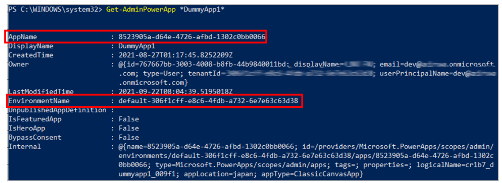

こんにちは、Power Platform サポートの谷です。<br/>
今回は、キャンバスアプリ 所有者の退職・異動に際し、Power Apps のキャンバス アプリ所有者を変更する方法についてご説明します。

<!-- more -->


## アプリの所有者・共同所有者・ユーザーとは？

キャンバス アプリを作成・実行するためには以下の3種類の権限があります。<br/>
それぞれ、役割に応じた権限を割り当て、安全にアプリを運用していきます。

**所有者**

アプリ作成者は自動的に所有者となります。
アプリの実行、編集、削除、共有設定を行うことが可能です。
 
**共同所有者**

アプリの実行、編集、共有設定を行うことが可能です。
アプリの削除は行うことができません。

**ユーザー**

アプリの実行を行うことが可能です。


## アプリ作成者（所有者）が退職あるいは離任する場合はどうしたらいいか？

退職や異動により、アプリ所有者のアカウントが削除された場合、アプリ自体は削除されません。<br/>
アプリを実行することは可能な状態ですが、所有者、及び共同所有者が一人も存在しないアプリは編集や削除ができません。

以下のケースごとに対応方法をご説明します。<br/>
- ケース１：アプリ作成者（所有者）が退職してしまったがアプリを継続して利用（編集）したい
- ケース２：アプリ作成者（所有者）が退職してしまったのでアプリを削除したい

### ケース1　アプリ作成者（所有者）が退職してしまったがアプリを継続して利用したい
アプリ作成者（所有者）のアカウントを削除後も、アプリを実行/編集するには、下記の対応が必要となります。
 
**＜共同所有者がいない場合＞**
- 対応方法１　管理者向けPower Apps コマンドレットで新たな所有者を割り当てる
- 対応方法２　Power Platform 管理センターでアプリの共同所有者、あるいはユーザーを割り当てる
 
**＜共同所有者がいる場合＞**
- 必要な対応はございません。引き続き、アプリを実行いただけます。


### ケース２　アプリ作成者（所有者）が退職してしまったのでアプリを削除したい

新たな所有者、あるいはPower Platform管理者などの管理者がアプリを削除することができます。
 
- 対応方法１　管理者用 Power Apps コマンドレットで新たな所有者を割り当て、所有者としてアプリを削除する
- 対応方法２　Power Platform 管理センターで、管理者としてアプリを削除する


以降では、それぞれの対応方法の詳細についてご説明いたします。

## 管理者用 Power Apps コマンドレットでアプリの所有者を変更する方法

グローバル管理者、Azure Active Directory グローバル管理者、Dynamics 365 管理者などの管理者はアプリの所有者を変更することができます。<br/>
当コマンドレットは所有者のアカウントが存在する場合でも所有者を変更することが可能です。

なお、管理者用 Power Apps コマンドレットをご利用前にPower Shellモジュールをインストールいただく必要があります。<br/>
https://docs.microsoft.com/ja-jp/power-platform/admin/powerapps-powershell#installation


**実行例**
1. （事前準備）管理者向けPower Apps コマンドレットをインストールします
2. 管理者としてPowerShellを実行します
3. 以下のコマンドを実行します

```
Set-AdminPowerAppOwner –AppName '＜アプリのGUID＞' -AppOwner '＜新たな所有者のGUID＞' –EnvironmentName '＜環境のGUID＞'
```

**実行コマンドで指定する各種引数について**
- ＜アプリのGUID＞、＜環境のGUID＞
    - 管理者用 Power Appsコマンドレット「[Get-AdminPowerApp](https://docs.microsoft.com/en-us/powershell/module/microsoft.powerapps.administration.powershell/get-adminpowerapp?view=pa-ps-latest)」コマンドでご取得ください
    - 
- ＜新たな所有者のGUID＞
    - 「[Get-AzureADUser](https://docs.microsoft.com/ja-jp/microsoft-365/enterprise/view-user-accounts-with-microsoft-365-powershell?view=o365-worldwide#view-additional-property-values-for-a-specific-account)」コマンド、あるいはAzure Active Directory管理センターご確認ください
    - Get-AzureADUser 実行例
        - 例えば、以下のとおり実行いただきますとテナント内の全ユーザーについてObjectId（AppOwnerに指定する値）が取得できます。
        - ```
          Get-AzureADUser | Select DisplayName, UserPrincipalName, ObjectId
          ```
        -
    - Azure Active Directory 管理センターにおけるユーザーのGUIDの確認例
        - [Azure Active Directory 管理センター](https://aad.portal.azure.com)　＞　ユーザー　＞　対象のユーザー
        - 

## Power Platform 管理センターでアプリの共同所有者を追加する、あるいは削除する方法

**実行例**
1. 管理者の役割を持つユーザーで [Power Platform 管理センター](https://admin.powerplatform.com) にアクセスします
2. 対象の環境の「…」メニューから「Power Apps」を選択します
    
3. 対象のアプリの「…」メニューから、共同所有者を追加する場合「共有」を、アプリを削除する場合「削除」を選択します
    

## 参考情報
- [キャンバス アプリのオーナーとしてログイン ユーザーを設定する](https://docs.microsoft.com/ja-jp/power-platform/admin/powerapps-powershell#set-logged-in-user-as-the-owner-of-a-canvas-app)
- [Power Appsの管理](https://docs.microsoft.com/ja-jp/power-platform/admin/admin-manage-apps)
- [キャンパスアプリを削除する](https://docs.microsoft.com/ja-jp/powerapps/maker/canvas-apps/delete-app)

---
