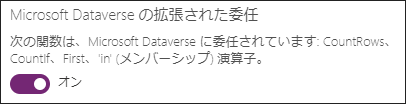
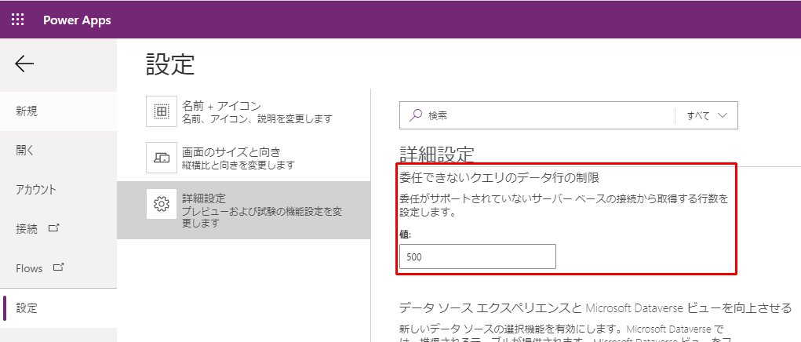
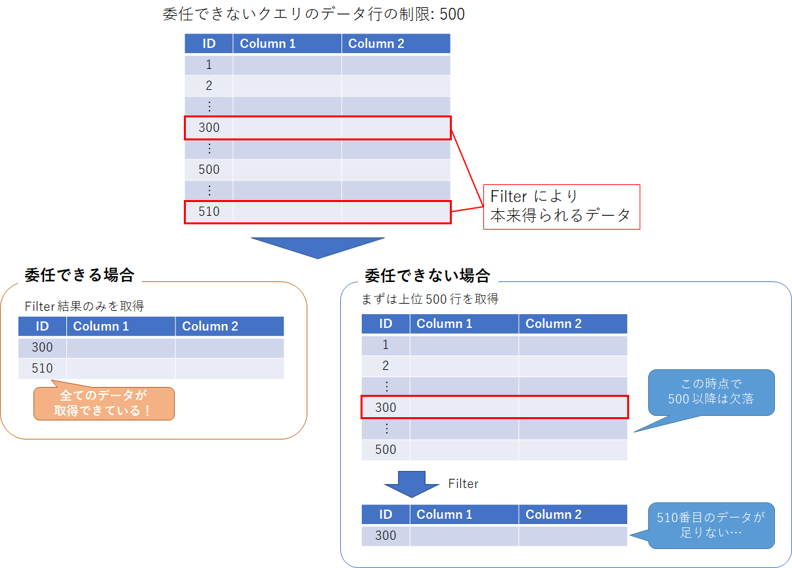
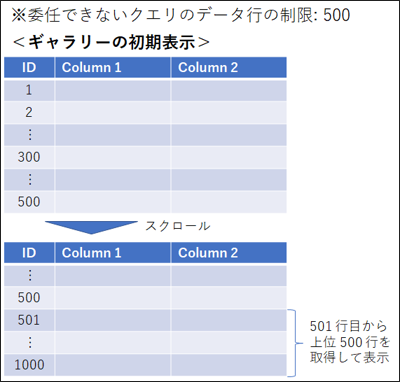
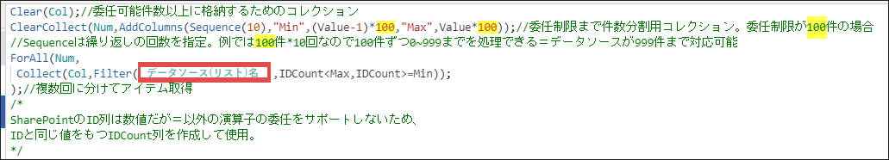

# キャンバス アプリの委任について

こんにちは、Power Platform サポートの清水です。
今回は、Power Apps のキャンバス アプリを使用する際に引っ掛かりがちな「委任」の制限について、かみ砕いてご説明いたします。


公開情報は[こちら](https://docs.microsoft.com/ja-jp/powerapps/maker/canvas-apps/delegation-overview)。

<!-- more -->

## そもそも委任って何？
「委任」とは、Power Apps 上でのデータ操作 (Filter クエリなど) をアプリ上で行わず、データソース側で行い、キャンバス アプリはその結果のみを取得することで、アプリのパフォーマンスを向上させる仕組みのことを言います。

Power Apps で扱う業務データは非常に膨大になることも少なくないので、全てのデータを取得してから、アプリ上で Filter や Sort を行うことは現実的ではございません。
したがって、データ量を抑えて効率的なアプリを作成するために、データソースに委任できる処理はデータソース側でやってもらい、アプリでは処理結果を受け取るだけにしましょうね、という仕組みを提供しています。

## 委任可能なデータソースと関数
とはいえ、データソース側でも全ての処理を実行できるわけではございませんので、Power Apps から委任できるデータソースや処理の内容は限られています。

委任可能なデータソースは、現時点では以下のデータソースのみです。
それぞれ、委任可能な関数がデータソースによって異なりますので、コネクタのリファレンスをご参照ください。
- [Microsoft Dataverse (旧名: Common Data Service)](https://docs.microsoft.com/ja-jp/connectors/commondataservice/#power-apps-delegable-functions-and-operations-for-dataverse)
※Dataverse では、プレビュー機能として CountRows, CountIf, First, in 演算子の委任もサポートしています。

(この設定は、既定でオンになっています。)
- [SharePoint](https://docs.microsoft.com/ja-jp/connectors/sharepointonline/#power-apps-delegable-functions-and-operations-for-sharepoint)
- [SQL Server](https://docs.microsoft.com/ja-jp/connectors/sql/#power-apps-delegable-functions-and-operations-for-sql-server)

## 委任できない場合どうなるの？
委任できないデータソースや関数を使用した場合、Power Apps では、一度データソースから全てのデータをメモリ上にダウンロードします。
ただし、あまりにも大量のデータを取得すると、アプリのパフォーマンスに大きな影響が出るため、取得できるデータ量は限られています。

一度に取得できるデータ件数の最大は、アプリの「委任できないクエリのデータ行の制限」の設定項目から確認できます。

[ファイル] > [設定] > [詳細設定]


データ行の制限は、既定で 500 、最大で 2000 まで変更可能ですので、キャンバス アプリに一度で取得できるデータの最大行数は 2000 行となります。

つまり、委任できないデータソースを使用している場合、また委任できない関数や演算子を使用している場合、データソースから上位 2000 件のみを取得し、アプリ上でクエリ処理を実行することとなります。

以下の例を見てみましょう。



データソースには全部で 510 件のデータがあり、「委任できないクエリのデータ行の制限」は 500 に設定されています。
Filter 処理により、300 番目のデータと 510 番目のデータが取得されると仮定すると、
- 委任がサポートされている場合、Power Apps では、Filter 処理の結果である 2 行のみを取得できます。
- 委任がサポートされていない場合、データソースの上位 500 行をアプリ上に取得してから Filter 処理が行われるため、得られる結果は 300 番目のデータのみとなり、510 番目のデータを得ることができません。

※ただし、ギャラリーを使用している場合は、Items プロパティの式が委任できるように記述されていれば、スクロールに伴って随時データソースと通信し、データの取得を行う動作となるので、ご安心ください。

## 委任可能なケースの落とし穴
「委任ができるデータソース・関数を使用しているから問題ない」と思っている方、実は、委任できるからと言って、どんなに大量のデータでも取得できるわけではないので、要注意です。

「委任できないクエリのデータ行の制限」という設定項目について説明しましたが、これは、委任ができるデータにも当てはまります。
つまり、Power Apps が一度に取得できるデータ行は、結局は最大で 2000 件なのです。
そのため、データソースにクエリを委任した結果、データ件数が 2500 件になってしまった場合、クエリ結果のうち 2000 件までしか取得できないので、残りの 500 件については置き去りにされてしまいます。


### では、どうすれば良いのか？？
「委任できないクエリのデータ行の制限」は、あくまでも**一度に**取得可能なデータ行の制限です。
2000 行を超えるデータを取得したい場合は、複数回に分けてデータを取得し、コレクションに追加するようにしましょう。
コレクションには、格納できるデータ件数に上限はございません。



### Tips - 複数回に分けてデータをコレクションに取得？？
複数回に分けてデータを取得する動作は、例えば以下のような数式で実現できます。

```OnSelect
// 委任可能件数以上に格納するためのコレクション
Clear(col) 

// 委任制限まで件数を分割するためのコレクション (委任制限が 100 件の場合)
// Sequence は繰り返しの件数を指定 (例では 100 件 * 10 回なので、 999 件まで対応可能)
ClearCollect(Num, 
    AddColumns(
        Sequence(10), 
        "Min", (Value - 1) * 100, 
        "Max", Value * 100
    )
);

// 複数回に分けてアイテムを取得
ForAll(Num,
    Collect(Col, FIlter(データソース, IDCount < Max, IDCount >= Min));
)
/*
SharePoint の ID 列は数値だが=以外の演算子の委任をサポートしていないため、ID と同じ値を持つ IDCount 列を作成して使用。
*/
```



※サンプルコードなので、動作検証はしっかりと行ってください。

ご参考まで。

## おわりに
以上、Power Apps キャンバス アプリの委任の動作についてご説明しました。
公開情報を読むと、小難しい制限に思われるかもしれませんが、理解してしまえば簡単ですよね。
委任をしっかりと理解し、正しくキャンバス アプリを作成する手助けになりましたら幸いです。

---

