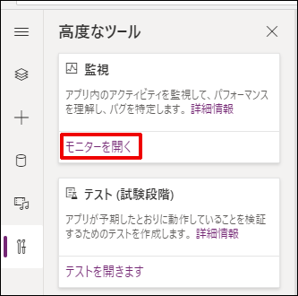
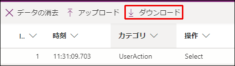
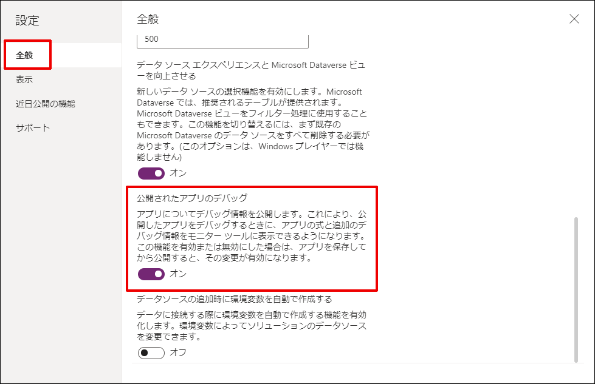
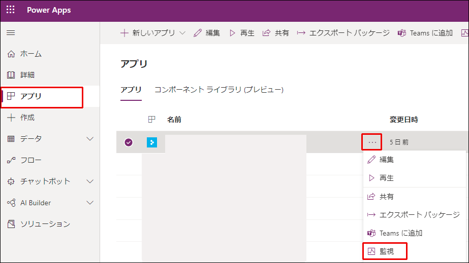

こんにちは、Power Platform サポートの清水です。
今回は、Power Apps のキャンバス アプリの調査の際に必要なモニターログの取得方法についてご説明します。
<!-- more -->

モニターログは、アプリの編集時のものと再生時のものがどちらも取得可能です。
「編集画面ではエラーが発生しないが、再生画面では発生する」といった場合には、正常系 (編集画面) と異常系 (再生画面) の両方のログを取得してください。

## 編集画面でのモニター ログ取得方法

**[手順]**

1. アプリを編集画面から開き、[高度なツール] ＞ [モニターを開く] をクリックします。

2. 別タブにてモニターが開きますので、事象発生部分を編集モードで実行してください。
3. ログの記録が確認できたら、モニター画面にて [ダウンロード] をクリックしてください。

4. Json ファイルがダウンロードされますので、弊社までお寄せください。

## 再生画面でのモニター ログ取得方法

**事前準備**: アプリ再生時の情報を取得するために、アプリを編集画面で開き、  
[設定] > [全般] にて「公開されたアプリのデバッグ」をオンに設定してください。

**[手順]**

1. エラーが発生するユーザーにて Power Apps にサインインし、[アプリ] をクリックします。
2. エラーの発生するアプリの […] > [監視] をクリックします。

3. 別タブにてモニターが開きますので、[公開したアプリの再生] をクリックします。

4. アプリが再生されるので、事象発生部分を実行します。
5. ログの記録が確認できたら、モニター画面にて [ダウンロード] をクリックしてください。

6. Json ファイルがダウンロードされますので、弊社までお寄せください。

---