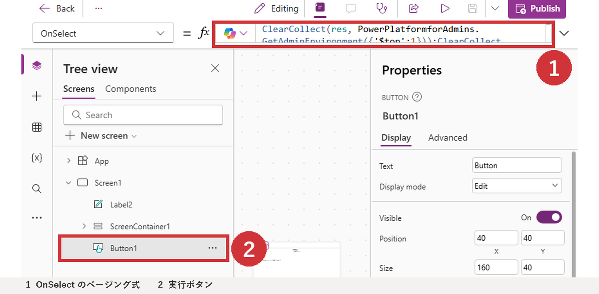
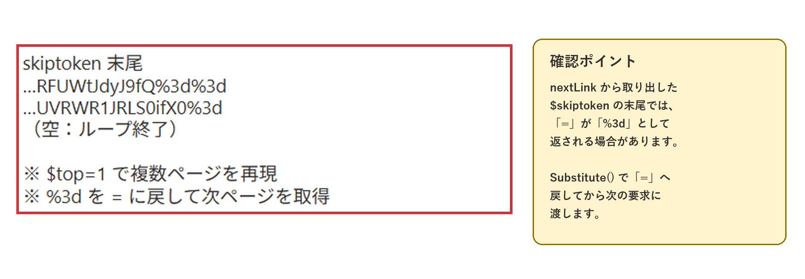
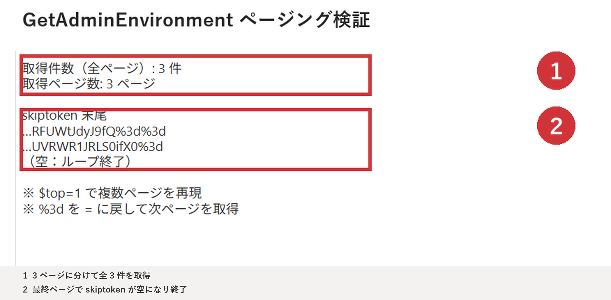

こんにちは、Power Platform サポートチームの早坂です。<br/>

本記事では、Power Apps キャンバス アプリからコネクタを呼び出した際に一部のデータしか返らない場合に、応答の `nextLink` と `$skiptoken` を使用して続きのページを取得する方法をご紹介します。

<!-- more -->

> [!NOTE]
> 本記事では Power Platform for Admins コネクタの `GetAdminEnvironment` アクションを例に説明します。ページングの対応状況、パラメーター名、1 ページあたりの件数はコネクタとアクションによって異なります。
>
> 数式で使用するコネクタのデータ ソース名は、アプリへ追加した際の表示名や言語によって異なる場合があります。本記事では `PowerPlatformforAdmins` を使用していますが、環境によっては `管理者向けPowerPlatform` などと表示されます。Power Apps の数式バーに表示される候補に従い、実際のデータ ソース名へ読み替えてください。

## 目次

- [1. 概要](#1-概要)
- [2. 一度の呼び出しで全件を取得できない理由](#2-一度の呼び出しで全件を取得できない理由)
- [3. nextLink を使用して続きのページを取得する](#3-nextLink-を使用して続きのページを取得する)
  - [3-1. nextLink から skiptoken を取り出す](#3-1-nextLink-から-skiptoken-を取り出す)
  - [3-2. 複数ページを取得する](#3-2-複数ページを取得する)
  - [3-3. 2 ページのみ取得する](#3-3-2-ページのみ取得する)
- [4. Power Automate を使用する方法](#4-Power-Automate-を使用する方法)
- [5. 設計時の注意点](#5-設計時の注意点)
- [6. まとめ](#6-まとめ)

<a id='1-概要'></a>

## 1. 概要

Power Apps キャンバス アプリから一覧取得系のコネクタ アクションを実行すると、対象データが存在するにもかかわらず、一部のレコードしか返らない場合があります。

たとえば、次の式では `GetAdminEnvironment` を 1 回だけ実行し、応答の `value` をコレクションへ格納しています。

```powerfx
ClearCollect(
    ClcEnvironment,
    AddColumns(
        PowerPlatformforAdmins.GetAdminEnvironment().value,
        DisplayName,
        properties.displayName
    )
);
```

このとき、コネクタの応答が複数ページに分かれていると、`value` に含まれるのは最初のページのデータのみです。

本記事では、以下のように `nextLink` が空になるまで続きのページを取得し、1 つのコレクションへ追加します。





<a id='2-一度の呼び出しで全件を取得できない理由'></a>

## 2. 一度の呼び出しで全件を取得できない理由

コネクタの一覧取得アクションでは、応答サイズや処理負荷を抑えるため、結果を複数ページに分けて返す場合があります。

Power Platform for Admins コネクタの `GetAdminEnvironment` アクションでは、次のパラメーターを指定できます。

| パラメーター | 説明 |
| --- | --- |
| `$top` | 1 ページに含める件数 |
| `$skiptoken` | 続きのページを取得するためのトークン |
| `$expand` | 応答に展開するプロパティ |

また、応答には主に次の値が含まれます。

| プロパティ | 説明 |
| --- | --- |
| `value` | 現在のページに含まれるデータ |
| `nextLink` | 次のページを取得するための URL。最終ページでは空 |

キャンバス アプリは、応答に `nextLink` が含まれていても、自動的にリンクをたどって全ページを取得しません。そのため、続きのデータが必要な場合は、アプリ側で `$skiptoken` を指定して次の要求を実行します。

[キャンバス アプリのコネクタの概要 - アクション](https://learn.microsoft.com/ja-jp/power-apps/maker/canvas-apps/connections-list#actions)

<a id='3-nextLink-を使用して続きのページを取得する'></a>

## 3. nextLink を使用して続きのページを取得する

処理の流れは次のとおりです。

1. 最初のページを取得します。
2. 応答の `value` を結果用コレクションへ追加します。
3. `nextLink` から `$skiptoken` の値を取り出します。
4. `$skiptoken` を指定して次のページを取得します。
5. `nextLink` が空になるまで処理を繰り返します。

<a id='3-1-nextLink-から-skiptoken-を取り出す'></a>

### 3-1. nextLink から skiptoken を取り出す

次の式では、`nextLink` を `skiptoken=` と `&` で分割し、トークン部分だけを取り出しています。

```powerfx
First(
    Split(
        Last(
            Split(
                Last(res).nextLink,
                "skiptoken="
            )
        ).Value,
        "&"
    )
).Value
```

> [!IMPORTANT]
> `GetAdminEnvironment` の `nextLink` では、トークン末尾の `=` が `%3d` として URL エンコードされる場合があります。取得した値を `$skiptoken` に渡す前に、`Substitute(トークン, "%3d", "=")` で戻します。





2026 年 7 月 24 日に検証環境で `$top=1` を指定して確認したところ、1 ページ目と 2 ページ目のトークン末尾に `%3d` が含まれ、3 ページ目でトークンが空になりました。

<a id='3-2-複数ページを取得する'></a>

### 3-2. 複数ページを取得する

次のサンプルでは、最初のページを取得した後、`Sequence()` と `ForAll()` を使用して続きのページを取得します。

```powerfx
// 最初のページを取得
ClearCollect(
    res,
    PowerPlatformforAdmins.GetAdminEnvironment(
        {
            '$top': 100
        }
    )
);

// 取得結果を格納
ClearCollect(
    result,
    Last(res).value
);

// 次のページのトークンを格納
ClearCollect(
    skiptoken,
    First(
        Split(
            Last(
                Split(
                    Last(res).nextLink,
                    "skiptoken="
                )
            ).Value,
            "&"
        )
    ).Value
);

// 続きのページを取得
ForAll(
    Sequence(15),
    If(
        !IsBlank(Last(skiptoken).Value),
        Collect(
            res,
            PowerPlatformforAdmins.GetAdminEnvironment(
                {
                    '$top': 100,
                    '$skiptoken': Substitute(
                        Last(skiptoken).Value,
                        "%3d",
                        "="
                    )
                }
            )
        );
        Collect(
            result,
            Last(res).value
        );
        Collect(
            skiptoken,
            First(
                Split(
                    Last(
                        Split(
                            Last(res).nextLink,
                            "skiptoken="
                        )
                    ).Value,
                    "&"
                )
            ).Value
        )
    )
);
```

`Sequence(15)` は、最初の要求に加えて最大 15 回、続きのページを確認する指定です。必要な回数は、想定する最大件数と `$top` の値から決定してください。

たとえば、1,200 件を超えるデータを `$top=100` で取得する場合は 13 ページ以上必要になる可能性があります。件数が増加することも考慮し、余裕を持った上限を設定します。

検証では `$top=1` として意図的に複数ページを発生させ、3 ページに分かれた全 3 件を取得できることを確認しました。





> [!CAUTION]
> `ForAll()` はレコードを順番どおりに処理することを保証せず、可能な場合は並列に処理します。本サンプルを採用する場合は、対象コネクタと実データで十分に動作検証してください。厳密な逐次処理が必要な場合は、Power Automate などで `nextLink` が空になるまで順次処理する方法をご検討ください。

[ForAll 関数](https://learn.microsoft.com/ja-jp/power-platform/power-fx/reference/function-forall)

<a id='3-3-2-ページのみ取得する'></a>

### 3-3. 2 ページのみ取得する

取得対象が 2 ページ以内であることが分かっている場合は、ループを使用せず、`With()` で 2 回目の要求を明示すると簡潔に記述できます。

```powerfx
With(
    {
        res:
            PowerPlatformforAdmins.GetAdminEnvironment(
                {
                    '$top': 200
                }
            )
    },
    ClearCollect(
        result2,
        res.value,
        If(
            !IsBlank(res.nextLink),
            PowerPlatformforAdmins.GetAdminEnvironment(
                {
                    '$top': 200,
                    '$skiptoken': Substitute(
                        First(
                            Split(
                                Last(
                                    Split(
                                        res.nextLink,
                                        "skiptoken="
                                    )
                                ).Value,
                                "&"
                            )
                        ).Value,
                        "%3d",
                        "="
                    )
                }
            ).value
        )
    )
);
```

`Set()` と `If()` を使い、同じ処理を段階的に記述することもできます。

```powerfx
Set(
    temp1,
    PowerPlatformforAdmins.GetAdminEnvironment(
        {
            '$top': 200
        }
    )
);

ClearCollect(
    result3,
    temp1.value
);

If(
    !IsBlank(temp1.nextLink),
    Collect(
        result3,
        PowerPlatformforAdmins.GetAdminEnvironment(
            {
                '$top': 200,
                '$skiptoken': Substitute(
                    First(
                        Split(
                            Last(
                                Split(
                                    temp1.nextLink,
                                    "skiptoken="
                                )
                            ).Value,
                            "&"
                        )
                    ).Value,
                    "%3d",
                    "="
                )
            }
        ).value
    )
);
```

<a id='4-Power-Automate-を使用する方法'></a>

## 4. Power Automate を使用する方法

アクションによっては、Power Automate の設定画面に **改ページ** が用意されています。対応するアクションでは、改ページを有効にしてしきい値を設定することで、複数ページを自動取得できます。

一方で、すべてのアクションが改ページ設定に対応しているわけではありません。対象アクションの設定に改ページが表示されるかを確認してください。

キャンバス アプリ内で処理する方法と Power Automate を使用する方法には、それぞれ次の特徴があります。

| 方法 | 特徴 |
| --- | --- |
| キャンバス アプリ内で処理 | アプリだけで完結する。ページング式、上限、エラー処理をアプリ側で管理する必要がある |
| Power Automate で処理 | 逐次処理や改ページ設定を構成しやすい。フローの保守、応答時間、実行制限を考慮する必要がある |

いずれか一方が常に推奨されるものではありません。取得件数、呼び出し頻度、保守担当、応答時間を考慮して選択します。

<a id='5-設計時の注意点'></a>

## 5. 設計時の注意点

### 必要なデータだけを取得する

全件取得は通信量、実行時間、端末のメモリ使用量を増加させます。画面表示が目的の場合は、フィルターで対象を絞る、必要になったタイミングで次のページを読み込む、といった設計もご検討ください。

### 最終ページを判定する

最終ページでは `nextLink` が空になります。空のトークンでコネクタを再実行しないよう、`IsBlank()` で確認します。

### 呼び出し回数の制限を確認する

Power Platform for Admins コネクタには、接続あたり 60 秒間に 100 回の呼び出し制限があります。ページ数が多いほどコネクタ呼び出し回数も増えるため、利用者数と実行頻度を含めて設計してください。

[Power Platform for Admins - Throttling Limits](https://learn.microsoft.com/ja-jp/connectors/powerplatformforadmins/#throttling-limits)

### エラー処理を追加する

ページ途中の要求が失敗した場合、結果用コレクションには一部のデータだけが残る可能性があります。実運用では `IfError()` などを使用し、取得失敗を利用者へ通知する処理を追加してください。

<a id='6-まとめ'></a>

## 6. まとめ

コネクタの応答に `nextLink` が含まれる場合、データは次のページへ続いています。

- 現在のページの `value` をコレクションへ格納する
- `nextLink` から `$skiptoken` を取り出す
- `%3d` を `=` に戻して次の要求へ渡す
- `nextLink` が空になるまで、用途に合った方法で続きを取得する

ページ数が少ない場合は `With()` や `Set()` で明示的に取得し、ページ数が多い場合や厳密な逐次処理が必要な場合は Power Automate の利用もご検討ください。

## 参考情報

- [Power Platform for Admins コネクタ](https://learn.microsoft.com/ja-jp/connectors/powerplatformforadmins/)
- [キャンバス アプリのコネクタの概要](https://learn.microsoft.com/ja-jp/power-apps/maker/canvas-apps/connections-list)
- [Sequence 関数](https://learn.microsoft.com/ja-jp/power-platform/power-fx/reference/function-sequence)
- [ForAll 関数](https://learn.microsoft.com/ja-jp/power-platform/power-fx/reference/function-forall)
- [With 関数](https://learn.microsoft.com/ja-jp/power-platform/power-fx/reference/function-with)
- [Replace および Substitute 関数](https://learn.microsoft.com/ja-jp/power-platform/power-fx/reference/function-replace-substitute)

> [!NOTE]
> 本記事の数式は実装例です。エラー処理や各環境固有の条件をすべて含むものではありません。ご利用の際は、検証環境で十分に動作をご確認ください。

※本情報の内容（添付文書、リンク先などを含む）は、作成日時点でのものであり、予告なく変更される場合があります。
