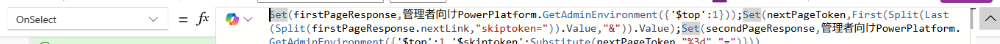
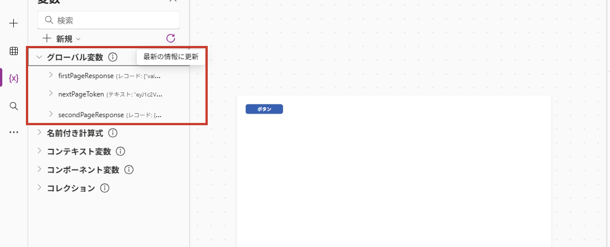
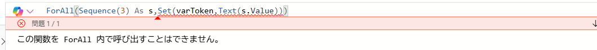
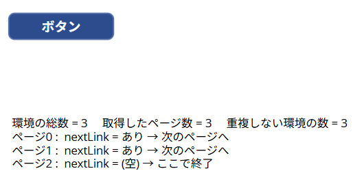
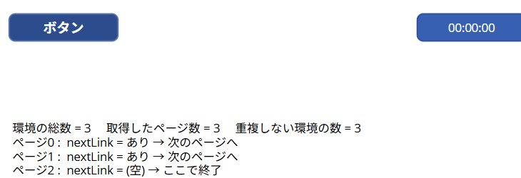

こんにちは、Power Platform サポートチームの早坂です。<br/>

本記事では、Power Apps キャンバスアプリからコネクタの一覧取得アクションを実行したときに、**データが存在するのに一部のレコードしか取得できない** という事象について、その理由と、応答の `nextLink` から `$skiptoken` を取り出して続きのページを取得する方法をご紹介します。あわせて、繰り返し回数の決め方による実装の違いと、設計時に確認いただきたい注意点も整理しています。

<!-- more -->

> [!NOTE]
> 本記事では、Power Platform for Admins コネクタの `GetAdminEnvironment` (環境を管理者として一覧表示する) アクションを例にご説明します。ページングの対応有無、パラメーター名、1 ページあたりの既定件数はコネクタとアクションによって異なるため、実際にご利用になるアクションのコネクタ リファレンスをあわせてご確認ください。
>
> 数式で使用するデータ ソース名は、アプリへ追加した際の表示名や環境の言語によって異なります。本記事の本文では `PowerPlatformforAdmins` と表記していますが、日本語環境では `管理者向けPowerPlatform` と表示される場合があります (本記事のスクリーンショットは日本語表示の環境で取得しています)。Power Apps の数式バーに表示される候補に従い、実際のデータ ソース名へ読み替えてください。

## 目次

- [1. 概要](#1-概要)
- [2. 一度の呼び出しですべてのデータを取得できない理由](#2-一度の呼び出しですべてのデータを取得できない理由)
- [3. キャンバスアプリで nextLink を使用して続きのページを取得する](#3-キャンバスアプリで%20nextLink%20を使用して続きのページを取得する)
  - [3-1. 処理の流れ](#3-1-処理の流れ)
  - [3-2. nextLink から $skiptoken を取り出す](#3-2-nextLink%20から%20$skiptoken%20を取り出す)
  - [3-3. 2 ページ分を取得する実装例](#3-3-2%20ページ分を取得する実装例)
  - [3-4. 動作確認](#3-4-動作確認)
  - [3-5. 回数を指定して繰り返す (ForAll + Sequence)](#3-5-回数を指定して繰り返す%20(ForAll%20+%20Sequence))
  - [3-6. 回数を決めずに繰り返す (タイマー コントロール)](#3-6-回数を決めずに繰り返す%20(タイマー%20コントロール))
  - [3-7. 3 つの方法の使い分け](#3-7-3%20つの方法の使い分け)
- [4. 補足: Power Automate クラウドフローを使用する方法](#4-補足%20Power%20Automate%20クラウドフローを使用する方法)
- [5. 設計時に確認しておきたい注意点](#5-設計時に確認しておきたい注意点)
- [6. まとめ](#6-まとめ)
- [参考情報](#参考情報)

<a id='1-概要'></a>

## 1. 概要

Power Apps キャンバスアプリから一覧を取得するコネクタ アクションを実行すると、対象のデータが存在していても、**一部のレコードしか返らない** ことがあります。

たとえば次の数式は、`GetAdminEnvironment` を 1 回だけ実行し、応答の `value` をコレクションへ格納しています。

```powerfx
ClearCollect(
    ClcEnvironment,
    AddColumns(
        PowerPlatformforAdmins.GetAdminEnvironment().value,
        DisplayName,
        properties.displayName
    )
);
```

このとき、コネクタの応答が複数ページに分かれていると、`value` に含まれるのは **最初のページのデータのみ** です。残りのデータを取得するには、応答に含まれる `nextLink` から `$skiptoken` を取り出し、アプリ側から次の要求を明示的に実行する必要があります。

本記事では、次の順にご説明します。

- なぜ 1 回の呼び出しですべてのデータが返らないのか
- `nextLink` から `$skiptoken` を取り出して次のページを取得する数式
- 実際に複数ページを取得できることの動作確認結果
- 繰り返しの回数を指定する方法 (`ForAll()` + `Sequence()`) と、回数を決めずに繰り返す方法 (タイマー コントロール)
- 全件取得を実装する前に確認しておきたい制限と注意点

<a id='2-一度の呼び出しですべてのデータを取得できない理由'></a>

## 2. 一度の呼び出しですべてのデータを取得できない理由

コネクタの一覧取得アクションでは、応答サイズやサービス側の処理負荷を抑えるため、結果を複数ページに分けて返す実装になっている場合があります。

Power Platform for Admins コネクタの `GetAdminEnvironment` アクションでは、次のパラメーターを指定できます。

| パラメーター | 説明 |
| --- | --- |
| `$top` | 1 ページに含める件数 |
| `$skiptoken` | 続きのページを取得するためのトークン |
| `$expand` | 応答に展開するプロパティ |

また、応答には主に次の値が含まれます。

| プロパティ | 説明 |
| --- | --- |
| `value` | 現在のページに含まれるデータ |
| `nextLink` | 次のページを取得するための URL。最終ページでは空になります |

ここで重要な点として、**キャンバスアプリは、応答に `nextLink` が含まれていても、自動的にリンクをたどって全ページを取得することはありません。** 1 回のアクション呼び出しは 1 回の API 要求に対応し、返された 1 ページ分の応答がそのまま数式の戻り値になります。

そのため、続きのデータが必要な場合は、アプリ側で `nextLink` を確認し、`$skiptoken` を指定して次の要求を実行する処理を作り込む必要があります。

[キャンバス アプリのコネクタの概要 - アクション - Microsoft Learn](https://learn.microsoft.com/ja-jp/power-apps/maker/canvas-apps/connections-list#actions)

<a id='3-キャンバスアプリで nextLink を使用して続きのページを取得する'></a>

## 3. キャンバスアプリで nextLink を使用して続きのページを取得する

<a id='3-1-処理の流れ'></a>

### 3-1. 処理の流れ

続きのページを取得する処理の流れは次のとおりです。

1. 最初のページを取得します。
2. 応答の `value` を結果用のコレクションへ格納します。
3. 応答の `nextLink` から `$skiptoken` の値を取り出します。
4. 取り出した値を `$skiptoken` に指定して、次のページを取得します。
5. `nextLink` が空になるまで、3 と 4 を繰り返します。

<a id='3-2-nextLink から $skiptoken を取り出す'></a>

### 3-2. nextLink から $skiptoken を取り出す

`nextLink` は、`$skiptoken` を含むクエリ文字列付きの URL として返されます。キャンバスアプリからはこの URL をそのまま呼び出せないため、`Split()` でトークン部分だけを抜き出します。

次の数式は、`nextLink` を `skiptoken=` で分割して後半を取得し、さらに `&` で分割して先頭を取得することで、トークンの値だけを取り出しています。

```powerfx
First(
    Split(
        Last(
            Split(
                firstPageResponse.nextLink,
                "skiptoken="
            )
        ).Value,
        "&"
    )
).Value
```

> [!IMPORTANT]
> `GetAdminEnvironment` の `nextLink` では、トークン末尾の `=` が `%3d` として URL エンコードされた状態で返される場合があります。エンコードされたまま `$skiptoken` へ渡すと、想定した次のページが返らないことがあります。<br/>
> `Substitute(トークン, "%3d", "=")` で `=` に戻してから `$skiptoken` へ渡してください。

<a id='3-3-2 ページ分を取得する実装例'></a>

### 3-3. 2 ページ分を取得する実装例

取得対象が 2 ページ以内であることが分かっている場合は、ループを使用せず、`With()` で 2 回目の要求を明示すると簡潔に記述できます。

```powerfx
With(
    {
        firstPageResponse:
            PowerPlatformforAdmins.GetAdminEnvironment(
                {
                    '$top': 200
                }
            )
    },
    ClearCollect(
        ClcEnvironment,
        firstPageResponse.value,
        If(
            !IsBlank(firstPageResponse.nextLink),
            PowerPlatformforAdmins.GetAdminEnvironment(
                {
                    '$top': 200,
                    '$skiptoken': Substitute(
                        First(
                            Split(
                                Last(
                                    Split(
                                        firstPageResponse.nextLink,
                                        "skiptoken="
                                    )
                                ).Value,
                                "&"
                            )
                        ).Value,
                        "%3d",
                        "="
                    )
                }
            ).value
        )
    )
);
```

`Set()` と `If()` を使用し、同じ処理を段階的に記述することもできます。途中の応答を変数に保持できるため、動作確認やトラブルシューティングの際に値を追いやすくなります。

```powerfx
Set(
    firstPageResponse,
    PowerPlatformforAdmins.GetAdminEnvironment(
        {
            '$top': 200
        }
    )
);

ClearCollect(
    ClcEnvironment,
    firstPageResponse.value
);

If(
    !IsBlank(firstPageResponse.nextLink),
    Collect(
        ClcEnvironment,
        PowerPlatformforAdmins.GetAdminEnvironment(
            {
                '$top': 200,
                '$skiptoken': Substitute(
                    First(
                        Split(
                            Last(
                                Split(
                                    firstPageResponse.nextLink,
                                    "skiptoken="
                                )
                            ).Value,
                            "&"
                        )
                    ).Value,
                    "%3d",
                    "="
                )
            }
        ).value
    )
);
```

<a id='3-4-動作確認'></a>

### 3-4. 動作確認

上記の考え方どおりに続きのページが取得できることを、実機で確認しました。

| 項目 | 内容 |
| --- | --- |
| 確認日 | 2026 年 7 月 24 日 |
| 使用コネクタ | Power Platform for Admins (`GetAdminEnvironment`) |
| 権限 | Power Platform 管理者 |
| 対象テナントの環境数 | 3 |
| 確認方法 | ボタンの `OnSelect` に数式を設定し、変数ペインおよび画面上のラベルで応答を確認 |

環境の数が少なくてもページが分かれる状態を作るため、`$top` に `1` を指定しています。ボタンの `OnSelect` へ、1 ページ目の取得、`$skiptoken` の抽出、2 ページ目の取得を続けて記述しました。



```powerfx
Set(
    firstPageResponse,
    PowerPlatformforAdmins.GetAdminEnvironment(
        {
            '$top': 1
        }
    )
);

Set(
    nextPageToken,
    First(
        Split(
            Last(
                Split(
                    firstPageResponse.nextLink,
                    "skiptoken="
                )
            ).Value,
            "&"
        )
    ).Value
);

Set(
    secondPageResponse,
    PowerPlatformforAdmins.GetAdminEnvironment(
        {
            '$top': 1,
            '$skiptoken': Substitute(
                nextPageToken,
                "%3d",
                "="
            )
        }
    )
);
```

ボタンを実行すると、変数ペインで次の状態を確認できます。

- `firstPageResponse` に 1 ページ目の応答が格納される
- `nextPageToken` に `nextLink` から取り出したトークンが格納される
- `secondPageResponse` に 2 ページ目の応答が格納される



`secondPageResponse` にも `value` が返っていることから、`$skiptoken` を指定した 2 回目の要求で続きのページを取得できていることが確認できます。最終ページに到達すると `nextLink` は空になるため、この値で繰り返しの終了を判定します。

> [!NOTE]
> 上記は動作の確認を目的とした最小構成のため、`$top` に `1` を指定しています。実際のアプリでは、呼び出し回数を抑えるためにアクションが許容する範囲でより大きな `$top` を指定してください。

<a id='3-5-回数を指定して繰り返す (ForAll + Sequence)'></a>

### 3-5. 回数を指定して繰り返す (ForAll + Sequence)

3-3 の方法は要求を数式へ直接並べるため、ページ数が増えると数式が長くなります。取得するページ数の **上限が決められる** 場合は、`Sequence()` で回数を作り、`ForAll()` で繰り返す書き方ができます。

ただし、この構成には Power Fx 側の制約があります。

> [!IMPORTANT]
> `ForAll()` の中では `Set()`、`UpdateContext()`、`Clear()`、`ClearCollect()` を呼び出せません。数式バーに入力すると **「この関数を ForAll 内で呼び出すことはできません。」** というエラーになります。<br/>
> そのため、「取り出した `$skiptoken` を変数に入れて次の周回で使う」という書き方はできません。



`Collect()` は `ForAll()` の中でも使用できます。そこで、応答をコレクションへ蓄積し、次の周回では `Last()` で直前の行の `nextLink` を読み取ることで、変数を使わずにトークンを引き継ぎます。

```powerfx
Clear(colPages);

// 1 ページ目
With(
    {
        firstPage: PowerPlatformforAdmins.GetAdminEnvironment({ '$top': 1 })
    },
    Collect(
        colPages,
        {
            page: 0,
            envName: First(firstPage.value).name,
            nextLink: firstPage.nextLink
        }
    )
);

// 2 ページ目以降 (最大 5 回)
ForAll(
    Sequence(5) As s,
    If(
        !IsBlank(Last(colPages).nextLink),
        With(
            {
                nextPage:
                    PowerPlatformforAdmins.GetAdminEnvironment(
                        {
                            '$top': 1,
                            '$skiptoken': Substitute(
                                First(
                                    Split(
                                        Last(
                                            Split(
                                                Last(colPages).nextLink,
                                                "skiptoken="
                                            )
                                        ).Value,
                                        "&"
                                    )
                                ).Value,
                                "%3d",
                                "="
                            )
                        }
                    )
            },
            Collect(
                colPages,
                {
                    page: s.Value,
                    envName: First(nextPage.value).name,
                    nextLink: nextPage.nextLink
                }
            )
        )
    )
);
```

#### 動作確認結果

環境が 3 つ存在するテナントで、`$top` に `1`、`Sequence()` に `5` を指定して実行しました。結果を分かりやすくするため、画面には取得したページ数、重複しない環境の数、各ページの `nextLink` の有無を表示しています。



- 取得したページ数は **3**、重複しない環境の数も **3** となり、各周回が直前のページの `$skiptoken` を使って **順番に** 実行されたことを確認できました。
- 3 ページ目で `nextLink` が空になった後は、`If(!IsBlank(...))` により 4 回目、5 回目の要求が実行されず、余分な呼び出しが発生していません。
- 同じ操作を 3 回繰り返し、いずれも同じ結果になることを確認しました。

> [!CAUTION]
> `ForAll()` の処理順序は公開情報上 **保証されていません**。「レコードは任意の順序で、可能な場合は並行して処理できる」と明記されています。上記は特定の環境・時期での確認結果であり、順序が保証される動作としてドキュメント化されているものではありません。<br/>
> 業務で採用する場合は、想定するページ数とデータで結果に取得漏れや重複がないことを必ずご確認ください。順序への依存を避けたい場合は、3-6 のタイマー コントロールをご検討ください。
>
> [ForAll 関数 - Microsoft Learn](https://learn.microsoft.com/ja-jp/power-platform/power-fx/reference/function-forall)

> [!WARNING]
> `If(!IsBlank(Last(colPages).nextLink), ...)` の判定を省略すると、`nextLink` が空になった後もコネクタが呼び出されます。空のトークンを渡した要求は **1 ページ目を返す** ため、コレクションに同じデータが重複して追加されます。実際に判定を省略した数式では、最終ページの次の周回で 1 ページ目のデータが再度追加されることを確認しました。

<a id='3-6-回数を決めずに繰り返す (タイマー コントロール)'></a>

### 3-6. 回数を決めずに繰り返す (タイマー コントロール)

`Sequence()` を使う方法では、繰り返し回数の上限をあらかじめ数式へ書く必要があります。**回数を決めずに `nextLink` が空になるまで繰り返したい** 場合は、タイマー コントロールの `OnTimerEnd` を利用します。

タイマーの `Repeat` を有効にすると、`Duration` ごとに `OnTimerEnd` が繰り返し実行されます。`OnTimerEnd` で 1 ページ分を取得し、`nextLink` が空になったらタイマーを停止する変数を更新することで、回数を指定しない繰り返しを実装できます。

タイマー コントロール (`Timer1`) のプロパティ:

| プロパティ | 設定値 |
| --- | --- |
| `Duration` | `300` |
| `Repeat` | `true` |
| `AutoStart` | `false` |
| `Start` | `varLooping` |

`OnTimerEnd` には、次の数式を設定します。`OnTimerEnd` は `ForAll()` の中ではないため、`Set()` を使用できます。

```powerfx
If(
    IsBlank(Last(colPages).nextLink),
    Set(varLooping, false),
    With(
        {
            nextPage:
                PowerPlatformforAdmins.GetAdminEnvironment(
                    {
                        '$top': 1,
                        '$skiptoken': Substitute(
                            First(
                                Split(
                                    Last(
                                        Split(
                                            Last(colPages).nextLink,
                                            "skiptoken="
                                        )
                                    ).Value,
                                    "&"
                                )
                            ).Value,
                            "%3d",
                            "="
                        )
                    }
                )
        },
        Collect(
            colPages,
            {
                page: CountRows(colPages),
                envName: First(nextPage.value).name,
                nextLink: nextPage.nextLink
            }
        )
    )
)
```

開始用のボタンでは、1 ページ目を取得してから `varLooping` を `true` にし、タイマーを開始します。

```powerfx
Set(varLooping, false);
Clear(colPages);

With(
    {
        firstPage: PowerPlatformforAdmins.GetAdminEnvironment({ '$top': 1 })
    },
    Collect(
        colPages,
        {
            page: 0,
            envName: First(firstPage.value).name,
            nextLink: firstPage.nextLink
        }
    )
);

Set(varLooping, true);
```

#### 動作確認結果

3-5 と同じ環境で実行したところ、繰り返し回数を数式に書かなくても、`nextLink` が空になった時点でタイマーが自動的に停止し、3 ページすべてを重複なく取得できました。



> [!NOTE]
> タイマーを使用する方法では、`Duration` の間隔で要求が繰り返されます。ページ数が多い場合は、`Duration` とコネクタの呼び出し回数の制限 (5-3 参照) を合わせてご確認ください。<br/>
> また、停止条件の更新に失敗するとタイマーが止まらず要求が繰り返されます。`nextLink` が空になったとき以外にも、あらかじめ決めた最大ページ数に達したときや `IfError()` でエラーを検知したときにタイマーを停止する処理を、あわせて実装してください。

<a id='3-7-3 つの方法の使い分け'></a>

### 3-7. 3 つの方法の使い分け

| 方法 | 繰り返し回数 | 特徴 |
| --- | --- | --- |
| `With()` / `Set()` で要求を並べる (3-3) | 固定 (2 ～ 3 回程度) | 実行順序が数式上明確。ページ数が増えると数式が長くなる |
| `ForAll()` + `Sequence()` (3-5) | 上限を指定 | 数式が簡潔。`ForAll()` 内で `Set()` を使えず、処理順序は公開情報上保証されない |
| タイマー コントロール (3-6) | 指定不要 | `nextLink` が空になるまで繰り返せる。停止条件の実装が必須 |

<a id='4-補足 Power Automate クラウドフローを使用する方法'></a>

## 4. 補足: Power Automate クラウドフローを使用する方法

本記事はキャンバスアプリ側の実装を対象としていますが、同じページングは Power Automate クラウドフローで行うこともできます。

- アクションによっては、アクションの設定に **改ページ (Pagination)** が用意されており、しきい値を指定するだけで複数ページをまとめて取得できます。
- 改ページに対応していないアクションでも、`Do until` アクションで `nextLink` が空になるまで繰り返す実装が可能です。

キャンバスアプリからは「Power Apps がフローを呼び出したとき (V2)」トリガーでフローを呼び出し、結果だけを受け取る構成にできます。ただし、フローからアプリへの応答には 120 秒の制限があるほか、フローの保守や実行数の上限も考慮が必要です。取得件数、呼び出し頻度、保守のしやすさを踏まえてご選択ください。

クラウドフロー側の具体的な設定手順は、別記事で詳しくご紹介する予定です。

[改ページ位置の自動修正で既定のページ サイズを超える結果を取得する - Microsoft Learn](https://learn.microsoft.com/ja-jp/azure/logic-apps/logic-apps-exceed-default-page-size-with-pagination)

<a id='5-設計時に確認しておきたい注意点'></a>

## 5. 設計時に確認しておきたい注意点

### 5-1. 本当に全件が必要かを確認する

全件取得は、通信量、実行時間、端末のメモリ使用量をいずれも増加させます。画面表示が目的の場合は、フィルターで対象を絞る、利用者が必要としたタイミングで次のページを読み込む、といった設計もご検討ください。

### 5-2. 最終ページを判定する

最終ページでは `nextLink` が空になります。空のトークンでコネクタを再実行すると、意図しない結果やエラーにつながる可能性があるため、`IsBlank()` で必ず確認してください。

### 5-3. コネクタの呼び出し回数の制限を確認する

ページングを実装すると、ページ数の分だけコネクタの呼び出し回数が増えます。Power Platform for Admins コネクタには、**接続ごとに 60 秒あたり 100 回** の API 呼び出し制限があります。利用者数と実行頻度を含めて、制限に到達しないかをご確認ください。

[Power Platform for Admins - Throttling Limits - Microsoft Learn](https://learn.microsoft.com/ja-jp/connectors/powerplatformforadmins/#throttling-limits)

### 5-4. エラー処理を追加する

途中のページ取得に失敗した場合、結果用のコレクションには一部のデータだけが残る可能性があります。利用者が「全件表示されている」と誤解しないよう、実運用では `IfError()` などで取得失敗を検知し、利用者へ通知する処理をあわせて実装してください。

[IfError 関数 - Microsoft Learn](https://learn.microsoft.com/ja-jp/power-platform/power-fx/reference/function-iferror)

<a id='6-まとめ'></a>

## 6. まとめ

コネクタの応答に `nextLink` が含まれる場合、データは次のページへ続いています。キャンバスアプリは自動的に続きを取得しないため、アプリまたはフロー側での実装が必要です。

- 現在のページの `value` をコレクションへ格納する
- `nextLink` から `$skiptoken` を取り出す
- `%3d` を `=` に戻してから次の要求へ渡す
- `nextLink` が空になったかどうかを `IsBlank()` で判定し、繰り返しを止める

繰り返しの方法は、取得するページ数に応じて選択します。ページ数が 2 ～ 3 ページであれば `With()` や `Set()` で要求を並べ、上限を決められる場合は `ForAll()` と `Sequence()`、回数を決めずに `nextLink` が空になるまで繰り返す場合はタイマー コントロールが利用できます。

あわせて、`ForAll()` 内で `Set()` を使用できない点、`nextLink` が空になった後の要求を止めないと 1 ページ目が重複して取得される点、コネクタの呼び出し回数の制限、エラー処理の実装もご確認いただけますと幸いです。

<a id='参考情報'></a>

## 参考情報

- [Power Platform for Admins コネクタ - Microsoft Learn](https://learn.microsoft.com/ja-jp/connectors/powerplatformforadmins/)
- [キャンバス アプリのコネクタの概要 - Microsoft Learn](https://learn.microsoft.com/ja-jp/power-apps/maker/canvas-apps/connections-list)
- [ForAll 関数 - Microsoft Learn](https://learn.microsoft.com/ja-jp/power-platform/power-fx/reference/function-forall)
- [Sequence 関数 - Microsoft Learn](https://learn.microsoft.com/ja-jp/power-platform/power-fx/reference/function-sequence)
- [With 関数 - Microsoft Learn](https://learn.microsoft.com/ja-jp/power-platform/power-fx/reference/function-with)
- [Split 関数 - Microsoft Learn](https://learn.microsoft.com/ja-jp/power-platform/power-fx/reference/function-split)
- [Replace および Substitute 関数 - Microsoft Learn](https://learn.microsoft.com/ja-jp/power-platform/power-fx/reference/function-replace-substitute)
- [タイマー コントロール - Power Apps | Microsoft Learn](https://learn.microsoft.com/ja-jp/power-apps/maker/canvas-apps/controls/control-timer)
- [改ページ位置の自動修正で既定のページ サイズを超える結果を取得する - Microsoft Learn](https://learn.microsoft.com/ja-jp/azure/logic-apps/logic-apps-exceed-default-page-size-with-pagination)

> [!NOTE]
> 本記事に記載した数式は実装例です。エラー処理や各環境固有の条件をすべて含むものではありません。ご利用の際は、検証環境で十分に動作をご確認ください。

※本記事の執筆には生成 AI を使用しています。[参考](https://learn.microsoft.com/ja-jp/principles-for-ai-generated-content)

---
免責事項
※本情報の内容 (添付文書、リンク先などを含む) は、作成日時点でのものであり、予告なく変更される場合があります。
