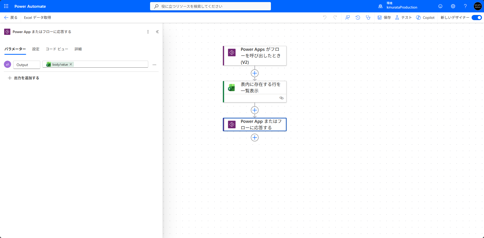
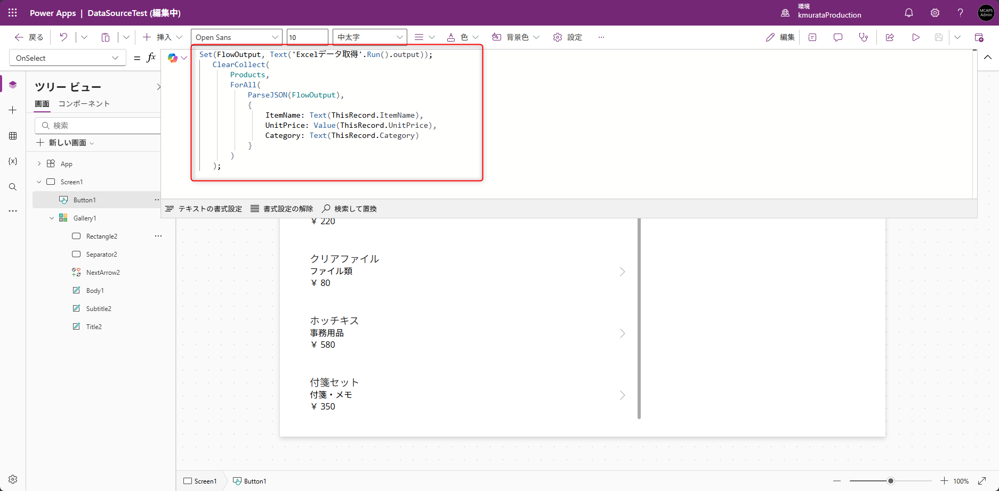
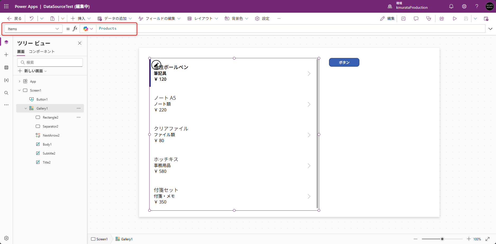
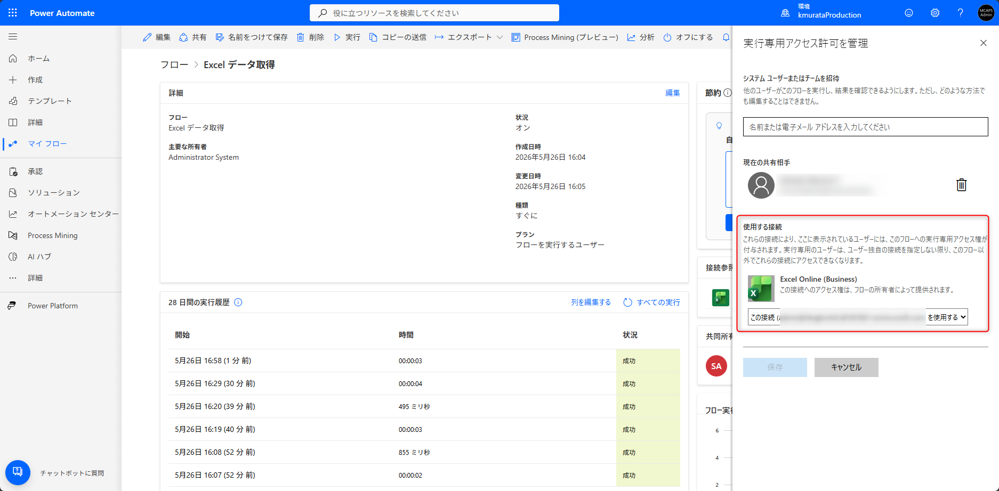

こんにちは、Power Platform サポートチームの村田です。<br/>

本記事では、Power Apps キャンバスアプリで Excel や SharePoint をデータソースとしてご利用の際にお問い合わせとしてよくいただく、**アプリ利用者にデータソースの権限を付与せずにデータだけを表示したい** というご要望について、その背景と Power Automate クラウドフローを活用した実現方法をご紹介します。

> [!NOTE]
> 本記事では Excel Online (Business) コネクタを例にご説明しますが、SharePoint コネクタに置き換えれば、SharePoint リストに対しても同様の構成を適用いただけます。

## 目次

- [1. 概要](#1-概要)
- [2. キャンバスアプリからコネクタを利用して接続する場合の制限](#2-キャンバスアプリからコネクタを利用して接続する場合の制限)
- [3. クラウドフロー経由でデータを参照させる方法](#3-クラウドフロー経由でデータを参照させる方法)
  - [3-1. データ取得用のクラウドフローを作成する](#3-1-データ取得用のクラウドフローを作成する)
  - [3-2. Power Apps キャンバスアプリからクラウドフローを呼び出してコレクションに格納する](#3-2-Power%20Apps%20キャンバスアプリからクラウドフローを呼び出してコレクションに格納する)
  - [3-3. 「実行のみのユーザー」設定で接続を固定する](#3-3-「実行のみのユーザー」設定で接続を固定する)
- [4. 採用前に確認しておきたい注意点](#4-採用前に確認しておきたい注意点)
  - [4-1. パフォーマンス](#4-1-パフォーマンス)
  - [4-2. コネクタ・フローの実行制限](#4-2-コネクタ・フローの実行制限)
  - [4-3. フローからアプリへの応答時間の制限](#4-3-フローからアプリへの応答時間の制限)
- [補足：Microsoft Dataverse の活用による監査要件への対応](#補足：Microsoft%20Dataverse%20の活用による監査要件への対応)

<a id='1-概要'></a>

## 1. 概要

Power Apps キャンバスアプリから Excel Online (Business) や SharePoint などのコネクタを使ってデータソースに接続する場合、その接続は **アプリ利用者の権限** で動作します。
そのため、アプリ上でデータを表示するには、**利用者本人にデータソース（Excel ファイルや SharePoint リスト）へのアクセス権限を付与しておく必要** があります。

一方で、**「Excel ファイルで管理しているマスタデータをアプリの利用ユーザーに閲覧させたいが、データソース自体へのアクセス権は付与したくない」** というご要望をいただくことが少なくありません。

このような場合は、アプリから直接データソースに接続するのではなく、Power Automate のクラウドフローを経由してデータを取得する構成にすることで、**アプリ利用者にはデータソースへの権限を付与せずに、画面上にデータを表示する** ことができます。

本記事では、この構成の具体的な手順と、採用前に押さえておきたい注意点をあわせてご紹介します。

<a id='2-キャンバスアプリからコネクタを利用して接続する場合の制限'></a>

## 2. キャンバスアプリからコネクタを利用して接続する場合の制限

前章で述べたとおり、Power Apps から Excel Online (Business) や SharePoint などのコネクタに直接接続すると、その接続はアプリを開いた利用者本人の権限で動作するため、事前に利用者にデータソースの権限を付与する必要があります。
さらに Excel Online (Business) コネクタは以下の公開情報のとおり、ファイルに対する **書き込み権限** を必要とします。<br/>
アプリ側では「閲覧用に表示するだけ」のご利用であっても、コネクタとしては書き込み相当の権限が要求されます。

[Excel Online (Business) connector - 一般的な既知の問題と制限事項 - Microsoft Learn](https://learn.microsoft.com/ja-jp/connectors/excelonlinebusiness/#general-known-issues-and-limitations)

SharePoint コネクタの場合は、リストに対する閲覧権限でもデータ取得は可能ですが、いずれにせよ利用者に対して権限を付与する運用は避けられません。

このように **Power Apps からコネクタに直接接続すると、利用者全員にデータソースへの権限を割り当てる必要が生じる** ため、運用上の懸念につながります。

<a id='3-クラウドフロー経由でデータを参照させる方法'></a>

## 3. クラウドフロー経由でデータを参照させる方法

Power Apps キャンバスアプリから Power Automate のクラウドフローを呼び出す構成にすると、フロー側のコネクタの接続参照について以下のいずれかを選択できます。

- フローを実行したユーザー（＝アプリ利用者）の接続を使用する
- フロー作成者など、**特定のユーザーの接続を使用する**

後者の設定で構成することで、アプリの利用者にかかわらず、Excel ファイルへの実際のアクセスはフローに紐づく特定ユーザー（データソースの権限を持つユーザー）の接続で行われます。
これにより、**アプリ利用者本人は Excel ファイルへの権限を一切持たなくても、フロー経由でデータを取得して画面に表示** できるようになります。

以下に、具体的な構築手順を Excel Online (Business) コネクタを例にご紹介します。

<a id='3-1-データ取得用のクラウドフローを作成する'></a>

### 3-1. データ取得用のクラウドフローを作成する

Power Automate でデータ取得用のクラウドフローを作成します。
「Power Apps がフローを呼び出したとき (V2)」トリガーを使ったフローを作成し、「Excel Online (Business) 」コネクタで対象のテーブルからデータを取得したうえで、「Power App またはフローに応答する」アクションで結果をアプリ側へ返します。<br/>
以下のサンプルでは、Excel テーブルから全行を取得し、JSON 文字列としてアプリに返却しています。



<a id='3-2-Power Apps キャンバスアプリからクラウドフローを呼び出してコレクションに格納する'></a>

### 3-2. Power Apps キャンバスアプリからクラウドフローを呼び出してコレクションに格納する

アプリ側では、作成したクラウドフローを呼び出し、戻り値をコレクションとして保持してギャラリー等から参照する形にします。
フローの呼び出しは、例えば `OnSelect` などボタンをクリックしたときに実行する形が考えられます。
以下は、3 列のデータを受け取ってコレクションに格納するサンプルです。



```powerfx
Set(FlowOutput, Text('Excelデータ取得'.Run().output));
ClearCollect(
    FlowOutput_Table,
    ForAll(
        ParseJSON(FlowOutput),
        {
            col1: Text(ThisRecord.col1),
            col2: Value(ThisRecord.col2),
            col3: Value(ThisRecord.col3)
        }
    )
);
```

`ParseJSON` 関数の詳細については、下記の公開情報をご参照ください。

[ParseJSON 関数 - Microsoft Learn](https://learn.microsoft.com/ja-jp/power-platform/power-fx/reference/function-parsejson)

ギャラリーの `Items` など、データソースを参照する箇所で上記のコレクションを指定します。



<a id='3-3-「実行のみのユーザー」設定で接続を固定する'></a>

### 3-3. 「実行のみのユーザー」設定で接続を固定する

作成したフローの詳細画面を開き、**「実行のみのユーザー」** の編集画面で、Excel Online (Business) の使用する接続を **「この接続 (XXXXX) を使用する」（＝データソースの権限を持つユーザーの接続に固定）** に変更します。



この設定により、フローが呼び出された際の Excel への実際のアクセスは、常にここで固定した接続を経由して行われるようになります。

<a id='4-採用前に確認しておきたい注意点'></a>

## 4. 採用前に確認しておきたい注意点

本構成は便利な一方で、アプリから直接データソースに接続する場合と比べていくつかのトレードオフがあります。
採用前にぜひご確認ください。

<a id='4-1-パフォーマンス'></a>

### 4-1. パフォーマンス

アプリ → フロー → コネクタ → ファイル と経由する処理が増えるため、**直接接続に比べてオーバーヘッドが発生** します。
取得列を絞る、必要なタイミングでのみ呼び出す、フロー側で集計してから返す、といった工夫をご検討ください。

<a id='4-2-コネクタ・フローの実行制限'></a>

### 4-2. コネクタ・フローの実行制限

アプリの利用者が多い場合、データの取得処理が **対象のコネクタやフローに集中** するため、それらの実行制限に到達しやすくなります。
たとえば Excel Online (Business) コネクタには、100 リクエスト / 60 秒 といった呼び出し回数の制限が設けられています。
利用者数や呼び出し頻度が多くなる構成では、コネクタやフローの制限値を事前にご確認ください。

[Excel オンライン (ビジネス) - Connectors | Microsoft Learn](https://learn.microsoft.com/ja-jp/connectors/excelonlinebusiness/#limits)

<a id='4-3-フローからアプリへの応答時間の制限'></a>

### 4-3. フローからアプリへの応答時間の制限

フローからアプリにデータを返す場合、**フローの呼び出しから応答までに 120 秒という時間制限** があります。
取得データ量が多い場合やフロー内の処理が長くなる場合は、この制限によりタイムアウトする可能性があります。<br/>
長時間の処理が見込まれる場合は、以下の公開情報で紹介されている非同期応答パターンの採用もご検討ください。

[非同期応答の使用 - Power Automate | Microsoft Learn](https://learn.microsoft.com/ja-jp/power-automate/guidance/coding-guidelines/asychronous-flow-pattern)

<a id='補足：Microsoft Dataverse の活用による監査要件への対応'></a>

## 補足：Microsoft Dataverse の活用による監査要件への対応
「誰が、いつ、どのレコードを 作成/更新/削除 したか」を確実に追跡する必要がある場合は、データソースとして Microsoft Dataverse をご採用いただくことを推奨します。<br/>
Dataverse の監査機能では、レコードの変更内容やユーザーによるアクセスをログとして記録可能なため、外部監査・コンプライアンス・ガバナンスの各ポリシーへの対応をサポートします。<br/>
あわせて、セキュリティロールによる テーブル単位/レコード単位 のアクセス制御や、列レベルセキュリティによる機密項目の保護を組み合わせることで、利用者に過剰な権限を付与することなく、参照範囲を適切に制御することが可能です。

- [Microsoft Dataverse とは - Microsoft Learn](https://learn.microsoft.com/ja-jp/power-apps/maker/data-platform/data-platform-intro)
- [Dataverse の監査の管理 - Microsoft Learn](https://learn.microsoft.com/ja-jp/power-platform/admin/manage-dataverse-auditing)
- [セキュリティ ロールとアクセス許可 - Microsoft Learn](https://learn.microsoft.com/ja-jp/power-platform/admin/security-roles-privileges)