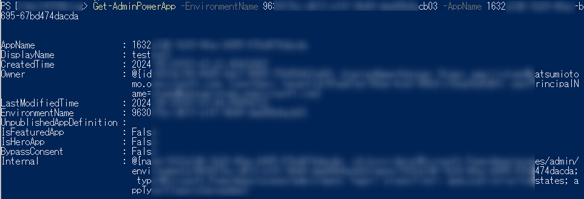
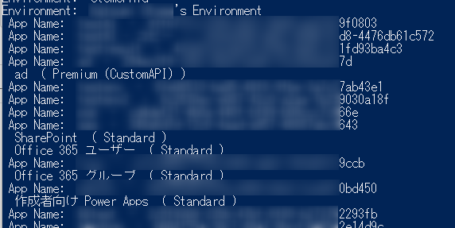
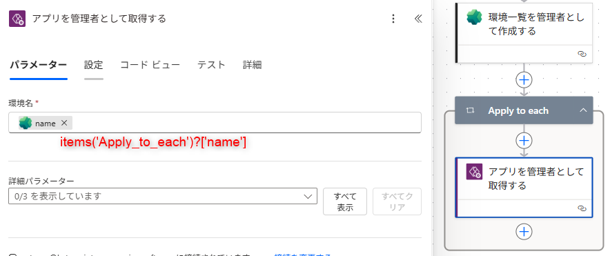

こんにちは、Power Platform サポートチームの大友です。  
本記事では、Power Apps のキャンバスアプリの一覧を取得する方法を詳しくご案内します。

<!-- more -->

# 目次

- [1. 概要](#overview)
- [2. キャンバスアプリの一覧を取得する方法](#how_to_list_canvas_app)
  - [2-1. テナントレベルの分析を利用する](#with_analytics_feature)
    - [2-1‐1. 分析レポート画面を利用する](#with_analytics_ui)
    - [2-1-2. 分析データのエクスポート機能を利用する](#with_analytics_export)
  - [2-2. PowerShell を利用する](#with_powershell)
  - [2-3. Power Apps for Admins コネクタを利用する](#with_connector)
- [まとめ](#まとめ)

<a id='overview'></a>

# 1. 概要
Power Apps をご利用頂いているお客様より、テナント内で作成されたすべてのキャンバスアプリを管理者にて確認したいというお問い合わせを多く頂いております。  
本記事では、テナント全体のキャンバスアプリを一覧化するための具体的な方法を解説します。(※ [Microsoft Power Platform CoE キット](https://learn.microsoft.com/ja-jp/power-platform/guidance/coe/starter-kit) は除いております。)  

なお、本記事のアクションやコマンドは管理者 (グローバル管理者、Power Platform 管理者) アカウントを用いて実行する必要がございますので、ご注意ください。  

> [!IMPORTANT]  
> 本記事で紹介しているサンプルコードをご利用いただく際には、本記事末尾に記載のある免責事項を先にご確認ください。    

<a id='how_to_list_canvas_app'></a>

# 2. キャンバスアプリ一覧を取得する方法
本記事では、キャンバスアプリの一覧を取得する具体的な方法として以下の3つを説明します。

- [テナントレベル分析](#with_analytics_feature)
- [PowerShell スクリプト](#with_powershell)
- [Power Apps for Admins コネクタ](#with_connector)

<a id='with_analytics_feature'></a>

## 2-1. テナントレベルの分析を利用する

> [!IMPORTANT]  
> この方法は事前にテナントレベルの分析を有効にする必要がございます。  
> 有効にする方法については下記の公開情報をご参照ください。  
> [テナント レベルでの分析 - Power Platform | Microsoft Learn](https://learn.microsoft.com/ja-jp/power-platform/admin/tenant-level-analytics#how-do-i-enable-tenant-level-analytics)

<a id='with_analytics_ui'></a>

### 2-1‐1. 分析レポート画面を利用する

Power Platfrom 管理センターに用意されたレポートを参照する方法です。  

1. [Power Platform 管理センター](https://admin.powerplatform.microsoft.com) にサインインします。
2. 左側メニューの [管理] > [Power Apps] を選択します。
3. 表示されるダッシュボードからアプリの使用状況や一覧を確認できます。
4. テナント内のアプリ一覧を取得する場合、[概要] > [アプリ在庫] タブをご確認ください。
  

テナントレベルの分析の詳細については下記の公開情報をご参照ください。  
[Power Apps のテナント レベルの分析](https://learn.microsoft.com/ja-jp/power-platform/admin/powerapps-analytics-reports)  

<a id='with_analytics_export'></a>

### 2-1-2. 分析データのエクスポート機能を利用する

Power Platform 管理センターの分析レポートの基となるデータをエクスポートし、そのデータを利用することでご利用者様の用途に合わせて利用状況を分析頂く事ができます。  

1. [Power Platform 管理センター](https://admin.powerplatform.microsoft.com) にサインインします。
2. 左側メニューの [管理] > [データ エクスポート] を選択します。
3. 画面上部 [(+)新しいデータ エクスポート] より Azure Data Lake Storage へのエクスポートを構成いたします。

4. 構成した宛先の Azure Data Lake Storage へ、分析画面の基となるデータがエクスポートされます。


データ エクスポートの詳細については下記の公開情報をご参照ください。  
[Microsoft Power Platform セルフサービス分析](https://learn.microsoft.com/ja-jp/power-platform/admin/self-service-analytics)

<a id='with_powershell'></a>

## 2-2. PowerShell を利用する
PowerShellを使用すると、詳細なキャンバスアプリ情報をCSV形式でエクスポートし、分析に役立てることができます。

1. PowerShell を管理者権限で開きます。
2. 以下のコマンドを順番に実行します。

```PowerShell
Install-Module -Name Microsoft.PowerApps.Administration.PowerShell
Add-PowerAppsAccount # ここで管理者アカウントでログインしてください。
Get-AdminPowerApp | Export-Csv -Path "app.csv" -Encoding UTF8
```

実行後に生成された `app.csv` ファイルを利用し、キャンバスアプリの詳細を把握できます。
CSVファイルには作成者、キャンバスアプリ名、作成日などの詳細な情報が含まれています。  
  

> [!NOTE]
> Power Platform の PowerShell コマンド実行についての詳細は下記の情報をご確認ください。  
> [Power Apps と Power Automate の PowerShell サポート - Power Platform | Microsoft Learn](https://learn.microsoft.com/ja-jp/power-platform/admin/powerapps-powershell#module-installation-and-sign-in)  
> また、キャンバスアプリ一覧を取得するコマンドの詳細については下記の公開情報をご参照ください。  
> [Get-AdminPowerApp (Microsoft.PowerApps.Administration.PowerShell) | Microsoft Learn](https://learn.microsoft.com/ja-jp/powershell/module/microsoft.powerapps.administration.powershell/get-adminpowerapp?view=pa-ps-latest)  

各キャンバスアプリの詳細な情報の取得がご入用である場合、対象のキャンバスアプリの AppName と、そのキャンバスアプリが存在する環境の EnvironmentName を代入の上、実行してください。  

```PowerShell
Get-AdminPowerApp -AppName *<AppName>* -EnvironmentName *<EnvironmentName>*
```

下記画面のように、キャンバスアプリの詳細な情報を確認することができます。  

  

上記コマンドを用いて、テナント内の全キャンバスアプリを取得する際のサンプルコードを下記に記載いたします。  
こちらのコードを実行すると、各キャンバスアプリにて利用されている接続や連携しているフローを確認頂けます。  
ご要件に合わせてご調整頂けましたら幸いでございます。  
※あくまでサンプルとなりますため、ご実行の前には本記事末尾の免責事項をご確認ください。  

```PowerShell
# 出力先ファイル作成
$outputFile=".\powerappsinventory.csv"
# 結果格納用変数作成
$powerappsObjects=@()
# 環境一覧取得
$environments = Get-AdminPowerAppEnvironment
# Power Apps 一覧作成
foreach ($e in $environments) {
    # 環境名表示
    write-host "Environment:" $e.displayname
    # 環境内キャンバスアプリ一覧取得
    $powerapps = Get-AdminPowerApp -EnvironmentName $e.EnvironmentName
    foreach ($pa in $powerapps) {
        # キャンバスアプリ情報表示
        write-host " App Name:" $pa.DisplayName "-" $pa.AppName
        # キャンバスアプリ詳細取得
        $papp = Get-AdminPowerApp -EnvironmentName $e.EnvironmentName -AppName $pa.AppName
        # 接続の確認
        foreach ($conRef in $papp.Internal.properties.connectionReferences) {
            foreach ($con in $conRef) {
                foreach ($conId in ($con | Get-Member -MemberType NoteProperty).Name) {
                    $conDetails = $($con.$conId)
                    $apiTier = $conDetails.apiTier
                    if ($conDetails.isCustomApiConnection) {$apiTier = "Premium (CustomAPI)"}
                    if ($conDetails.isOnPremiseConnection ) {$apiTier = "Premium (OnPrem)"}
                    # 接続情報表示
                    Write-Host " "$conDetails.displayName "(" $apiTier ")"
                    $paObj=@{
                        EnvironmentName = $e.displayname
                        EncironmentId = $e.EnvironmentName
                        AppName = $papp.DisplayName
                        AppId = $papp.AppName
                        ConnectionName = $conDetails.displayName
                        Tier = $apiTier
                        FlowId = $conDetails.parameterHints.workflowName.value
                        createdDate = $papp.CreatedTime
                        createdBy = $papp.Owner
                    }
                    # 結果に格納
                    $powerappsObjects += $(new-object psobject -Property $paObj)
                }
            }
        }
    }
}
# CSV 出力
$powerappsObjects | Export-Csv $outputFile -NoTypeInformation -Encoding UTF8
```

> [!NOTE]  
> テナント内のキャンバスアプリ数が多い場合、処理完了までに長時間を要する可能性がございます。    

  

<a id='with_connector'></a>

## 2-3. Power Apps for Admins コネクタを利用する
この方法では Power Automate クラウドフローを用いて、テナント内のキャンバスアプリを一覧化いたします。

1. Power Automate で新規クラウドフローを作成します。
2. 任意のトリガー（例:手動）を選択します。
3. アクションに「Power Apps for Admins」コネクタを追加し、「アプリを管理者として取得する」アクションを選びます。
4. 取得対象の環境 ID を入力してください。
5. アクション実行後、得られたアプリ情報は後続のアクションでご利用頂けます。

 

テナント内の全環境を対象として実行したい場合、「管理者向け Power Platform」コネクタの「環境一覧を管理者として作成する」アクションと組み合わせてください。
その場合、下記のように設定してください。

「それぞれに適用する」：outputs('環境一覧を管理者として作成する')?['body/value']  
「アプリを管理者として取得する」：items('それぞれに適用する')?['name']  
 
 
  

「Power Apps for Admins」コネクタの詳細は下記の公開情報をご覧ください。  
[Power Apps for Admins - Connectors | Microsoft Learn](https://learn.microsoft.com/ja-jp/connectors/powerappsforadmins/)

<a id='まとめ'></a>

# まとめ
上記三つの方法から、ご要件に応じて適切な方法をご選択いただき、ご利用ください。  
本記事が適切な管理の一助となりましたら幸いでございます。  


> [!IMPORTANT]  
> ===サンプルコード免責事項===    
> ・本記事で紹介しているサンプルコードは説明のためのサンプルであり、お客様の要望を直接満たすためのご提供ではございません。
> そのため、製品の実運用環境で使用されることを前提に提供されるものではありません。
> 
> ・エラー処理などは含まれておりません。また、弊社にてその動作を保証するものではございません。
> 
> ・サンプル コードおよびそれに関連するあらゆる情報は、"現状のまま" で
> 提供されるものであり、商品性や特定の目的への適合性に関する黙示の保証も含め、
> 明示、黙示を問わずいかなる保証も付されるものではありません。
> 
> ご使用の際には、十分にご検証いただき、ご使用くださいますようお願い申し上げます。
> 
> マイクロソフトは、お客様に対し、サンプル コードを使用および改変するための
> 非排他的かつ無償の権利ならびに本サンプル コードをオブジェクト コードの形式で
> 複製および頒布するための非排他的かつ無償の権利を許諾します。
> 
> 但し、お客様は下記に同意するものとします。
> (1) サンプル コードが組み込まれたお客様のソフトウェア製品のマーケティングのために
>     マイクロソフトの会社名、ロゴまたは商標を用いないこと
> (2) サンプル コードが組み込まれたお客様のソフトウェア製品に有効な著作権表示をすること
> (3) サンプル コードの使用または頒布から生じるあらゆる損害 (弁護士費用を含む) に
>     関する請求または訴訟について、マイクロソフトおよびマイクロソフトの取引業者に対し補償し、
>     損害を与えないこと

---

※ 本記事の内容は執筆時点の情報に基づいています。最新の情報については公式ドキュメントも合わせてご確認ください。

