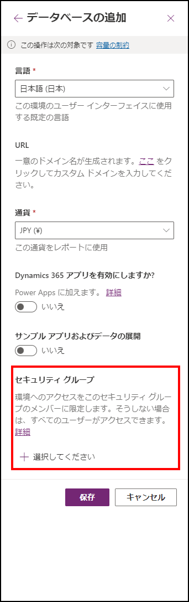

こんにちは、Power Platform サポートの谷です。 
メッセージセンターにてご確認いただける MC435264 について、ご利用のキャンバス アプリへの影響についてご説明します。

<!-- more -->

## MC435264 の内容
Power Platform 環境作成時にその環境にアクセスできるセキュリティ グループを指定すると、指定したセキュリティ グループのメンバーのみが当該の環境のキャンバス アプリを利用できるようになり、
それ以外のユーザーは当該環境のキャンバス アプリにアクセスが制限されます。

これまでは、Power Platform 環境作成時に環境にアクセスできるセキュリティ グループを設定することができましたが、実際にセキュリティ グループよるキャンバス アプリへのアクセス制御を行う機能は実装されておりませんでした。 
この度の変更により、このセキュリティ グループによるアクセス制御機能を正式にリリースいたします。 
対象の環境に紐づくセキュリティ グループのメンバー (ユーザー) は当該環境のキャンバス アプリへのアクセス権を持ちますが、セキュリティ グループ外のユーザーは新規環境のキャンバス アプリへのアクセス権を持ちません。

※環境作成 設定画面のセキュリティ グループ設定画面 

※環境にアクセスできるセキュリティ グループが設定されている場合 

※環境にアクセスできるセキュリティ グループが設定されていない場合 

## ご利用のキャンバス アプリへの影響
環境へのアクセスをセキュリティ グループで制限している場合、当該環境のアプリの実行ユーザーが当該セキュリティ グループのメンバーである場合のみ利用できるようになります。 
引き続き、当該環境のアプリを実行、共有するためには、対象のユーザーを環境に紐づくセキュリティ グループのメンバーに追加します。

## よくあるご質問
### いつからこの変更が適用されますか？
2022 年 10 月 24 日以降に、当更新プログラムのリリースを開始します。2022 年 11 月 11 日までにすべてのリージョンで完全に完了する予定です。

### キャンバス アプリ以外への影響はありますか？
キャンバス アプリ以外の機能への影響はありません。 
例えば、Power Automate やモデル駆動型 アプリなど Power Platform 上で動作する他のサービスへの影響はありません。

### セキュリティ グループにより環境へのアクセスを制御していませんが影響はありますか？
いいえ。セキュリティ グループによるアクセス制御を行っていない環境は当変更の影響はありません。これまでどおり、すべてのユーザーへキャンバス アプリを共有し、アプリを実行することができます。 
同様に、既定環境におきましてもセキュリティ グループによるアクセス制御が行えない環境でございますため、当変更による影響はありません。

### Dataverse環境がありませんが影響はありますか？
いいえ。本変更は Dataverse データベースが作成されている環境のみ影響します。 
Dataverse データベースが作成されていない環境への影響はありません。これまでどおり、すべてのユーザーへキャンバス アプリを共有し、アプリを実行することができます。

---
