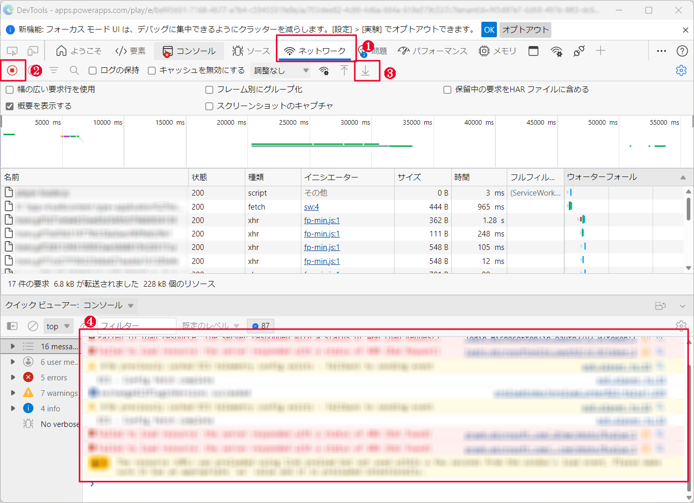
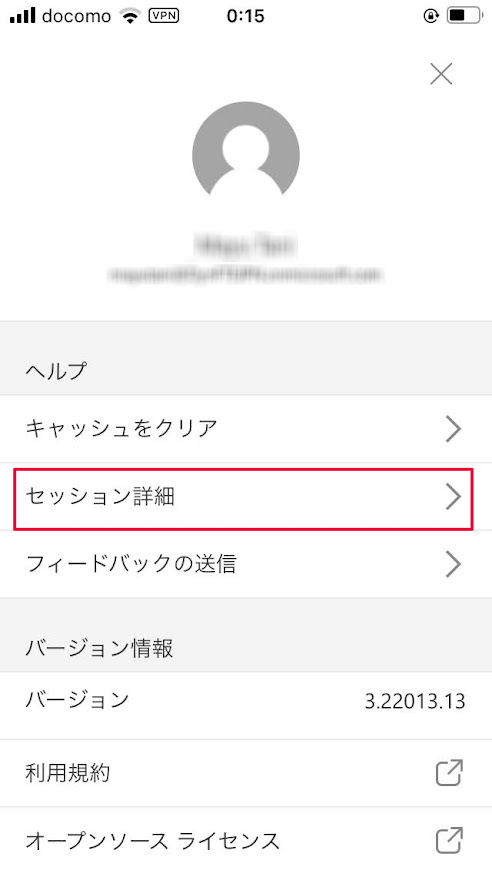
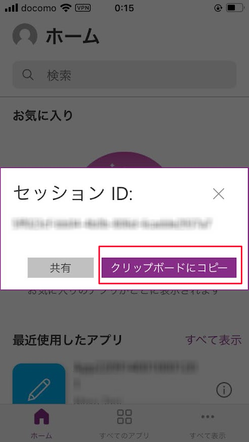

# はじめに
こんにちは、Power Platform サポートの大友です。  

本記事では、キャンバス アプリのトラブルシューティングを行うにあたって、必要となる情報の取得手順をご説明します。

<!-- more -->
# 目次
1. [概要](#anchor-intro)
1. [情報取得手順詳細](#anchor-how-to-collect)
   1. [事象の発生状況](#anchor-about-situation)
   1. [事象発生時のエラーメッセージや画面キャプチャ・動画](#anchor-about-screencapture)
   1. [アプリ チェッカーのエラーメッセージ　※編集中のみ](#anchor-about-appchecker)
   1. [Power Apps バージョン](#anchor-about-versions)
      - [キャンバス アプリ 編集時](#anchor-about-versions-edit)
      - [キャンバス アプリ 実行時](#anchor-about-versions-play)
   1. [Power Apps モニターログ](#anchor-about-monitorlog)
      - [キャンバス アプリ 編集時](#anchor-about-monitorlog-edit)
      - [キャンバス アプリ 実行時 (Webブラウザ) ](#anchor-about-monitorlog-web-play)
      - [キャンバス アプリ 実行時 (モバイル アプリ) ](#anchor-about-monitorlog-mobile-play)
   1. [Webブラウザのネットワーク トレース・コンソール ログ](#anchor-about-networkhar)
   1. [セッションID](#anchor-about-sessionid)
      - [編集セッション](#anchor-about-sessionid-web-edit)
      - Windows 端末での実行セッション
        - [Webブラウザ](#anchor-about-sessionid-web-play)
        - [SharePoint カスタム フォーム](#anchor-about-sessionid-web-sharepointcustomform)
        - [Windows Teams アプリ上での実行](#anchor-about-sessionid-web-sharepointcustomform)
        - [サイト埋め込みのキャンバス アプリ](#anchor-about-sessionid-web-sharepointcustomform)
      - モバイル端末(iOS, Android)
        - [モバイル アプリ](#anchor-about-sessionid-mobile-play)
        - [Webブラウザ](#anchor-about-sessionid-teams-mobile)
        - [モバイル版 Teams アプリ上での実行](#anchor-about-sessionid-teams-mobile)
        - [サイト埋め込みのキャンバス アプリ](#anchor-about-sessionid-teams-mobile)
   1. [アプリURL (アプリID、テナントID) ](#anchor-about-app-tenant-ids)
   1. [環境ID](#anchor-about-enviromentid)
   1. [アプリ](#anchor-about-canvasapp)
      - [公開済みアプリ](#anchor-about-canvasapp-published)
      - [編集中アプリ](#anchor-about-canvasapp-edit)
      - [ソリューション アプリ](#anchor-about-canvasapp-solutionapp)
      - [SharePoint カスタムフォーム](#anchor-about-canvasapp-spocustomform)
      - [コンポーネント単体](#anchor-about-canvasapp-componentlibrary)

# 概要
弊社サポートではお問合せを頂いた際のトラブルシューティングにおいてお問い合わせの内容をもとに調査方針を立てております。  
発生している事象の把握のため、直面されている事象の切り分けや情報提供をお願いすることがあります。  
Power Apps キャンバスアプリに関するサポートサービスのお問合せの際の情報取得手順について以下のとおりご案内いたします。

> [!IMPORTANT]
> 以下の情報は**事象再現の事前**に取得開始し、**事象を再現させた後**に採取を行う必要がございます。
> ・事象発生時の動画
> ・Power Apps モニターログ
> ・Webブラウザのネットワーク トレース・コンソール ログ
  

# 情報取得手順

## 1. 事象の発生状況
エラーや意図しない状況がどのような状況下で発生するかお知らせください。  
事象の発生条件を特定することで、問題の特定だけではなく弊社環境での再現調査においても有用な情報が得られます。
以下の情報をお知らせいただくことでより明確に事象を把握することができます。  
1. 事象が発生するタイミング
   - いつから発生しているか・現在も継続して発生しているか
   - どれぐらいの頻度で発生しているか
   - 発生前後で何らかの変更を行ったか
   - 特定の操作で発生するか
1. 事象の発生環境
   - 機種
   - OS およびバージョン
   - Web ブラウザ or Power Apps アプリ
   - ブラウザ種類 (Microsoft Edge、Google Chrome、Firefoxなど)
   - プラグインや拡張機能の有無
1. 特定の利用で発生する事象か
   - 特定の端末か？
   - 事象が発生している端末と事象が発生していない端末の差異
   - 特定のユーザーか？
   - 事象が発生しているユーザーと事象が発生していないユーザーの差
     および、両者のメールアドレスやユーザープリンシパル名
1. キャンバス アプリをご利用いただいている端末のネットワーク環境の差異
   - プロキシ経由かどうか
   - Azure Express Route の利用有無
   - セキュリティ製品の利用有無

## 2. 事象発生時のエラーメッセージや画面キャプチャ・動画
エラーの内容を具体的に表すメッセージや画面キャプチャなどの情報をお寄せください。  
事象再現時の動画がありますと事象の発生状況をより正確に把握することができます。  

### エラーメッセージや画面キャプチャ
エラーの内容が分かるよう画面キャプチャをご取得ください。  
エラーメッセージ内にタイムスタンプやエラーコードが記載されている場合はそれらの情報を **テキスト形式** でご取得ください。  

### 動画
以下のいずれかの方法で事象発生時の動画をご取得ください。  

> [!IMPORTANT]
> 事象発生の事前に取得開始し、事象発生後に採取を行う必要がございます。

- Windows ゲーム バーでの画面収録  
  [ゲーム バーを使用して PC にゲーム クリップを記録する](https://support.microsoft.com/ja-jp/windows/%E3%82%B2%E3%83%BC%E3%83%A0-%E3%83%90%E3%83%BC%E3%82%92%E4%BD%BF%E7%94%A8%E3%81%97%E3%81%A6-pc-%E3%81%AB%E3%82%B2%E3%83%BC%E3%83%A0-%E3%82%AF%E3%83%AA%E3%83%83%E3%83%97%E3%82%92%E8%A8%98%E9%8C%B2%E3%81%99%E3%82%8B-2f477001-54d4-1276-9144-b0416a307f3c)
- Power Point での画面収録  
  [PowerPoint で画面を記録する](https://support.microsoft.com/ja-jp/office/powerpoint-%E3%81%A7%E7%94%BB%E9%9D%A2%E3%82%92%E8%A8%98%E9%8C%B2%E3%81%99%E3%82%8B-0b4c3f65-534c-4cf1-9c59-402b6e9d79d0)
- Microsoft Teams での画面収録  
  [Microsoft Teamsで会議を記録する](https://support.microsoft.com/ja-jp/office/microsoft-teams-%E3%81%A7%E4%BC%9A%E8%AD%B0%E3%82%92%E8%A8%98%E9%8C%B2%E3%81%99%E3%82%8B-34dfbe7f-b07d-4a27-b4c6-de62f1348c24#:~:text=Microsoft)

## 3. アプリ チェッカーのエラーメッセージ ※編集中のみ
キャンバス アプリ編集中の場合、Power Apps Studio のアプリ チェッカーにエラーメッセージが記録されます。  
エラーが発生している処理 (関数やコントロール等) と併せてアプリ チェッカーに記録されているエラーメッセージをご提供ください。

1. [Power Apps 作成者ポータル](http://make.powerapps.com) にサインインします
2. 対象のアプリの編集画面を表示します
3. 事象を発生させます
4. アプリ チェッカーに記録されるエラーメッセージを **画面キャプチャ** などで取得します  
    

## 4. Power Apps バージョン
バージョン差異による問題かどうかお調べする際に使用します。

### キャンバス アプリ 編集時
1. [Power Apps 作成者ポータル](http://make.powerapps.com) にサインインします
2. 対象のアプリ編集画面を表示します
3. メニュー「設定」>「サポート」を選択します
4. 作成バージョンを **テキスト形式** で取得します  
    

### キャンバス アプリ 実行時
本手順にてキャンバス アプリのリリース バージョンをご取得いただき、さらに、事象が発生している端末においてライブ バージョンをご取得ください。  
ライブ バージョンはセッション情報から取得します。  
Web ブラウザで事象が発生している場合、[セッションID (Webブラウザ)](#anchor-about-sessionid-web-play) をご参照ください。  
モバイル アプリで事象が発生している場合、[セッションID (モバイルアプリ)](#anchor-about-sessionid-mobile-play) をご参照ください。

1. [Power Apps 作成者ポータル](http://make.powerapps.com) にサインインします
2. 対象のアプリの「…」メニュー>「詳細」を選択します  
    
3. 「バージョン」タブを押下し、Power Apps リリース バージョンを **テキスト形式** で取得します  
    

## 5. Power Apps モニターログ
キャンバス アプリ編集中、あるいは実行中に発生するイベントを記録頂き、発生している事象を把握することができます。  
ダウンロードしたファイル (PowerAppsTraceEvents.json) をご提供ください。  

> [!IMPORTANT]
> 事象発生の事前に取得開始し、事象発生後に採取を行う必要がございます。

以下の設定を有効化することで編集時でなくとも数式の情報が記録されます。  
実行時に発生するエラーの場合、可能でしたら以下設定を有効化しアプリ発行頂いたのちモニターログをご取得下さい。  
ご取得後は再度設定を無効化いただきますようお願い致します。  

### キャンバス アプリ 編集時
1. [Power Apps 作成者ポータル](http://make.powerapps.com) にアクセスします
2. アプリ一覧画面から対象のアプリの編集画面を表示します  
3. 画面左方にある　高度なツール > 監視 > モニターを開く を選択します
    - 別タブで監視ウィンドウが表示されます  
      
4. アプリ編集画面に戻り、事象を発生させます
5. 監視ウィンドウに移動し、記録されたモニター結果を「ダウンロード」します  
    

### キャンバス アプリ 実行時 (Web ブラウザ)
1. [Power Apps 作成者ポータル](http://make.powerapps.com) にアクセスします
2. アプリ一覧画面から対象のアプリの「...」メニューを表示し、「監視」を選択します  
    
3. 別タブで監視ウィンドウが表示されるので「公開したアプリの再生」を行います  
    
4. 別タブでアプリが再生されるので事象を発生させます  
5. 手順3で表示した監視ウィンドウに移動し、記録されたモニター結果を「ダウンロード」します   
    

### キャンバス アプリ 実行時 (モバイル アプリ)
1. [Power Apps 作成者ポータル](http://make.powerapps.com) にアクセスします
2. アプリ一覧画面から対象のアプリの「...」メニューを表示し、「監視」を選択します  
    
3. ユーザー接続からセッションへのユーザー接続メニューを開きます  
    
4. Power Apps モバイルで使用するユーザーを追加しリンクを入手します  
    
5. 得られたリンクをメールやチャットなどでモバイル端末に送ります
6. モバイル端末で URL へアクセスすると、 Power Apps モバイルが起動されますので事象を発生させます
    下図のとおり、デバックセッションに接続する旨メッセージが表示されます  
    
7. モニターログに Power Apps モバイルの操作が記録されます  
    
8. 記録されたモニター結果を「ダウンロード」します 
    

> [!NOTE]
> 以下ブログ記事でもモニターログの取得方法をご説明しています。  
> [キャンバス アプリのモニターログ取得手順](https://jpdynamicscrm.github.io/blog/canvasapp/Canvas-app-monitor/)

## 6. Web ブラウザのネットワーク トレース・コンソール ログ
キャンバス アプリ編集中、あるいは実行中に Power Apps サービスへ送信する HTTP リクエストや Power Apps サービスから受信する HTTP レスポンスの内容を確認することで通信上の問題を特定します。  

> [!IMPORTANT]
> 事象発生の事前に取得開始し、事象発生後に採取を行う必要がございます。

> [!NOTE]
> 事象の内容により、netsh trace コマンドやサードパーティ製のツール「Fiddler」によるネットワーク キャプチャの取得をお願いする場合があります。  

### ブラウザネットワークトレース
ご取得方法は以下公開情報をご参照ください。  
[ブラウザーでネットワーク トレースを収集する (ブラウザーベースのアプリのみ)](https://learn.microsoft.com/ja-jp/azure/azure-web-pubsub/howto-troubleshoot-network-trace#collect-a-network-trace-in-the-browser-browser-based-apps-only)

> [!IMPORTANT]
> ご取得の際は「ログの保持」「キャッシュを無効にする」にチェックを有効にしご取得ください。  
> 

###  コンソールログ
Console タブをクリックし、ログ領域を右クリックし**「名前を付けて保存」**にて保存いたします。  

## 7. セッション ID
セッション情報から Power Apps サービス側の記録を確認し、発生している事象を調査します。

### キャンバス アプリ編集時
  1. [Power Apps 作成者ポータル](http://make.powerapps.com) にサインインします
  2. アプリ一覧画面から対象のアプリのアプリ編集画面を表示します
  3. メニュー「設定」を選択します
  4. ポップアップの左メニューから「サポート」を選択します
  5. 「セッション詳細」を押下し、セッション ID を **テキスト形式** で取得します  
        

### キャンバス アプリ実行時
  1. 対象のアプリを実行します
  2. 画面右上部の歯車アイコンを押下します
  3. 「セッション詳細」を選択し、Power Apps ライブ バージョンを含む、表示されている情報をすべてを **テキスト形式** で取得します  
        

### SharePoint カスタム フォーム、Windows Teams アプリ、Web 版 Teams、埋め込みのキャンバス アプリ  
1. `Alt` キーを押下しながらフォームを右クリックします
2. 表示される「セッション詳細」を押下し、セッション ID を **テキスト形式** で取得します  
    

### モバイル アプリ
1. Power Apps モバイル アプリを起動します
2. 画面左上部のユーザーアイコンを押下します  
    
3. 「バージョン情報」を **テキスト形式** でお手元に控えます  
    
4. 「セッション詳細」を押下します  
    
5. クリップボードにコピーされた セッション ID を **テキスト形式** で取得します  
    

### モバイル(iOS, Android)端末の Web ブラウザ、Teams アプリ、Web 版 Teams、埋め込みのキャンバス アプリ  
1. アプリ画面を二本指でロングタップ(長押し)します
2. 表示される「セッション詳細」を押下し、セッション ID を **テキスト形式** で取得します  
    
    

## 8. アプリ URL (アプリ ID、テナント ID)
アプリ ID、テナント ID の情報から Power Apps サービス側の記録を確認し、発生している事象を調査します。

1. [Power Apps 作成者ポータル](http://make.powerapps.com) にアクセスします
2. アプリ一覧画面から対象のアプリの「...」メニューを押下し、「詳細」を選択します
3. Web リンク、アプリ ID を **テキスト形式** で取得します  
    

## 9. 環境 ID
環境 ID の情報から Power Apps サービス側の記録を確認し、発生している事象を調査します。

1. [Power Apps 作成者ポータル](http://make.powerapps.com) にアクセスします
2. 事象が発生している環境に切り替えます (❶)
3. 画面右上部の歯車アイコンを押下します (❷)
4. 「セッション詳細」を選択します (❸)
5. ポップアップで表示された、環境 ID を含むセッションの詳細情報すべてを **テキスト形式** で取得します (❹)  
    ※環境 ID は赤枠で囲った部分です。本セッション情報を用いて事象が発生している環境の情報を確認します  
    

## 10. アプリ
事象が発生しているアプリを調査し、問題の箇所を特定します。  
アプリが接続するデータソースにより SharePoint リストのテンプレートや Dataverse テーブルのメタ情報をご提供いただく場合があります。

### アプリのエクスポートファイル
「エクスポート」機能によりエクスポートされるアプリのファイルは公開済みのバージョンです。  
アプリを編集中の場合は msapp ファイルとしてローカルに保存したアプリのファイルをご取得ください。

- 公開済みのアプリ
    1. [Power Apps 作成者ポータル](http://make.powerapps.com) にサインインします
    2. アプリ一覧画面から対象のアプリの「...」メニューを押下し、「エクスポート パッケージ」を選択します  
        
    3. 任意の名前を付けてエクスポートします
    4. ローカルに zip ファイルがダウンロードされます

- 編集中の最新のアプリ
    1. [Power Apps 作成者ポータル](http://make.powerapps.com) にサインインします
    2. アプリ一覧画面から対象のアプリを編集します
    3. メニュー「∨」アイコン > 「コピーのダウンロード」を選択します  
        
    4. ローカルに msapp ファイルをダウンロードします  
        

### アプリを含むソリューションファイル
1. [Power Apps 作成者ポータル](http://make.powerapps.com) にサインインします
2. ソリューション一覧画面を表示します
3. 「新しいソリューション」を押下します  
    
4. 手順 3 で作成したソリューションに対象のアプリを追加します  
    
5. 必須オブジェクトを追加し、アプリが使用するテーブルなどをソリューションに自動追加します  
    
5. カスタマイズを公開します  
    
6. ソリューションをエクスポートします  
    
7. ローカルに zip ファイルがダウンロードされます

### SharePoint カスタム フォーム
1. カスタム フォームを設定している SharePoint リストを表示します
2. 画面右上部の歯車アイコンを選択し、「リストの設定」を選択します  
    
3. 「フォームの設定」リンクを選択します  
    
4. 「バージョンと使用方法を参照」リンクを選択します  
    
5. Power Apps のアプリ詳細画面に遷移しますので「エクスポート パッケージ」を選択します  
    
6. 任意の名前を付けてエクスポートします
7. ローカルに zip ファイルがダウンロードされます

### コンポーネント単体
※キャンバス アプリ内でコンポーネントを使用している場合、[公開済みアプリのエクスポート ファイル](#anchor-about-canvasapp-published) (あるいは、[編集中アプリのエクスポート ファイル](#anchor-about-canvasapp-edit)) でご紹介している方法でエクスポートすると、コンポーネントが含まれた状態でエクスポートできます。

1. [Power Apps 作成者ポータル](http://make.powerapps.com) にサインインします
2. ソリューション一覧画面を表示します
3. 「新しいソリューション」を押下します  
    
4. 手順 3 で作成したソリューションに対象のコンポーネントを追加します  
    
5. カスタマイズを公開します  
    
6. ソリューションをエクスポートします  
    
7. ローカルに zip ファイルがダウンロードされます

---

## 補足
本手順は執筆時点でのユーザー インターフェイスを基に紹介しています。バージョンアップによって若干の UI の遷移など異なる場合があります。その場合は画面の指示に従って進めてください。  

---
