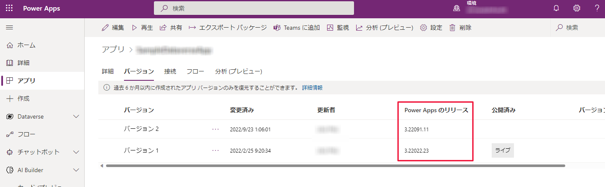
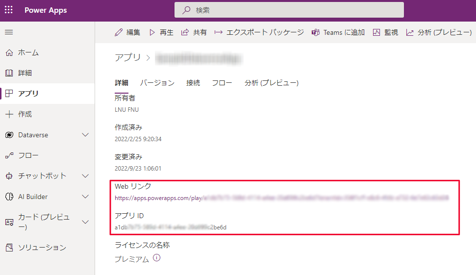
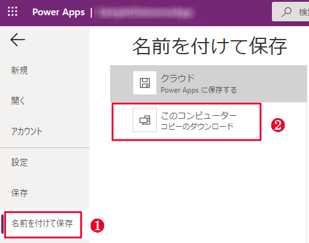

こんにちは、Power Platform サポートの谷です。 
弊社サポートでは、キャンバス アプリが動作しない、エラーが発生する、等のトラブルシューティングにおいて、お問い合わせの内容をもとに調査方針を立てておりますが、発生している事象を明確に把握するため、ご利用者様の環境で発生している事象の切り分けや情報提供をお願いすることがあります。 
この記事では、キャンバス アプリのトラブルシューティングを行うにあたって、必要となる情報の取得手順をご説明します。

<!-- more -->

## 概要
キャンバス アプリ編集時、また実行時に発生する問題解決におけるお問い合わせの際の情報取得手順についてご説明します。

---
1. [事象の発生状況](#anchor-about-situation)
2. [事象発生時のエラーメッセージや画面キャプチャ・動画](#anchor-about-screencapture)
3. [アプリ チェッカーのエラーメッセージ　※編集中のみ](#anchor-about-appchecker)
4. [Power Apps バージョン](#anchor-about-versions)
    - [キャンバス アプリ 編集時](#anchor-about-versions-edit)
    - [キャンバス アプリ 実行時](#anchor-about-versions-play)
5. [Power Apps モニターログ](#anchor-about-monitorlog)
    - [キャンバス アプリ 編集時](#anchor-about-monitorlog-edit)
    - [キャンバス アプリ 実行時 (Webブラウザ) ](#anchor-about-monitorlog-web-play)
    - [キャンバス アプリ 実行時 (モバイル アプリ) ](#anchor-about-monitorlog-mobile-play)
6. [Webブラウザのネットワーク トレース・コンソール ログ](#anchor-about-networkhar)
7. [セッションID](#anchor-about-sessionid)
    - [編集セッション](#anchor-about-sessionid-web-edit)
    - [実行セッション (Webブラウザ) ](#anchor-about-sessionid-web-play)
    - [実行セッション (モバイル アプリ) ](#anchor-about-sessionid-mobile-play)
    - [実行セッション (SharePoint カスタムフォーム ) ](#anchor-about-sessionid-web-sharepointcustomform)
8. [アプリURL (アプリID、テナントID) ](#anchor-about-app-tenant-ids)
9. [環境ID](#anchor-about-enviromentid)
10. [アプリ](#anchor-about-canvasapp)
    - [公開済みアプリ](#anchor-about-canvasapp-published)
    - [編集中アプリ](#anchor-about-canvasapp-edit)
    - [ソリューション アプリ](#anchor-about-canvasapp-solutionapp)
    - [SharePoint カスタムフォーム](#anchor-about-canvasapp-sharepointcustomform)
    - [コンポーネント単体](#anchor-about-canvasapp-componentlibrary)

## 情報取得手順

### 1. 事象の発生状況
エラーや意図しない状況がどのような状況下で発生するかお知らせください。 
事象の発生条件を見極めることで、問題の箇所を特定するだけではなく、弊社環境で動作検証を行い再現するかどうか確認することができます。 
例えば、以下の情報をお知らせいただくことでより明確に事象を把握することができます。

- 事象が発生するタイミング
    - いつから発生しているか・現在も継続して発生しているか
    - どれぐらいの頻度で発生しているか
    - 発生前後で何らかの変更を行ったか
- 事象が発生する端末の差異
- 事象が発生しているユーザーと事象が発生していないユーザーの差異
    - 事象の内容によりユーザーのメールアドレス情報やユーザープリンシパル名をご提供いただく場合があります
- キャンバス アプリをご利用いただいている端末のネットワーク環境の差異 (プロキシ経由で利用など)
- 事象が発生している Web ブラウザの差異 (Microsoft Edge、Google Chrome、Firefoxなど)
    - Web ブラウザのプラグインや拡張機能の有無
- 事象の発生環境 (Power Apps モバイルアプリ/Web ブラウザ)

### 2. 事象発生時のエラーメッセージや画面キャプチャ・動画
エラーの内容を具体的に表すメッセージや画面キャプチャなどの情報をお寄せください。 
事象再現時の動画がありますと事象の発生状況をより正確に把握することができます。

#### エラーメッセージや画面キャプチャ
エラーの内容が分かるよう画面キャプチャをご取得ください。 
エラーメッセージ内にタイムスタンプや何らかのエラーコードが記載されている場合はそれらの情報を **テキスト形式** でご取得ください。

#### 動画
以下の2つの方法で事象発生時の動画をご取得ください。

- `Windows + G` での画面収録
    1. Web ブラウザを起動します
    2. Web ブラウザの画面を一度クリックしたのち、`Windows キー + G` を押下します
    3. 「●」から画面キャプチャを開始します 
        
    4. 事象を発生させます
    5. 画面キャプチャを停止します
    6. 録画ファイルが保存されます

- Teams 会議の録画機能
    1. Teams 会議を開始します
    2. 「Start Recording」を選択し、録画を開始します 
        
    3. 画面共有し、事象を発生させます
    4. Teams 会議を終了します (録画も停止します)
    5. 録画ファイルを保存します

### 3. アプリ チェッカーのエラーメッセージ ※編集中のみ
キャンバス アプリ編集中の場合、Power Apps Studio のアプリ チェッカーにエラーメッセージが記録されます。 
エラーが発生している処理 (関数やコントロール等) と併せてアプリ チェッカーに記録されているエラーメッセージをご提供ください。

1. [Power Apps 作成者ポータル](http://make.powerapps.com) にサインインします
2. 対象のアプリの編集画面を表示します
3. 事象を発生させます
4. アプリ チェッカーに記録されるエラーメッセージを **画面キャプチャ** などで取得します 
    

### 4. Power Apps バージョン
バージョン差異による問題かどうかお調べする際に使用します。

#### キャンバス アプリ 編集時
1. [Power Apps 作成者ポータル](http://make.powerapps.com) にサインインします
2. 対象のアプリ編集画面を表示します
3. メニュー「設定」>「サポート」を選択します
4. 作成バージョンを **テキスト形式** で取得します 
    

#### キャンバス アプリ 実行時
本手順にてキャンバス アプリのリリース バージョンをご取得いただき、さらに、事象が発生している端末においてライブ バージョンをご取得ください。 
ライブ バージョンはセッション情報から取得します。 
Web ブラウザで事象が発生している場合、[セッションID (Webブラウザ)](#anchor-about-sessionid-web-play) をご参照ください。 
モバイル アプリで事象が発生している場合、[セッションID (モバイルアプリ)](#anchor-about-sessionid-mobile-play) をご参照ください。

1. [Power Apps 作成者ポータル](http://make.powerapps.com) にサインインします
2. 対象のアプリの「…」メニュー>「詳細」を選択します 
    
3. 「バージョン」タブを押下し、Power Apps リリース バージョンを **テキスト形式** で取得します 
    

### 5. Power Apps モニターログ
キャンバス アプリ編集中、あるいは実行中に発生するイベントの記録をご提供ください。 
アプリ実行中のイベントを確認することで発生している事象を正確に把握することができます。

以下ブログ記事でもモニターログの取得方法をご説明しています。 
[キャンバス アプリのモニターログ取得手順](https://jpdynamicscrm.github.io/blog/canvasapp/Canvas-app-monitor/)

#### キャンバス アプリ 編集時
1. [Power Apps 作成者ポータル](http://make.powerapps.com) にアクセスします
2. アプリ一覧画面から対象のアプリの編集画面を表示します  
3. 画面左方にある　高度なツール > 監視 > モニターを開く を選択します
    - 別タブで監視ウィンドウが表示されます 
      
4. アプリ編集画面に戻り、事象を発生させます
5. 監視ウィンドウに移動し、記録されたモニター結果を「ダウンロード」します 
    
6. ダウンロードしたファイル (PowerAppsTraceEvents.json) をご提供ください

#### キャンバス アプリ 実行時 (Web ブラウザ)
1. [Power Apps 作成者ポータル](http://make.powerapps.com) にアクセスします
2. アプリ一覧画面から対象のアプリの「...」メニューを表示し、「監視」を選択します 
    
3. 別タブで監視ウィンドウが表示されるので「公開したアプリの再生」を行います 
    
4. 別タブでアプリが再生されるので事象を発生させます 
5. 手順3で表示した監視ウィンドウに移動し、記録されたモニター結果を「ダウンロード」します  
    
6. ダウンロードしたファイル (PowerAppsTraceEvents.json) をご提供ください

#### キャンバス アプリ 実行時 (モバイル アプリ)
1. [Power Apps 作成者ポータル](http://make.powerapps.com) にアクセスします
2. アプリ一覧画面から対象のアプリの「...」メニューを表示し、「監視」を選択します 
    
3. ユーザー接続からセッションへのユーザー接続メニューを開きます 
    
4. Power Apps モバイルで使用するユーザーを追加しリンクを入手します 
    
5. 得られたリンクをメールやチャットなどでモバイル端末に送ります
6. モバイル端末で URL へアクセスすると、 Power Apps モバイルが起動されますので事象を発生させます
    - 下図のとおり、デバックセッションに接続する旨メッセージが表示されます 
      
7. モニターログに Power Apps モバイルの操作が記録されます 
    
8. 記録されたモニター結果を「ダウンロード」します 
9. ダウンロードしたファイル (PowerAppsTraceEvents.json) をご提供ください

### 6. Web ブラウザのネットワーク トレース・コンソール ログ
キャンバス アプリ編集中、あるいは実行中に発生する HTTP リクエストの記録をご提供ください。 
Power Apps サービスへ送信する HTTP リクエストや Power Apps サービスから受信する HTTP レスポンスの内容を確認することで通信上の問題を特定します。 
※事象の内容により、netsh trace コマンドやサードパーティ製のツール「Fiddler」によるネットワーク キャプチャの取得をお願いする場合があります。

1. Web ブラウザを起動します
2. 事象が発生する画面を表示します
3. 手順 2 で表示している画面 (タブ) 上で `F12` を押下してブラウザの開発者ツールを開始します
    - 「ログの保持」・「キャッシュを無効にする」にチェックを入れます (❶・❷)
4. `F5` を押下して画面を再読み込み後、事象が発生する操作を行います
5. ブラウザ開発者ツールに戻り、Networkタブの赤色の [Stop recording network log] アイコンをクリックします(❸)
6. [Export HAR] のアイコンをクリックし、任意のファイル名で保存します(❹)
7. Console タブをクリックし、表示されるすべての情報をコピーして **テキスト形式** で保存します(❺)

### 7. セッション ID
セッション情報から Power Apps サービス側の記録を確認し、発生している事象を調査します。

#### Web ブラウザ

- キャンバス アプリ編集時
    1. [Power Apps 作成者ポータル](http://make.powerapps.com) にサインインします
    1. アプリ一覧画面から対象のアプリのアプリ編集画面を表示します
    2. メニュー「設定」を選択します
    3. ポップアップの左メニューから「サポート」を選択します
    4. 「セッション詳細」を押下し、セッション ID を **テキスト形式** で取得します 
        

- キャンバス アプリ実行時
    1. 対象のアプリを実行します
    2. 画面右上部の歯車アイコンを押下します
    3. 「セッション詳細」を選択し、Power Apps ライブ バージョンを含む、表示されている情報をすべてを **テキスト形式** で取得します 
        

#### モバイル アプリ
1. Power Apps モバイル アプリを起動します
2. 画面左上部のユーザーアイコンを押下します 
    
3. 「バージョン情報」を **テキスト形式** でお手元に控えます 
    
4. 「セッション詳細」を押下します 
    
5. クリップボードにコピーされた セッション ID を **テキスト形式** で取得します 
    

#### SharePoint カスタム フォーム等、埋め込みのキャンバス アプリ
1. `Alt` キーを押下しながらフォームを右クリックします
2. 「セッション詳細」を押下し、セッション ID を **テキスト形式** で取得します 
    

### 8. アプリ URL (アプリ ID、テナント ID)
アプリ ID、テナント ID の情報から Power Apps サービス側の記録を確認し、発生している事象を調査します。

1. [Power Apps 作成者ポータル](http://make.powerapps.com) にアクセスします
2. アプリ一覧画面から対象のアプリの「...」メニューを押下し、「詳細」を選択します
3. Web リンク、アプリ ID を **テキスト形式** で取得します 
    

### 9. 環境 ID
環境 ID の情報から Power Apps サービス側の記録を確認し、発生している事象を調査します。

1. [Power Apps 作成者ポータル](http://make.powerapps.com) にアクセスします
2. 事象が発生している環境に切り替えます (❶)
3. 画面右上部の歯車アイコンを押下します (❷)
4. 「セッション詳細」を選択します (❸)
5. ポップアップで表示された、環境 ID を含むセッションの詳細情報すべてを **テキスト形式** で取得します (❹) 
    ※環境 ID は赤枠で囲った部分です。本セッション情報を用いて事象が発生している環境の情報を確認します 
    

### 10. アプリ
事象が発生しているアプリを調査し、問題の箇所を特定します。 
アプリが接続するデータソースにより SharePoint リストのテンプレートや Dataverse テーブルのメタ情報をご提供いただく場合があります。

#### アプリのエクスポートファイル
「エクスポート」機能によりエクスポートされるアプリのファイルは公開済みのバージョンです。 
アプリを編集中の場合は msapp ファイルとしてローカルに保存したアプリのファイルをご取得ください。

- 公開済みのアプリ
    1. [Power Apps 作成者ポータル](http://make.powerapps.com) にサインインします
    2. アプリ一覧画面から対象のアプリの「...」メニューを押下し、「エクスポート パッケージ」を選択します 
        
    3. 任意の名前を付けてエクスポートします
    4. ローカルに zip ファイルがダウンロードされます

- 編集中の最新のアプリ
    1. [Power Apps 作成者ポータル](http://make.powerapps.com) にサインインします
    2. アプリ一覧画面から対象のアプリを編集します
    3. メニュー「∨」アイコン > 「コピーのダウンロード」を選択します 
        
    4. ローカルに msapp ファイルをダウンロードします 
        

#### アプリを含むソリューションファイル
1. [Power Apps 作成者ポータル](http://make.powerapps.com) にサインインします
2. ソリューション一覧画面を表示します
3. 「新しいソリューション」を押下します 
    
4. 手順 3 で作成したソリューションに対象のアプリを追加します 
    
5. 必須オブジェクトを追加し、アプリが使用するテーブルなどをソリューションに自動追加します 
    
5. カスタマイズを公開します 
    
6. ソリューションをエクスポートします 
    
7. ローカルに zip ファイルがダウンロードされます

#### SharePoint カスタム フォーム
1. カスタム フォームを設定している SharePoint リストを表示します
2. 画面右上部の歯車アイコンを選択し、「リストの設定」を選択します 
    
3. 「フォームの設定」リンクを選択します 
    
4. 「バージョンと使用方法を参照」リンクを選択します 
    
5. Power Apps のアプリ詳細画面に遷移しますので「エクスポート パッケージ」を選択します 
    
6. 任意の名前を付けてエクスポートします
7. ローカルに zip ファイルがダウンロードされます

#### コンポーネント単体
※キャンバス アプリ内でコンポーネントを使用している場合、[公開済みアプリのエクスポート ファイル](#anchor-about-canvasapp-published) (あるいは、[編集中アプリのエクスポート ファイル](#anchor-about-canvasapp-edit)) でご紹介している方法でエクスポートすると、コンポーネントが含まれた状態でエクスポートできます。

1. [Power Apps 作成者ポータル](http://make.powerapps.com) にサインインします
2. ソリューション一覧画面を表示します
3. 「新しいソリューション」を押下します 
    
4. 手順 3 で作成したソリューションに対象のコンポーネントを追加します 
    
5. カスタマイズを公開します 
    
6. ソリューションをエクスポートします 
    
7. ローカルに zip ファイルがダウンロードされます

## 補足
本手順は執筆時点でのユーザー インターフェイスを基に紹介しています。バージョンアップによって若干の UI の遷移など異なる場合があります。その場合は画面の指示に従って進めてください。 
※本情報の内容（添付文書、リンク先などを含む）は、作成日時点でのものであり、予告なく変更される場合があります。

## 参考情報
- [Teams で会議を記録する](https://support.microsoft.com/ja-jp/office/teams-%E3%81%A7%E4%BC%9A%E8%AD%B0%E3%82%92%E8%A8%98%E9%8C%B2%E3%81%99%E3%82%8B-34dfbe7f-b07d-4a27-b4c6-de62f1348c24)
- [ブラウザートレースのキャプチャ手順](https://social.technet.microsoft.com/Forums/ja-JP/7c2e860a-c756-42d7-8fde-6afe043ab57f/12502125211245412470125401248812524125401247312398124611251512?forum=DCRMSupport)
- [セッションおよびアプリ ID の詳細を取得する](https://learn.microsoft.com/ja-jp/power-apps/maker/canvas-apps/get-sessionid)
- [モニターでキャンバス アプリをデバッグする](https://learn.microsoft.com/ja-jp/power-apps/maker/monitor-canvasapps)
- [高度なモニタリングの概要](https://learn.microsoft.com/ja-jp/power-apps/maker/monitor-advanced)
---
