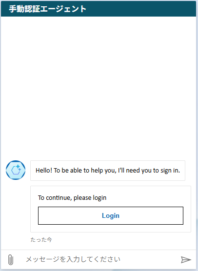
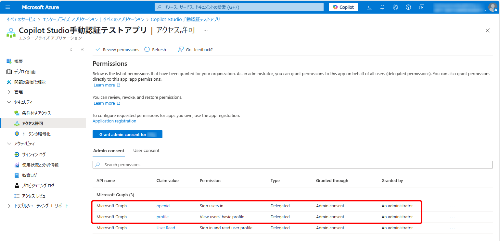
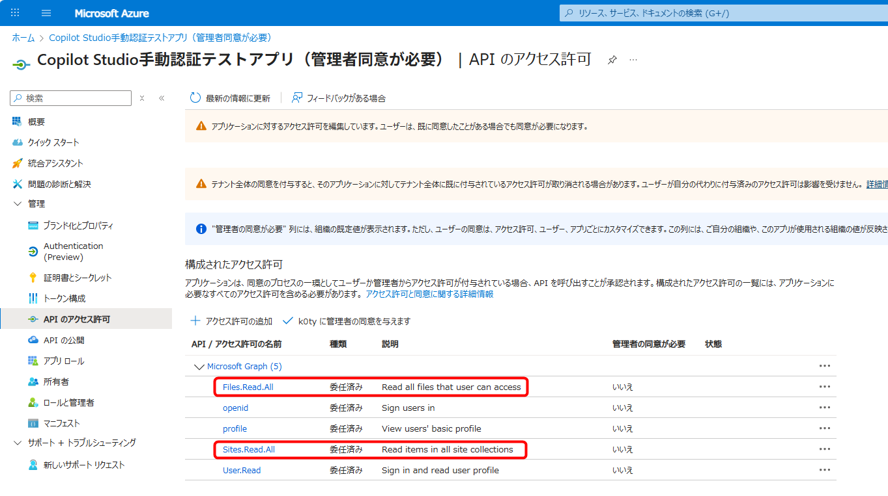
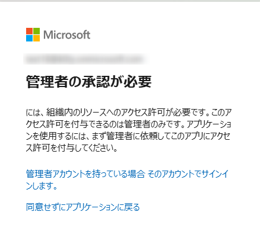

# はじめに

こんにちは、Power Platform サポートチームの山田です。  
本記事では Copilot Studioの手動認証についてご説明いたします。  
 
<!-- more -->
# 目次

1. [エージェントの手動認証](#anchor-manual-auth)
  1. [Azureポータルでのアプリ登録](#azure-app-registration)
1. [ナレッジ使う際のアクセス権について](#anchor-knowledge-access)
1. [「管理者の承認」について](#anchor-admin-consent)
1. [よくあるご質問](#common-questions)
---  

# エージェントの手動認証  
手動認証とは、ユーザーがCopilot Studioで作成したエージェントにアクセスする際に、Microsoft 認証以外の事前に構成された認証情報を使って、手動でログイン操作を行う認証方式を指します。  
SSO（シングルサインオン）などの自動認証とは異なり、ユーザーが明示的に認証操作を行う必要があります。  

Copilot Studioの各エージェントでは、複数の認証オプションが用意されています。  
手動認証では、サポートされて認証プロバイダを利用しサインインし、エージェントを利用します。  
例えば、Generic OAuth 2 認証を選んだ場合は、OAuth 2.0 に対応しているプロバイダがご利用いただけます。  
認証方式の種類については下記公開情報をご参照ください。  
[Copilot Studio でユーザー認証の構成](https://learn.microsoft.com/ja-jp/microsoft-copilot-studio/configuration-end-user-authentication#authenticate-manually)
  

# 手動認証でのエージェントの動作  
下図の通り、エージェントとのチャットの中でサインインを促されます。  
ログインボタンより、認証を完了させてください。  
  

# Azureポータルでのアプリ登録
手動認証において、Entra ID 認証を利用する場合は、Azureポータルでのアプリ登録が事前に必要となります。  
アプリにアクセス権を付与し、そのアプリに与えたアクセス権を行使して、エージェントを利用しております。  
手動認証時には、アプリに対して下記のAPIアクセス許可が必要となります。

* openid 
* profile

  

詳細は下記公開情報をご参照ください。  
[Microsoft Entra ID を使用してユーザー認証を構成する](https://learn.microsoft.com/ja-jp/microsoft-copilot-studio/configuration-authentication-azure-ad?tabs=fic-auth)  
また、アプリの登録自体の詳細は下記公開情報をご参照ください。  
[チュートリアル: Microsoft Entra ID に登録する](https://learn.microsoft.com/ja-jp/power-apps/developer/data-platform/walkthrough-register-app-azure-active-directory)
 

アプリのメインの目的は上記の通りとなりますが、他にも使用できる＝認証できるユーザー範囲を限定する目的でもアプリをご使用いただけます。  
詳細については、下記ブログ記事をご参照ください。  
[「管理者の承認が必要」のメッセージが表示された場合の対処法](https://jpazureid.github.io/blog/azure-active-directory/azure-ad-consent-framework/#4-%E7%AE%A1%E7%90%86%E8%80%85%E3%81%AE%E5%90%8C%E6%84%8F%E3%81%8C%E5%BF%85%E8%A6%81%E3%81%A8%E8%A1%A8%E7%A4%BA%E3%81%95%E3%82%8C%E3%81%9F%E9%9A%9B%E3%81%AE%E5%AF%BE%E5%87%A6%E6%B3%95)
  

# ナレッジを使う際のアクセス権について  
手動認証を利用しているエージェントにおいてナレッジを使う際、Azureポータルで登録するアプリに対して、対象ナレッジソースへのアクセス権の付与も必要となります。  
また、ナレッジソースごとに必要な認証タイプは異なります。  
例えばSharePointをナレッジソースとして使う際には、ユーザーの Microsoft Entra ID 認証が必要となります。  

また、ナレッジソースとして使う際には、ナレッジソースごとのアクセス許可が必要となります。  
例えばSharePointをナレッジソースとして使う際には、下記のアクセス許可が必要となります。  

* Sites.Read.All  
* Files.Read.All  

例:  
  

ナレッジごとに必要な認証タイプなどの詳細は下記公開情報をご参照ください。  
[サポートされるナレッジ ソース](https://learn.microsoft.com/ja-jp/microsoft-copilot-studio/knowledge-copilot-studio#supported-knowledge-sources)  

SharePointをナレッジソースとする場合に必要なアクセス許可の詳細は下記公開情報をご参照ください。  
[生成型の回答に SharePoint コンテンツを使用する](https://learn.microsoft.com/ja-jp/microsoft-copilot-studio/nlu-generative-answers-sharepoint-onedrive)  

その他ナレッジソースとして接続先サービスごとに必要なアクセス権の更なる詳細などについては、下記公開情報をご参照ください。  
[Copilot Studio の認証の構成](https://learn.microsoft.com/ja-jp/microsoft-copilot-studio/configuration-authentication-azure-ad#configure-authentication-in-copilot-studio)  
[SharePoint ソースを指す生成型の回答が結果を返しません](https://learn.microsoft.com/ja-jp/microsoft-copilot-studio/generative-answers-sharepoint-no-response)
  

# 「管理者の承認」について  
管理者の同意が必要なAPI/アクセス許可をご利用の場合や、APIのアクセス許可に対して、管理者同意を与えずにアプリをAzureポータルで登録し、管理者権限のないユーザーでエージェントにアクセスした場合、「管理者の承認」が必要な旨のメッセージが表示されます。  
この場合、メッセージの通り、Entra観点によるテナントの管理者による同意が必要となります。  
  

詳細は下記ブログ記事をご参照ください。  
[「管理者の承認が必要」のメッセージが表示された場合の対処法](https://jpazureid.github.io/blog/azure-active-directory/azure-ad-consent-framework/)
  

# よくあるご質問  
Q. 手動認証方法を無効化する方法はあるか？（例：全エージェント共通でMicrosoft認証のみを選択できるようにしたい）
A. 誠に恐れながら、方法のご用意はございません。エージェント毎に認証方法の変更は可能となっております。  
ただし、DLPポリシーにおいて下記コネクタをブロックグループに分類することで、Microsoft Entra ID認証以外の認証を無効化することが可能でございます。  

- Chat without Microsoft Entra ID authentication in Copilot Studio  

上記をブロックした場合、「認証なし」の選択肢は無効化されます。  
また、「手動で認証する」の選択肢自体は利用可能でございますが、Microsoft Entra ID認証を手動で認証することのみ可能となります。  

DLPポリシーでの管理詳細については下記公開情報をご参照ください。  
[エージェントのデータ損失防止ポリシーを構成する](https://learn.microsoft.com/ja-jp/microsoft-copilot-studio/admin-data-loss-prevention)  

## 補足

本手順は執筆時点でのユーザー インターフェイスを基に紹介しています。バージョンアップによって若干の UI の遷移など異なる場合があります。その場合は画面の指示に従って進めてください。
