こんにちは、Power Platform サポートチームの竹内です。  
本記事では Copilot Studio (旧称 Power Virtual Agents) で作成したエージェントを Microsoft Teams (以降 Teams) に公開する方法についてご案内致します。

<!-- more -->
# 目次

- [目次](#目次)
- [1. 概要](#1-概要)
- [2. Web 版 Copilot Studio で作成したエージェントを Teams で利用する](#2-web-版-copilot-studio-で作成したエージェントを-teams-で利用する)
  - [2-1. エージェントを公開する](#2-1-エージェントを公開する)
  - [2-2. 他のユーザーと共有する](#2-2-他のユーザーと共有する)
  - [2-3. Teamsチャネルに接続する](#2-3-teamsチャネルに接続する)
  - [2-4. 他のユーザーが Teams でエージェントを利用する](#2-4-他のユーザーが-teams-でエージェントを利用する)
    - [2-4-1. リンクの共有](#2-4-1-リンクの共有)
    - [2-4-2. Teamsアプリストアに公開する](#2-4-2-teamsアプリストアに公開する)
    - [2-4-3. zipとしてダウンロード・アップロード](#2-4-3-zipとしてダウンロードアップロード)
  - [2-5. Teams チームにエージェントをインストールする](#2-5-teams-チームにエージェントをインストールする)
- [3. Teams 版 Copilot Studio で作成したエージェントを Teams で利用する](#3-teams-版-copilot-studio-で作成したエージェントを-teams-で利用する)
  - [3-1. エージェントを公開する](#3-1-エージェントを公開する)
  - [3-2. 他のユーザーと共有する](#3-2-他のユーザーと共有する)
  - [3-3. 他のユーザーが Teams でエージェントを利用する](#3-3-他のユーザーが-teams-でエージェントを利用する)
- [補足](#補足)

# 1. 概要

今回はよくあるお問い合わせとして、Copilot Studio で作成したエージェントを Teams に公開する方法についてご案内いたします。  
この方法では Copilot Studio の設定だけでなく、Teams 管理センターなどの設定も必要となります。  
そのため、一部 Teams 管理センターにアクセスできる権限がある管理者にてご実行いただく必要がある操作もございますので、ご留意ください。  

> [!NOTE]
> Teams 管理センターでアクセス許可ポリシーを設定している場合、事前にカスタムアプリのアクセスを許可するようポリシーを設定する必要がございます。  
> 本記事執筆時点で、アクセス許可ポリシーからアプリ中心の管理への移行が推奨されておりますので、本記事では詳細は割愛します。  
> アクセス許可ポリシーの設定方法等については下記の公開情報をご参照ください。  
> [Microsoft Teams のアプリのアクセス許可ポリシーを管理する - Microsoft Teams | Microsoft Learn](https://learn.microsoft.com/ja-jp/microsoftteams/teams-app-permission-policies)  

# 2. Web 版 Copilot Studio で作成したエージェントを Teams で利用する

## 2-1. エージェントを公開する
  エージェントを作成、編集した場合、そのエージェントを他の人が使えるようにするため、まずは公開する必要があります。  
  作成、編集したエージェントを開き、画面右上の「公開」ボタンよりエージェントを公開してください。
  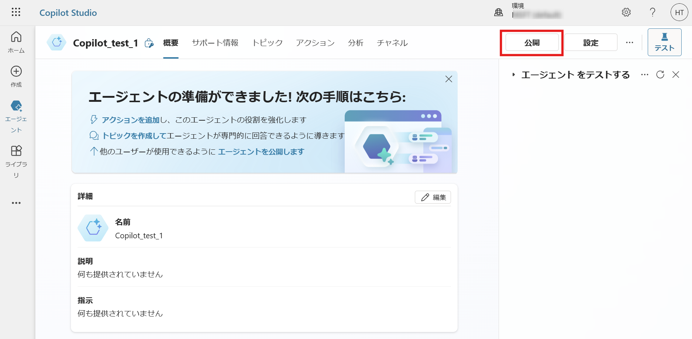  

  下記のようなロード画面が表示され、しばらくすると公開が完了します。  
  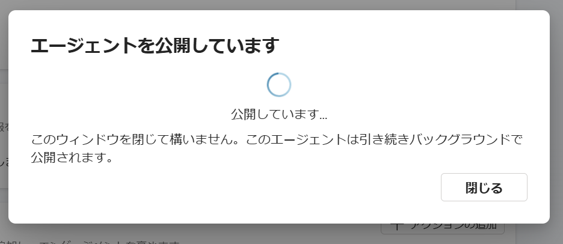  

## 2-2. 他のユーザーと共有する
  作成したエージェントを、他のユーザーがで利用できるようにします。  
  他のユーザーとエージェントを共有するには 2 つの方法がございます。  
   1. セキュリティグループ、組織に利用者として共有する（[設定方法はこちら](https://learn.microsoft.com/ja-jp/microsoft-copilot-studio/admin-share-bots?tabs=web#share-an-agent-for-chat)）
   2. ユーザーに共同編集者として共有する（[設定方法はこちら](https://learn.microsoft.com/ja-jp/microsoft-copilot-studio/admin-share-bots?tabs=web#share-an-agent-for-collaborative-authoring)）  
  
  > [!NOTE]  
  > 利用者としてエージェントを共有する場合、利用者のユーザーは Power Platform 環境のメンバーである必要はありません。  
  > また、セキュリティロールを割り当てる必要もありません。  
  > ただし、エージェントを通して環境内のデータやその他データソースへアクセスする場合には、別途データソースへのアクセス権限をユーザーに割り当てる必要があります。  
  > 一方、エージェントにナレッジとして直接追加されたファイルへアクセスする際には、セキュリティロールを割り当てる必要はありません。

## 2-3. Teamsチャネルに接続する
  次に、公開したエージェントを Teams で使えるようにするため、Teams チャネルと接続します。  

  > [!IMPORTANT]
  > Teams でエージェントを利用するためには、Teams 管理センターからカスタムアプリの使用を許可する必要があります。  
  > 具体的な設定方法は下記の公開情報をご参照ください。    
  > [Microsoft Teams 管理センターで Microsoft Power Platform アプリを管理する - Microsoft Teams | Microsoft Learn](https://learn.microsoft.com/ja-jp/microsoftteams/manage-power-platform-apps)  

  > [!NOTE]  
  > Power Platform 管理センターより Teams チャネルへの接続を許可するよう DLP を設定しておく必要があります。  
  > 下記の「Microsoft Teams + M365 Channel in Copilot Studio」のコネクタを許可してください。  
  >   
  > なお、Copilot Studio に関する DLP の詳細については下記の公開情報をご参照ください。    
  > [エージェントのデータ損失防止ポリシーを構成する - Microsoft Copilot Studio | Microsoft Learn](https://learn.microsoft.com/ja-jp/microsoft-copilot-studio/admin-data-loss-prevention#copilot-studio-connectors)  

  該当のエージェントを開き、画面上部の「チャネル」タブより「Microsoft Teams」をご選択ください。  
  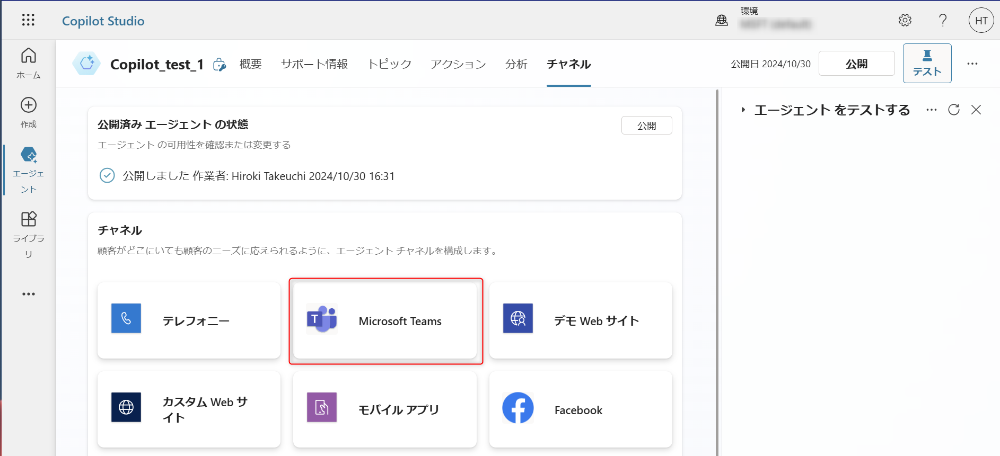  

  チャネルが追加されると下記の画面が表示されます。  
  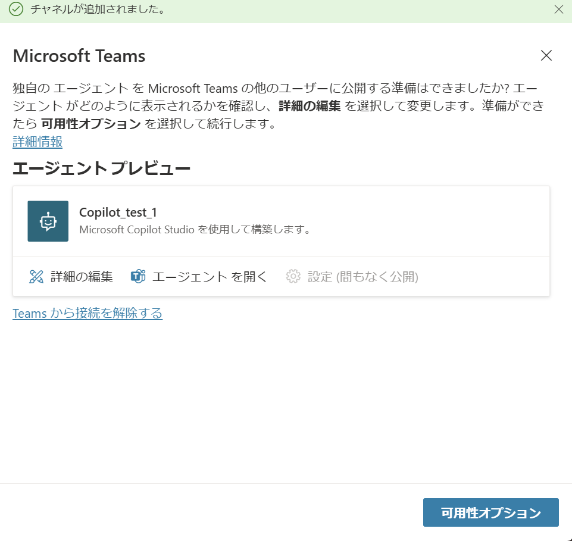  

  「詳細の編集」より Teams に公開する際のエージェントの外観等を編集することが可能です。  
  また、エージェントを Teams チームに追加することの許可などもここから可能です。  
  エージェントを Teams チームに追加する詳細については、[2-5 項](#2-5-teams-チームにエージェントをインストールする)で後述します。
  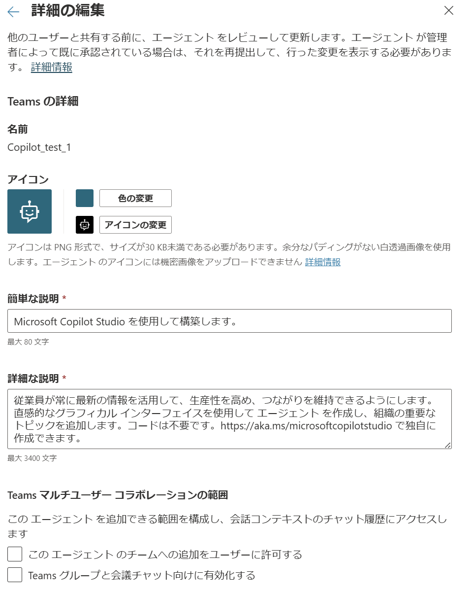    

  「エージェントを開く」を選択すると、Teams が開き、下記の画面が表示されます。
      
  
  「追加」を選択することで、Teams でエージェントを利用することが可能になります。
  ここまでの操作で、自分（作成者）だけが Teams で該当エージェントを使える状態となります。

  > [!WARNING]  
  > Teams 管理センターの設定が適切に行われていない場合、下画像のようなエラーが表示されることがあります。  
  >   
  > Teams 管理センターの設定をご確認ください。  
  > 具体的な設定方法は下記の公開情報をご参照ください。    
  > [Microsoft Teams 管理センターで Microsoft Power Platform アプリを管理する - Microsoft Teams | Microsoft Learn](https://learn.microsoft.com/ja-jp/microsoftteams/manage-power-platform-apps)  

## 2-4. 他のユーザーが Teams でエージェントを利用する
  Copilot Studio 「チャネル」タブより「Microsoft Teams」を選択すると、下記の画面が表示されます。  
    

  他のユーザーがこのエージェントを利用できるようにするには、「可用性オプション」をご選択ください。  
  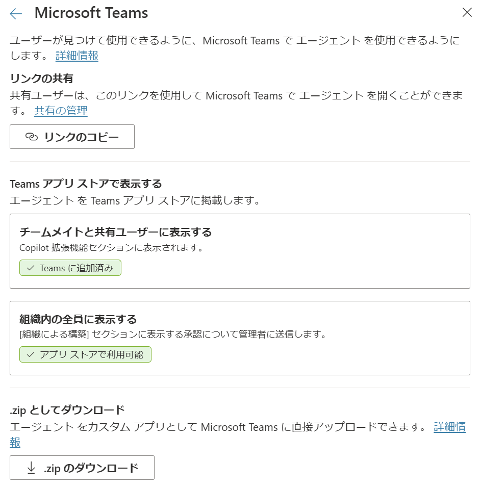  

  上記画像中にもあるように、他のユーザーが Teams でエージェントを利用できるように共有するには主に 3 つの方法があります。
  1. リンクの共有
  2. Teams アプリストアに公開する
  3. zip としてダウンロード・アップロード

### 2-4-1. リンクの共有
  まず、リンクの共有によって共有する方法です。  
  この方法は事前に共有先ユーザーに、エージェント自体を共有しておく必要があります。  
  共有の方法については [2-2 項](#2-2-他のユーザーと共有する) をご参照ください。  
  
  下記の画面で「リンクのコピー」を選択します。  
  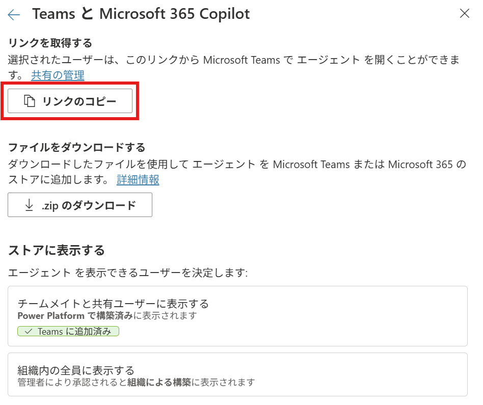  
  
  すると、クリップボートに Teams でエージェントを利用するための URL がコピーされます。  
  エージェントにアクセス権がある他ユーザーがその URL を入力すると、下記画面が表示されます。  
  「追加」を選択することで、Teams でエージェントを利用することが可能となります。  
    

  この方法の詳細については下記の公開情報も合わせてご参照ください。  
  [Microsoft Teams 用コパイロットの接続と構成 - Microsoft Copilot Studio | Microsoft Learn](https://learn.microsoft.com/ja-jp/microsoft-copilot-studio/publication-add-bot-to-microsoft-teams#share-a-link-so-others-can-install-a-copilot)  

  > [!WARNING]  
  > エージェントが共有されていないユーザーが、リンクにアクセスした場合、下画像のエラーが表示されます。  
  >   
  > [2-2 項](#2-2-他のユーザーと共有する) をご参照のうえ、適切にエージェントが共有されいているかご確認ください。  

### 2-4-2. Teamsアプリストアに公開する
  次に、Teams アプリストアに公開する方法です。
  Teams アプリストアに公開するには下記の二つの公開範囲別の方法があります。  
  ご要件の公開範囲に応じた設定を行ってください。  

  1. 共有ユーザーに表示する（[設定方法はこちら](https://learn.microsoft.com/ja-jp/microsoft-copilot-studio/publication-add-bot-to-microsoft-teams#show-to-shared-users)）
  2. 組織に表示する（[設定方法はこちら](https://learn.microsoft.com/ja-jp/microsoft-copilot-studio/publication-add-bot-to-microsoft-teams#show-to-the-organization)）

  なお、この手順全体の詳細については下記の公開情報をご参照ください。  
  [接続 を設定し、エージェント を設定します Microsoft Teams - Microsoft Copilot Studio | Microsoft Learn](https://learn.microsoft.com/ja-jp/microsoft-copilot-studio/publication-add-bot-to-microsoft-teams#show-an-agent-in-the-teams-app-store)  

  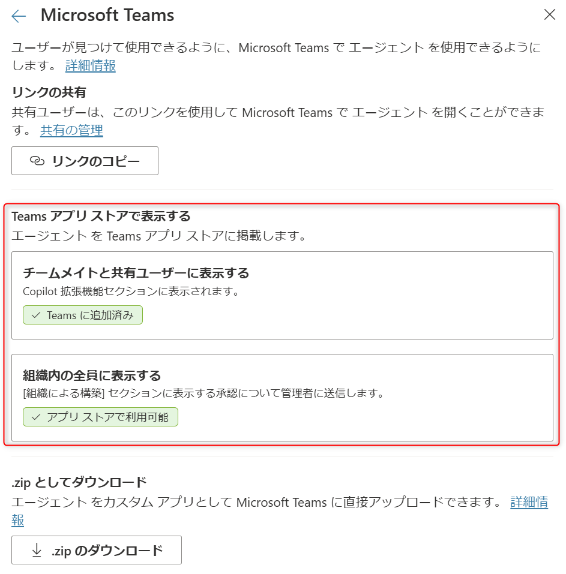  

### 2-4-3. zipとしてダウンロード・アップロード
  この方法は .zip ファイルとしてエージェントをダウンロードし、直接マニフェストファイルを編集したり、他ユーザーと共有してアップロードする方法となります。

  ダウンロードするには、下記の画面で「.zip のダウンロード」を選択します。  
  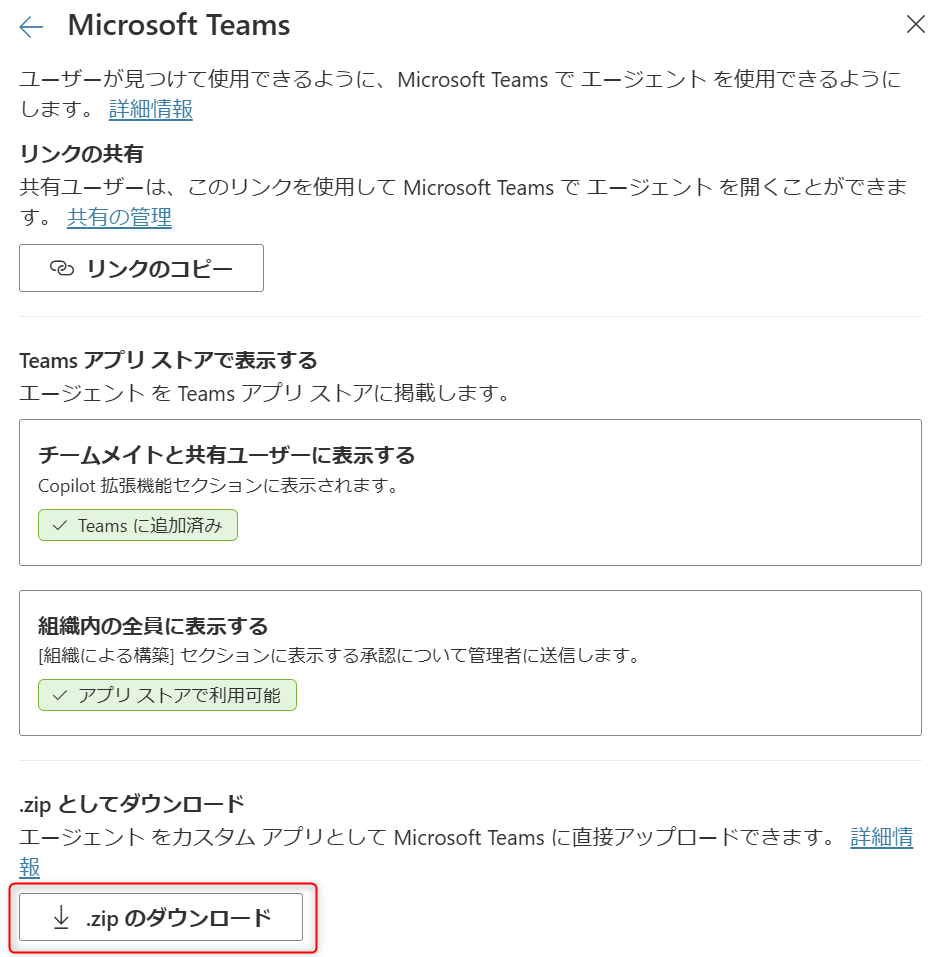  

  ダウンロードしたファイルを Teams にアップロードして利用する方法については下記の公開情報をご参照ください。  
  [カスタム アプリをアップロードする - Teams | Microsoft Learn](https://learn.microsoft.com/ja-jp/microsoftteams/platform/concepts/deploy-and-publish/apps-upload)

  なお、この方法の詳細については下記の公開情報も合わせてご参照ください。  
  [接続 を設定し、エージェント を設定します Microsoft Teams - Microsoft Copilot Studio | Microsoft Learn](https://learn.microsoft.com/ja-jp/microsoft-copilot-studio/publication-add-bot-to-microsoft-teams#download-the-teams-app-manifest-for-an-agent-advanced)  

## 2-5. Teams チームにエージェントをインストールする
  Teams 内のチームにエージェントをインストールし、チームの他のメンバーがエージェントを利用できるように設定することができます。  

  Copilot Studio 「チャネル」タブより「Microsoft Teams」を選択すると、下記の画面が表示されますので、「詳細の編集」をご選択ください。 
  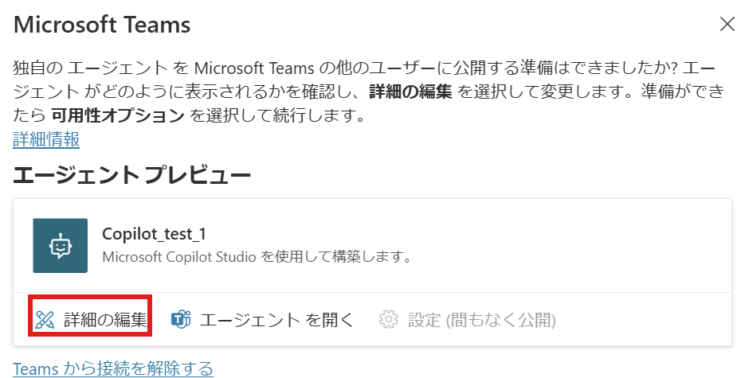  

  「このエージェントのチームへの追加をユーザーに許可する」のチェックボックスを埋めてください。  
  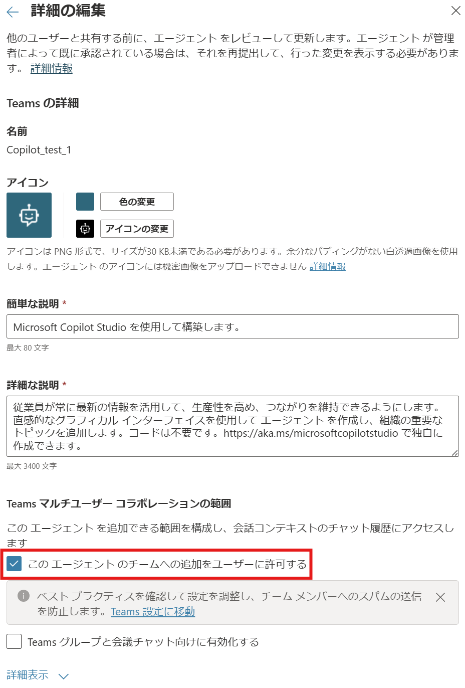  
  
  上記の設定を行っている状態で、リンクの共有、または Teams アプリストアに公開を経由し、下記の「追加」ボタンを選択してください。
     

  すると、下記のように、Teams で開くか、特定のチームを選択してエージェントをインストールするか、選択が可能となります。
  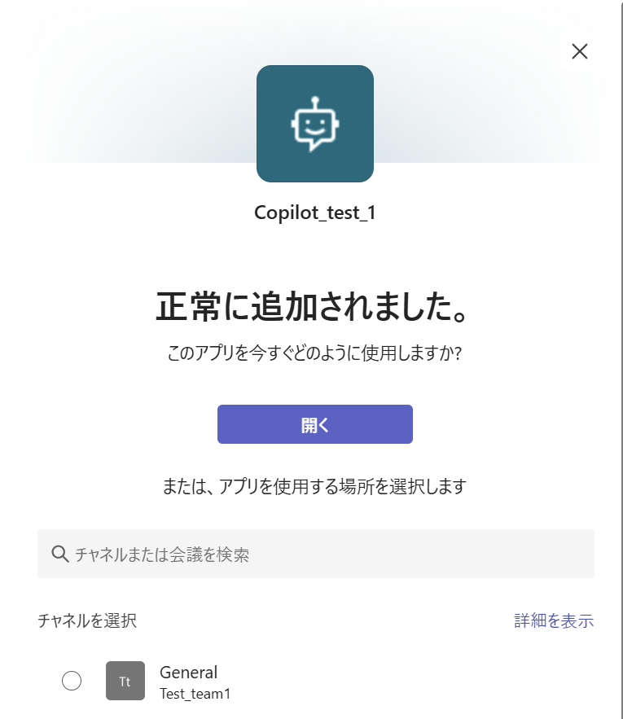  

  チームにエージェントをインストールする場合、インストール先のチームを選択し、インストールしてください。

  なお、この方法の詳細については下記の公開情報も合わせてご参照ください。  
  [Microsoft Teams のエージェントを接続して構成します - Microsoft Copilot Studio | Microsoft Learn](https://learn.microsoft.com/ja-jp/microsoft-copilot-studio/publication-add-bot-to-microsoft-teams#allow-users-to-add-an-agent-to-a-team-in-teams)

# 3. Teams 版 Copilot Studio で作成したエージェントを Teams で利用する

## 3-1. エージェントを公開する
  エージェントを作成、編集した場合、そのエージェントを他の人が使えるようにするため、まずは公開する必要があります。  
  作成、編集したエージェントを開き、「公開」メニューより「公開」ボタンを選択し、エージェントを公開してください。
    

## 3-2. 他のユーザーと共有する
  作成したエージェントを、他のユーザーがで利用できるようにします。  
  Web 版と同様に、他のユーザーとエージェントを共有するには 2 つの方法がございます。  
   1. セキュリティグループに利用者として共有する
   2. ユーザーに共同編集者として共有する
  
  手順の詳細等については下記の公開情報をご参照ください。  
  [他のユーザーとエージェントを共有する - Microsoft Copilot Studio | Microsoft Learn](https://learn.microsoft.com/ja-jp/microsoft-copilot-studio/admin-share-bots?tabs=teams)  

  > [!NOTE]  
  > 利用者としてエージェントを共有する場合、利用者のユーザーは Power Platform 環境のメンバーである必要はありません。  
  > また、セキュリティロールを割り当てる必要もありません。  
  > ただし、エージェントを通して環境内のデータやその他データソースへアクセスする場合には、別途データソースへのアクセス権限をユーザーに割り当てる必要があります。  
  > 一方、エージェントにナレッジとして直接追加されたファイルへアクセスする際には、セキュリティロールを割り当てる必要はありません。

## 3-3. 他のユーザーが Teams でエージェントを利用する
  Web 版 Copilot Studio でエージェントを公開した直後や、下記の画面で「このエージェントの試用を他のユーザーに許可する」を選択すると、次の画面が表示されます。  
  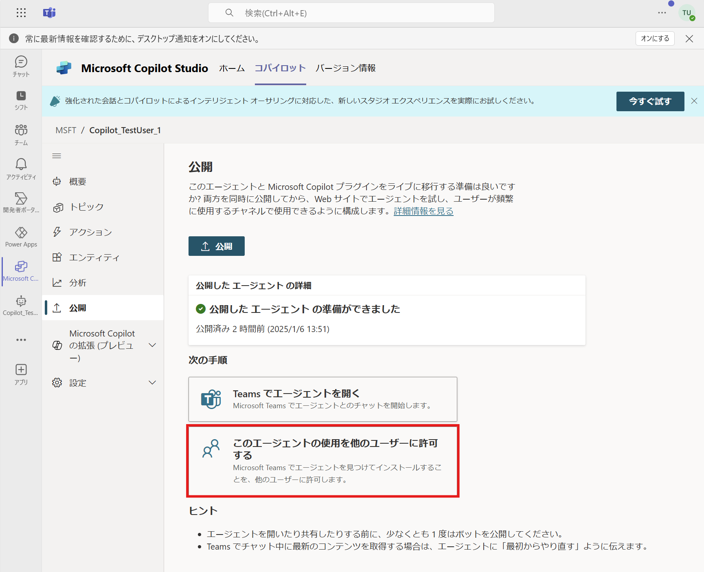  
  
  [2-4 項](#2-4-他のユーザーが-teams-でエージェントを利用する)で説明した画面と同様の画面となります。  
  それ以降の公開範囲に応じて、Web 版と同様の設定を行ってください。  
  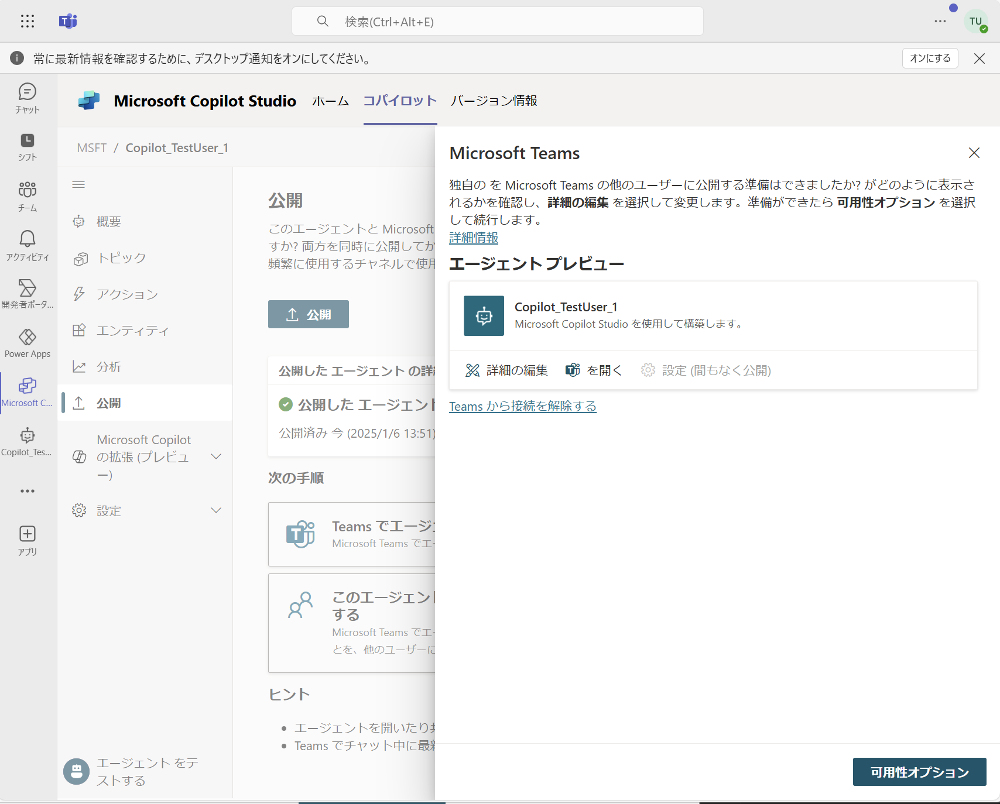  

---

# 補足

本手順は執筆時点でのユーザー インターフェイスを基に紹介しています。バージョンアップによって UI の遷移などが若干異なる場合があります。その場合は画面の指示に従って進めてください。  

