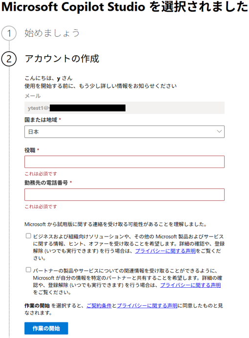
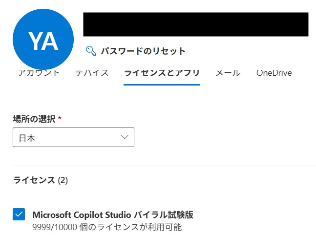

こんにちは、Power Platform サポートチームのヤサルです。
本記事では Copilot Studio (旧称 Power Virtual Agents) の試用版について下記項目の順にご説明いたします。
1. 試用版ライセンスの概要
2. 試用版の種類 
3. ブロックする方法
4. 付与されているライセンスを確認する方法

<!-- more -->

### 1. 試用版ライセンスの概要

Copilot Studio の試用版は、開発者や管理者が Microsoft Copilot Studio の機能を評価・体験することは可能でございます。以下に、試用版の種類、付与方法、利用可能な環境、ブロック方法、およびライセンス確認方法について詳しく説明します。 

### 2. 試用版の種類
Copilot Studio には主に以下の種類があります。

**1. 個人用試用版**

個人の職場または学校アカウントを使用してサインアップし、Copilot Studio の機能を体験できます。試用期間を30日間延長は可能です。試用期間終了後、最大90日間はエージェントが引き続き機能します。 
詳細なサインアップ手順については、以下の公開文書を参照してください。
[Copilot Studio試用版へのサインアップ](https://learn.microsoft.com/ja-jp/microsoft-copilot-studio/sign-up-individual)


   
**2. 組織用試用版**
組織としての試用版は組織単位なので同じ組織で利用できるのは1度だけです。管理者がMicrosoft 365管理センターから有効にする必要がございます。試用期間は30日間で1回だけ30日延長はできます。

### 3. ブロックする方法
Copilot Studioの試用版のみ組織内のユーザーが取得できないように以下のコマンドで制御できます。

**事前準備**
PowerShellモジュールを以下の公開文書の手順に従ってインストールします。
[PowerShellモジュールのインストール](https://learn.microsoft.com/ja-jp/power-platform/admin/powerapps-powershell)

**コマンドの実行**
以下のコマンドを実行し試用版のライセンスを無効化し、利用停止にします。
```PowerShellコマンド
「$params = @{allowedToSignUpEmailBasedSubscriptions = $false}」
「Update-MgPolicyAuthorizationPolicy -BodyParameter $params」
```
コマンドの詳細については下記の公開情報をご参照ください。
[電子メール検証済みユーザーのセルフサービスサインアップ](https://learn.microsoft.com/ja-jp/entra/identity/users/directory-self-service-signup)

### 4. 付与されているライセンスを確認する方法
Microsoft 365管理センターよりユーザーにCopilot Studio試用版ライセンスを付与されているかを確認できます。



