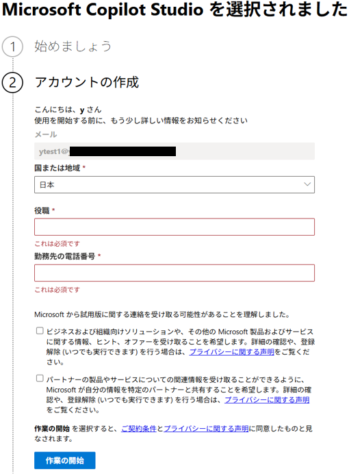
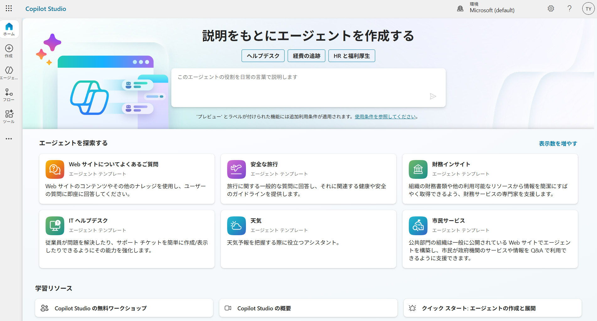
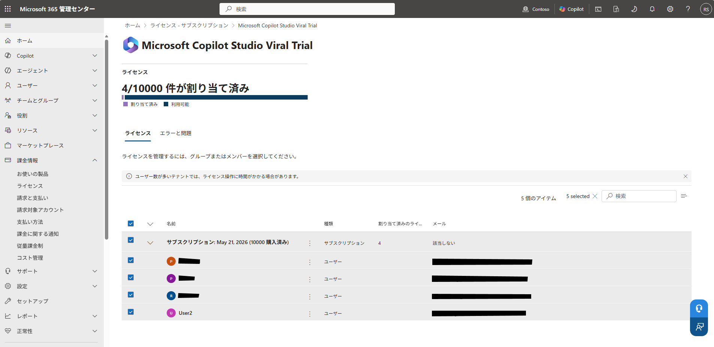

# Copilot Studio試用版ライセンスについて

こんにちは、Power Platform サポートチームのヤサルです。
本記事では Copilot Studio (旧称 Power Virtual Agents) の試用版について下記項目の順にご説明いたします。

<!-- more -->
# 目次

- [目次](#目次)
- [1. 概要](#1-概要)
- [2. 試用版の種類 ](#2-試用版の種類)
- [3. ブロックする方法](#3-ブロックする方法)
- [4. セルフサービスサインアップによりライセンスを取得したユーザーを確認する方法](#4-付与されているライセンスを確認する方法)

<a id='1-概要'></a>

# 1. 概要

Copilot Studio の試用版では、開発者や管理者が Microsoft Copilot Studio の主要な機能を体験することが可能です。以下に、試用版の種類、付与方法、ブロック方法、およびライセンス確認方法について詳しく説明します。 

<a id='2-試用版の種類'></a>

# 2. 試用版の種類
Copilot Studio の試用版には以下の 2 種類があります。
1. 個人用試用版
2. 組織用試用版

## 1. 個人用試用版
個人の職場または学校アカウントを使用してサインアップし、Copilot Studio の機能を体験できます。ユーザー本人が、Copilot Stuido サインアップページよりサインアップすることで、「Microsoft Copilot Studio Viral Trial」を取得することができます。
初回は 30 日間の無料試用が開始されますが試用終了時にさらに 30 日間の延長が可能です。試用期間終了後、最大 90 日間はエージェントが引き続き機能します。 
詳細なサインアップ手順については、以下の公開文書を参照してください。

[Copilot Studio 試用版へのサインアップ](https://learn.microsoft.com/ja-jp/microsoft-copilot-studio/sign-up-individual)



   
## 2. 組織用試用版
組織用試用版は、組織 (テナント) 単位で Copilot Studio の有償版を試すための試用版です。管理者が Microsoft 365 管理センターから「Microsoft Copilot Studio 試用版」を有効にする必要があります。組織 (テナント) につき 1 回のみ有効化可能で、試用期間は 30 日間、1 回だけ 30 日間の延長ができます。
また、Microsoft Copilot Studio 試用版を取得した後、アドオンライセンスとして「Microsoft Copilot Studio ユーザー ライセンス試用版」を最大 25 ライセンス取得することが可能です。
Copilot Studio でエージェントの作成を行いたいユーザーには、「Microsoft Copilot Studio ユーザー ライセンス試用版」を付与してください。

<a id='3-ブロックする方法'></a>

# 3. ブロックする方法
Copilot Studio の個人用試用版を、組織内のユーザーがセルフサービスで取得できないように、以下のコマンドで制御できます。
ご留意事項といたしまして、本コマンドは Copilot Studio のみを個別にブロックするものではありません。テナント全体の Microsot セルフサービス サインアップの試用版を制御する設定となりますので、ご留意ください。

また、本コマンドの実行により、組織内ユーザーが新たにセルフサービスで試用版を取得することを防止できますが、すでに試用版を取得しているユーザーのライセンスは自動的には解除されません。
すでに Microsoft Copilot Studio Viral Trial を取得しているユーザーのライセンスを剥奪したい場合には、後述の[4. セルフサービスサインアップによりライセンスを取得したユーザーを確認する方法](#4-付与されているライセンスを確認する方法)をご確認ください。


**事前準備**
PowerShellモジュールを以下の公開文書の手順に従ってインストールします。

[PowerShellモジュールのインストール](https://learn.microsoft.com/ja-jp/power-platform/admin/powerapps-powershell)

**コマンドの実行**
以下のコマンドを実行しセルフサービスサインアップの無効化します。

```PowerShell
$params = @{allowedToSignUpEmailBasedSubscriptions = $false}
Update-MgPolicyAuthorizationPolicy -BodyParameter $params
```
コマンドの詳細については下記の公開情報をご参照ください。

[電子メール検証済みユーザーのセルフサービスサインアップ](https://learn.microsoft.com/ja-jp/entra/identity/users/directory-self-service-signup)

<a id='4-付与されているライセンスを確認する方法'></a>

# 4. セルフサービスサインアップによりライセンスを取得したユーザーを確認する方法
Microsoft 365 管理センターより、ユーザーに Microsoft Copilot Studio Viral Trial ライセンスを付与されているかを確認できます。
[課金情報] > [ライセンス] > [Microsoft Copilot Studio Viral Trial] の順にクリックし、ユーザー一覧をご確認ください。また、本画面にてユーザーを複数選択し、一括でライセンスの割り当て解除を行うことも可能です。

