こんにちは、Power Platform サポートチームの竹内、原です。  
本記事では Microsoft Copilot Studio (旧称 Power Virtual Agents) 関連のお問い合わせの際に、調査のために必要となる情報について、その取得手順をご案内致します。

<!-- more -->
# 目次

1. [概要](#anchor-intro)
1. [情報取得手順詳細](#anchor-how-to-collect)
      1. [事象の発生状況](#anchor-about-situation)
      1. [事象発生時のエラーメッセージや画面キャプチャ・動画](#anchor-about-screencapture)
      1. [環境 ID](#anchor-environmentid)
      1. [Bot ID](#anchor-botid)
      1. [Conversation ID](#anchor-conversationid)
      1. [セッション詳細](#anchor-session-details)
      1. [事象再現時のスナップショット zip ファイル](#anchor-snapshot-zip)
      1. [ナレッジの有効化状態](#anchor-knowledge-enable-state)
      1. [会話入出力](#anchor-raw-input-output)
      1. [トピック画面](#anchor-topics-screen)
      1. [会話トランスクリプションテーブルデータ](#anchor-conversation-transcript)
      1. [ソリューションエクスポートファイル](#anchor-solution-export-file)
      1. [Web ブラウザのネットワーク トレース・コンソール ログ](#anchor-about-networkhar)
      1. [Teamsクライアントのネットワーク トレース、診断ログ](#anchor-teamslog)

# 概要

弊社サポートではお問合せを頂いた際のトラブルシューティングにおいてお問い合わせの内容をもとに調査方針を立てております。  
発生している事象の把握のため、直面されている事象の切り分けや情報提供をお願いすることがあります。  
Copilot Studio (旧称 Power Virtual Agents) に関するサポートサービスへお問合せの際の情報取得手順について以下のとおりご案内いたします。

# 情報取得手順詳細

## 1. 事象の発生状況
  エラーや意図しない状況がどのような状況下で発生するかお知らせください。  
  事象の発生条件を特定することで、問題の特定だけではなく弊社環境での再現調査においても有用な情報が得られます。  
  以下の情報をお知らせいただくことでより明確に事象を把握することができます。  

## 2. 事象発生時のエラーメッセージや画面キャプチャ・動画
  エラーの内容を具体的に表すメッセージや画面キャプチャなどの情報をお寄せください。  
  事象再現時の動画がありますと事象の発生状況をより正確に把握することができます。  

### エラーメッセージや画面キャプチャ
  エラーの内容が分かるよう画面キャプチャをご取得ください。  
  エラーメッセージ内にタイムスタンプやエラーコードが記載されている場合はそれらの情報を **テキスト形式** でご取得ください。  

### 動画
  以下のいずれかの方法で事象発生時の動画をご取得ください。  

  > [!IMPORTANT]
  > 事象発生の事前に取得開始し、事象発生後に採取を行う必要がございます。
  - Windows ゲーム バーでの画面収録  
    [ゲーム バーを使用して PC にゲーム クリップを記録する](https://support.microsoft.com/ja-jp/windows/%E3%82%B2%E3%83%BC%E3%83%A0-%E3%83%90%E3%83%BC%E3%82%92%E4%BD%BF%E7%94%A8%E3%81%97%E3%81%A6-pc-%E3%81%AB%E3%82%B2%E3%83%BC%E3%83%A0-%E3%82%AF%E3%83%AA%E3%83%83%E3%83%97%E3%82%92%E8%A8%98%E9%8C%B2%E3%81%99%E3%82%8B-2f477001-54d4-1276-9144-b0416a307f3c)  
  - PowerPoint での画面収録  
    [PowerPoint で画面を記録する](https://support.microsoft.com/ja-jp/office/powerpoint-%E3%81%A7%E7%94%BB%E9%9D%A2%E3%82%92%E8%A8%98%E9%8C%B2%E3%81%99%E3%82%8B-0b4c3f65-534c-4cf1-9c59-402b6e9d79d0)  
   - Microsoft Teams での画面収録  
    [Microsoft Teamsで会議を記録する](https://support.microsoft.com/ja-jp/office/microsoft-teams-%E3%81%A7%E4%BC%9A%E8%AD%B0%E3%82%92%E8%A8%98%E9%8C%B2%E3%81%99%E3%82%8B-34dfbe7f-b07d-4a27-b4c6-de62f1348c24#:~:text=Microsoft)  

## 3. 環境ID
  以下の手順で環境 ID を取得し、ご提供ください。
  必要に応じて URL をそのままご提供ください。

  - Copilot Studio ポータルを開きます。開いている環境が対象の環境であることを確認してください  
  - URL 内の environments/ の直後にある ID が環境 ID です。
  - URL をテキストファイル、あるいは文字列としてメール等に張り付けてご提供ください。  
  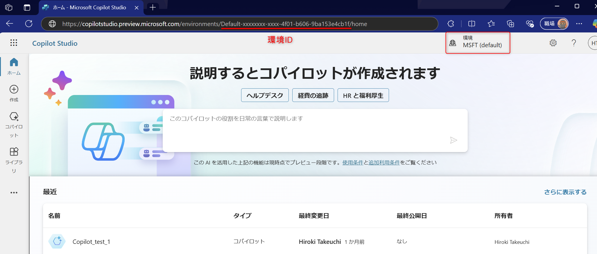  

## 4. Bot ID
  以下の手順で Bot ID を取得し、ご提供ください。
  必要に応じて URL をそのままご提供ください。

  - Copilot Studio ポータル>（対象の環境選択）＞エージェント＞対象のコパイロットを開きます。
  - URL 内の bots/ の直後にある ID が Bot ID です。
  - URL をテキストファイル、あるいは文字列としてメール等に張り付けてご提供ください。
  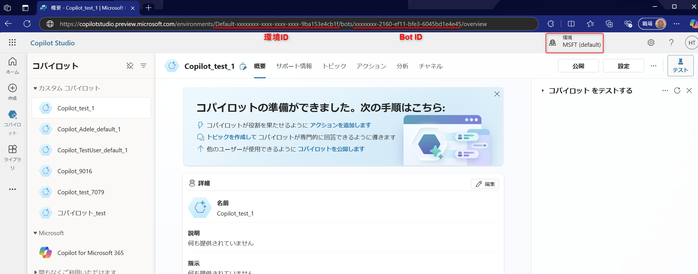  

## 5. Conversation ID
  以下の手順で Conversation ID を取得し、ご提供ください。

  - Copilot Studio ポータル>（対象の環境選択）＞エージェント＞対象のコパイロットを開きます。  
  - 対象のコパイロットとのチャットウィンドウに '/debug conversationid' とご入力ください。  
  - 得られた応答をテキストファイルとしてご提供ください。また、下画像と同様のスクリーンショットをご提供ください。  
  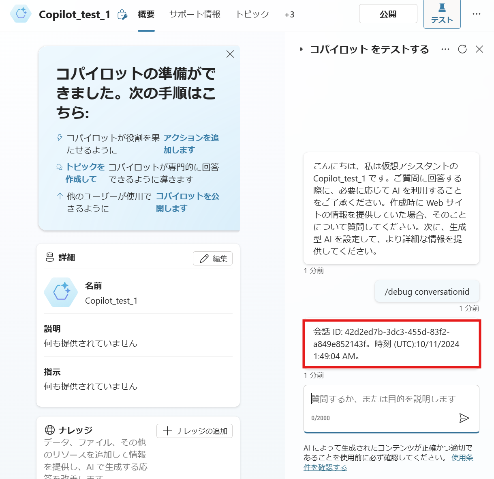  

## 6. セッション詳細
  以下の手順でセッション詳細を取得し、ご提供ください。

  - Copilot Studio ポータル>（対象の環境選択）＞歯車アイコン＞セッション詳細を開きます。
  - 表示された内容をコピーしてテキストファイルとしてご提供ください。
  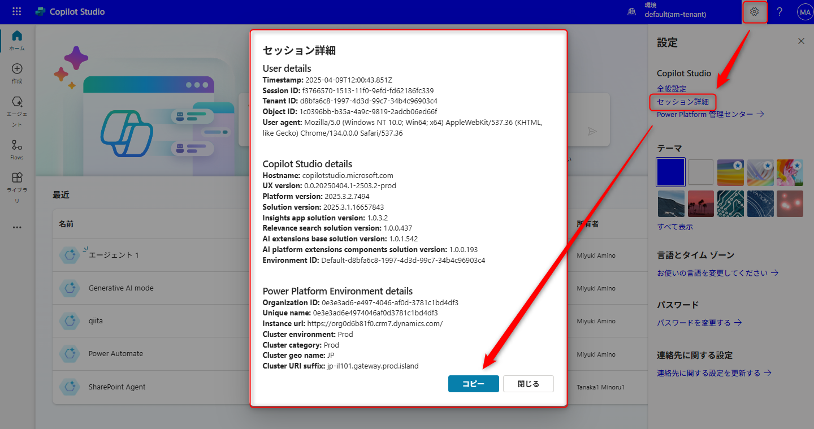  

## 7. 事象再現時のスナップショット zip ファイル
  以下の手順でスナップショット zip ファイルを取得し、ご提供ください。

  - Copilot Studio ポータル>（対象の環境選択）＞エージェント＞対象のコパイロットを開きます。  
  - 対象のコパイロットとのチャットウィンドウ右上の三点リーダーより、「スナップショットの保存」を選択します。  
  - 得られた zip ファイルをご提供ください。  
  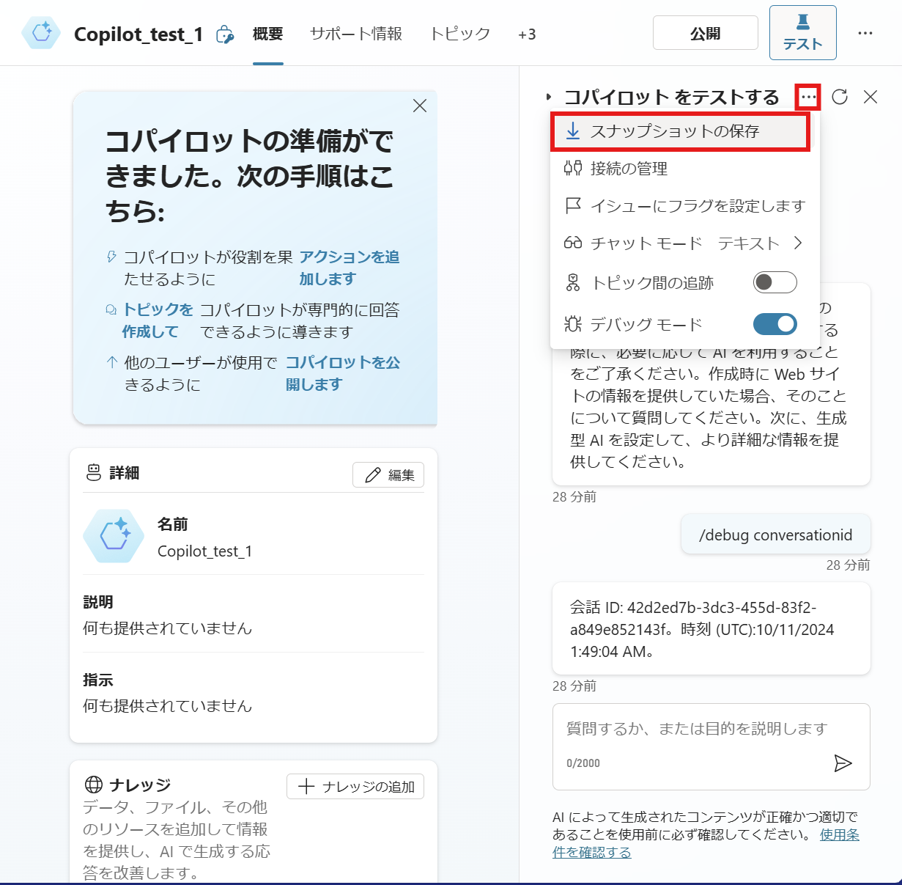  

## 8. ナレッジの有効化状態
  以下の手順でスクリーンショット画像ファイルを取得し、ご提供ください。

  - Copilot Studio ポータル>（対象の環境選択）＞エージェント＞対象のコパイロットを開きます。  
  - 対象のコパイロットの「ナレッジ」セクションで「有効」のトグルボタンがオンであるかを確認します。  
  - 確認した際の、下画像と同様のスクリーンショットをご提供ください。  
  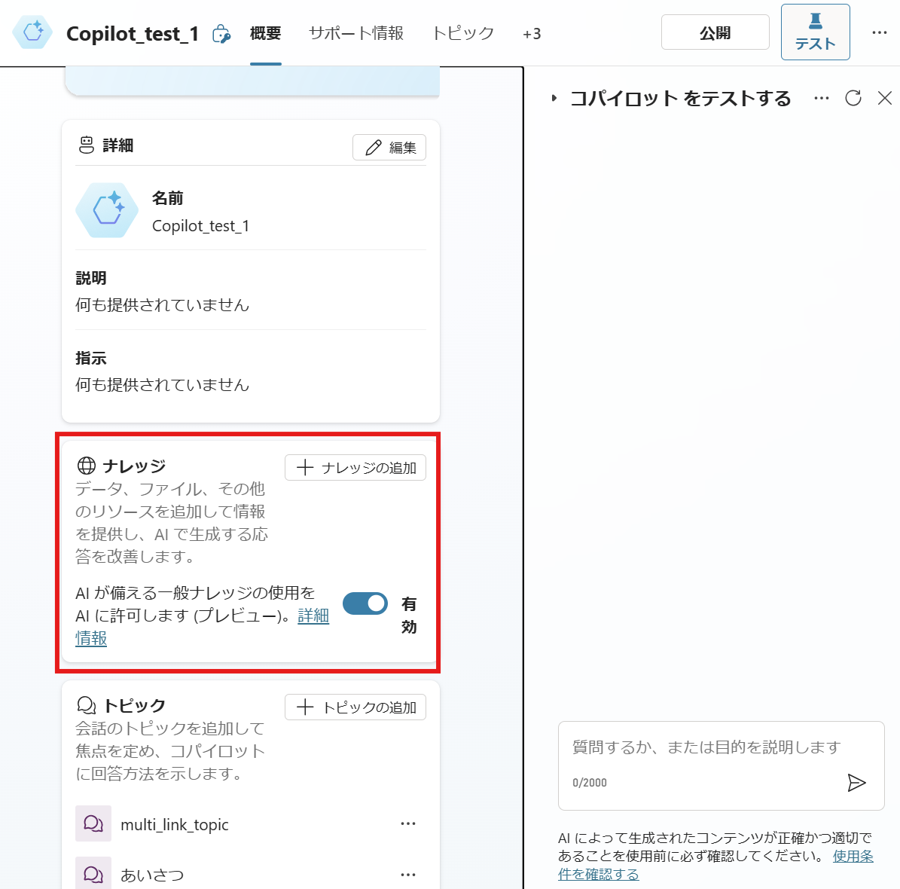  

## 9. 会話入出力 
  以下の手順でスクリーンショット画像ファイルを取得し、ご提供ください。

  - Copilot Studio ポータル>（対象の環境選択）＞エージェント＞対象のコパイロットを開きます。  
  - 対象のコパイロットとのチャットウィンドウでコパイロットと会話を行ってください。  
  - その会話画面について、下画像と同様のスクリーンショットをご提供ください。  
   

## 10. トピック画面
  以下の手順でスクリーンショット画像ファイルを取得し、ご提供ください。

  - Copilot Studio ポータル>（対象の環境選択）＞エージェント＞対象のコパイロット＞トピックタブを開きます。  
  - 事象に応じて対象のトピックの全体像や、対象のノードのプロパティなどを表示してください。  
  - その画面について、下画像のようにスクリーンショットを撮影してご提供ください。  
   

## 11. 会話トランスクリプションテーブルデータ
  下記公開情報にてご案内している方法で、会話トランスクリプションテーブルのデータを取得してください。  
  取得した zip ファイルをご提供ください。  
  https://learn.microsoft.com/ja-jp/microsoft-copilot-studio/analytics-sessions-transcripts#export-conversation-transcripts

## 12. ソリューションエクスポートファイル

1. エージェントのエクスポートを選択し、ソリューション画面を開きます。  
起動経路：エージェント＞（任意のエージェント）…　＞　エージェントのエクスポート
    　
1. 新しいソリューションを作成します。設定値は任意で構いません。
   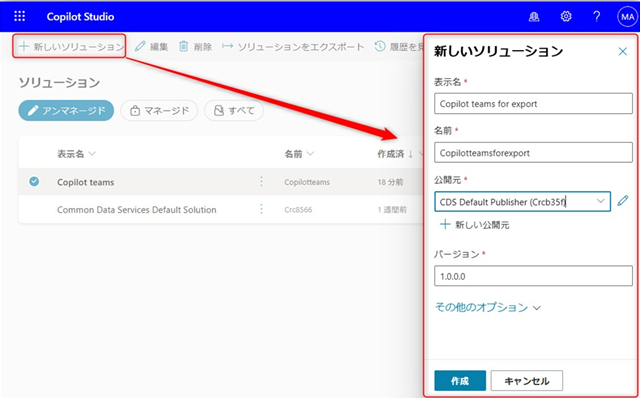 　
1. 「既存を追加」からエージェントをソリューションに追加します。  
   必要に応じて同様の手順でクラウドフローもソリューションに追加し、一緒にご提供ください。
   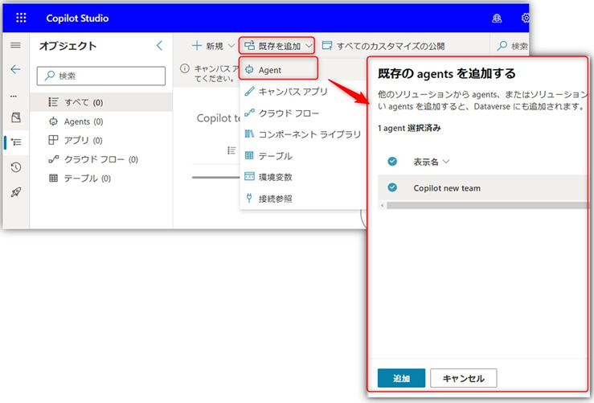 　
1. ソリューション一覧画面に戻り、作成したソリューションをエクスポートします。設定値は任意で構いません。
   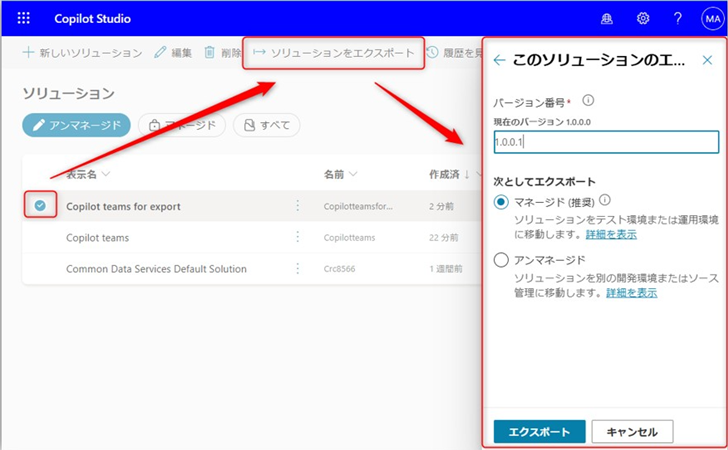 　

## 13. Web ブラウザのネットワーク トレース・コンソール ログ
  カスタム Copilot 編集中、あるいは実行中に Copilot Studio サービスへ送信する HTTP リクエストや Copilot Studio サービスから受信する HTTP レスポンスの内容を確認することで通信上の問題を特定します。  

 > [!IMPORTANT]
 > 事象発生の事前に取得開始し、事象発生後に採取を行う必要がございます。 

 > [!NOTE]
 > 事象の内容により、netsh trace コマンドやサードパーティ製のツール「Fiddler」によるネットワーク キャプチャの取得をお願いする場合があります。  

### ブラウザネットワークトレース
  ご取得方法は以下公開情報をご参照ください。  
  [ブラウザーでネットワーク トレースを収集する (ブラウザーベースのアプリのみ)](https://learn.microsoft.com/ja-jp/azure/azure-web-pubsub/howto-troubleshoot-network-trace#collect-a-network-trace-in-the-browser-browser-based-apps-only)

  > [!IMPORTANT]
  > ご取得の際は「ログの保持」「キャッシュを無効にする」にチェックを有効にしご取得ください。  
  > 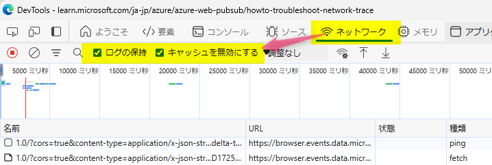 　

###  コンソールログ
  Console タブをクリックし、ログ領域を右クリックし **「名前を付けて保存」** にて保存いたします。  
  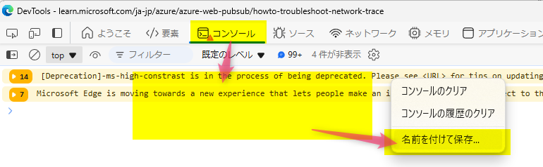　　

## 14. Teamsクライアントのネットワーク トレース、診断ログ
Teamsクライアントにおいてのみエラーや問題が発生する場合、Teamsクライアントのネットワーク トレースやTeams 診断ログ　より、発生している事象を調査します。 

1. Teams を起動し、「…」 > 「設定」 > 「プライバシー」 > 「拡張診断データ」 でトグルをオンにします
    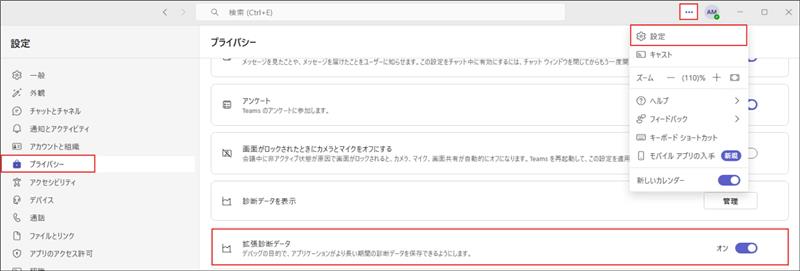　
1. ノートパットやメモ帳を使用し、{"core/devMenuEnabled": true} の記入後、"configuration.json" のファイル名にて保存します 
※ 拡張子が .json となっていることをご確認ください 
    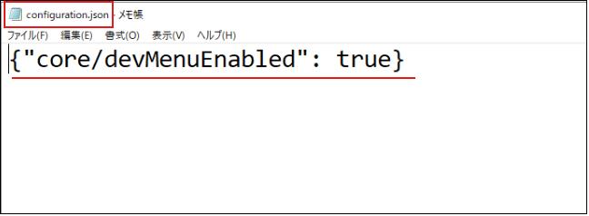　
1. 2. で作成した 「configuration.json」 を以下パスのフィルダーに保存します 
パス : %localappdata%\Packages\MSTeams_8wekyb3d8bbwe\LocalCache\Microsoft\MSTeams 
    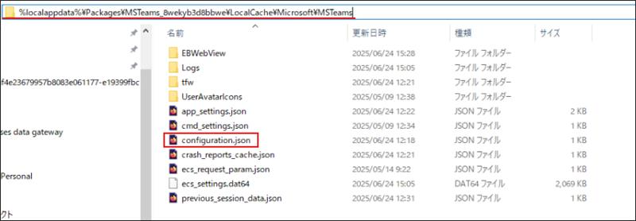　
1. Teams をサインアウトし、一度閉じます
1. 再度 Teams を起動し、以下の順で 「開発者ツール」 を起動します 
Windows のタスクバーにある 「隠れているインジケータを表示します」 > 「Teams アイコン」 の右クリック >「Engineering Tools」 > 「Open DevTools (Main Window)」 
    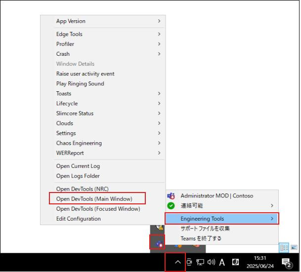　
1. 「Network」 タブを選択し、「Preserve log」 「Disable cache」 にチェックします
    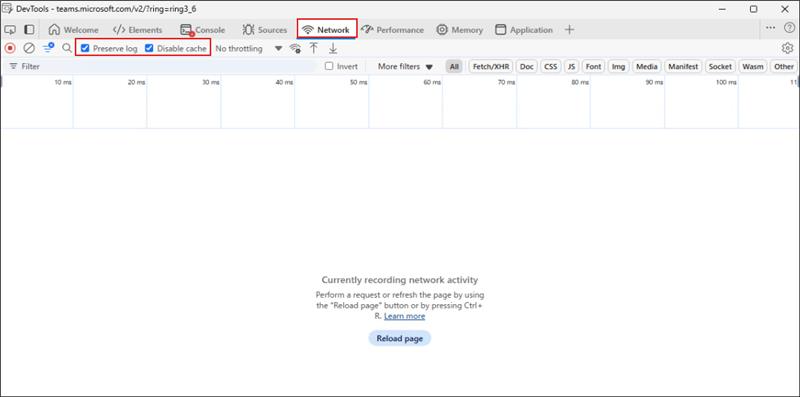　
1. Teams で事象が発生するように操作します 
※ 操作をすると以下のようにログが記録されます 
    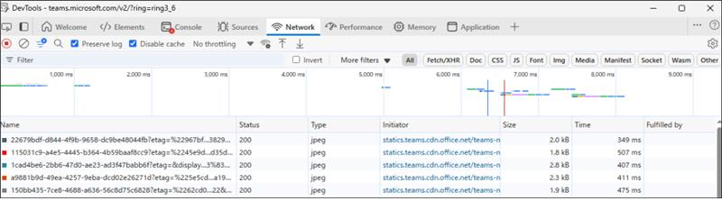　
1. 事象の再現が終わりましたら 「Export HAR」 にてファイルをダウンロードします
    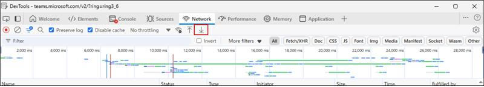　
1. Teams に戻り、「Ctrl+Alt+Shift + 1 (数字) キー」 を同時に押下し、Microsoft Teams 診断ログがダウンロードされることを確認します 
※ ダウンロードが開始されると、以下のようなメッセージが表示されます 
    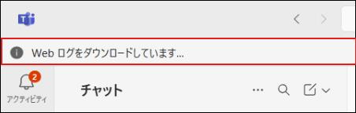　
1. 「ダウンロード」 フォルダーに 「PROD-WebLogs ….zip」「MSTeams Support Logs …フォルダー」 が生成されていることを確認します 
    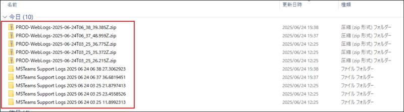　
1. 8. で取得したHARファイルと、10. で取得した「PROD-WebLogs ….zip」 および 「MSTeams Support Logs … フォルダー」 を圧縮した .zip ファイル　のご提供をお願いします

---

## 補足

本手順は執筆時点でのユーザー インターフェイスを基に紹介しています。バージョンアップによって若干の UI の遷移など異なる場合があります。その場合は画面の指示に従って進めてください。  

