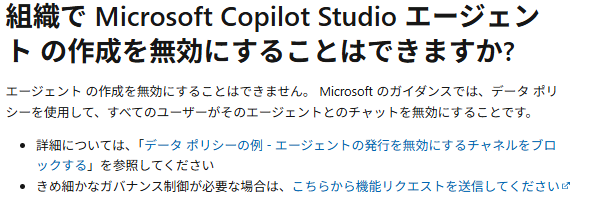

こんにちは。Power Platform サポートチームの 網野 です。
今回は Copilot Studio でエージェントを作成できるユーザーに必要な権限についてご紹介します。

<!-- more -->
## はじめに
Copilot Studioでエージェントを作成できるユーザーに、どのような権限が必要なのかを解説します。

ご留意点として、Copilot Studio は 2025 年 9 月現在、早いスピードで日々機能開発が進んでいます。そのため、実際にご利用いただく際は必ず最新の公開情報を参照していただけますようお願い申し上げます。

## Copilot Studioでエージェント作成に必要な権限とは？
Copilot Studio でエージェントを作成するには、ユーザーに [Copilot Studio へのアクセス権](https://learn.microsoft.com/en-us/microsoft-copilot-studio/billing-licensing#copilot-studio-use-rights-included-with-microsoft-365-copilot-license)と、対象環境でリソースを作成するための[セキュリティロール](https://learn.microsoft.com/ja-jp/microsoft-copilot-studio/admin-share-bots?tabs=web#assign-environment-security-roles)が割り当てられている必要があります。  
この2つの権限が揃っていないと、エージェントの作成や管理ができません。

### Copilot Studio へのアクセス権
Copilot Studio ポータルにアクセスするためには、ユーザーに以下のいずれかのライセンスまたはロールが必要です。  
※以下のいずれかに該当するとアクセスできるようになります。

* Copilot Studio ユーザーライセンス
* Copilot Studio 試用版ライセンス
* Microsoft 365 Copilot ライセンス
* Power Platform 管理センター テナント設定の「Copilot Studio 作成者」ロール（※）
> ※ 重量課金のみのライセンスでエージェントを作成する際に必要なロールです。
> 詳細は[アクセス権の詳細](#アクセス権の詳細)で説明します。

### 対象環境でリソースを作成するためのセキュリティロール
エージェントを作成するためには、エージェントを作成する環境に対してセキュリティロールが必要となります。  
リソースを作成するために必要なセキュリティロールは以下になります。

* 環境作成者
* システムカスタマイザー
* システム管理者

>※ 詳細は公開情報を参照ください。
> https://learn.microsoft.com/ja-jp/power-apps/maker/canvas-apps/sign-in-to-power-apps#filter-environments-by-role

## アクセス権の詳細

### Copilot Studio ユーザーライセンス
Copilot Studio メッセージパックに含まれるライセンスで、[Microsoft 365 管理センター等から付与](https://learn.microsoft.com/ja-jp/microsoft-copilot-studio/requirements-licensing?tabs=web#assign-licenses-to-users
)することができます。  
Copilot Studio の使用権が含まれています。

### Copilot Studio 試用版ライセンス
[ユーザーがセルフサービスサインアップで取得できる](https://learn.microsoft.com/ja-jp/microsoft-copilot-studio/sign-up-individual)期間限定のライセンスです。  
有償ライセンスを購入いただく前のお試し用として、Copilot Studio ユーザーライセンスと同じ機能が利用できます。

### Microsoft 365 Copilot ライセンス
Copilot Studio を通じて [Microsoft 365 Copilot](https://learn.microsoft.com/ja-jp/copilot/microsoft-365/microsoft-365-copilot-overview) を拡張することができるため、Microsoft 365 Copilot ライセンスを持つユーザーは Copilot Studio を利用することができます。  

[Microsoft 365 管理センター等から付与](https://learn.microsoft.com/ja-jp/copilot/microsoft-365/microsoft-365-copilot-setup#step-2---provision-microsoft-365-copilot-licenses)することができます。　  
Copilot Studio だけなく、Microsoft 365 Copilot の使用権が含まれています。

> [!IMPORTANT]
> Copilot Studio にアクセスさせるためには、「Copilot Studio in Copilot for M365」サービスを有効にする必要があります。

### Power Platform 管理センター テナント設定の「Copilot Studio 作成者」ロール
従量課金環境のみを利用して Copilot Studio を利用するユーザー向けに用意された機能が「Copilot Studio 作成者」機能です。  
他のユーザーに付与するライセンスと異なり、ユーザーごとにライセンスを付与する必要はありません。  
Copilot Studio でエージェントを作成したいユーザーをセキュリティグループに追加し、Copilot Studio へのアクセスを許可します。

作成手順
1. Azure ポータルでセキュリティグループを作成します。
1. Copilot Studio へのアクセスを許可したいユーザーをセキュリティグループに追加します。

1. [Power Platform 管理センターのテナント設定](https://admin.powerplatform.microsoft.com/manage/tenantsettings)を開きます。
1. 「Copilot Studio 作成者」を選択し、作成したセキュリティグループを設定します。

## よくある質問
### テナント設定の「Copilot Studio 作成者」に設定したセキュリティグループに属さないユーザーは、Copilot Studio にアクセスできないようになりますか。
いいえ、「Copilot Studio 作成者」に設定したセキュリティグループに属さないユーザーも、ユーザーライセンスを持っていれば Copilot Studio にアクセスできます。

### Copilot Studio にアクセスできないユーザーは Copilot Studio で作成したエージェントを利用することができますか
はい、利用できます。エージェントの利用者は、Copilot Studio にアクセスできる必要はありません。  
ただし、Teams やカスタム Web サイトなど、エージェントを公開した場所にアクセスできる必要がございます。  
https://learn.microsoft.com/ja-jp/microsoft-copilot-studio/requirements-licensing?tabs=web

### 環境ごとにエージェントの作成を制限することはできますか
現時点では、エージェントの作成を制御するための機能はありません。
https://learn.microsoft.com/ja-jp/microsoft-copilot-studio/security-faq#can-i-disable-microsoft-copilot-studio-agent-creation-in-my-organization

ただし、既定環境以外の環境では、 [対象環境でリソースを作成するためのセキュリティロール]を付与しないことで、環境へのアクセスを制御することが可能です。

> [!NOTE]
>※ 既定環境では、「環境作成者」ロールが自動付与されるため、アクセスを制御することはできません。

