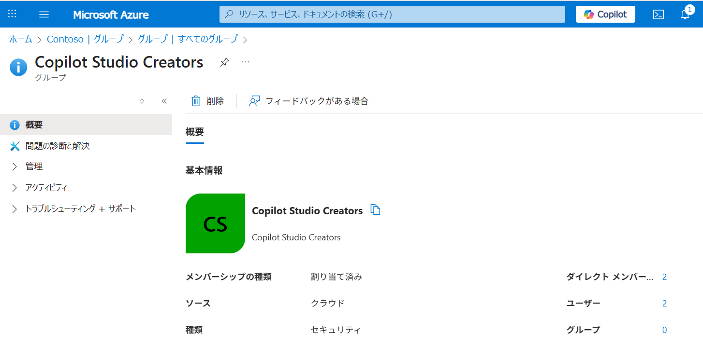
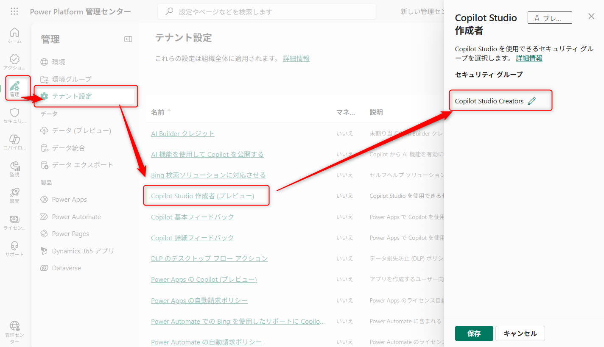

こんにちは。Power Platform サポートチームの 網野 です。
今回は Copilot Studio でエージェントを作成できるユーザーを制御する方法をご案内します。

<!-- more -->

## はじめに
本記事では Copilot Studio でエージェントを作成できるユーザーを制御する方法をご案内致します。

ご留意点として、Copilot Studio は 2025 年 8 月現在、早いスピードで日々機能開発が進んでいます。そのため、実際のご利用いただく際は必ず最新の公開情報を参照していただけますようお願い申し上げます。

## 作成を制御する方法
エージェントの作成を制御するためには、[Copilot Studio へのアクセス権](https://learn.microsoft.com/en-us/microsoft-copilot-studio/billing-licensing#copilot-studio-use-rights-included-with-microsoft-365-copilot-license)と、エージェントを作成する環境への[セキュリティロール](https://learn.microsoft.com/ja-jp/microsoft-copilot-studio/admin-share-bots?tabs=web#assign-environment-security-roles)が必要です。

### アクセス権
Copilot Studio ポータルにアクセスするためには、以下のいずれかが必要です。  
※以下のいずれかに該当するとアクセスできるようになります。

* Copilot Studio ユーザーライセンス
* Copilot Studio 試用版ライセンス
* Microsoft 365 Copilot ライセンス
* Power Platform 管理センター テナント設定の「Copilot Studio 作成者」

### セキュリティロール
エージェントを作成するためには、エージェントを作成する環境に対してセキュリティロールが必要となります。  
ご要件に合わせてユーザーにセキュリティロールを付与してください。

例）
* 環境作成者　・・　作成したエージェントまたは共有されたエージェントにアクセスできます
* システムカスタマイザー　・・　環境内のエージェントにアクセスできます
* システム管理者　・・　環境内のエージェントにアクセスできます

## アクセス権の詳細

### Copilot Studio ユーザーライセンス
Copilot Studio メッセージパックに含まれるライセンスで、[Microsoft 365 管理センター等から付与](https://learn.microsoft.com/ja-jp/microsoft-copilot-studio/requirements-licensing?tabs=web#assign-licenses-to-users
)することができます。  
Copilot Studio の使用権が含まれています。

### Copilot Studio 試用版ライセンス
[ユーザーがセルフサービスサインアップで取得できる](https://learn.microsoft.com/ja-jp/microsoft-copilot-studio/sign-up-individual)期間限定のライセンスです。  
有償ライセンスを購入いただく前のお試し用として、Copilot Studio ユーザーライセンスと同じ機能が利用できます。

### Microsoft 365 Copilot ライセンス
Copilot Studio を通じて [Microsoft 365 Copilot](https://learn.microsoft.com/ja-jp/copilot/microsoft-365/microsoft-365-copilot-overview) を拡張することができるため、Microsoft 365 Copilot ライセンスを持つユーザーは Copilot Studio を利用することができます。  

[Microsoft 365 管理センター等から付与](https://learn.microsoft.com/ja-jp/copilot/microsoft-365/microsoft-365-copilot-setup#step-2---provision-microsoft-365-copilot-licenses)することができます。　  
Copilot Studio だけなく、Microsoft 365 Copilot の使用権が含まれています。

> [!IMPORTANT]
> Copilot Studio にアクセスさせるためには、「Copilot Studio in Copilot for Microsoft 365」サービスを有効にする必要があります。

### Power Platform 管理センター テナント設定の「Copilot Studio 作成者」
従量課金環境のみを利用して Copilot Studio を利用するユーザー様向けに用意された機能が「Copilot Studio 作成者」機能です。  
他のユーザーに付与するライセンスと異なり、ユーザーごとにライセンスを付与する必要はありません。  
Copilot Studio でエージェントを作成したいユーザーをセキュリティグループに追加し、Copilot Studio へのアクセスを許可します。

作成手順
1. Azure ポータルでセキュリティグループを作成します。
1. Copilot Studio へのアクセスを許可したいユーザーをセキュリティグループに追加します。

1. [Power Platform 管理センターのテナント設定](https://admin.powerplatform.microsoft.com/manage/tenantsettings)を開きます。
1. 「Copilot Studio 作成者」を選択し、作成したセキュリティグループを設定します。

## よくある質問
### テナント設定の「Copilot Studio 作成者」に設定したセキュリティグループに属さないユーザーは、Copilot Studio にアクセスできないようになりますか。
いいえ、「Copilot Studio 作成者」に設定したセキュリティグループに属さないユーザーも、ユーザーライセンスを持っていれば Copilot Studio にアクセスできます。

### Copilot Studio にアクセスできないユーザーは Copilot Studio で作成したエージェントを利用することができますか
はい、利用できます。エージェントの利用者は、Copilot Studio にアクセスできる必要はありません。  
ただし、Teams やカスタム Web サイトなど、エージェントを公開した場所にアクセスできる必要がございます。  
https://learn.microsoft.com/ja-jp/microsoft-copilot-studio/requirements-licensing?tabs=web

### 環境ごとにエージェントの作成を制限することはできますか
はい、エージェントを作成させたい環境にのみセキュリティロールを付与することで、環境ごとにエージェントの作成を制限することができます。

