こんにちは、Power Platform サポートチームの網野です。  
Copilot Studio にて作成されたエージェントは Dataverse または Dataverse for Teams に保存されます。本記事では Dataverse および Dataverse for Teams からエージェントを一覧を取得する方法と Power Platform 管理センターのレポートからエージェントの一覧を確認する方法をご案内いたします。

<!-- more -->
## 概要
Copilot Studio は 2 つのルートでエージェントを作成することができます。
1. [Copilot Studio ポータル](https://learn.microsoft.com/ja-jp/microsoft-copilot-studio/requirements-licensing-subscriptions#standalone-copilot-studio-subscription)
1. [Teams アプリの Copilot Studio](https://learn.microsoft.com/ja-jp/microsoft-copilot-studio/requirements-licensing-subscriptions#copilot-studio-for-microsoft-teams-plans)

Copilot Studio ポータルから作成したエージェントは Dataverse に保存されます。  
Teams アプリの Copilot Studio から作成したエージェントは Dataverse for Teams に保存されます。Dataverse/Dataverse for Teams に格納されているデータは本記事に記載する方法で取得・確認することができます。

なお、[Agent Builder](https://learn.microsoft.com/ja-jp/microsoft-365-copilot/extensibility/copilot-studio-agent-builder) を利用して作成したエージェントは Cosmos DB に保存されますので、本記事の方法では取得することができません。

## 前提
テナント内のエージェント一覧を取得するためには、取得する環境の Copilots テーブルに対して、組織レベルの読み取り権限が必要となります。  

## 特定の環境のエージェントを一覧にする方法
### 詳細検索を利用する方法 (Dataverse のみ)
1. [Power Apps ポータル](https://make.powerapps.com/) に接続し、エージェントを取得する環境を選択します。
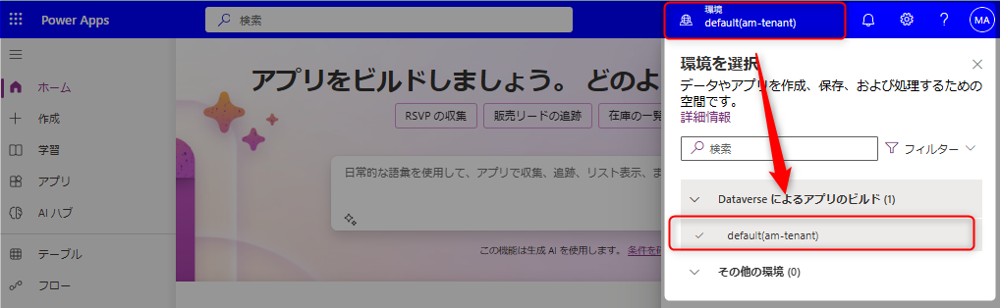

1. 右上のギアアイコンより、[詳細設定] を選択します。  
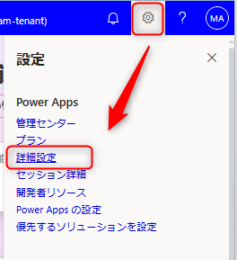
1. 表示された Dynamics 365 画面右上のフィルタアイコンを選択します。  

1. 「高度な検索」画面が開いたら以下の操作を行います。
   * 検索対象テーブルに「Copilots/コパイロット」を選択します。
   * 必要に応じて、「列の編集/Edit Columns」から表示する列を編集します。
   * 「結果/Results」を押します。  
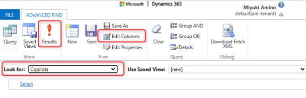
1. エージェント一覧が表示されます。表示された検索結果をExcel にエクスポートが可能です。  
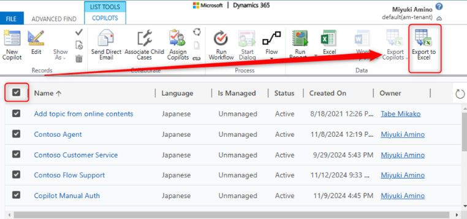
1. エクスポートした Excel を開くと、エージェント名 (Name列) と所有者 (Owner) を確認することができます。  
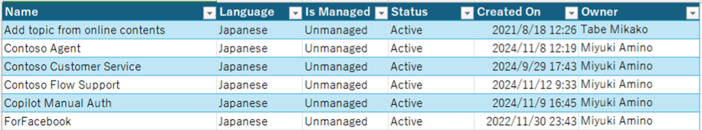
1. 手順4の画面で所有者のメールアドレスを追加しますと、エクスポート時にメールアドレスを一緒に出力することができます。  
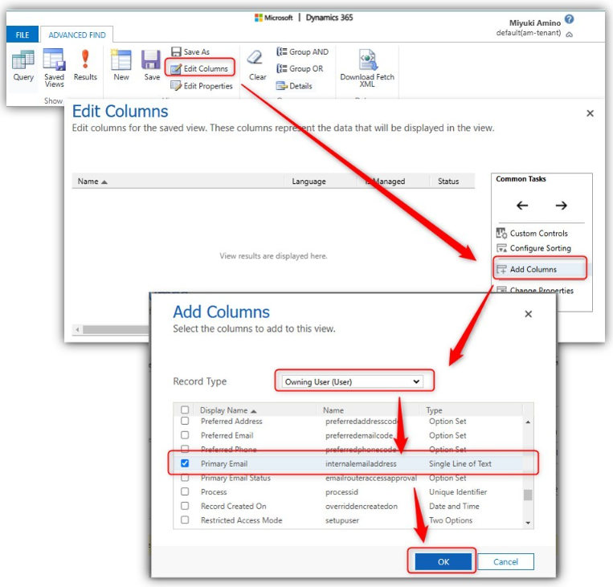

### Dataverse コネクタを利用する方法
Dataverse コネクタを利用し Copilots(bot) テーブルからエージェント情報を取得します。  

#### フロー全体図

#### フロー詳細
1. 任意のトリガーを設定します  
1. Dataverse コネクタ「選択した環境の行を一覧表示する」アクションを設定します。  
   * 環境：（任意）
   * テーブル名：Copilots
   * 列を選択する：（表示したい列をカンマ区切りで記載）  
     取得可能な列は [Copilot (bot) table/entity reference](https://learn.microsoft.com/en-us/power-apps/developer/data-platform/reference/entities/bot) を参照してください。
   * クエリの展開：（任意）  
      サンプルではエージェント作成者＝CreatedBy の姓名とメールアドレスを取得しています。  
      値：createdby($select=internalemailaddress,lastname,firstname)  
   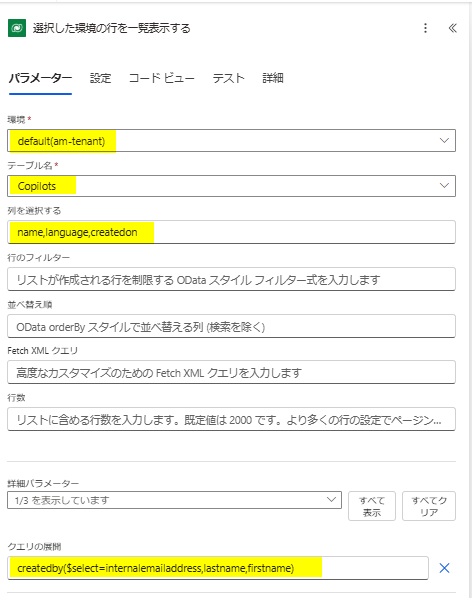
1. ここで一度フローを実行し、実行履歴から「選択した環境の行を一覧表示する」アクションの body をコピーします。  
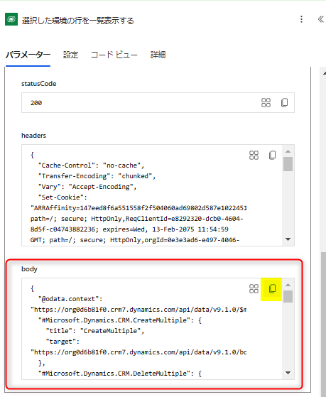
1. 「JSON の解析」アクションを設定します。  
   * Content：動的コンテンツ「選択した環境の行を一覧表示する」の本文
   * Shema：以下の手順で作成します。
     1. 「サンプルペイロードを使用してスキーマを生成する」を選択します。
     1. 一つ前の手順で取得した実行履歴の body の値を貼り付けます。
     1. 「完了」を押します。  
     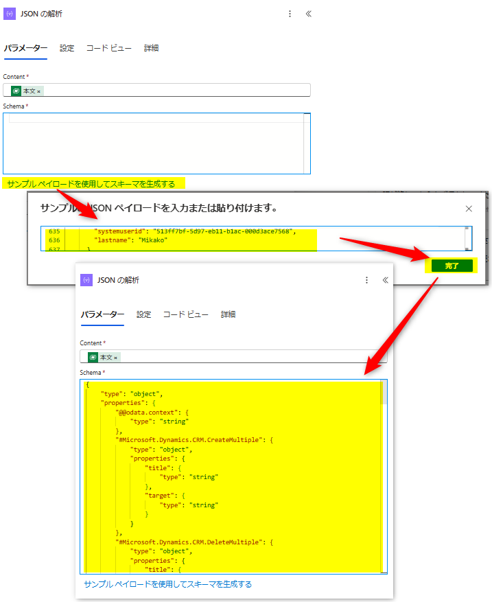
     1. 以下のように表示されていることを確認してください。  
     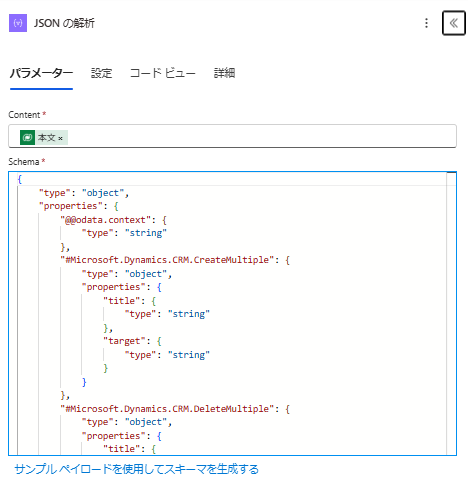 
1. 「CSV テーブルの作成」アクションを設定します。  
   * From ：動的コンテンツ「JSON の解析」の Body value
   * Columns： カスタム
   * Columns Header： （CSV ヘッダーとして使用する任意の文字列）
   * Columns Value：（動的コンテンツ「JSON の解析」の任意の項目）  
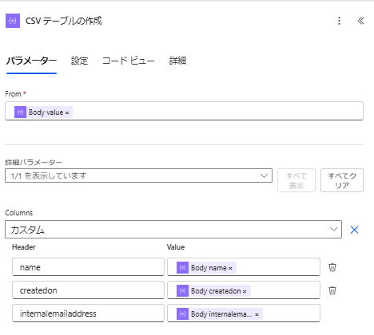
1. 任意のコネクタを利用し CSV ファイルを作成します。  
   サンプルでは OneDrive for Business コネクタの「ファイルの作成」アクションを利用して CSV ファイルを作成します。  
   * フォルダーのパス：（任意）
   * ファイル名：（任意）
   * ファイルコンテンツ：concat(decodeUriComponent('%EF%BB%BF'), body('CSV_テーブルの作成'))
     日本語が文字化けしないように、ファイルコンテンツの先頭に BOM=decodeUriComponent('%EF%BB%BF') を追加します。  
     ※BOM とは文字コードが UTF-8 であることを示すものです。  
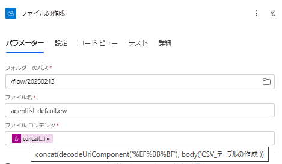

これでフローの作成は完了です。

#### フロー実行結果
フローを実行すると指定したフォルダに CSV が出力されます。  
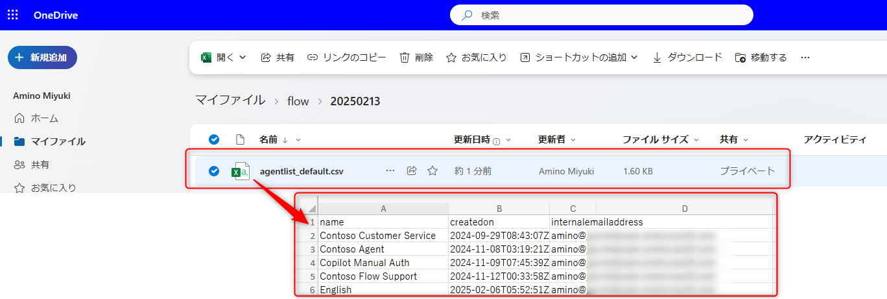

## テナント内の環境のエージェントを一覧にする方法
### Power Platform 管理センターで用意されたレポートを利用する方法
[Power Platform 管理センター](https://admin.powerplatform.microsoft.com) の [管理] > [Copilot Studio] の画面よりご確認いただくことができます。
この方法の詳細については、下記の公開情報をご参照ください。  
[Power Platform インベントリ (プレビュー)](https://learn.microsoft.com/ja-jp/power-platform/admin/power-platform-inventory)  

### CoE を利用する方法 (Dataverse のみ)
[CoE Starter kit](https://learn.microsoft.com/ja-jp/power-platform/guidance/coe/starter-kit) を環境にインストールすることで、Datavese に作成されたエージェントの一覧を確認することができます。  
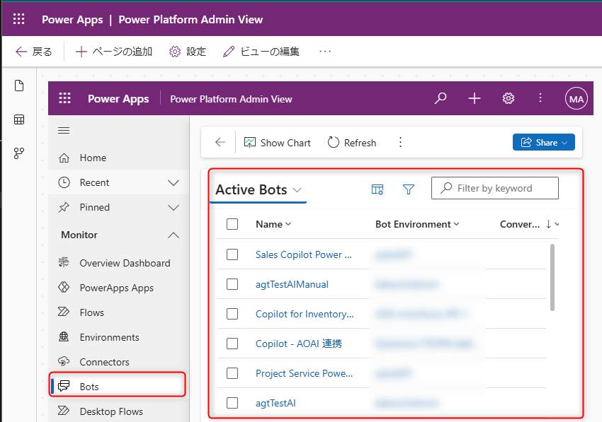  

Dataverse for Teams 環境の Copilot につきましては 2025 年 2 月時点で CoE Starter Kit から確認することはサポートされていません。  
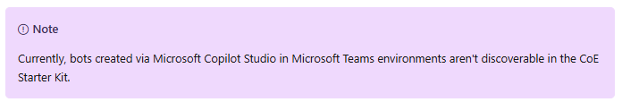  

なお、 CoE Starter Kit は有志が作成するツールとなりますのでご不明点等ございましたら、[GitHub](https://aka.ms/coe-starter-kit-issues) へお問い合わせください。  
関連リンク：[CoE Starter Kit に関するフィードバックとサポート](https://learn.microsoft.com/ja-jp/power-platform/guidance/coe/feedback-support)

### Dataverse コネクタを利用する方法
上述のDataverse コネクタを利用する方法にて特定環境のエージェント一覧を取得する方法をご案内しました。その方法を全ての環境に対して行うことでテナント内の環境のエージェント一覧を取得することができます。  
具体的には「環境一覧を管理者として作成する」アクションを利用して取得した、取得した環境ごとに CSV を出力することで、 Copilot 情報を取得します。

### フロー全体図
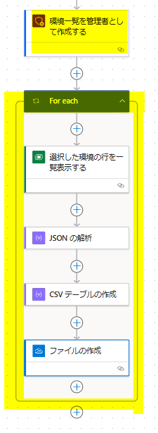

#### 前作業
全ての環境の Copilots テーブルにアクセスするために、自分自身を環境の管理者として追加します。  
具体的な手順は [PowerShell による自己昇格](https://learn.microsoft.com/ja-jp/power-platform/admin/manage-high-privileged-admin-roles#self-elevate-through-powershell) を参照してください。  

### フロー詳細
1. 管理者向け Power Platform コネクタの「環境一覧を管理者として作成する」アクションを追加します。
1. 「選択した環境の行を一覧表示する」アクションの「環境」を動的コンテンツ「リンクされたメタデータ インスタンス API の URL」に変更します。  
  環境：@item()?['properties/linkedEnvironmentMetadata/instanceApiUrl']  
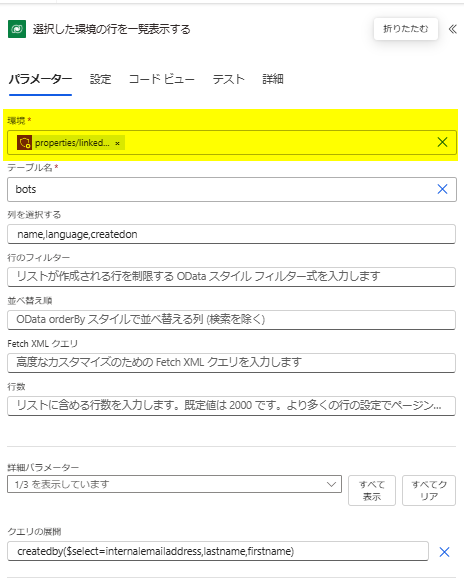
1. 「選択した環境の行を一覧表示する」アクションが 「For each」 コントロールで囲まれることを確認し、後続のアクションもすべて 「For each」 コントール内に追加します。  
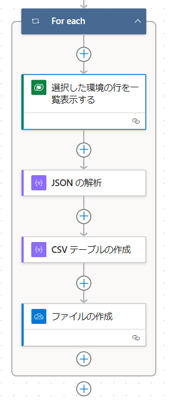
1. 「ファイルの作成」アクションのファイル名に動的コンテンツ「リンクされたメタデータ フレンドリ名」を追加します。　　
   サンプルでは、フレンドリ名（＝環境名）を追加することで、環境ごとにファイルを作成し、他の環境のデータが上書きされる事を防ぎます。運用に合わせて任意の項目を設定してください。  
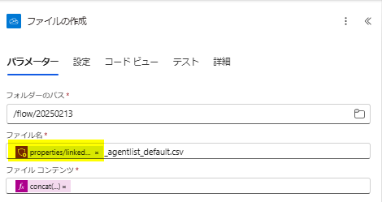

#### フロー実行結果  
フローを実行すると指定したフォルダに環境ごとの CSV が出力されます。  
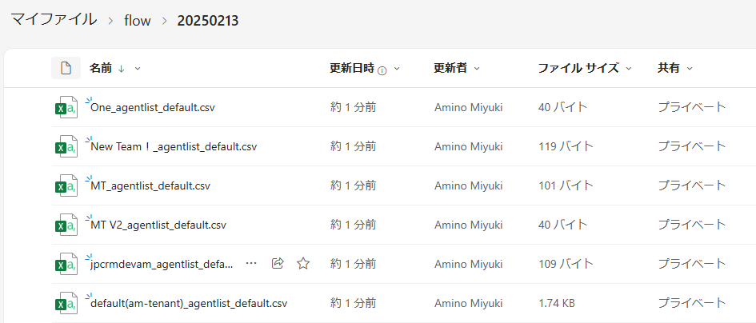

## よくある質問
### Microsoft 365 Copilot を拡張した Copilot の情報が取得できますか
はい、取得できます。  
Copilot Studio から Copilot for Microsoft 365 を選択して作成した Copilot は Dataverse に保存されます。そのため、本手順でご案内した方法で取得することができます。

