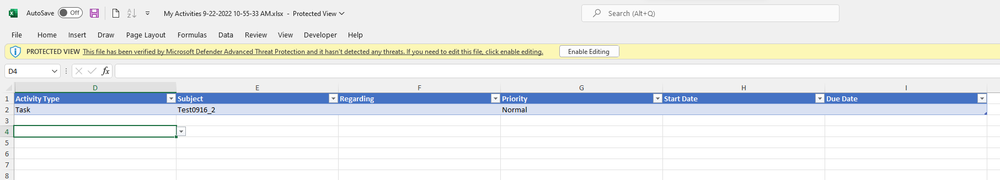
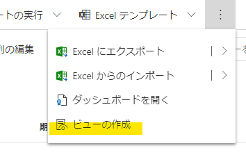
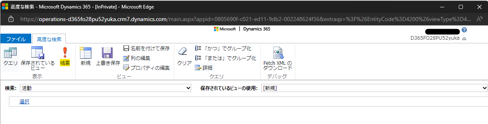
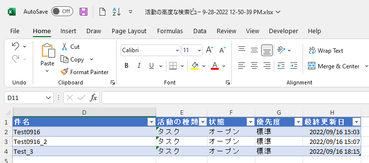
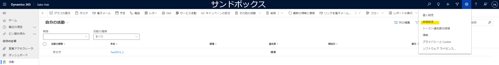
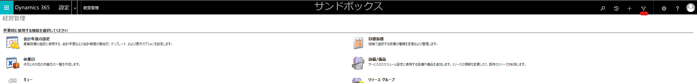
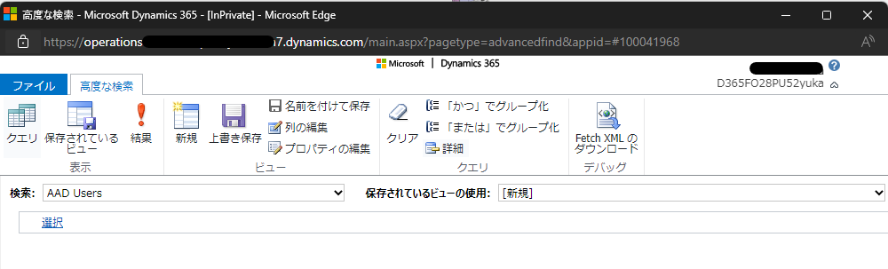

こんにちは、Dynamics 365 Customer Engagement サポートの木村です。  
本ブログでは、Excel エクスポート時の列幅が規定値で出力される件についてご説明いたします。

<!-- more -->
## 目次

1. [はじめに](#anchor-intro)
2. [Excel エクスポート時の列幅が規定値で出力される件について](#anchor-excelexport-widhtherror)
2. [今後の修正予定について](#anchor-futurefix)
3. [おわりに](#anchor-finish)

---

## はじめに

2022 年 6 月 11 日 (土) に日本環境に適用したアップデートが原因で、Excel エクスポート時の列幅が規定値で出力される事象が発生しております。
こちらの事象の詳細と今後の修正予定につきまして、当ブログにてご説明いたします。

---

## Excel エクスポート時の列幅が規定値で出力される件について

アップデート内容と致しましては、「列の編集」でビューに列を追加した際、その追加した列も出力した Excel に表示されるよう動作変更が行われました。  
上記機能追加に伴い、追加リグレッションが発生していることから、ビューから出力されたファイルの表示幅が規定値 (294 ピクセル) になるという不具合が発生しております。  
  

また、高度な検索から出力した場合には、ビューの列幅設定が反映されることを確認しております。
* 高度な検索にて Excel を出力する方法
1. 対象の画面の上部にある […] を押下し、 [ビューの作成] を開く  
 
2. [結果] を押下する  
 
3. 全ての行を選択し、 [Excel にエクスポート] を押下する  
 
4. Excel ファイルが出力される  
 

※下記公開資料に記載のある「最新の高度な検索」が ON になっている場合  
[最新の高度な検索が既定でオンになっている](https://learn.microsoft.com/ja-jp/power-platform-release-plan/2022wave2/power-apps/modern-advanced-find-turned-default)
1. 画面上部にある [歯車] を押下し、[詳細設定]を押下する
 
2. 画面上部にある、 [ろうと]を押下し、高度な検索画面を開く
 
 
それ以降の手順は上記 No.2 以降と同様になります。

---

## 今後の修正予定について
2022 年 10 月 3 日 (月) 現在
修正方法については、検討段階であるため決定事項ではございませんが、修正には少なくとも 2 週間ほど見積もっており、その他の修正も併せて日本リージョンへの展開まで 1 か月以上先になる見込みでございます

## おわりに

こちらのブログでは現在弊社にて確認されている Excel エクスポート時の列幅が規定値で出力される件についてご案内いたしました。
今後の修正予定につきましては、更新がございましたら「今後の修正予定について」の内容を更新いたします。
ご不便をいたしますが、修正完了および展開について今しばらくお待ちくださいませ。
