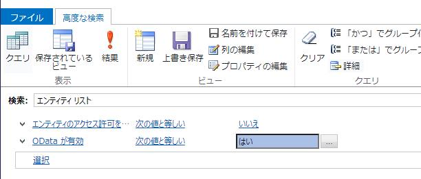

こんにちは。Power Platform サポート チームの 王 です。
先日公開された Power Apps Portal で意図せず外部からデータが参照されてしまう問題についてご案内させていただきます。

<!-- more -->

## 初めに

Power Apps Portal において、利用者によって正しく設定が行われていない場合に、意図せず内部の情報が匿名ユーザーから取得できてしまう問題が、外部セキュリティ機関の UpGuard により米国時間2021年8月23日に[発表](https://www.upguard.com/breaches/power-apps)されました。  
この問題について、自身がご利用されている環境がこの問題に該当しているか確認する方法および該当している場合の対処方法についてご案内いたします。

## 影響範囲について

この問題は Power Apps Portal のみ影響を受けるものです。  
Power Apps Portal は既定で構成されないため、ご利用されていない場合は対象となる設定自体が存在せず、本件について対処の必要はございません。  
同様に、その他の Power Apps における キャンバスアプリ や モデル駆動型アプリ なども本件の対象外です。

## 発表された問題について

今回指摘された問題は以下２つの設定によって発生いたします。  
・リストのアクセス制御有効化の設定  
　リストレコードの "全般" タブにて設定できる [**エンティティのアクセス許可を有効にする**] の設定は、対象のリストにアクセスするユーザーに対してWeb ロールを使用した権限制御を有効化する設定です。こちらが無効の場合、匿名ユーザーがデータを表示することが可能となります。  
[リストをセキュリティで保護する](https://docs.microsoft.com/ja-jp/powerapps/maker/portals/configure/entity-lists#securing-lsists)

・リストのOData フィードの有効化状態  
　リストレコードの "OData フィード" タブにて設定できる [**有効**] の設定は、リストを API サービスとして外部に公開しデータ連携などの用途で利用するための設定です。設定が有効な場合、ユーザーは API を使用してデータの取得を要求することが可能です。  
[リストの OData フィード](https://docs.microsoft.com/en-us/powerapps/maker/portals/configure/entity-lists#list-odata-feeds)

[**エンティティのアクセス許可を有効にする**] の設定が無効化状態かつ、"OData フィード" タブの [**有効**] にチェックが入っている場合、匿名のユーザーが API を使用してポータルへアクセスすると、対象のリストのデータを取得することができてしまいます。

## ご利用の環境が上記問題に該当するか確認する方法について

・メッセージセンターにおける通知  
　上記条件に該当するリストの設定を行っているお客様に対し、Microsoft 365 管理センターのメッセージID MC277597 にて通知を行っています。  

・[ポータルチェッカーの実行](https://docs.microsoft.com/ja-jp/powerapps/maker/portals/admin/portal-checker)  
　Power Apps Portal 管理センターよりポータルチェッカーを実行することで、対象のポータルに構成されているリストのうち、条件に該当するものが存在するか確認することができます。  
　該当するリストが存在する場合、以下の様な警告とともに対象のリストのIDが表示されます。  

・高度な検索を使用した手動確認  
　手動で上記条件に該当するリストをご確認頂く場合、高度な検索を使用して以下の条件で検索いただくことで、該当のエンティティリストが存在しているかご確認いただくことが可能です。  

## 対処方法について

意図せずリストのデータが公開状態になっていた場合、対処を行う必要がございます。  
匿名ユーザーがアクセスできない様にするためには、以下いずれかの対処をご実施頂く必要がございます。  

・「エンティティのアクセス許可を有効にする」にチェックを入れてWeb ロールの設定を正しく構成する  
　有効な権限を保持していない匿名ユーザーに対するデータ表示を制限することが可能です。  
　Web ロールの設定内容についてはお客様運用に合わせてご検討ください。  

・OData フィードタブの「有効」からチェックを外す  
　API によるデータへのアクセスが不可能となります。  

また、本件に対する製品側の対処として、2021年8月15日以降に作成されたPower Apps ポータルでは、OData フィード機能を有効化した場合にはテーブル権限を無効にできないように動作変更が行われました。  

## 終わりに

一般サイトで案内されている内容については一部不適切な表記がされていたり、具体的にご自身の環境が対象となっているか判断が難しいかと存じますので、こちらの記事がご確認の参考になりましたら幸いです。  
その他ご不明点などがございましたら、弊社サポートまでお気軽にご相談ください。  

--