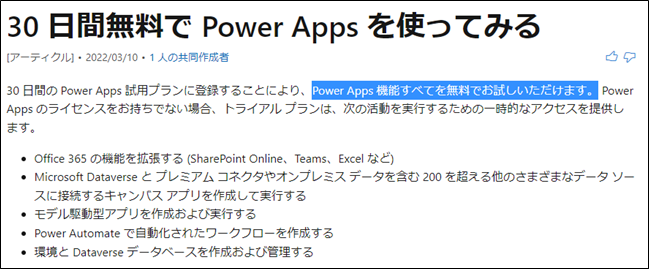
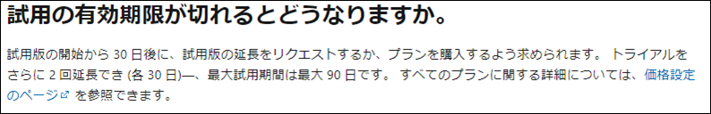
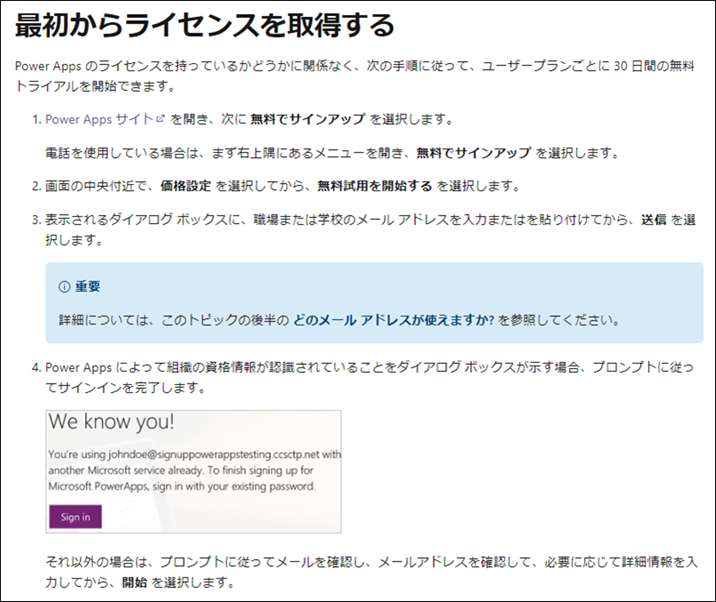
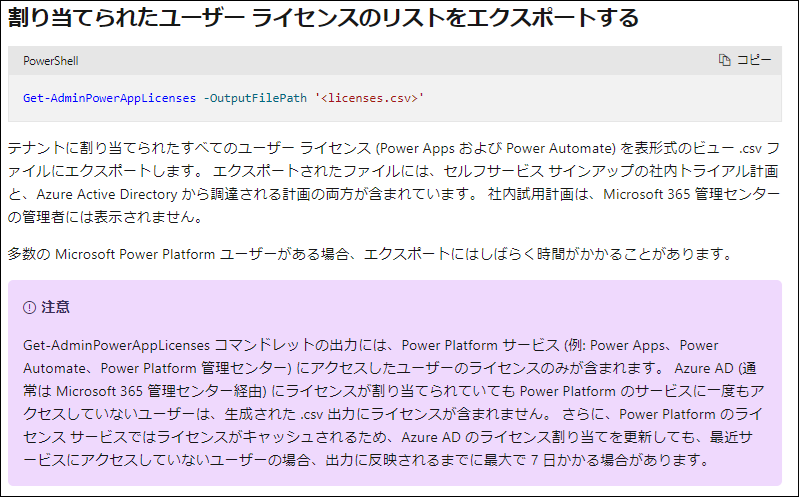
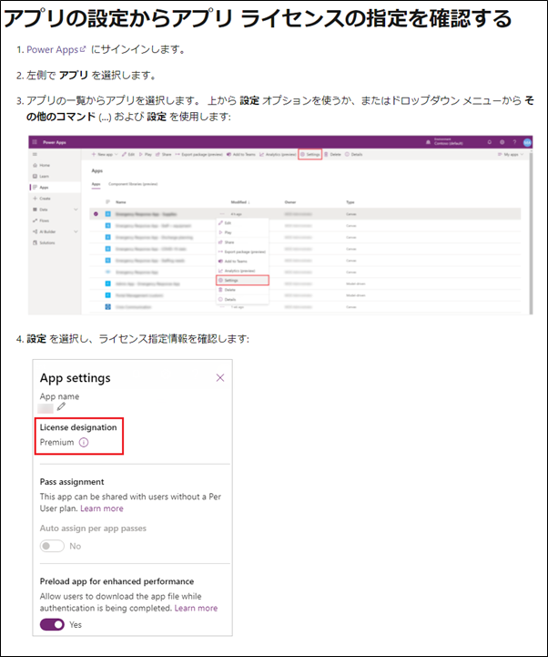
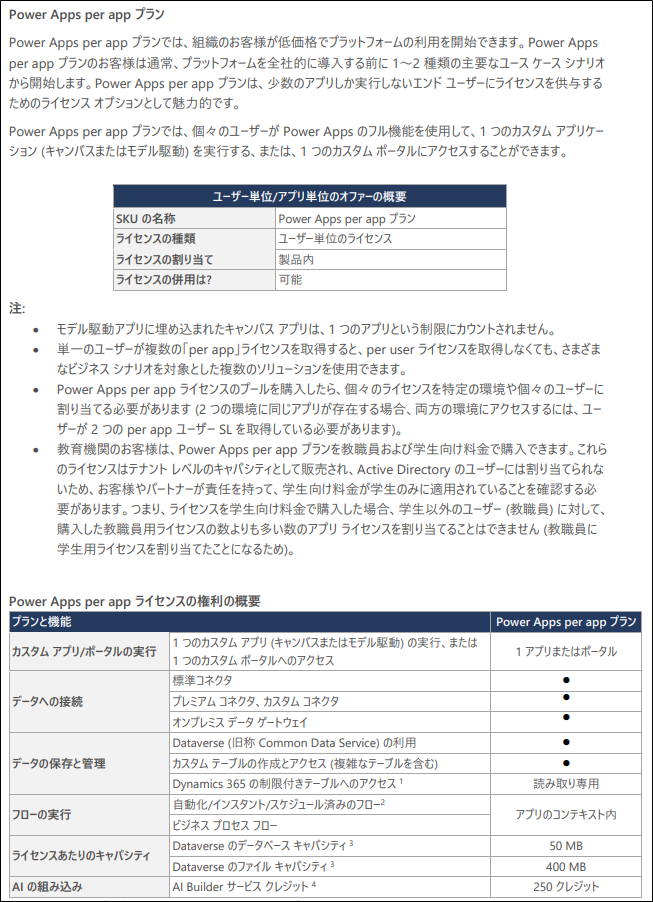
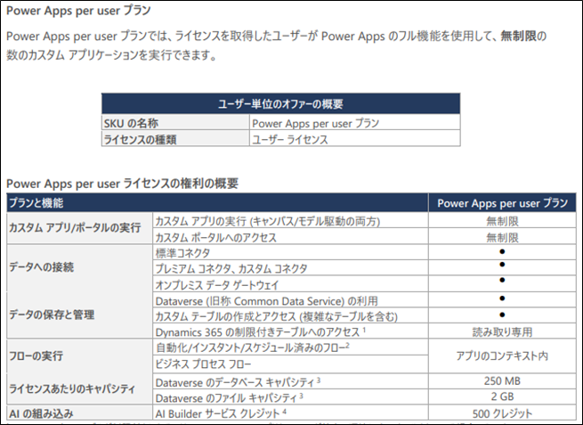

こんにちは、Power Platform サポートの山田です。<br/>
今回は、Power Appsの試用版ライセンスについて、下記項目の順にご説明いたします。  
＜試用版ライセンスの概要＞  
＜試用版ライセンスの種類について＞  
＜ライセンス利用状況の確認方法について＞  
＜Microsoft 365（Office 365）ライセンスとの機能の違い＞  
＜Power Apps有償ライセンスについて＞  

<!-- more --> 
## **＜試用版ライセンスの概要＞**  
試用版ライセンスでは、プレミアム機能（プレミアムコネクタやオンプレミスデータゲートウェイなど）を含むPower Appsの全ての機能をご利用いただけます。  
試用版ライセンスはユーザー毎に1回30日間のご利用が可能でございます。  
2回までの延長が可能でございますので、合計最大90日までご利用いただけます。  
その他詳細については下記公開情報をご参照ください。  
[Power Apps 30 日間の無料試用版](https://docs.microsoft.com/ja-jp/powerapps/maker/signup-for-powerapps)  
  
  
※上述の公開情報より抜粋      

## **＜試用版ライセンスの種類について＞**  
試用版ライセンスには、下記の2種類がございます。  
①Microsoft 365 管理センター上でご確認いただけるライセンス  
②Microsoft 365 管理センター上でご確認いただけないライセンス  
  
**①Microsoft 365 管理センター上でご確認いただけるライセンス**  
下記公開情報に記載の方法にて、Microsoft 365 管理センター上にてご確認いただける試用版ライセンスがご取得いただけます。  
対象ユーザーに付与いただいたタイミングがそのユーザーにおける開始時期となります。  
[最初からライセンスを取得する](https://docs.microsoft.com/ja-jp/powerapps/maker/signup-for-powerapps#get-a-license-from-scratch)  
  
※上述の公開情報より抜粋    
  
**②Microsoft 365 管理センター上でご確認いただけないライセンス**   
Power Appsが有効なライセンスが付与されていない状態で、任意のアプリを実行しようとすると下図のメッセージが表示されます。  
「試用版の開始」よりサインインし、試用版ライセンスのセットアップ手続きを行います。    
管理センター上に表示されない試用版ライセンスが対象ユーザーにおいて取得され、利用開始となります。  
   
   
　  
　  
## **＜ライセンス利用状況の確認方法について＞**  
管理センター上に表示されない試用版ライセンスは、下記のPowerShellでのPower Apps管理コマンドをご利用いただくことでご確認いただけます。  
Power Apps管理コマンドをご実行いただくとライセンス利用状況のCSVファイルをご取得いただけます。  
  
ただし、コマンドの出力には、Power Platform サービスにアクセスしたユーザーのライセンスのみが含まれます。   
ライセンスが割り当てられていても、Power Platformサービスにアクセスしたことがないユーザーは、CSVファイルにライセンスが含まれません。   
また、最近サービスにアクセスしていないユーザーの場合、出力に反映されるまでに最大で7日かかる場合がございます。  
予めご承知おきいただけますと幸いでございます。  
　  
### ＜PowerShellコマンド実行手順＞  
⓪これまでにPower Apps管理モジュールをご利用頂いたことがない場合は、  
　管理者権限でPowerShellを起動し、初めに以下のコマンドでモジュールをインストールください。  
　Install-Module -Name Microsoft.PowerApps.Administration.PowerShell -Force  

①下記Power Apps管理コマンドを実行  
  ```CMD
　Get-AdminPowerAppLicenses -OutputFilePath '<licenses.csv>'  
  ```   
  　　
　詳細につきましては、下記公開情報もご参照ください。  
　[割り当てられたユーザー ライセンスのリストをエクスポートする](https://docs.microsoft.com/ja-jp/power-platform/admin/powerapps-powershell#export-a-list-of-assigned-user-licenses)  
　   
　※上述の公開情報より抜粋  
　  
　実行イメージ：  
　   
　  
上記コマンドで取得できるCSVファイルの内容は下図例の様になります。  
   
  
- C列”Service”：「Power Apps Per User Plan trial」となっているものが管理センター上でご確認いただける試用版ライセンス  
- D列”License”：「Power Apps Per User Plan trial」となっているものが管理センター上でご確認いただけない試用版ライセンス  
- E列”License Assigned Date”：対象ユーザーの試用版ライセンスの開始時期  
- G列”Expiration Date”：対象ユーザーの試用版ライセンスの終了時期  
　  
  


## **＜Microsoft 365（Office 365）ライセンスとの機能の違い＞**  　  
Office365 E3ライセンスなどのMicrosoft 365（Office 365）にはPower Appsの一部の使用権が含まれておりますが、  
試用版ライセンスに含まれるプレミアム機能は含まれておりません。  
そのため、プレミアムコネクタ等を利用しているアプリはMicrosoft 365ではご実行いただくことができません。  
  
Microsoft 365ライセンスに含まれるPower Apps使用権の詳細については下記のライセンスガイドをご参照ください。   
　※クリックすると PDF のダウンロードが開始します。  
　[Microsoft Power Apps、Microsoft Power Automate、Microsoft Power Virtual Agents ライセンスガイド](https://go.microsoft.com/fwlink/?LinkId=2085130&clcid=0x411)  
  
Microsoft 365ライセンスに含まれるPower Apps の使用権は、  
プレミアムコネクタ等が含まれておらず、限定された機能となります。  
  
※ライセンスガイドより抜粋  
　　  


　　  
## **＜試用版ライセンスの期限を迎えた場合＞**  
### -プレミアム機能を利用していないアプリの場合
試用版ライセンスのみが付与されているユーザーがアプリを実行しようとすると、下図の様なメッセージが表示されアプリをご実行いただけません。  
     
  
対象アプリを引き続きご実行いただくには、以下の2通りの対応が必要となります。  
①試用版ライセンスを延長いただく（※ただし、上述の通り、延長は各ユーザーにつき2回までとなります。）  
②Microsoft 365ライセンス、およびライセンスに含まれるPower Apps使用権を対象ユーザーに付与いただく  
  


### -プレミアム機能を利用しているアプリの場合
アプリを実行しようとすると有償ライセンスが必要であるメッセージが表示され、アプリをご実行いただけません。  
  
プレミアム機能を利用しているため、Microsoft 365ライセンスに含まれるPower Apps使用権をユーザーへ付与してもアプリはご実行いただけません。  
そのため、対象アプリを引き続きご実行いただくには、以下の2通りの対応が必要となります。  
①試用版ライセンスを延長いただく（※ただし、上述の通り、延長は各ユーザー2回までとなります。）  
②Power Appsの有償ライセンスをご利用いただく（※詳細については、後述致します。）  
  
※対象アプリがプレミアム機能を必要とするかの判断方法については下記公開情報もご参照ください。  
[アプリのライセンス指定の確認方法](https://docs.microsoft.com/ja-jp/powerapps/maker/canvas-apps/license-designation#check-app-license-designation-from-app-settings)  
  
※上述の公開情報より抜粋  
  
上記公開情報に記載のライセンス指定情報=設定画面上の「ライセンスの名称」が「プレミアム」となっている場合には、  
プレミアム機能が有効なライセンスが必要となります。  
  
  
  
   


## **＜Power Apps有償ライセンスについて＞**
試用版ライセンスと同様にPower Appsの全ての機能をご利用いただくには、  
下記2種のPower Appsの有償ライセンスのどちらかが必要となります。  
①Power Apps per app プラン  
②Power Apps per user プラン  
  
各ライセンスの詳細は以下の通りとなります。  
  
**①Power Apps per app プラン**  
　1ライセンスで1ユーザーが1アプリをご利用いただけます。  
　利用されたいアプリが2つある場合には、利用されたいアプリ数分のライセンスが必要となります。  
　また、1つのアプリを複数ユーザーにてご利用されたい場合には、 
　利用されるユーザー数分のライセンスが必要となります。  
　  
　※ライセンスガイドより抜粋  
  
**②Power Apps per user プラン**  
　割り当てられた対象ユーザーがアプリ数の制限なく、Power Appsをご利用いただけるライセンスとなっております。  
　ご利用いただくユーザー数分のライセンスが必要となります。  
　  
　※ライセンスガイドより抜粋 
  


その他、ライセンス詳細につきましては、下記公開情報をご参照ください  
- [Microsoft Power Platform ライセンスの概要 ](https://docs.microsoft.com/ja-jp/power-platform/admin/pricing-billing-skus)  
- [アプリごとの Power Apps プラン ](https://docs.microsoft.com/ja-jp/power-platform/admin/about-powerapps-perapp)  
- [従量課金制プランの概要 ](https://docs.microsoft.com/ja-jp/power-platform/admin/pay-as-you-go-overview)  
- [Power Apps と Power Automate のライセンスに関する FAQ ](https://docs.microsoft.com/ja-jp/power-platform/admin/powerapps-flow-licensing-faq)  


