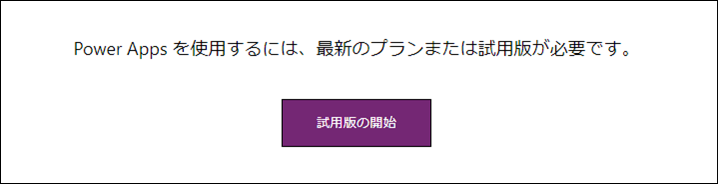
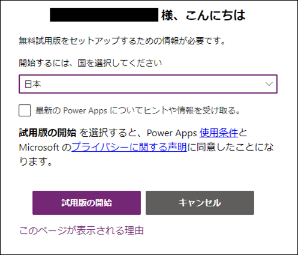
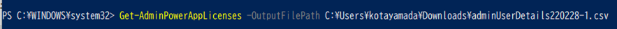
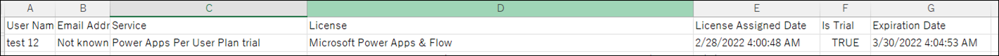
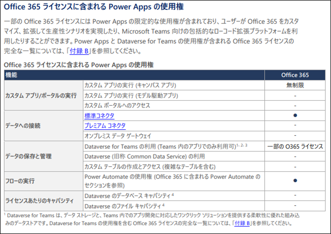
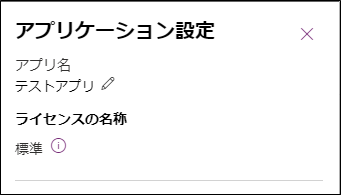
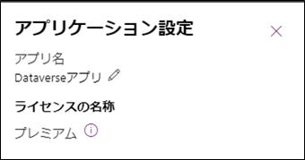

こんにちは、Power Platform サポートの山田です。<br/>
今回は、Power Apps の試用版ライセンスについて、下記項目の順にご説明いたします。  

1. 試用版ライセンスの概要
2. 試用版ライセンスの種類について  
3. ライセンス利用状況の確認方法について  
4. Microsoft 365 (Office 365) ライセンスとの機能の違い  
5. Power Apps 有償ライセンスについて

<!-- more --> 
## 1. 試用版ライセンスの概要  
試用版ライセンスでは、プレミアム機能 (プレミアム コネクタやオンプレミス データ ゲートウェイなど) を含む Power Apps の全ての機能をご利用いただけます。  
試用版ライセンスはユーザー毎に 1 回 30 日間のご利用が可能でございます。  
2 回までの延長が可能でございますので、合計最大 90 日までご利用いただけます。  
その他詳細については下記公開情報をご参照ください。  
[Power Apps 30 日間の無料試用版](https://learn.microsoft.com/ja-jp/power-apps/maker/signup-for-powerapps)  

## 2. 試用版ライセンスの種類について  
試用版ライセンスには、下記の 2 種類がございます。  
① Microsoft 365 管理センター上でご確認いただけるライセンス  
② Microsoft 365 管理センター上でご確認いただけないライセンス  
  
**① Microsoft 365 管理センター上でご確認いただけるライセンス**  
下記公開情報に記載の方法にて、Microsoft 365 管理センター上にてご確認いただける試用版ライセンスがご取得いただけます。  
[最初からライセンスを取得する](https://learn.microsoft.com/ja-jp/power-apps/maker/signup-for-powerapps#%E6%9C%80%E5%88%9D%E3%81%8B%E3%82%89%E3%83%A9%E3%82%A4%E3%82%BB%E3%83%B3%E3%82%B9%E3%82%92%E5%8F%96%E5%BE%97%E3%81%99%E3%82%8B)  

または、Microsoft 365 管理センターにて、対象ユーザーに付与することでご利用いただけます。  
   
ライセンス付与の対象ユーザーが既に Power Apps サービスへアクセスしたことがある場合は、  
ライセンスを付与したタイミングから 30 日間ご利用いただけます。  
ライセンス付与の対象ユーザーがまだ Power Apps サービスへアクセスしたことがない場合は、  
初回アクセス時に表示される下図の「作業の開始」を実行いただいたタイミングから 30 日間ご利用いただけます。      
  

**② Microsoft 365 管理センター上でご確認いただけないライセンス**   
Power Apps が有効なライセンスが付与されていない状態で、任意のアプリを実行しようとすると下図のメッセージが表示されます。  
「試用版の開始」よりサインインし、試用版ライセンスのセットアップ手続きを行います。    
管理センター上に表示されない試用版ライセンスが対象ユーザーにおいて取得され、利用開始となります。  
   
   
　  
　  
## 3. ライセンス利用状況の確認方法について  
管理センター上に表示されない試用版ライセンスは、下記の PowerShell での Power Apps 管理 コマンドをご利用いただくことでご確認いただけます。  
Power Apps 管理 コマンドをご実行いただくとライセンス利用状況の CSV ファイルをご取得いただけます。  
  
ただし、コマンドの出力には、Power Platform サービスにアクセスしたユーザーのライセンスのみが含まれます。   
ライセンスが割り当てられていても、Power Platform サービスにアクセスしたことがないユーザーは、CSV ファイルにライセンスが含まれません。   
また、最近サービスにアクセスしていないユーザーの場合、出力に反映されるまでに最大で 7 日かかる場合がございます。  
予めご承知おきいただけますと幸いでございます。  
　  
### <PowerShell コマンド実行手順>  
⓪ これまでに Power Apps 管理モジュールをご利用頂いたことがない場合は、  
　管理者権限で PowerShell を起動し、初めに以下のコマンドでモジュールをインストールください。  
　`Install-Module -Name Microsoft.PowerApps.Administration.PowerShell -Force`  

① 下記 Power Apps 管理コマンドを実行  
  ```CMD
　Get-AdminPowerAppLicenses -OutputFilePath '<licenses.csv>'  
  ```   
    
　詳細につきましては、下記公開情報もご参照ください。  
　[割り当てられたユーザー ライセンスのリストをエクスポートする](https://learn.microsoft.com/ja-jp/power-platform/admin/powerapps-powershell#export-a-list-of-assigned-user-licenses)  
　  
　実行イメージ：  
　   
　  
上記コマンドで取得できる CSV ファイルの内容は下図例の様になります。  
   
  
- C列 "Service"：「Power Apps Per User Plan trial」となっているものが管理センター上でご確認いただける試用版ライセンス  
- D列 "License"：「Power Apps Per User Plan trial」となっているものが管理センター上でご確認いただけない試用版ライセンス  
- E列 "License Assigned Date"：対象ユーザーの試用版ライセンスの開始時期  
- G列 "Expiration Date"：対象ユーザーの試用版ライセンスの終了時期  


## 4. Microsoft 365 (Office 365) ライセンスとの機能の違い 　  
Office 365 E3 ライセンスなどの Microsoft 365 (Office 365) には Power Apps の一部の使用権が含まれておりますが、  
試用版ライセンスに含まれるプレミアム機能は含まれておりません。  
そのため、プレミアム コネクタ等を利用しているアプリは Microsoft 365 ではご実行いただくことができません。  
  
Microsoft 365 ライセンスに含まれる Power Apps 使用権の詳細については下記のライセンス ガイドをご参照ください。    
[Power Platform ライセンス ガイド ](https://aka.ms/pplicjp)  
  
Microsoft 365 ライセンスに含まれる Power Apps の使用権は、  
プレミアム コネクタ等が含まれておらず、限定された機能となります。  
  
※ライセンスガイドより抜粋。2022 年 4 月時点のものとなります。  

　　  
## **<試用版ライセンスの期限を迎えた場合>**  
### -プレミアム機能を利用していないアプリの場合
試用版ライセンスのみが付与されているユーザーがアプリを実行しようとすると、下図の様なメッセージが表示されアプリをご実行いただけません。  
     
  
対象アプリを引き続きご実行いただくには、以下の 2 通りの対応が必要となります。  
① 試用版ライセンスを延長いただく (※ただし、上述の通り、延長は各ユーザーにつき 2 回までとなります。)  
② Microsoft 365 ライセンス、およびライセンスに含まれる Power Apps 使用権を対象ユーザーに付与いただく  
  

### -プレミアム機能を利用しているアプリの場合
アプリを実行しようとすると有償ライセンスが必要であるメッセージが表示され、アプリを実行いただけません。  
  
プレミアム機能を利用しているため、Microsoft 365 ライセンスに含まれる Power Apps 使用権をユーザーへ付与してもアプリは実行いただけません。  
そのため、対象アプリを引き続きご実行いただくには、以下の 2 通りの対応が必要となります。  
① 試用版ライセンスを延長いただく (※ただし、上述の通り、延長は各ユーザー 2 回までとなります。)  
② Power Apps の有償ライセンスをご利用いただく (※詳細については、後述致します。)  
  
※対象アプリがプレミアム機能を必要とするかの判断方法については下記公開情報もご参照ください。  
[アプリのライセンス指定の確認方法](https://learn.microsoft.com/ja-jp/power-apps/maker/canvas-apps/license-designation#check-app-license-designation-from-app-settings)   
  
上記公開情報に記載のライセンス指定情報 = 設定画面上の「ライセンスの名称」が「プレミアム」となっている場合には、  
プレミアム機能が有効なライセンスが必要となります。  
  
  
  
   
## 5. Power Apps有償ライセンスについて
試用版ライセンスと同様に Power Apps の全ての機能をご利用いただくには、  
下記 2 種の Power Apps の有償ライセンスのどちらかが必要となります。  
① Power Apps per app プラン  
② Power Apps Premium (旧 : Power Apps per user) プラン  
  
各ライセンスの内容は以下の通りとなります。
更なる詳細については上述のライセンスガイドを併せてご確認ください。  

**① Power Apps per app プラン**  
　1 ライセンスで 1 ユーザーが 1 アプリをご利用いただけます。  
　利用されたいアプリが 2 つある場合には、利用されたいアプリ数分のライセンスが必要となります。  
　また、1 つのアプリを複数ユーザーにてご利用されたい場合には、 
　利用されるユーザー数分のライセンスが必要となります。  

  
**② Power Apps Premium (旧 : Power Apps per user) プラン**  
　割り当てられた対象ユーザーがアプリ数の制限なく、Power Apps をご利用いただけるライセンスとなっております。  
　ご利用いただくユーザー数分のライセンスが必要となります。  
  

その他、ライセンス詳細につきましては、下記公開情報もご参照ください  
- [Microsoft Power Platform ライセンスの概要](https://learn.microsoft.com/ja-jp/power-platform/admin/pricing-billing-skus)  
- [アプリごとの Power Apps プラン](https://learn.microsoft.com/ja-jp/power-platform/admin/about-powerapps-perapp)  
- [従量課金制プランの概要](https://learn.microsoft.com/ja-jp/power-platform/admin/pay-as-you-go-overview)  
- [Power Apps と Power Automate のライセンスに関する FAQ](https://learn.microsoft.com/ja-jp/power-platform/admin/powerapps-flow-licensing-faq)  


