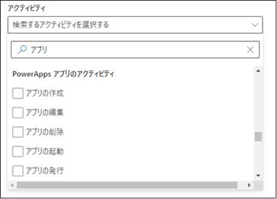
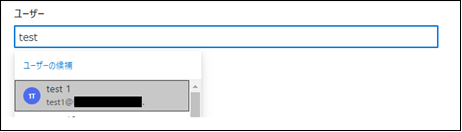
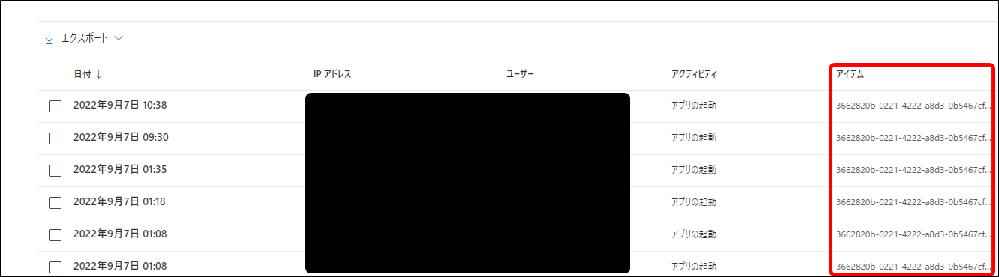
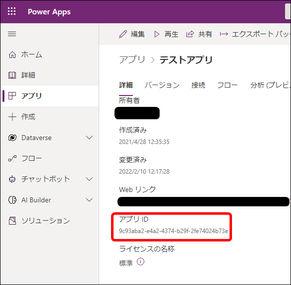
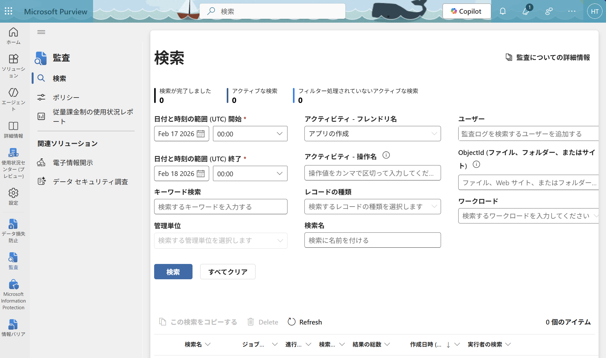
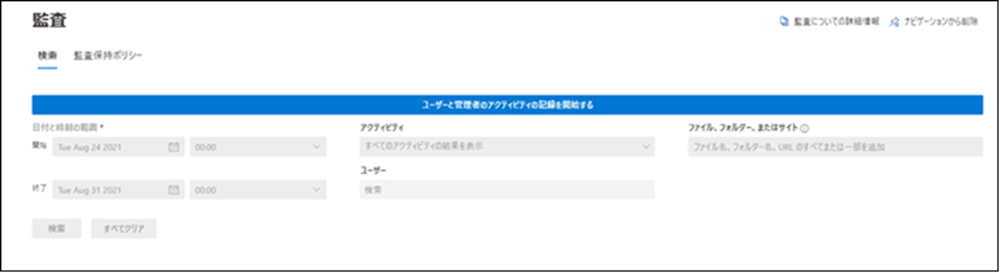
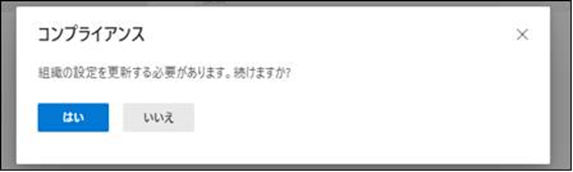
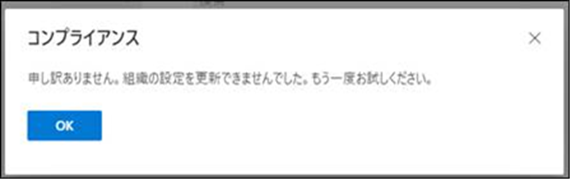

こんにちは、Power Platform サポートの山田です。 
今回は、監査ログでの Power Apps の利用状況確認について、下記項目の順にご説明いたします。  

1. 監査ログ  
2. ログの出力  
3. 監査ログ利用方法    
4. 監査ログの注意点
  
<!-- more -->  
## 1. 監査ログ
Microsoft 365 コンプライアンスの「監査ログ」機能でアプリの実行状況をご確認いただけます。  
監査ログにて、「アクティビティ」の「Power Apps アプリのアクティビティ」より、  
「アプリの起動」にて、アプリの各起動 (実行) ログ等をご確認いただけます。   

 

ユーザー欄にて対象ユーザーをフィルターいただくことが可能でございます。  

 

## 2. ログの出力  
ログは下図のような形となります。  
各ログの「アイテム」欄が各アプリの詳細画面にてご確認いただけるアプリ ID を示しております。   
誰がいつ、どのアプリを実行したかご確認いただけます。  
各ログを選択いただきますと、より詳細な情報をご確認いただけます。  
アクティビティによって、詳細の中には IP や対象環境情報などが含まれておりますので、ご活用ください。  
  

 

## 3. 監査ログ利用方法  
[Microsoft Purview ポータル](https://purview.microsoft.com/home)の "ソリューション>監査" にて、  
ログの時刻範囲を決定、アクティビティにて「アプリの○○」を選択し、検索します。   

 

## 4. 監査ログの注意点 
監査ログの注意点として、下記公開情報に記載のように、   
イベントの発生からログ出力までの時差やログ保存期間の制限等ございますのでご留意ください。  
監査レコードは通常は 90 日間保持されます。  
Office 365 E5 または Microsoft E5 ライセンスが割り当てられたユーザーのアクティビティの場合、  
ポリシーを設定することにより、1 年間まで保持されます。  
[既定の監査ログの保持ポリシー](https://learn.microsoft.com/ja-jp/purview/audit-log-retention-policies?view=o365-worldwide#default-audit-log-retention-policy)  
 

なお、初回時には下図例の「ユーザーと管理者のアクティビティの記録を開始する」ボタンが表示されます。   
ボタンを押して頂き、案内に従ってください。   
なお、こちらのボタンは一度では有効化されない場合がございます。   
下図のようなメッセージが表示される場合には、何度か押下して頂けますと幸いでございます。   
  
  

 

その他監査ログの詳細につきましては、下記公開情報をご参照ください。  
[監査ログの検索](https://learn.microsoft.com/ja-jp/purview/audit-search?view=o365-worldwide#search-the-audit-log)  
[Microsoft Purview で Power Apps アクティビティ ログを表示する](https://learn.microsoft.com/ja-jp/power-platform/admin/activity-logging-auditing/activity-logs-power-apps)
 

免責事項  
※本情報の内容 (添付文書、リンク先などを含む) は、作成日時点でのものであり、予告なく変更される場合があります。 

