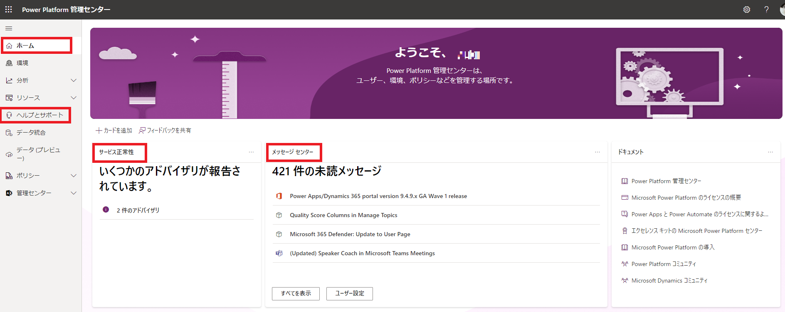

こんにちは、Power Apps サポートの深津です。  
今回は、Power Platform に問い合わせを行うための最小の権限についてご説明いたします。

<!-- more -->
## 目次

1. [はじめに](#anchor-intro)
2. [Power Platform に問い合わせを行うための最小権限](#anchor-sr-authority)
3. [おわりに](#anchor-finish)

---

## はじめに

Power Platform 管理センターより SR (Service Request) を起票する権限をユーザーに与えたいが、他の操作権限に関しては最小に抑えたいという時があると思います。  
今回は、そのためにどういった権限を付与すれば良いか、権限を付与する際の制限人数はあるかについてご説明いたします。

---

## Power Platform に問い合わせを行うための最小の権限

結論から申し上げますと、Power Platform 管理センターより SR を起票するためだけの権限はご用意がなく、他の操作権限も付与される形となります。  
そこで、他の操作権限を最小に抑え、SR を起票する権限を与える方法として「サービス サポート管理者」権限の付与という方法があります。
[公開情報](https://learn.microsoft.com/ja-jp/microsoft-365/admin/add-users/about-admin-roles?view=o365-worldwide)より「サービス サポート管理者」の権限が与えられると以下の 3 つの操作を行うことができます。
 - サービス リクエストを開いて管理する
 - メッセージ センターの投稿を表示して共有する
 - サービス正常性を監視する

つまり、行うことができる操作は「ヘルプとサポート」および、「ホーム」>「サービス正常性」/「メッセージ センター」になります。以下の画像で赤く囲った部分が該当します。

また、環境ごとに SR を起票する権限をユーザーに付与したい場合、セキュリティ ロールを付与するといった方法があります。  
セキュリティ ロールは Power Platform の環境ごとに付与する権限であり、対象環境内のユーザーのアクセスを制御します。  
ユーザーへのセキュリティ ロールの割り当てはこちらの[公開情報](https://learn.microsoft.com/ja-jp/power-platform/admin/assign-security-roles)に記載があるためご覧ください。  
SR を起票する権限が含まれるセキュリティ ロールとして「環境管理者」と「システム管理者」の２つがあります。  
「環境管理者」はデータベースなしの環境、「システム管理者」はデータベースありの環境で存在するセキュリティ ロールですので、データベース利用の有無に基づいて選択してください。  
加えて、セキュリティ ロールを付与する人数に上限があるかといったご質問をいただくことが多いですが、追加できる人数に関しまして特に制限はございません。

---

## おわりに

今回、Power Platform に問い合わせを行うための最小の権限についてご説明いたしました。  
このように権限を適切にユーザーに与えることで、セキュリティ強化に繋がります。  
ぜひ、試してみてください。
