こんにちは、Power Apps サポートの深津です。
今回は、Power Automate から Power Apps へデータを送信する方法についてご説明いたします。

<!-- more -->
## 目次

1. [はじめに](#anchor-intro)
2. [プレミアムコネクタを使用する場合](#anchor-premium-connecter)
3. [標準コネクタを使用する場合](#anchor-standard-connecter)
4. [おわりに](#anchor-finish)

---

## はじめに

Power Automate で取得したデータを Power Apps で表示したい時があると思います。
今回はプレミアムコネクタを使用する場合と標準コネクタを使用する場合の２種類の方法をご説明いたします。
ライセンス状況に基づいて方法を選択していただければと思います。

#### 今回送信するデータ

SharePointのリストに格納されている商品名、金額、個数の3列からなるデータを Power Automate で取得し、 Power Apps に送信することを想定します。

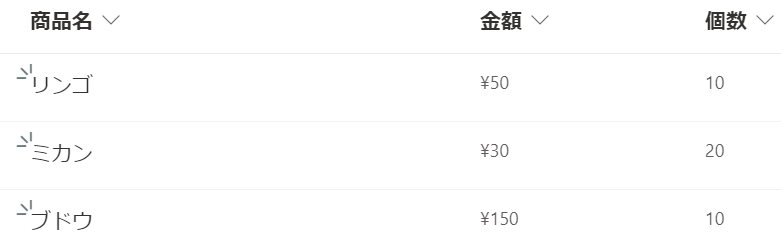  

---

## プレミアムコネクタを使用する場合

#### 必要なライセンス

今回作成するフローではプレミアム コネクタを使用するため、以下のいずれかのライセンスが必要です。  

- Power Automate per user
- Power Automate per flow
- Power Automate per user with attended RPA

#### Power Automate の説明

フローの全体図は下記の通りです。

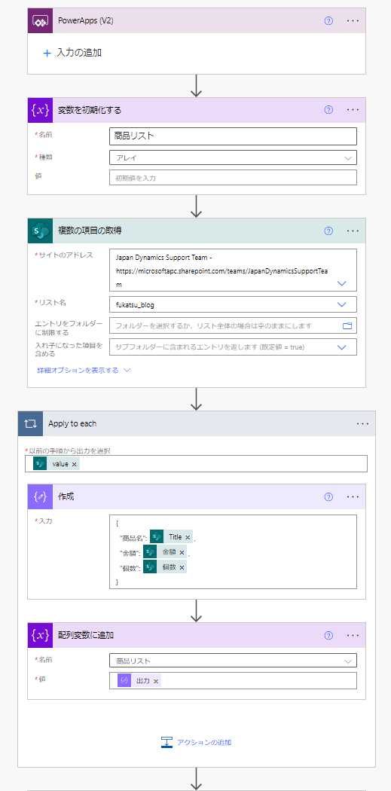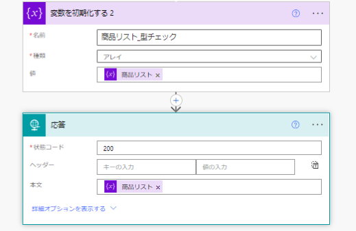

フローの流れについてご説明いたします。
1. Power Apps からフローを呼び出せるように Power Apps (V2)トリガーを挿入します。
2. 「変数を初期化する」のアクションでSharePointの商品リストを格納するための変数を定義します。以後この変数を商品リスト変数と呼ぶことにします。
3. 「複数の項目を取得」のアクションでSharePointの商品リストの情報を取得します。
4. 「作成」のアクションで必要な情報（Title、金額、個数）の JSONを定義し、「配列変数に追加」のアクションで商品リスト変数に追加します。
5. 「変数を初期化する２」のアクションで商品リスト変数のアレイ型の構造を確認します。
6. 「応答」のアクションで商品リストの情報を Power Apps に送信します。また、応答アクション内のパラメータは以下の手順で設定します。
　　6-1. まず、一度フローを実行し、手順５の実行結果の値をコピーします。

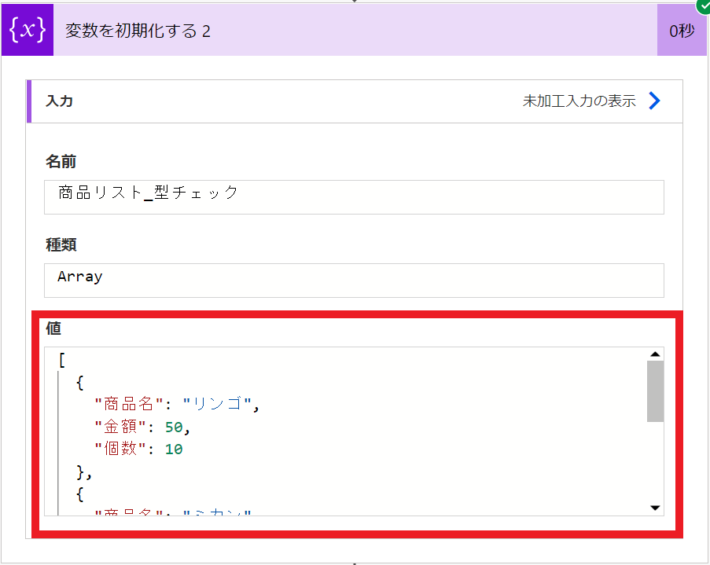

　　6-2. 応答アクションのサンプルから生成をクリックし、先程コピーした値をペースト、完了ボタンを押します。

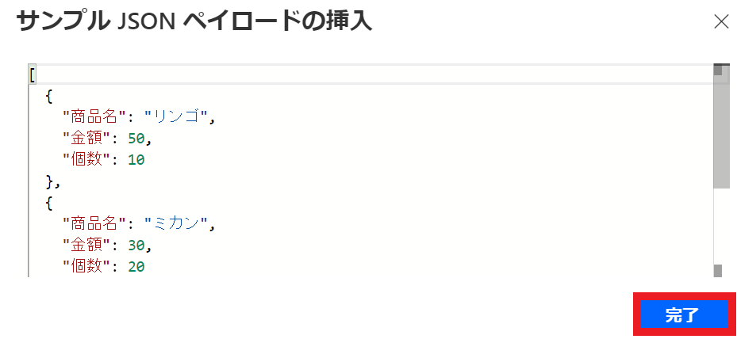

　　6-3. 完了すると以下の画像のようにJSONスキーマが定義されていることが確認できます。

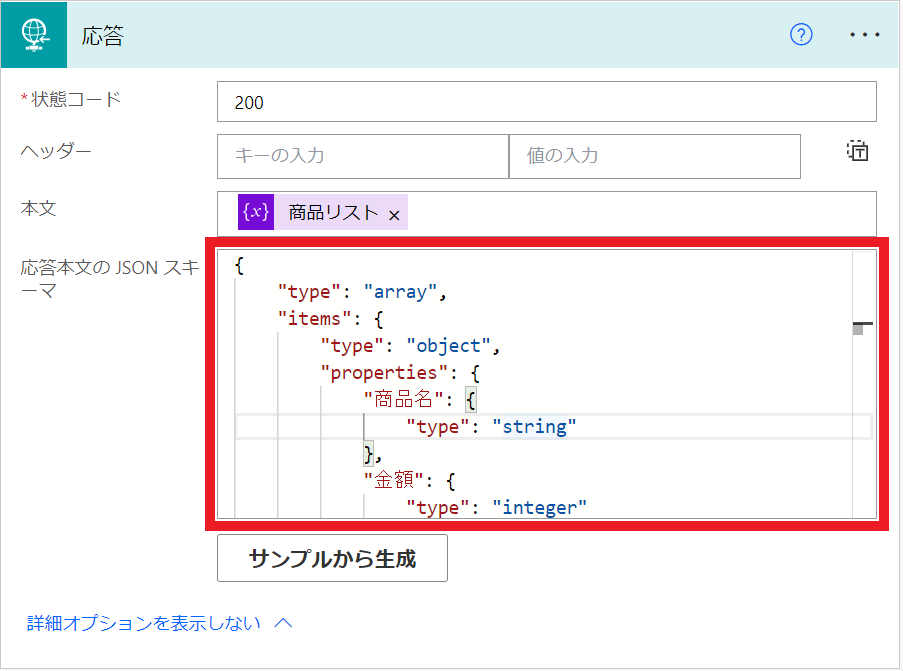

## Power Apps の説明

今回、Power Appsで簡単なアプリを作成しました。ボタンをクリックすることで先程作成したフローが動き、商品リストが表示されるものです。
ボタンのOnselectプロパティーにClearCollect(適当な変数名, Power Automate のフロー名.Run())を記載することで変数にフローの出力データを格納することが可能です。

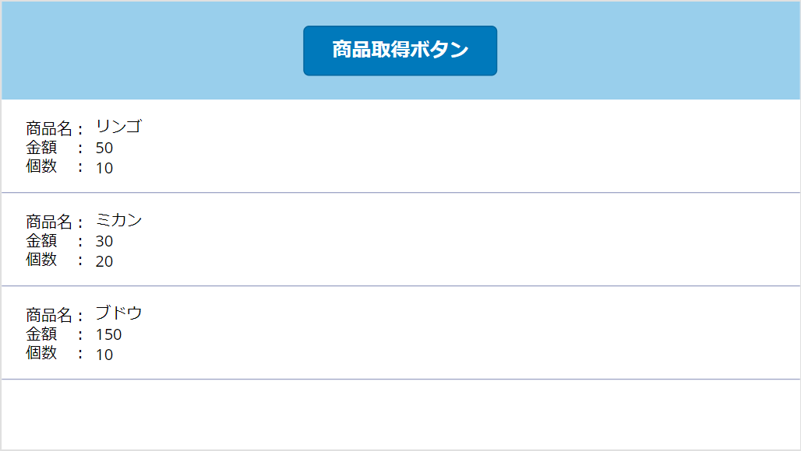

---

## 標準コネクタを使用する場合

#### Power Automate の説明

次は、標準コネクタを使用する場合についてご説明いたします。
フローの全体図は下記の通りです。

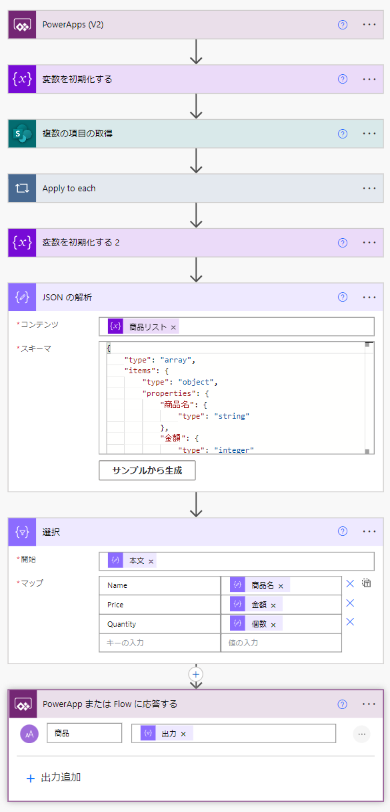

標準コネクタでは「応答」アクションの代わりに「PowerApp または Flow に応答する」アクションを使用します。
フロー作成手順についてはプレミアムコネクタの説明の１～５までは同様です。その続きは以下の手順になります。
6. 「データ操作＞ JSON の解析」のアクションを追加します。「サンプルから生成」に手順５の実行結果を入力します。
7. 「データ操作＞選択」のアクションで手順６の結果を文字列に変換します。今回は、商品名、金額、個数の値が欲しいため、それらの値をマップの内容とします。このときにマップのキーの値を英語で記載することに注意してください。後にPower Appsで受け取った文字列をMatchAll関数で解析する際に日本語判定ができないためです。
8. 「PowerApp または Flow に応答する」のアクションで商品リストの情報を Power Apps に送信します。
パラメータとして名称には任意の値、式には「出力」（手順７の出力結果）を選択します。その際に、「出力」という動的なコンテンツが出てこない場合があります。その時は、以下の画像のように式で（）を挿入してから動的なコンテンツに戻ることで「出力」という動的なコンテンツが出てきます。

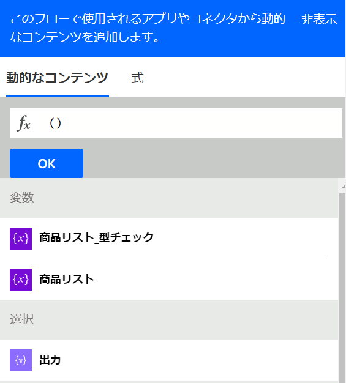

#### Power Apps の説明

プレミアムコネクタの時と同様にボタンをクリックすることで先程作成したフローが動き、商品リストが表示されるものを作成しました。

プレミアムコネクタを使用する場合と比較して標準コネクタを使用する場合は Power Apps 上で文字列を正規表現で解析する必要があります。
作成手順は以下の通りです。

1. ボタンの設置、Power Automate のフローの読み込みを行います。
2. ボタンのOnSelectプロパティを以下のように設定します。
　　2-1. 初めに、Set(変数,フロー名.Run())で Power Automate のフローの出力を変数に格納します。
　　2-2. 次に、MatchAll関数を用いて文字列を正規表現で解析し、テーブルに格納します。黄色の部分の正規表現は適宜ご変更ください。正規表現を作成の際のヒントをこの章の最下部に載せています。ご参考になれば幸いです。
　　2-3. 最後に、テーブルの行が1行以上ある場合、ClearCollect関数を用いて必要な列からなるテーブルを作成します。紫色の部分についても必要な列に応じてご変更ください。

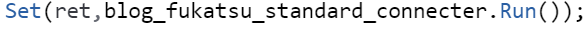
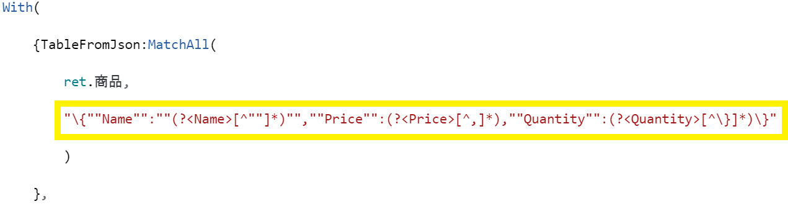
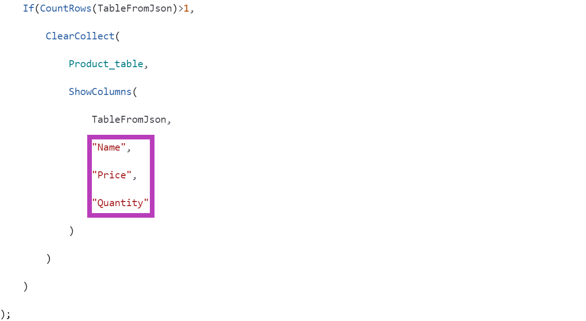

正規表現作成の際のヒントを記載します。
下記画像の文字列①の情報をテーブルに変換する際の正規表現は正規表現①、文字列②の場合は正規表現②になります。
ここで注意していただきたいのが文字列の色がついている部分です。この部分は「取得したい文字列」の次にある文字を示しており、それに伴い正規表現のカラー部分も変更する必要があります。
例えば文字列①のように取得したい値の次の文字が「"」の場合、正規表現も緑の色のように「""」で表します。
また、文字列②の黄色の部分のように取得したい文字列の次の文字が「,」の場合、正規表現中の黄色の部分は「,」、水色の部分のように取得したい文字列の次の文字が「}」の場合、正規表現中の水色の部分は「\}」で表します。
※水色の部分を「}」ではなく「\}」と表す理由は、正規表現では、「}」は特殊文字なので「}」自体として扱わず、「\}」と表記することで「}」それ自体を表すためです。

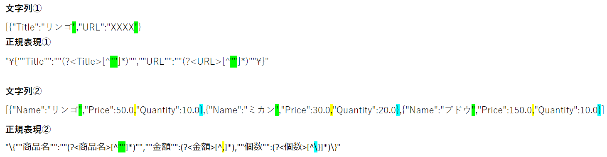

---

## おわりに

今回紹介した方法を使用することでPower Automate で取得した様々な情報を Power Apps で表示することができます。
ぜひ、色々なシーンで活用してみてください。
