# はじめに

こんにちは、Power Platform サポートチームの宮﨑です。  
本記事では、Dataflow のトラブルシューティングにあたって、必要となる情報の取得手順についてご案内いたします。

<!-- more -->
# 目次

1. [概要](#anchor-intro)
1. [情報取得手順詳細](#anchor-how-to-collect)
    1. [事象の発生状況](#anchor-about-situation)
    1. [データフローのデータソースの状況](#anchor-about-dataflow-datasource)
    1. [オンプレミスデータゲートウェイの使用状況](#anchor-about-onpremise-data-gateway)
    1. [データフローの型](#anchor-about-dataflow-type)
    1. [エラー発生時のネットワークトレース](#anchor-network-trace)
    1. [Dataflow テーブル](#anchor-dataflow-table)
    1. [Dataflow の更新履歴ファイル（ csv ）](#anchor-dataflow-history)
    1. [ソリューションのエクスポート](#anchor-solution-export)
    1. [ユーザーアカウント](#anchor-user-account)
1.  [補足](#補足)

# 概要
弊社サポートでは、お問い合わせを頂いた際のトラブルシューティングにおいて、お問い合わせの内容をもとに調査方針を立てております。
発生している事象の把握のため、発生している事象の切り分けや情報提供をお願いすることがあります。
本記事では、Dataflow に関するサポートサービスのお問い合わせの際の情報取得手順につきまして、以下の通りご案内いたします。

# 情報取得手順詳細

## 事象の発生状況
エラーがどのような状況下で発生するかお知らせください。  
事象の発生条件を特定することで、問題の特定だけではなく弊社環境での再現調査においても有用な情報が得られます。
以下の情報をお知らせいただくことでより明確に事象を把握することができます。

1. 事象が発生するタイミング 
   - いつから発生しているか・現在も継続して発生しているか
   - どれぐらいの頻度で発生しているか
   - 発生前後で何らかの変更を行ったか
   - 特定の操作で発生するか
2. 事象の発生環境
   - 機種
   - OS およびバージョン
   - ブラウザ種類 ( Microsoft Edge、Google Chrome、Firefox など)
   - プラグインや拡張機能の有無
3. 特定の利用で発生する事象か
   - 特定の端末か？
   - 事象が発生している端末と事象が発生していない端末の差異
   - 特定のユーザーか？
   - 事象が発生しているユーザーと事象が発生していないユーザーの差
   - および、両者のメールアドレスやユーザープリンシパル名
4. Dataflow をご利用いただいている端末のネットワーク環境の差異
   - プロキシ経由かどうか
   - Azure Express Route の利用有無
   - セキュリティ製品の利用有無

## データフローのデータソースの状況
以下の手順で、事象が発生しているデータフローのデータソースについてご確認ください。
データフローの編集画面を開きます。

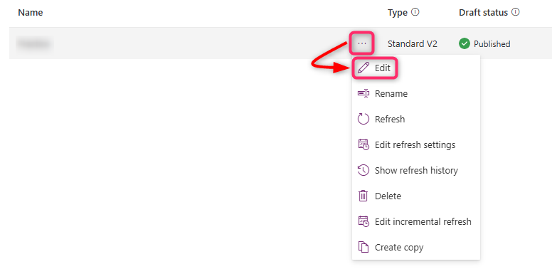 

画面右下にて、「ダイアグラム ビュー」をご選択ください。 

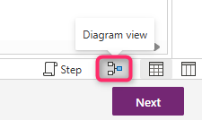 
  
以下のような表示画面が出てきましたら、「ソース」にカーソルを合わせていただき、どのようなデータソースをご使用になっているかご教示ください。　
（下画像では例として CSV ファイルを使用しております。）

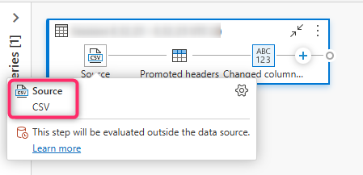 

## オンプレミスデータゲートウェイの使用状況
事象が発生しているデータフローにおきまして、オンプレミスデータゲートウェイのご利用についてご確認ください。（データフロー作成時にご選択されていない場合は「していない」とお答えください。）

## データフローの型
対象となるデータフローの「型」列の値についてご教示ください。

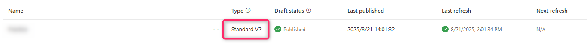 

## エラー発生時のネットワークトレース
>[!NOTE]
>以下の手順は、データフロー編集時にエラーが起きた場合にご実行ください。

エラーが発生する作業を実施したときの、ブラウザのネットワークトレースのご取得をお願いいたします。 
データフローの編集を行う直前でログの記録を開始し、エラーが表示されるまでの動作をログに収録いただけますようお願い申し上げます。

ログの取得方法については、お手数ですが以下の公開情報をご参照ください。 
※手順内の1. 及び2.ステップ記録ツール」については実施いただかなくて大丈夫です。 
https://learn.microsoft.com/ja-jp/azure/azure-portal/capture-browser-trace#google-chrome-and-microsoft-edge-chromium

## Dataflowテーブル
対象のデータフローの ID やクエリの詳細を確認させていただくために、Dataverse 内の Dataflow テーブルのご提供をお願いいたします。
以下の手順にて Dataflow テーブルを表示して、ご提供頂けますようお願いいたします。

1. Power Apps ( https://make.powerapps.com/ ) を開き、[設定] – [開発者リソース] の順にクリックします。

 

2. [Web API エンドポイント] を取得し、末尾に /msdyn_dataflows を追加したリンクを作成します。 
例 : https://org **bbca2a.api.crm7.dynamics.com/api/data/v9.2/msdyn_dataflows

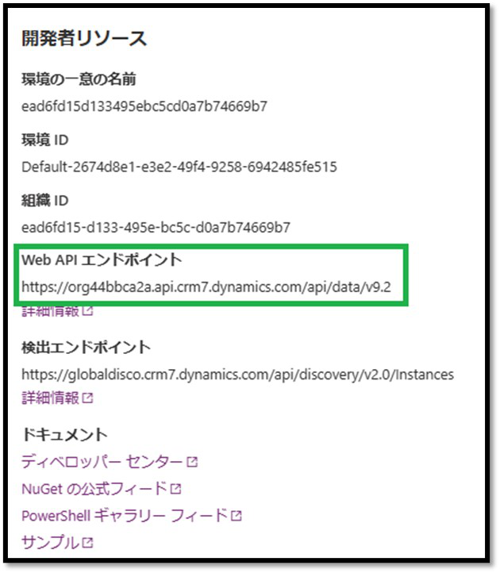

3. 項番 2 にて作成したリンクにアクセスし、保存します。 
※ 以下の画面は Edge での例となります。　
※ 保存時に、ファイル名に環境 ID などの記載いただけますと幸いです。

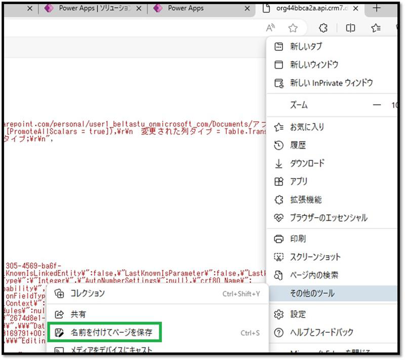

## データフローの更新履歴ファイル（ csv ）
対象のデータフローの更新履歴ファイル（ csv ）を開き、該当する問題の実行履歴をダウンロードしていただけますようお願いいたします。 
また、過去に成功した実行履歴がある場合は、そちらも併せてダウンロードの上、ご提供いただけますと幸いです。

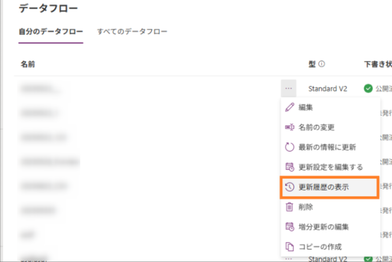

## ソリューションのエクスポート
以下の手順にて対象のデータフローをソリューションに含めていただき、アンマネージドにてエクスポートをいただけますようお願いいたします。（実装の内容やご利用のコネクタについて確認をさせていただきます。）
1. Power Automate ( https://make.powerautomate.com/ )を開き、「ソリューション」をご選択ください（環境名がデータフローのものと一致しているかご確認ください）。 
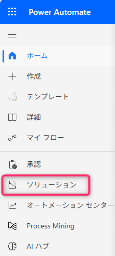

2. 新しいソリューションをご作成ください。（既存のソリューションが存在する場合は、この項目を飛ばしてください。）

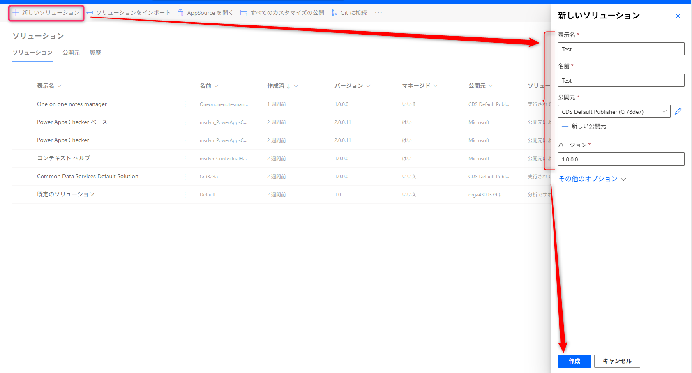

3. 作成したソリューションを開き、対象のデータフローを追加します。

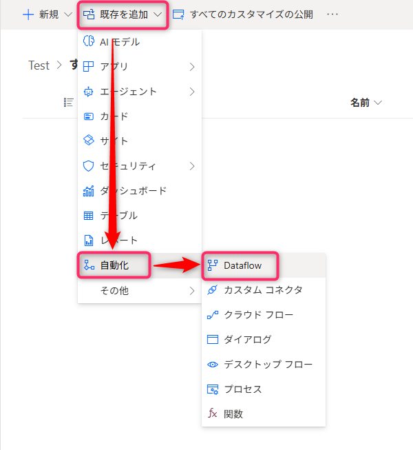

4. 「マネージド」が「いいえ」になっているかをご確認いただいた上で、「追加」をご選択ください。

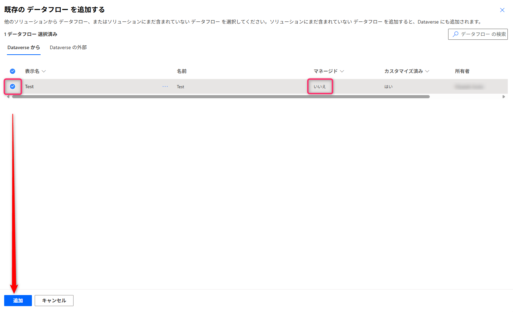

5. 「ソリューションに戻る」をクリックします。

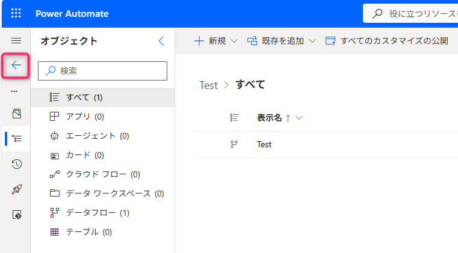

6. 作成したソリューションを選択し、「ソリューションをエクスポート」をお選びください。

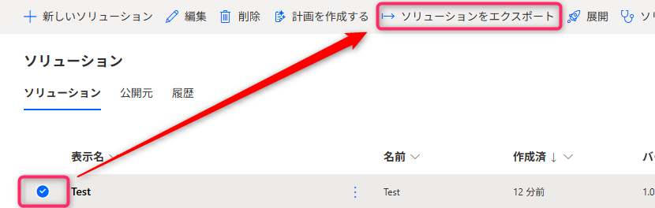

7. 「エクスポート前画面」にて「次へ」をクリックした後、アンマネージドに切り替えてエクスポートしてください。

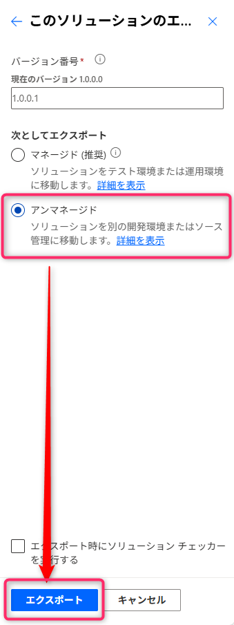

8. しばらくするとエクスポートが完了しますので、ダウンロードして .zip フォルダをご取得ください。

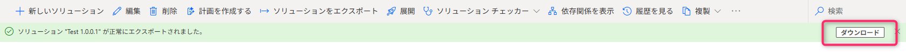

## ユーザーアカウント
対象のデータフロー所有者のユーザーアカウントをご教示ください。
もしご不明の場合は、対象のデータフローが含まれているソリューションをご選択いただき、
下記画像の通りに表示名がございますので、そちらをご教示いただければ幸いです。
※所有者の UPN もしくはオブジェクト ID がわかる場合は、そちらも併せてご提供ください。

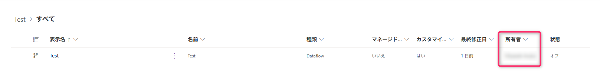
---

# 補足

本手順は執筆時点でのユーザー インターフェイスを基に紹介しています。バージョンアップによって UI の遷移などが若干異なる場合があります。その場合は画面の指示に従って進めてください。  

