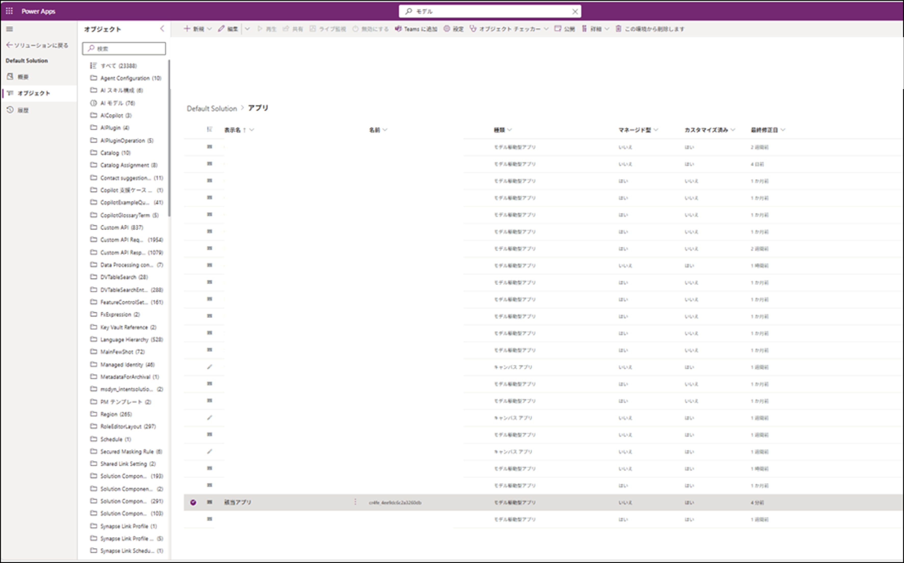
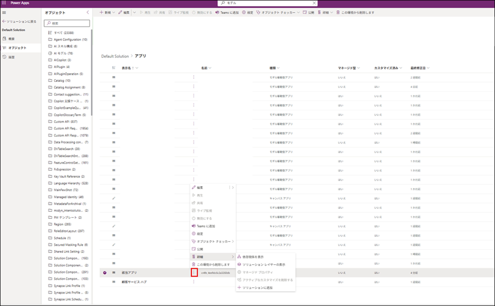
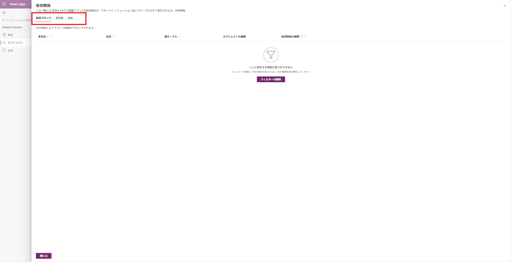

# モデル駆動型アプリ削除について

こんにちは、PowerPlatformサポートチームの三田でございます。

本記事では以下の 3 つの質問 (Q1〜Q3) に体系的に回答し、モデル駆動型アプリ (Model-driven App) を安全かつ意図通りに削除するための権限要件、依存関係の考え方、そして依存関係が表示されないにもかかわらず削除できない事例とその時の対処を整理いたします。

- [Q1: モデル駆動型アプリの削除に必要な権限は？](#モデル駆動型アプリ削除に必要な権限-q1)
- [Q2: モデル駆動型アプリを削除する際に注意しなければならない「依存関係」とは？](#削除前に確認すべき依存関係の整理-q2)
- [Q3: 削除を阻止する「依存関係」がないのに削除できないときの対処法は？](#依存関係が表示されないのに削除できない場合の対処-q3)

### この記事でわかること
- 削除に必要なロールと権限の要点
- 削除を阻止する依存関係の見分け方
- Managed / Unmanaged の違いが削除可否へ与える影響
- 削除ブロックが表示されない場合でも削除が失敗する代表的原因
- SQL 547 (外部キー制約違反) など内部参照エラーの対処例

## 目次
- [モデル駆動型アプリ削除に必要な権限 (Q1)](#モデル駆動型アプリ削除に必要な権限-q1)
- [削除前に確認すべき依存関係の整理 (Q2)](#削除前に確認すべき依存関係の整理-q2)
- [依存関係が表示されないのに削除できない場合の対処 (Q3)](#依存関係が表示されないのに削除できない場合の対処-q3)
- [まとめ](#まとめ)
- [注意事項（情報の更新可能性）](#注意事項情報の更新可能性)

## モデル駆動型アプリ削除に必要な権限 (Q1)
【結論】モデル駆動型アプリを削除できる既定ロールはシステム管理者 (System Administrator) もしくはシステムカスタマイザー (System Customizer) でございます。

これら以外のカスタムロールで削除を許可したい場合、両既定ロールが保有する App (App Module) の Delete、関連 Solution 操作 (Read / Write / Delete / Append / Append To) および Publish Customizations などの権限セットを完全に再現する必要がございます。

Managed ソリューション由来アプリはロールに関わらず個別削除できず、Managed ソリューション全体のアンインストールが前提でございます。

【ポイント】
1. 既定ロール: System Administrator / System Customizer
2. 必須操作: App Module Delete + Publish Customizations
3. 付随権限: Solution（Read / Write / Delete / Append / Append To）
4. カスタムロール: 上記権限を完全複製で代替可
5. Managed 配下: 個別削除不可（ソリューションアンインストール）

 【よくある誤解】
- 誤解: アプリを作成したユーザなら誰でもそのアプリを削除できる。
	- → 正しくは: 作成者であっても適切な Delete 権限と関連カスタマイズ権限がなければ削除できません。
- 誤解: Managed ソリューションからインポートしたアプリも Maker 画面から直接削除できる。
	- → 正しくは: Managed ソリューション配下のコンポーネントは個別削除不可で、ソリューションのアンインストールが必要でございます。
 - 誤解: Publish Customizations 権限は削除には無関係である。
	- → 正しくは: 削除後の状態反映で公開処理が走るため関連カスタマイズ権限不足でエラーとなる場合がございます。
 - 誤解: App Module の Delete 権限さえ付与されていればアプリを削除できる。
	- → 正しくは: Delete 単独では不十分で Solution への Read / Write / Delete / Append / Append To と Publish Customizations、および依存関係解消が揃って初めて削除可能でございます。誤設定リスク低減のため既定ロール (システム管理者 / システムカスタマイザー) の利用を推奨いたします。

＜参考資料＞
- [セキュリティ ロールおよび特権 (Dataverse)](https://learn.microsoft.com/ja-jp/power-platform/admin/security-roles-privileges)
- [Dataverse のカスタマイズに必要な特権](https://learn.microsoft.com/ja-jp/power-apps/maker/model-driven-apps/privileges-required-customization)
- [Managed and unmanaged solutions](https://learn.microsoft.com/power-platform/alm/managed-unmanaged-solutions) (英語のみ)
- [Delete a model-driven app](https://learn.microsoft.com/power-apps/maker/model-driven-apps/delete-model-driven-app) (英語のみ)


## 削除前に確認すべき依存関係の整理 (Q2)
【結論】依存関係は「アプリが内部的に利用している (Uses) 要素」と「他コンポーネントが当該アプリに依存している (Used by) 要素」に大別され、実際に削除をブロックするのは依存関係ビューの “Delete blocked by” タブに列挙されるコンポーネントでございます。

代表例として SiteMap、テーブル (Table)、フォーム (SystemForm)、ビュー (SavedQuery)、ビューのチャート (SavedQueryVisualization)、ダッシュボード、Business Process Flow、ロール依存、Web リソース、URL Suffix などが該当いたします。

【ポイント】
1. 二分類: Uses / Used by
2. ブロック判定: “Delete blocked by” タブ列挙項目
3. 代表要素: SiteMap / Table / SystemForm / SavedQuery / SavedQueryVisualization
4. その他: ダッシュボード / BPF / Web リソース / URL Suffix / ロール依存

【補足】“Used by” に表示されても “Delete blocked by” に現れない要素は削除ブロックではございません。無闇に削除すると他アプリや別ソリューションでリンク切れや機能欠落を生む恐れがございます。


Power Apps ポータルで依存関係を確認する手順 (簡易):
1. 対象環境で ソリューション を開き、アプリを含むソリューションを選択
	
2. アプリ行を選択後、該当行のコマンドバー (… など) から「詳細 > 依存関係を表示」をクリック
	
3. 削除ブロック / 使用者 (Used by) / 用途 (Uses) の各タブで確認可能
	


【よくある誤解】
- 誤解: アプリを削除すれば内部で参照しているビューやフォームも自動削除される。
	- → 正しくは: 参照コンポーネントは独立しており自動削除されないため別途クリーンアップが必要でございます。
- 誤解: Used by に出た要素はすべて削除ブロックである。
	- → 正しくは: Delete blocked by に現れない限り直接のブロックではなく副作用確認対象でございます。
- 誤解: Managed コンポーネントは Unmanaged に変換しないと依存関係表示できない。
	- → 正しくは: Managed でも依存関係ビューから直接確認可能でございます。

＜参考資料＞
- [Power Apps でコンポーネントの依存関係を表示する](https://learn.microsoft.com/ja-jp/power-apps/maker/data-platform/view-component-dependencies)
- [テーブルとモデル駆動型アプリ間の依存関係を削除する](https://learn.microsoft.com/ja-jp/power-platform/alm/remove-table-app)
- [依存関係の削除の概要](https://learn.microsoft.com/ja-jp/power-platform/alm/removing-dependencies)
- [Managed and unmanaged solutions](https://learn.microsoft.com/power-platform/alm/managed-unmanaged-solutions) (英語のみ)
- [Delete a model-driven app](https://learn.microsoft.com/power-apps/maker/model-driven-apps/delete-model-driven-app) (英語のみ)


## 依存関係が表示されないのに削除できない場合の対処 (Q3)
【結論】依存関係ビューに削除ブロックが無くても AppSettingBase など内部設定テーブルの参照整合性 (外部キー制約) 残存により削除が失敗する事例がございます。

以下のようなエラーが発生しシステム管理者でも削除できない事例が複数報告されております。

```
Sql error: Statement conflicted with a constraint.
The DELETE statement conflicted with the REFERENCE constraint "appmodule_appsetting_parentappmoduleid".
The conflict occurred in database "db_crmcorejpn_********_********_****", table "dbo.AppSettingBase", column 'ParentAppModuleId'.
The statement has been terminated.
CRM ErrorCode: -2147185375
Sql ErrorCode: -2146232060
Sql Number: 547
```

エラー文の要点:
1. Sql Number 547 は参照整合性 (外部キー) 違反を示す一般的エラー
2. 外部キー名 appmodule_appsetting_parentappmoduleid は AppSettingBase の ParentAppModuleId が対象 App Module を指しているレコードが残存していることを示唆
3. 一時的な未公開 / キャッシュ状態や App 設定レイヤー未更新により不要な AppSetting レコード参照が残留している可能性がございます。


再現事例で有効だった対処手順:
1. システム管理者が対象モデル駆動型アプリを Power Apps (Maker ポータル) で開き「保存して公開」(Save & Publish) を実行（「保存して公開」が非活性の場合はページの追加など軽微な編集を行ってください）
2. 直後に「再生」(Play) を押下し一度アプリを起動

上記手順により不要な AppSetting 参照が再生成または解消され削除が可能となるケースがございます。

【補足】上記手順でのエラーが解消されない場合は問題発生直後のサポート チケット提出を推奨いたします。

＜参考資料＞
- [Power Apps でコンポーネントの依存関係を表示する](https://learn.microsoft.com/ja-jp/power-apps/maker/data-platform/view-component-dependencies)
- [依存関係の削除の概要](https://learn.microsoft.com/ja-jp/power-platform/alm/removing-dependencies)
- [Managed and unmanaged solutions](https://learn.microsoft.com/power-platform/alm/managed-unmanaged-solutions) (英語のみ)
- [Troubleshoot common solution issues](https://learn.microsoft.com/power-platform/alm/troubleshoot-common-solution-issues) (英語のみ)

## まとめ
- モデル駆動型アプリ削除にはシステム管理者 / システムカスタマイザーまたは同等の削除権限を付与したカスタム セキュリティ ロール が必要でございます。
- 依存関係は Power Apps (Maker ポータル) の「依存関係を表示」から Uses / Used by / Delete blocked by を確認可能でございます。
- SQL Number 547 (appmodule_appsetting_parentappmoduleid) は AppSettingBase 残留参照が原因で「保存して公開 → 再生 → 削除」手順が有効となるケースがございます。

## 注意事項（情報の更新可能性）
本記事の内容は執筆日時点の公開情報に基づいております。仕様や UI、権限名称、依存関係の表示挙動は将来変更される可能性がございます。最新情報は公式ドキュメントをご確認くださいますようお願い申し上げます。
