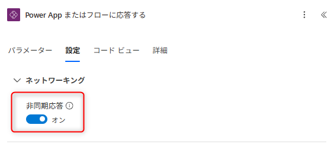

こんにちは、Power Platform サポートチームの竹嶋です。<br/>

本記事では、Power Apps キャンバスアプリから Power Automate のクラウドフローを呼び出す構成でよくお問い合わせをいただく、**フローの呼び出しから応答までの「120 秒制限」によってタイムアウトが発生するケース**について、その仕組みと具体的な回避方法をご紹介します。

<!-- more -->

## 目次

- [目次](#目次)
- [1. 概要](#1-概要)
- [2. 120 秒制限が発生する仕組み](#2-120-秒制限が発生する仕組み)
- [3. 回避策：非同期応答をオンにする](#3-回避策非同期応答をオンにする)
    - [手順 1. フローを作成する（応答を非同期にする）](#手順-1-フローを作成する応答を非同期にする)
    - [手順 2. アプリから呼び出す](#手順-2-アプリから呼び出す)
- [まとめ](#まとめ)

<a id='1-概要'></a>

## 1. 概要

Power Apps キャンバスアプリから `'フロー名'.Run()` でクラウドフローを呼び出し、「Power App またはフローに応答する」アクションで結果を受け取る構成は、データ取得や処理のオフロードなどで広く利用されています。

一方で、この呼び出しには **応答が返るまで 120 秒という時間制限** があります。フロー内の処理が長引いて 120 秒以内に応答を返せない場合、**呼び出し元のアプリ側でタイムアウトエラーが発生** します。

ここで重要なのは、これが **フロー全体の実行時間ではなく「応答を返すまで」の制限** であるという点です。フロー自体はバックエンドで実行を継続している場合があり、「フローは成功しているのに、アプリ側だけがエラーになる」という状況も起こり得ます。

本記事では、この 120 秒制限の仕組みと、長時間処理が見込まれる場合の回避策をご紹介します。

<a id='2-120-秒制限が発生する仕組み'></a>

## 2. 120 秒制限が発生する仕組み

Power Apps からのフロー呼び出しは、内部的には **HTTP の同期通信** で行われます。アプリは「Power App またはフローに応答する」アクションからの応答を待ち受けますが、この同期リクエスト／応答には公開情報のとおり 120 秒の上限が設けられています。

> 受信要求（インスタント フローのトリガーや HTTP 要求トリガーなど）の制限は **120 秒（2 分）**。

[自動化フロー、スケジュール フロー、インスタント フローの制限 - Power Automate | Microsoft Learn](https://learn.microsoft.com/ja-jp/power-automate/limits-and-config#request-limits)

つまり、フロー内で実行されるデータ取得・外部 API 呼び出し・AI 処理などの合計が 120 秒に近づくと、応答が間に合わずタイムアウトに至ります。

この制限を回避する方法として **「非同期応答」をオンにする** 手順をご紹介します。

<a id='3-回避策非同期応答をオンにする'></a>

## 3. 回避策：非同期応答をオンにする

120 秒制限は HTTP 同期応答の仕様であり、値を変更することはできません。そこで有効なのが、「Power App またはフローに応答する」アクションの **「非同期応答」トグルをオンにする** 方法です。

非同期応答をオンにすると、フローは呼び出し元へ即座に **202（Accepted）** と **Location ヘッダー**（状態確認用 URL）を返します。呼び出し元はこの URL を使って処理状況をバックグラウンドで確認し、処理が完了した時点で最終的な結果を受け取ります。Power Apps キャンバスアプリの `.Run()` もこの仕組みを解釈するため、**フローの処理が 120 秒を超えても、完了後の結果をそのまま受け取とることが可能です**。

応答アクションの設定トグルを 1 つ変更するだけで長時間処理に対応できるため、基本的には**フローのアクションの並びを作り変えずに** 対応することが出来ることも利点になります。

#### 手順 1. フローを作成する（応答を非同期にする）

前提として、「Power Apps がフローを呼び出したとき (V2)」をトリガーに、時間のかかる処理を実行し、最後に「Power App またはフローに応答する」アクションを配置されているとします。

```text
１．[Power Apps がフローを呼び出したとき (V2)]
２．時間のかかるアクション・処理を実行
３．[Power App またはフローに応答する]
```

「Power App またはフローに応答する」アクションの **設定（…）→「非同期応答」をオン** にします。

<!-- 📸 キャプチャ（3-async-toggle）: 「Power App またはフローに応答する」の設定で「非同期応答」がオンになっている状態。 -->


#### 手順 2. アプリから呼び出す

アプリ側は通常どおり `.Run()` で呼び出すだけです。非同期応答により、120 秒を超える処理でもタイムアウトせず、完了後の結果を受け取れます。

> [!NOTE]
> 非同期応答の詳細については、下記の公開情報をご参照ください。
> [非同期応答の使用 - Power Automate | Microsoft Learn](https://learn.microsoft.com/ja-jp/power-automate/guidance/coding-guidelines/asychronous-flow-pattern)

<a id='まとめ'></a>

## まとめ

- Power Apps からのフロー呼び出しには、**応答までに 120 秒（2 分）の制限** があります。これは HTTP 同期応答の仕様であり、値の変更はできません。
- これは **フロー全体の実行時間ではなく「応答を返すまで」の制限** です。
- 長時間処理が見込まれる場合は、「Power App またはフローに応答する」アクションの **「非同期応答」をオンにする** だけで回避できます。
- 非同期応答をオンにすると、フローの構成を作り変えることなく、120 秒を超える処理の結果も `.Run()` でそのまま受け取れます。