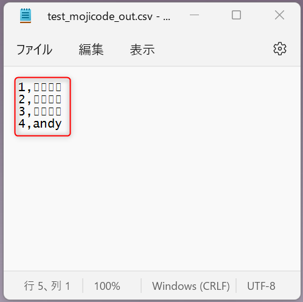

# Power Automate でテキストファイルの文字化けを回避する

こんにちは、 Power Platform サポートの竹内です。  
今回は、 Power Automate で起きる日本語テキストファイルの文字化け事例と対処法から、特に多くお問い合わせをいただくものを２つご紹介します。  
① Power Automate 内で作成した CSV ファイルを Excel で開く際に文字化けを起こさない方法  
② 文字コードが ANSI(Shift_JIS) であるテキストファイルを Power Automate で文字化けを起こさずに扱う方法

### [前提条件]

現在 Power Automate はテキストファイルの文字コードを UTF-8 として扱います。Power Automate で Shift_JIS  など他の文字コードでのテキストファイルを作成することはできません。

<!-- more -->

## ① Power Automate 内で作成した CSV ファイルを Excel で開く際に文字化けを起こさない方法  

### [事象]

例として下図のように、Power Automate で JSON を CSV として変換して OneDrive for Business に保存するフローを考えます。  

  

このフローをそのまま実行し、 OneDrive for Business に保存された CSV ファイルを Excel Online で開いてみると、下図のように文字化けしてしまいます。  
  
  
 

### [原因]  

これは Power Automate によって作成されたCSV形式のテキストファイルは文字コードが UTF-8 であるのに対し、 Excel Online は文字コードが ANSI(Shift_JIS) であると見なして処理してしまうためです。先ほどのフローで OneDrive for Business 上に保存されたCSVファイルをダウンロードして Windows 標準のメモ帳アプリで開くと、下図のように文字コードが UTF-8 であることが確認できます。  

  
 

### [対処法]  

Excel Online が文字コードを正しく判断できていないことが原因なので、文字コードが UTF-8 であることを教えてあげるための記号として、 BOM(Byte Order Mark) を付けます。
UTF-8 の BOM は「0xEF 0xBB 0xBF」の3バイトの文字列なので、これをテキストファイルの先頭に付与します。  
 
では、先ほどのフローを下図のように編集してみます。  

[OneDrive for Business] コネクタの [ファイルの作成] アクションの「ファイルコンテンツ」の入力項目を以下のように変更しました。  

`concat(decodeUriComponent('%EF%BB%BF'),body('CSV_テーブルの作成'))`  

これでBOM付きのCSVファイルを作成することができました。では、このフローを実行して作成されたファイルを開いてみましょう。  

上図のように日本語が文字化けすることなく表示されている様子を確認することができます。  
 
ひとつ目の事例は以上となります。  
 
 

## ② 文字コードがANSI(Shift_JIS)であるテキストファイルをPower Automateで文字化けを起こさずに扱う方法  

### [事象]  

例として下図のような CSV ファイルを Power Automate で扱うことを考えます。
特徴として以下の二つが挙げられます。  

1. 日本語が含まれている。  
2. 文字コードが ANSI(Shift_JIS) である。  

  

OneDrive for Business に格納してあるこの CSV ファイルを下図のようなフローで扱います。  

  

このフローを実行し、出力されたファイルをダウンロードして表示すると、下図のように日本語が文字化けしている様子が見られます。

  

フローの実行履歴を確認すると、下図のように [ファイルコンテンツの取得] のアクションで日本語が文字化けしていることが分かります。  

  
 

### [原因]  

Power Automate はテキストファイルを読みこむ際に、既定では自動で UTF-8 にエンコードします。このため、 UTF-8 以外の文字コードで記述されているテキストファイルのコンテンツを読み込む際に文字化けが発生してしまいます。  
 

### [対処法]  

UTF-8としてデコードする動作を回避し、元のファイルコンテンツをそのまま扱うように設定します。
読み込むファイルをテキストファイルだと判断し、UTF-8にエンコードする動作を変更する方法をご紹介します。下図のように [OneDrive for Business] コネクタの [ファイルコンテンツの取得] アクションで、「詳細オプションを表示する」を選択してください。

  

すると、下図のように「コンテンツタイプの推測」という項目が表示されます。これが既定では「はい」になっているところを、「いいえ」に変更してください。  
 
(変更前)

  

(変更後)

  

この状態で先ほどの下図のフローをもう一度実行してみます。  

  

実行履歴を確認してみると、下図のように結果が変化していることを確認できます。  

  

また、出力されたファイルを確認してみると、下図のように①日本語が文字化けしていないこと②文字コードが ANSI のままであること、を確認することができます。  

 

### [注釈]  

上記では [OneDrive for Business] コネクタの [ファイルコンテンツの取得] アクションを例に取り上げましたが、類似のアクションでは同様の設定項目があります。以下に例を示します。  
 

1. [SharePoint] コネクタの [ファイルコンテンツの取得]

2. [File System] コネクタの [ファイルコンテンツの取得]

## 最後に

以上、Power Automate で日本語のテキストファイルを扱う際に文字化けを回避する方法をご紹介いたしました。  
参考になりましたら幸いです。  
