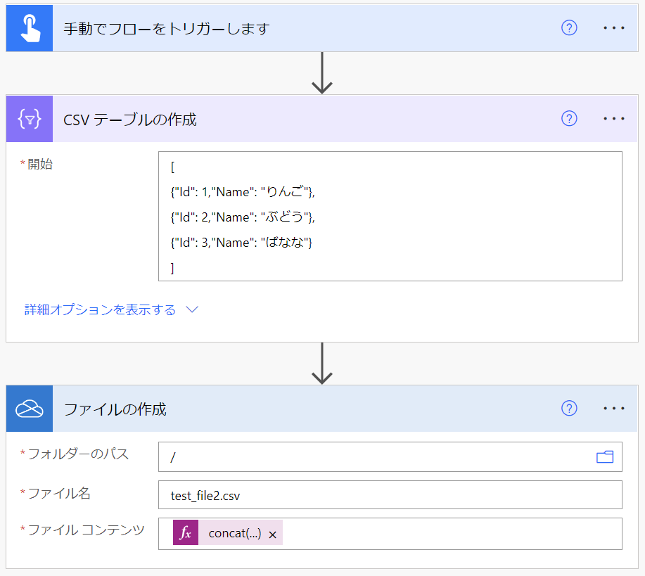

# Power Automate でテキストファイルの文字化けを回避する

こんにちは、 Power Platform サポートの竹内です。  
今回は、 Power Automate で起きる日本語テキスト ファイルの文字化け事例と対処法から、特に多くお問い合わせをいただくものを 2 つご紹介します。  
① Power Automate 内で作成した CSV ファイルを Excel で開く際に文字化けを起こさない方法  
② 文字コードが ANSI (Shift_JIS) であるテキスト ファイルを Power Automate で文字化けを起こさずに扱う方法

### [前提条件]

現在 Power Automate はテキスト ファイルの文字コードを UTF-8 として扱います。Power Automate で Shift_JIS  など他の文字コードでのテキスト ファイルを作成することはできません。

<!-- more -->

## ① Power Automate 内で作成した CSV ファイルを Excel で開く際に文字化けを起こさない方法  

### [事象]

例として下図のように、Power Automate で JSON を CSV として変換して OneDrive for Business に保存するフローを考えます。  

  

このフローをそのまま実行し、 OneDrive for Business に保存された CSV ファイルを Excel Online で開いてみると、下図のように文字化けしてしまいます。  
  
  
 

### [原因]  

これは Power Automate によって作成された CSV 形式のテキスト ファイルは文字コードが UTF-8 であるのに対し、 Excel Online は文字コードが ANSI (Shift_JIS) であると見なして処理してしまうためです。先ほどのフローで OneDrive for Business 上に保存された CSV ファイルをダウンロードして Windows 標準のメモ帳アプリで開くと、下図のように文字コードが UTF-8 であることが確認できます。  

  
 

### [対処法]  

Excel Online が文字コードを正しく判断できていないことが原因なので、文字コードが UTF-8 であることを教えてあげるための記号として、BOM (Byte Order Mark) を付けます。
UTF-8 の BOM は「0xEF 0xBB 0xBF」の 3 バイトの文字列なので、これをテキスト ファイルの先頭に付与します。  
 
では、先ほどのフローを下図のように編集してみます。  

[OneDrive for Business] コネクタの [ファイルの作成] アクションの「ファイル コンテンツ」の入力項目を以下のように変更しました。  

`concat(decodeUriComponent('%EF%BB%BF'),body('CSV_テーブルの作成'))`  

これで BOM 付きの CSV ファイルを作成することができました。では、このフローを実行して作成されたファイルを開いてみましょう。  

上図のように日本語が文字化けすることなく表示されている様子を確認することができます。  
 
ひとつ目の事例は以上となります。  
 
 

## ② 文字コードが ANSI (Shift_JIS) であるテキストファイルを Power Automate で文字化けを起こさずに扱う方法  

### [事象]  

例として下図のような CSV ファイルを Power Automate で扱うことを考えます。
特徴として以下の 2 つが挙げられます。  

1. 日本語が含まれている。  
2. 文字コードが ANSI (Shift_JIS) である。  

  

OneDrive for Business に格納してあるこの CSV ファイルを下図のようなフローで扱います。  

  

このフローを実行し、出力されたファイルをダウンロードして表示すると、下図のように日本語が文字化けしている様子が見られます。

  

フローの実行履歴を確認すると、下図のように [ファイル コンテンツの取得] のアクションで日本語が文字化けしていることが分かります。  

  
 

### [原因]  

Power Automate はテキスト ファイルのファイル コンテンツ取得時に、 "コンテンツ タイプの推測" オプションにより読み込むファイルが UTF-8 で符号化されているテキスト ファイルであると自動的に判断し、変換処理を行います。このため、 UTF-8 以外の文字コードで記述されているテキスト ファイルのコンテンツを読み込む際に正しく変換処理を行うことができず、文字化けが発生してしまいます。  
 

### [対処法]  

"コンテンツ タイプの推測" オプションを無効にすることで、 UTF-8 であると自動的に判断して変換する動作を回避し、元のファイル コンテンツをそのまま扱うことができるようになります。
以降ではその設定方法をご紹介します。  
下図のように [OneDrive for Business] コネクタの [ファイル コンテンツの取得] アクションで、「詳細オプションを表示する」を選択してください。

  

すると、下図のように「コンテンツ タイプの推測」という項目が表示されます。これが既定では「はい」になっているところを、「いいえ」に変更してください。  
 
(変更前)

  

(変更後)

  

この状態で先ほどの下図のフローをもう一度実行してみます。  

  

実行履歴を確認してみると、下図のように結果が変化していることを確認できます。  

  

また、出力されたファイルを確認してみると、下図のように ①日本語が文字化けしていないこと ②文字コードが ANSI のままであること、を確認することができます。  

 

### [注釈]  

上記では [OneDrive for Business] コネクタの [ファイル コンテンツの取得] アクションを例に取り上げましたが、類似のアクションでは同様の設定項目があります。以下に例を示します。  
 

1. [SharePoint] コネクタの [ファイル コンテンツの取得]

2. [File System] コネクタの [ファイル コンテンツの取得]

> [!WARNING]
> 本記事で紹介した設定は、UTF-8 以外のコンテンツを Base64 形式に変換しデータの破損 (文字化け) を防ぐ方法です。   
クラウドフロー内部で文字列として認識できるのは UTF-8 のテキストファイルのみです。そのため、上記の方法で Base64 形式で取得したデータは、文字列操作を行うことはできません。変数等に格納した場合、base64形式のデータがそのまま設定される動作となります。
　

## 最後に

以上、Power Automate で日本語のテキスト ファイルを扱う際に文字化けを回避する方法をご紹介いたしました。  
参考になりましたら幸いです。  
