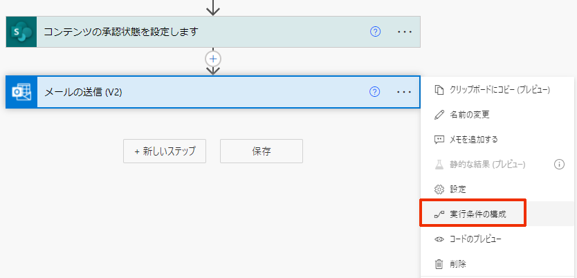
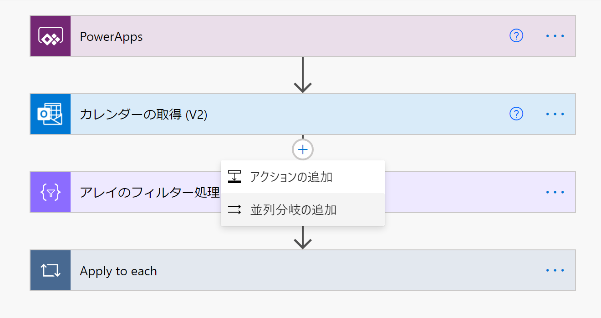
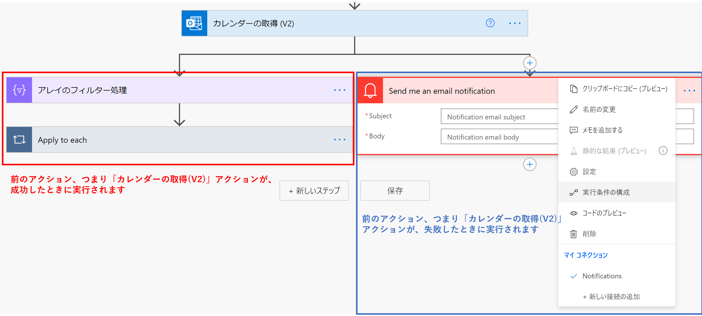
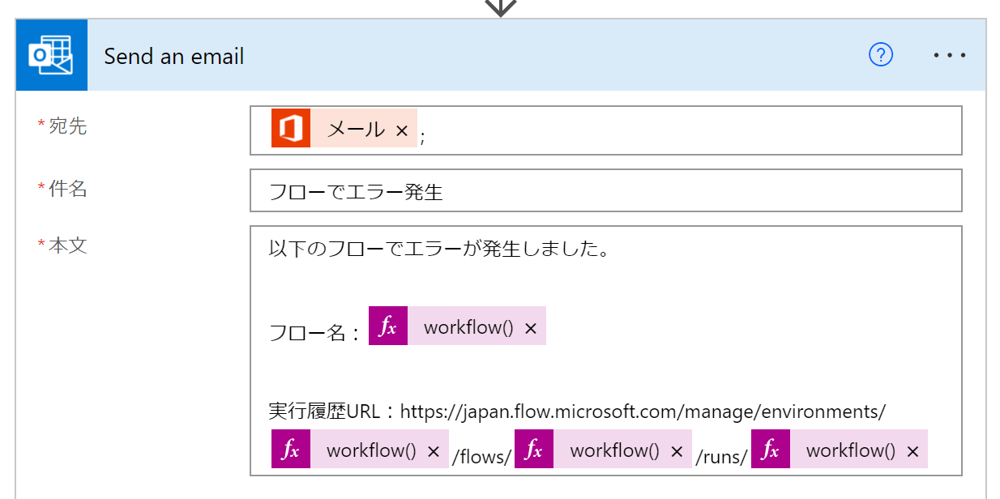
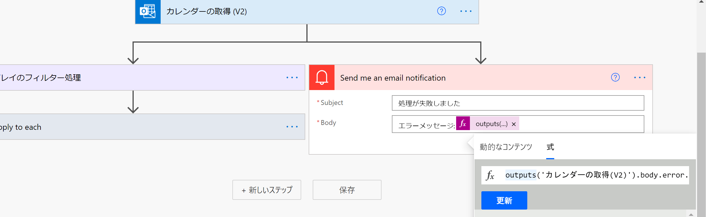

こんにちは、Power Platform サポートチームの三宅です。  
  今回は、 Power Automate でクラウド フローでエラー処理を行う方法についてご紹介いたします。
  
  <!-- more -->

## 実行条件を構成する    
 
クラウド フローの「実行条件の構成」機能では、直前のアクションの終了状態に応じてアクションの実行の有無を制御できます。  
エラーの予測されるアクションがある場合、後続アクションの実行条件を構成することで、エラーの有無にかかわらずフローを最後まで実行させることができます。  

**[手順]**  
1. アクションの [メニュー] から、[実行条件の構成] を選択します。  
 　
2. アクションが実行されるタイミングについて、チェックボックスの任意の値を選んで [完了] をクリックします。  
以下の例では、「カレンダーの取得(V2)」アクションが成功または失敗した時に「Apply to each」処理が実行されます。
タイムアウトまたはスキップした時には実行されません。  
  

各実行条件の説明は以下の通りです。 

- に成功しました・・既定値。前のアクションが成功した時に実行されます。  
- に失敗しました・・前のアクションがエラーになったときに実行されます。  
- がスキップされます・・前のアクションがスキップされたときに実行されます。  
- がタイムアウトしました・・フロー自体のタイムアウト、またはアクションごとのタイムアウト（アクションの設定）に該当した場合に実行されます。

## アクションの成否によって後続のアクションを変更する

並列分岐を用いることで、アクションが成功した場合と失敗した場合とで異なる処理を行うことも可能です。

例として、エラーが予測されるアクションの後にステップがある場合、[並列分岐の追加] から、前のアクションが失敗した場合にメールを送るステップを追加します。  
  



## エラー情報を取得する  

### 実行履歴の URL の取得
式にて[ワークフロー関数](https://docs.microsoft.com/ja-jp/azure/logic-apps/workflow-definition-language-functions-reference#workflow)を使用することで、実行履歴の URL を生成し、メール等で送付することが可能です。  

実行履歴の URL は下記のような構成となっております。  
https://japan.flow.microsoft.com/manage/environments/{環境ID}/flows/{FlowName}/runs/{実行ID}  

各値を取得する式は、以下の通りです。  

- 環境ID : workflow().tags.environmentName  
- FlowName : workflow().name  
- 実行ID : workflow().run.name  
- フロー表示名 : - workflow().tags.flowDisplayName  

「メールの送信(V2)」アクションでの使用例：  
  

### エラーメッセージの取得
実行時のアクションの出力を返す outputs 関数を用いることで、エラー情報を取得することが可能です。  
例えば、「式」にて以下のように記述することで、エラーメッセージを取得することができます。  
```outputs('<アクション名>').body.error.message```  

「失敗しました」側のアクションでの使用例:  
  
参考：[式関数のリファレンス ガイド](https://docs.microsoft.com/ja-jp/azure/logic-apps/workflow-definition-language-functions-reference#outputs)

なお、アクションによっては上記の式でエラーメッセージを取得できない場合もありますので、想定されるエラーについて応答 body の json の構造を確認して、適切な式をご設定ください。  
参考：[式関数のリファレンス ガイド](https://docs.microsoft.com/ja-jp/azure/logic-apps/workflow-definition-language-functions-reference#outputs)

## スコープを用いてフロー全体を監視する  
実行条件を用いる方法ではアクション単位でのエラー検知が必要でしたが、コントロール コネクタの [スコープ] を用いると、フロー全体を監視することが可能です。
以下、Try、Catch、Finally テンプレートによるエラー処理の手順をご紹介いたします。  
[Try、Catch、Finally テンプレート](https://flow.microsoft.com/en-us/galleries/public/templates/e8e028c6df7b4eb786abdf510e4f1da3/try-catch-and-finally-template/)  
  

**[手順]**  
1. Try スコープ内に、メインとなるアクションを挿入します。  
2. Catch スコープの実行条件は Try ブロックが失敗した際に実行するように設定されています。Try ブロックが失敗した際は、Catch スコープ内のアクションによりメールが送信されます。  
3. Finally スコープ内には、前のアクションの成否にかかわらず実行されるアクションを挿入します。  

### 参考情報  
[Error handling steps, counters, a new flow details experience and more](https://powerautomateweb.microsoft.com/en-us/blog/error-handling/)
