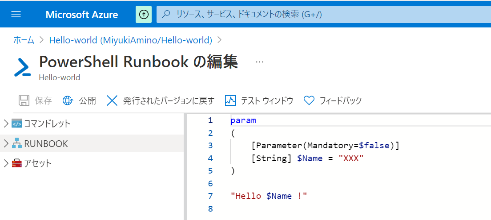
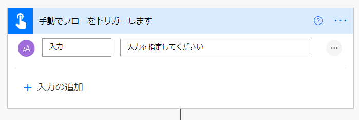
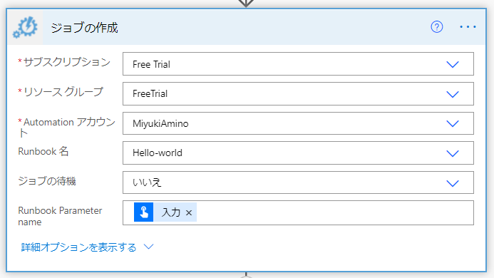
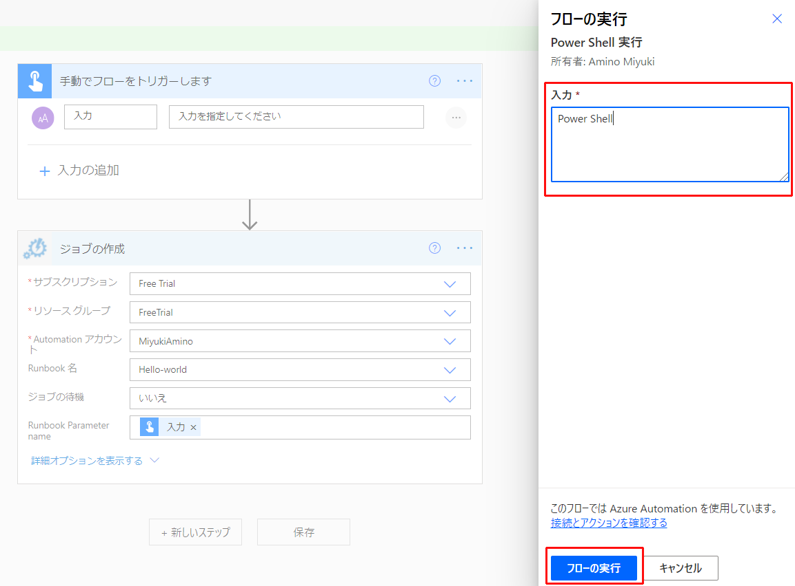
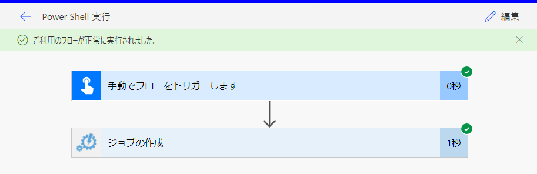
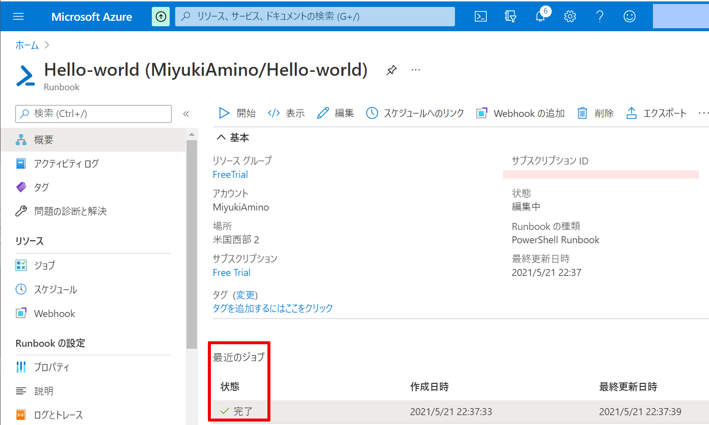
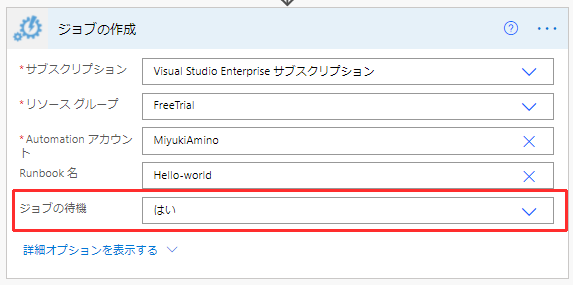

#  Power Automate から Power Shell を実行する方法

こんにちは、Power Platform サポートチームの網野です。

 
今回は、Power Automate から Power Shell を実行する方法についてご案内致します。

Power AutomateとPower Shellと連携させることで、業務自動化の幅を広げていきましょう。

 

<!-- more -->

# 目次
1. [はじめに](#anchor-intro)
1. [必要なライセンス](#anchor-license)
1. [手順](#anchor-setup-steps)
      1. [事前準備](#anchor-preparation)
      1. [Runbookの作成](#anchor-create-runbook)
      1. [フローの作成](#anchor-create-flow)
      1. [実行結果](#anchor-resutls)
1. [FAQ](#anchor-faq)
1. [Power Shellリンク集](#anchor-powershell-links)

## はじめに

Azure Automation Runbook という機能をご存じでしょうか。 
Azure上でPower ShellやPythonなどを実行することができる機能です。 
 
このRunbookを利用すると、Power AutomateのフローにPower Shellを組み込むことができます。 
Power Automateと組み合わせることによって、例えば以下のようなフローを構築し、業務を自動化できます。 
 - FormsでMicrosoft 365 管理センターのロール申請を行い、承認されたら、Power Shellでロール付与する 
 

申請者は申請だけを、承認者は承認だけをすれば、ロール付与ができるようになります。ロール付与にかけていた時間で重要な業務に集中できるようになりますね！
 

## 必要なライセンス

Power Automate の有償ライセンスと、Azure Automationのライセンスが必要です。 
各ライセンスの概要については、それぞれ以下のページをご参照ください。

- [Power Automateの有償ライセンス](https://flow.microsoft.com/ja-jp/pricing/)
- [Azure Automation の公開価格](https://azure.microsoft.com/ja-jp/pricing/details/automation/)

 

## 手順

＜[参考：Azure Automationコネクタ](https://docs.microsoft.com/ja-jp/connectors/azureautomation/)＞

### ■事前準備
1.  Azure Automation アカウントを作成します  
 [「Automation アカウントを作成する」](https://docs.microsoft.com/ja-jp/azure/automation/automation-quickstart-create-account)を実施してください。

### ■Runbookの作成
1.  Runbookを作成します  
 [「Runbookの作成」](https://docs.microsoft.com/ja-jp/azure/automation/automation-quickstart-create-runbook)を実施してください。

2. Runbookの「編集」からPower Shellを作成します。 
   実行したい処理を記載してください。 
    
   「Param」を指定することでフローからパラメータを渡すことができます。 
    サンプルでは、String型の「Name」パラメータを受け取り、コンソールに表示します。 
   
　　 
3. Runbookを「保存」後「公開」を押下します 
   

### ■フローの作成
ボタンを押したときに、Power Shellを実行するフローを作成します。 

1. トリガーに「手動でフローをトリガーします」を設定します。 
   実行時の入力項目に「テキスト」を追加します。 
   
    

2. Power Shellを実行する処理を作成します。 
   Azure Automationコネクタの「ジョブの作成」を追加します。各項目にRunbookの値を指定します。 
    
   サンプルではPower Shellにフロー実行時に入力したテキストを渡したいと思いますので 
   「Runbook Parameter name」に動的コンテンツ「入力」を設定します。 
   
   
    

### ■実行結果

1. フローを実行します。 
   入力欄に「Power Shell」と入れ、「フローの実行」を押します。 
     
   フローが正常終了したことを確認します。 
   
   

2. Azure上でPower Shellが実行されたか確認します。 
   ジョブの状態が完了になっていることを確認します。 
    
    
   コンソールに実行時に入力した「Power Shell」の文字が表示されていることが確認できます。 
   
　　 
　 

## FAQ
### Q1. ジョブが完了を待ちたい
  「ジョブの待機」を「はい」に変更してください。 
   
　

## Power Shell リンク集
 - [Power Apps/Power Automate](https://docs.microsoft.com/ja-jp/power-platform/admin/powerapps-powershell)
 - [Azure](https://docs.microsoft.com/ja-jp/powershell/azure/?view=azps-6.3.0&viewFallbackFrom=azps-3.0.0)
 - [Microsoft 365](https://docs.microsoft.com/ja-jp/microsoft-365/enterprise/getting-started-with-microsoft-365-powershell?view=o365-worldwide)
 - [Teams](https://docs.microsoft.com/ja-jp/microsoftteams/teams-powershell-overview)
 - [SharePoint](https://docs.microsoft.com/ja-jp/powershell/sharepoint/?view=sharepoint-ps)
 
 
Power ShellとPower Automateを組み合わせることで、みなさまの業務自動化が進むことを楽しみにしています。 
自動化のアイデアを共有してもいいよという方がいましたら、ぜひ私たちに共有してくださいね。

---
Hope to acceralate your business with Power Automate!