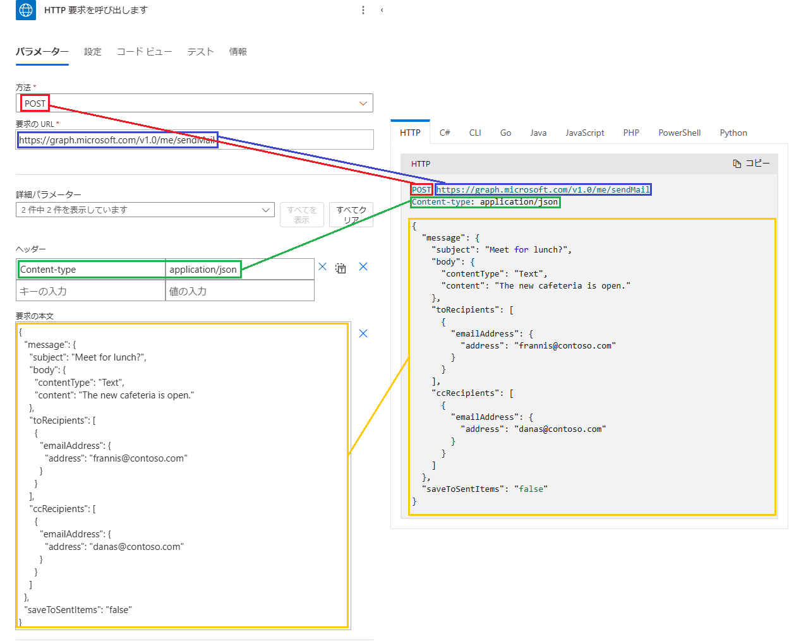

こんにちは、Power Platform サポートチームの清水、竹内です。
この記事では、Power Automate を使用して、Microsoft Graph API を実行する方法についてご紹介いたします。

<!-- more -->
# 目次

- [目次](#目次)
- [はじめに](#はじめに)
- [必要なライセンス](#必要なライセンス)
- [使用する API を決定する](#使用する-api-を決定する)
- [必要なアクセス許可を確認する](#必要なアクセス許可を確認する)
- [HTTP with Microsoft Entra ID (preauthorized) コネクタまたは HTTP with Microsoft Entra ID コネクタを使用する](#http-with-microsoft-entra-id-preauthorized-コネクタまたは-http-with-microsoft-entra-id-コネクタを使用する)
- [HTTP コネクタを使用する](#http-コネクタを使用する)
  - [おわりに](#おわりに)

# はじめに
---
Power Automate では、コネクタを使用して様々な操作を自動化することができますが、目的の操作がコネクタでは用意されていない場合、API を使用することでフローでの自動化が実現可能な場合があります。  

ここでは、Microsoft Graph API を使用して API リクエストを送信する 2 つの方法について、ご説明いたします。

# 必要なライセンス
---
今回作成するフローではプレミアム コネクタを使用するため、以下のいずれかのライセンスが必要です。  

- Power Automate Premium
- Power Automate Process

# 使用する API を決定する
---
まずは使用する API を決定します。  
[Microsoft Graph API のリファレンス](https://learn.microsoft.com/ja-jp/graph/api/overview?view=graph-rest-1.0) から、目的に合った API を探してください。  

本記事では、よくあるお問い合わせの一つとして、「テキスト形式でメールを送信する」処理を例にとって進めていきたいと思います。  
Power Automate の Office 365 Outlook コネクタ「メールを送信する (V2)」アクションでは、HTML 形式のメールしか送信できませんが、Graph API を使用することで、テキスト形式でメールを送信することも可能です。  
今回使用する API はこちらです。  
[メールを送信する - Microsoft Graph v1.0 | Microsoft Learn](https://learn.microsoft.com/ja-jp/graph/api/user-sendmail?view=graph-rest-1.0&tabs=http)  

# 必要なアクセス許可を確認する
---
公開情報には、必ず API を呼び出すために必要なアクセス許可が記されているので、「アクセス許可」のセクションにて必要なアクセス許可が何かを確認してください。   

アクセス許可の選択方法などの詳細については、[Microsoft Graph のアクセス許可のリファレンス | Microsoft Learn](https://learn.microsoft.com/ja-jp/graph/permissions-reference)をご参照ください。  
今回使用する API では、以下のアクセス許可が必要です。  

  

ここで、アクセス許可には「委任」と「アプリケーション」の 2 種類があります。  

- 委任されたアクセス許可  
  ユーザーの代わりにアクセスする際に使用いたします。  
  API を実際に実行するアプリケーションに対し、サインインしているユーザーとして動作するためのアクセス許可が委任されます。  
  
- アプリケーションのアクセス許可  
  ユーザーなしでアクセスする際に使用いたします。  
  API を実行するアプリケーション自体にアクセス許可を付与します。  

委任されたアクセス許可が使用できる場合は、ユーザーに変わって API を実行する HTTP with Entra ID (preauthorized) コネクタまたは HTTP with Entra ID コネクタが、  
アプリケーションのアクセス許可が使用できる場合は、ユーザーなしで API を実行する HTTP コネクタが使用できます。  

それぞれのコネクタの使い方について説明します。  

# HTTP with Microsoft Entra ID (preauthorized) コネクタまたは HTTP with Microsoft Entra ID コネクタを使用する  
---
HTTP with Microsoft Entra ID (preauthorized) コネクタまたは HTTP with Microsoft Entra ID コネクタでは、接続でサインインしたユーザーに代わって API を実行できます。  

> [!NOTE]   
> Microsoft Entra ID は Azure Active Directory の名称が変更されたものです。この変更の更なる詳細についてはこちらのドキュメント（[Azure Active Directory は Microsoft Entra ID に名称変更されています - Microsoft Entra | Microsoft Learn](https://learn.microsoft.com/ja-jp/entra/fundamentals/compare)）をご参照ください。   
> 
> この変更に伴い、HTTP with Azure AD コネクタは HTTP with Microsoft Entra ID (preauthorized) コネクタに変更されました。  
> また、利用者のアクセス可能な範囲の制御を容易にするため、HTTP with Microsoft Entra ID コネクタが作成されました。  
> これらのコネクタについての更なる詳細については、こちらのドキュメント（[Microsoft Entra ID 付きの HTTP (事前承認済み) - Connectors | Microsoft Learn](https://learn.microsoft.com/ja-jp/connectors/webcontents/)）（[Microsoft Entra ID を使用した HTTP - Connectors | Microsoft Learn](https://learn.microsoft.com/ja-jp/connectors/webcontentsv2/)）をご参照ください。  

以降では HTTP with Microsoft Entra ID (preauthorized) コネクタを使用した例をご紹介いたします。   
1. HTTP with Microsoft Entra ID (preauthorized) コネクタの「HTTP 要求を呼び出します」アクションを挿入します。
2. コネクタを初めて使用する場合、接続を作成します。  
   今回は Graph API を実行するため、「基本リソース URL」と「Microsoft Entra ID リソース URI (アプリケーション ID URI)」の両方に以下の URI を設定し、[サインイン] をクリックします。  
   - URI: https://graph.microsoft.com  
   
     

   ※ここでサインインしたユーザーのアクセス許可が委任され、API が実行されます。  
3. [API のリファレンス](https://learn.microsoft.com/ja-jp/graph/api/user-sendmail?view=graph-rest-1.0&tabs=http#http-request) を参考に、リクエストを作成します。  
 
     

   <補足>  
   本文の指定方法は、各リソースのリファレンスを参考に変更してください。  
   今回は、Message リソースを使用するので、下記の公開情報を参照しました。  
   [メッセージ リソースの種類 - Microsoft Graph | Microsoft Learn](https://learn.microsoft.com/ja-jp/graph/api/resources/message?view=graph-rest-1.0)  
   
   また、テキスト形式でメールを送信することが目的なので、 `message.body.contentType` を `Text` に設定します。  
   
     
   
4. フローを実行し、正常に実行されるか確認します。  

> [!NOTE]  
> 必要なアクセス許可の種類によっては、HTTP with Microsoft Entra ID (preauthorized) コネクタでは API が実行できない場合があります。  
> HTTP with Microsoft Entra ID (preauthorized) コネクタで実行できる権限スコープの一覧は現時点では公開されておりませんが、フローを実行した際に権限エラーが発生する場合、HTTP with Microsoft Entra ID (preauthorized) コネクタでは実行できない可能性がございますので、HTTP with Microsoft Entra ID コネクタや HTTP コネクタでの実行をお試しください。  

# HTTP コネクタを使用する  
---
HTTP コネクタでは、ユーザーのサインインなしに、Azure AD に登録したアプリから API を実行できます。  

1. Azure AD にアプリを登録します。  
   [アプリを Azure AD v2.0 エンドポイントに登録する - Microsoft Graph | Microsoft Learn](https://learn.microsoft.com/ja-jp/graph/auth-register-app-v2?context=graph%2Fapi%2F1.0&view=graph-rest-1.0) にしたがって、 Azure AD にアプリを登録します。  
   また、登録したアプリの [API のアクセス許可] のページにて、「必要なアクセス許可を確認する」の手順で確認したアプリケーションのアクセス許可を追加し、管理者の同意を与えます。  
   
      
   
2. HTTP コネクタの「HTTP」アクションを挿入します。  
   2-1. [API のリファレンス](https://learn.microsoft.com/ja-jp/graph/api/user-sendmail?view=graph-rest-1.0&tabs=http#http-request) を参考に、リクエストを作成します。  
      HTTP コネクタを使用する場合、サインイン中のユーザーがいないため、`/me/sendMail`ではなく、`/users/{id | userPrincipalName}/sendMail` の要求方法を使用することに注意してください。  
      
        
   
   2-2. 認証を「Active Directory OAuth」に設定し、Azure AD に登録したアプリから取得した情報を設定します。  
   - テナント: ディレクトリ (テナント) ID  
   - 対象ユーザー: https://graph.microsoft.com  
   - クライアント ID: アプリケーション (クライアント) ID  
   - 資格情報の種類: シークレット  
   - シークレット: [証明書とシークレット] より、新しいクライアントシークレットを発行し、発行された「値」  
   
     
   
3. フローを実行し、正常に実行されるか確認します。  

---
## おわりに

Power Automate から Graph API を実行することで、様々な操作を自動化することができます。  
ぜひ、色々なシーンで活用してみてください。
