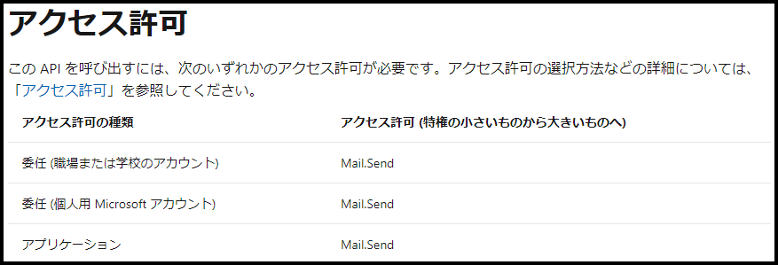
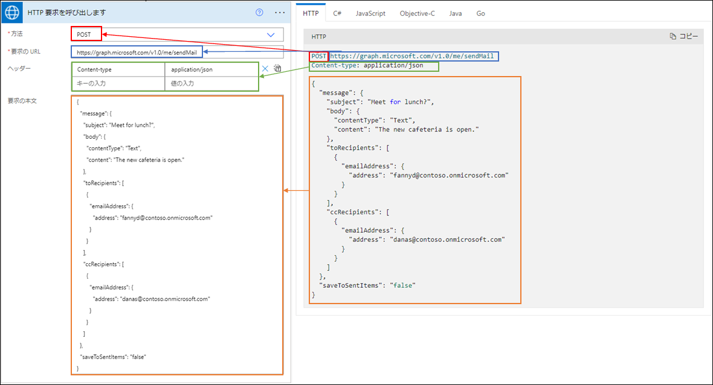
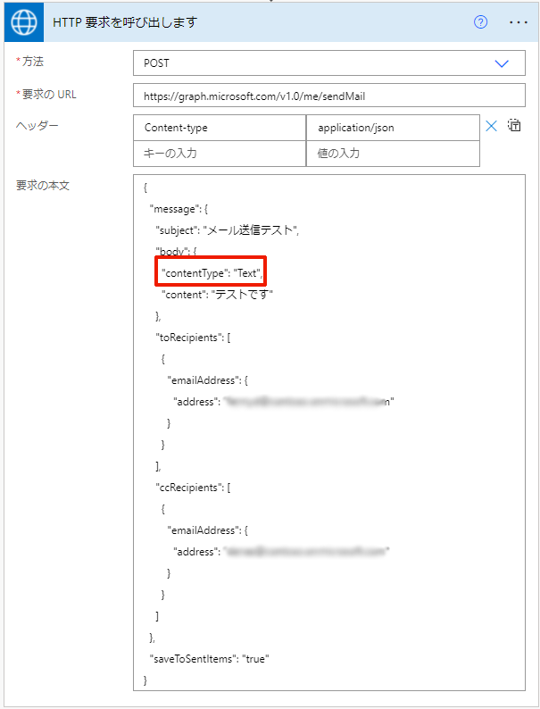
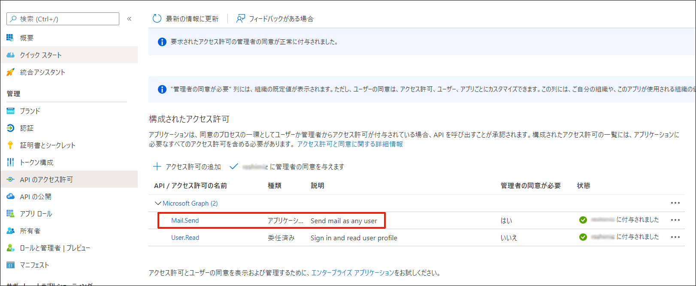
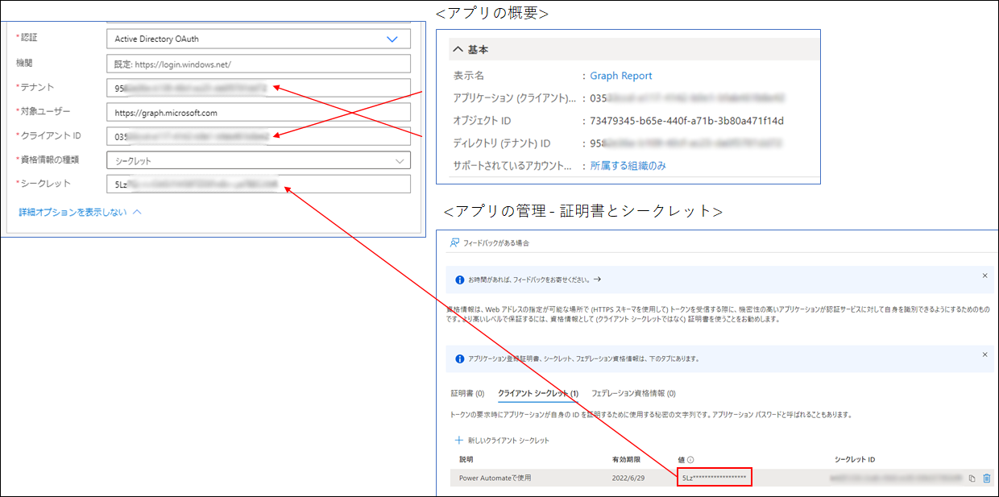

こんにちは、Power Platform サポートチームの清水です。
この記事では、Power Automate を使用して、Microsoft Graph API を実行する方法についてご紹介いたします。

<!-- more -->
# 目次

1. [はじめに](#anchor-intro)
2. [必要なライセンス](#anchor-license-requirement)
3. [使用する API を決定する](#anchor-decide-the-API)
4. [必要なアクセス許可を確認する](#anchor-check-the-permission)
5. [HTTP with Azure AD コネクタを使用する](#anchor-use-HTTP-with-Azure-AD-Connector)
6. [HTTP コネクタを使用する](#anchor-use-HTTP-connector)

# はじめに
---
Power Automate では、コネクタを使用して様々な操作を自動化することができますが、目的の操作がコネクタでは用意されていない場合があります。  

コネクタでの自動化ができない場合、代わりに API リクエストを実行することで、実現可能な場合があります。

ここでは、Microsoft Graph API を使用して API リクエストを送信する 2 つの方法について、ご説明いたします。

# 必要なライセンス
---
フローではプレミアム コネクタを使用するため、以下のいずれかのライセンスが必要です。  

- Power Automate per user
- Power Automate per flow
- Power Automate per user with attended RPA

# 使用する API を決定する
---
まずは使用する API を決定します。  
[Microsoft Graph API のリファレンス](https://docs.microsoft.com/ja-jp/graph/api/overview?view=graph-rest-1.0) から、目的に合った API を探してください。  

本記事では、よくあるお問い合わせの一つとして、「テキスト形式でメールを送信する」処理を例にとって進めていきたいと思います。  
Power Automate の Office 365 Outlook コネクタ「メールを送信する (V2)」アクションでは、HTML 形式のメールしか送信できませんが、Graph API を使用することで、テキスト形式でメールを送信することも可能です。  
今回使用する API はこちらです。  
[メールを送信する - Microsoft Graph v1.0 | Microsoft Docs](https://docs.microsoft.com/ja-jp/graph/api/user-sendmail?view=graph-rest-1.0&tabs=http)  

# 必要なアクセス許可を確認する
---
公開情報には、必ず API を呼び出すために必要なアクセス許可が記されているので、「アクセス許可」のセクションにて必要なアクセス許可が何かを確認してください。   

アクセス許可の選択方法などの詳細については、[Microsoft Graph のアクセス許可のリファレンス | Microsoft Docs](https://docs.microsoft.com/ja-jp/graph/permissions-reference)をご参照ください。  
今回使用する API では、以下のアクセス許可が必要です。  

  

ここで、アクセス許可には「委任」と「アプリケーション」の 2 種類があります。  

- 委任されたアクセス許可  
  ユーザーの代わりにアクセスする際に使用いたします。  
  API を実際に実行するアプリケーションに対し、サインインしているユーザーとして動作するためのアクセス許可が委任されます。  
- アプリケーションのアクセス許可  
  ユーザーなしでアクセスする際に使用いたします。  
  管理者の同意が必要です。  

委任されたアクセス許可が使用できる場合は、ユーザーに変わって API を実行する HTTP with Azure AD コネクタが、  
アプリケーションのアクセス許可が使用できる場合は、ユーザーなしで API を実行する HTTP コネクタが使用できます。  

それぞれのコネクタの使い方について説明します。  

# HTTP with Azure AD コネクタを使用する  
---
HTTP with Azure AD コネクタでは、接続でサインインしたユーザーに代わって API を実行できます。    

1. Azure AD を使用した HTTP コネクタの「」アクションを挿入します。
2. コネクタを初めて使用する場合、接続を作成します。  
   今回は Graph API を実行するため、「基本リソース URL」と「Azure AD リソース URL」の両方に以下の URL を設定し、[サインイン] をクリックします。  
   - URL: https://graph.microsoft.com  
   
     
   ※ここでサインインしたユーザーのアクセス許可が委任され、API が実行されます。  
3. [API リファレンスのドキュメント](https://docs.microsoft.com/ja-jp/graph/api/user-sendmail?view=graph-rest-1.0&tabs=http#http-request) を参考に、リクエストを作成します。
     
   ※引用: https://docs.microsoft.com/ja-jp/graph/api/user-sendmail?view=graph-rest-1.0&tabs=http#example-1-send-a-new-email-using-json-format  

   <補足>  
   本文の指定方法は、各リソースのリファレンスを参考に変更してください。  
   今回は、Message リソースを参照します。  
   
   [メッセージ リソースの種類 - Microsoft Graph | Microsoft Docs](https://docs.microsoft.com/ja-jp/graph/api/resources/message?view=graph-rest-1.0)  
   今回は、テキスト形式でメールを送信することが目的なので、  
   
   - message.subject (タイトル)
   - message.body.content (メール本文)
   - toRecipients (宛先)
   - ccRecipients (cc)  
  
   を変更し、message.body.contentType は "Text" のままに設定します。  
     
   
4. フローを実行し、正常に実行されるか確認します。

# HTTP コネクタを使用する  
---
HTTP コネクタでは、ユーザーのサインインなしに、Azure AD に登録したアプリから API を実行できます。  

1. Azure AD にアプリを登録します。  
   [アプリを Azure AD v2.0 エンドポイントに登録する - Microsoft Graph | Microsoft Docs](https://docs.microsoft.com/ja-jp/graph/auth-register-app-v2?context=graph%2Fapi%2F1.0&view=graph-rest-1.) にしたがって、 Azure AD にアプリを登録します。  
   また、登録したアプリの [API] のアクセス許可にて、「必要なアクセス許可を確認する」の手順で確認したアプリケーションのアクセス許可を追加し、管理者の同意を与えます。  
     
2. HTTP コネクタの「HTTP」アクションを挿入します。  
   2-1. [API リファレンスのドキュメント](https://docs.microsoft.com/ja-jp/graph/api/user-sendmail?view=graph-rest-1.0&tabs=http#http-request) を参考に、リクエストを作成します。  
     今回はサインイン中のユーザーがいないため、「/me/sendMail」ではなく、「/users/{id | userPrincipalName}/sendMail」の要求方法を使用します。  
     
   
   2-2. 認証を「Active Directory OAuth」に設定し、Azure AD に登録したアプリから取得した情報を設定します。  
   - テナント: ディレクトリ (テナント ID)
   - 対象ユーザー: https://graph.microsoft.com
   - クライアント ID: アプリケーション (クライアント ID)
   - 資格情報の種類: シークレット
   - シークレット: [証明書とシークレット] より、新しいクライアントシークレットを発行し、発行された「値」  
   
     
   
3. フローを実行し、正常に実行されるか確認します。  

---
## おわりに

Power Automate から Graph API を実行することで、様々な操作を自動化することができます。
ぜひ、色々なシーンで活用してみてください。
