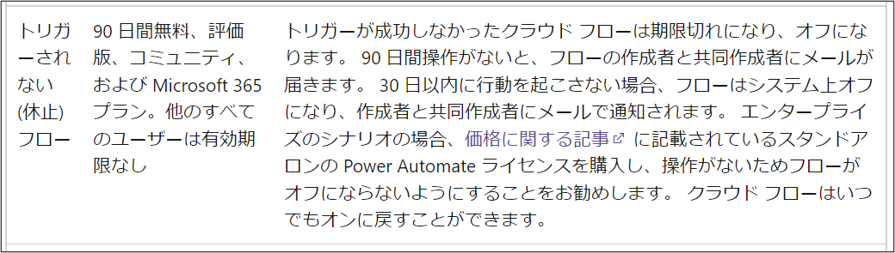
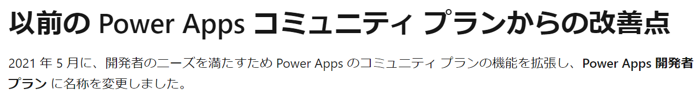
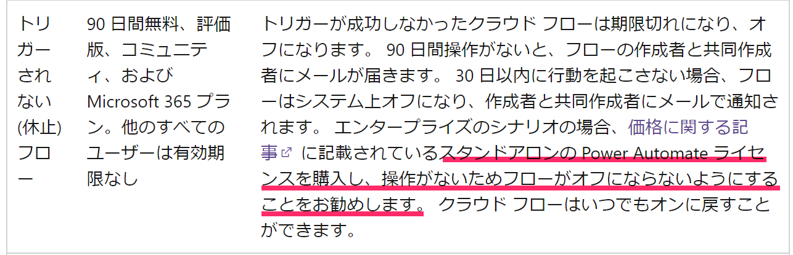
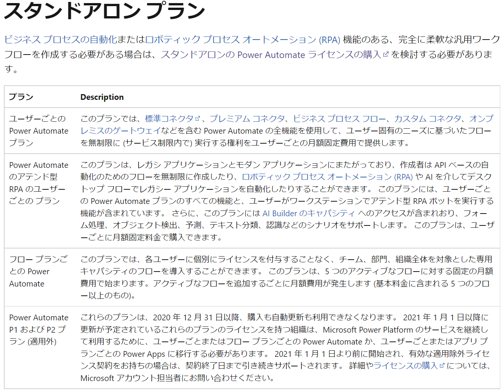
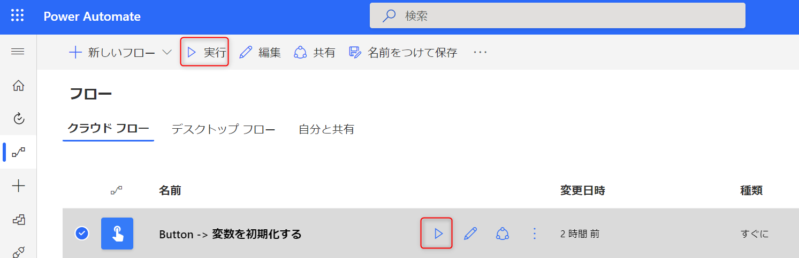
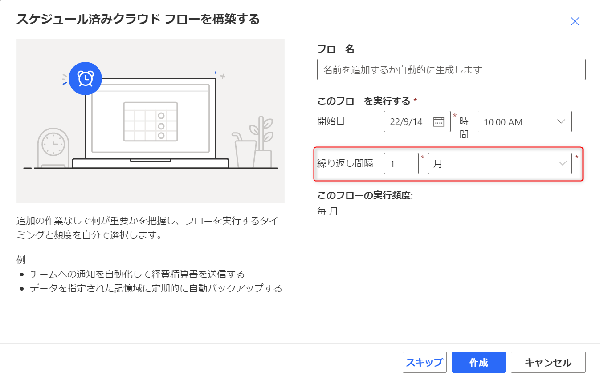
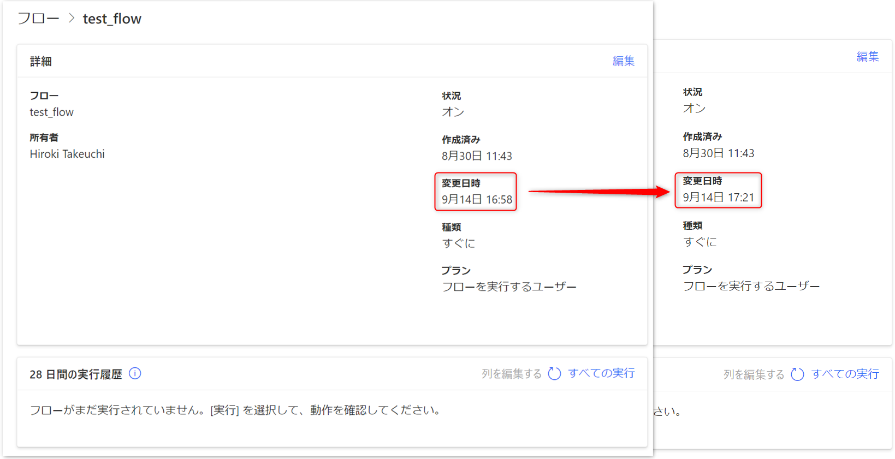

# Power Automate でフローの自動無効化に対処する

こんにちは、 Power Platform サポートの竹内です。  
今回は、 Power Automate で一定期間フローを実行していない場合に自動的に無効化される事象へ、どのように対応すればよいのかをご紹介します。

## [前提]

現在、以下のプランで Power Automate をご利用されている方々に対し、 90 日間フローを実行していない場合にはフローの作成者(所有者)と共同作成者(共同所有者)へ 30 日後にフローを自動的に無効化する旨のメールが届きます。  
その後、30 日以内に適切な対応がされない場合には、フローはシステム上無効化され、フローの作成者(所有者)と共同作成者(共同所有者)へメールで通知されます。  
[対象のプラン]  
無料版と試用版、Power Apps 開発者プラン* 、 Microsoft 365 プラン  

詳細については以下の公開文書を併せてご参照ください。

  
[制限と構成 - Power Automate | Microsoft Docs](https://docs.microsoft.com/ja-jp/power-automate/limits-and-config?WT.mc_id=BA-MVP-5003233#expiration-limits)

*Power Apps コミュニティプランは 2021 年 5 月に Power Apps 開発者プランに名称を変更しました。  

  
[Power Apps 開発者プランにサインアップ - Power Apps | Microsoft Docs](https://docs.microsoft.com/ja-jp/power-apps/maker/developer-plan#improvements-from-the-previous-power-apps-community-plan)

## [フローの無効化を回避する方法]

以降では、フローが自動的に無効化される事象を回避する方法についてご案内いたします。その方法は大きく分けて、以下の 3 つがございます。  
① スタンドアロンの Power Automate ライセンスをご購入いただく。  
② フロー作成、あるいは最終実行日から 120 日以内に 1 度以上実行していただく。  
③ フローの最終更新日から 30 日以内に 1 度以上更新していただく。

以降ではそれらについて詳細にご紹介いたします。

<!-- more -->

## ① スタンドアロンの Power Automate ライセンスをご購入いただく。  

スタンドアロンの Power Automate ライセンスを持ったユーザーがフローを作成する、あるいは自動で無効化されたくないフローをフローごとのライセンスの対象に入れることで自動で無効化される事象を回避できます。  
以下の公開文書も併せてご確認ください。  

  
[制限と構成 - Power Automate | Microsoft Docs](https://docs.microsoft.com/ja-jp/power-automate/limits-and-config?WT.mc_id=BA-MVP-5003233#expiration-limits)

また、スタンドアロンの Power Automate ライセンスの詳細につきましては以下の公開情報をご参照ください。

  
[Power Automate ライセンスの種類 - Power Platform | Microsoft Docs](https://docs.microsoft.com/ja-jp/power-platform/admin/power-automate-licensing/types)  
[価格 | Microsoft Power Automate](https://powerautomate.microsoft.com/ja-jp/pricing/)  

## ② フロー作成日、あるいは最終実行日から 120 日以内に 1 度以上実行していただく。  

フローを実行していただくことにより、フローを実行していない 90 日の期間と自動的に無効化されるまでの 30 日の期間をリセットすることができます。  
定期的に手動で実行していただく、あるいはフローのトリガーを定期的に起動するものに変更することによって実現することができます。  
まず、手動で実行していただく方法についてご紹介致します

フローの一覧画面から対象のフローを選択し、下図の赤枠のいずれかを押すことにより実行します。

  

あるいは下図のフローの詳細画面から実行することもできます。

  

 
次に、定期的に起動するトリガーを活用する方法をご紹介いたします。

フロー作成時に下図のように「スケジュール済みクラウド フロー」を選択します。

  

すると、下図のような画面が表示されるため、繰り返し間隔を 120 日以内に設定し、フローの作成を行ってください。

  

## ③ フローの最終更新日から 30 日以内に 1 度以上更新していただく。  

フローの更新をしていただくことにより、フローが自動的に無効化されるまでの 30 日の期間をリセットすることができます。  
定期的に手動で更新していただく、あるいはフローを定期的に更新するフローを作成することによって実現することができます。  

まず、手動で更新していただく方法についてご紹介致します。  
例として、下図のフローの更新を行います。最終変更日時が 9 月 14 日 12:14 であることが確認できます。  

  

では、更新を行います。このフローの編集画面へ遷移すると以下のような画面になります。  
ここで保存ボタンを押してください。

  

すると、変更日時が更新されていることが確認できます。

  

この操作を定期的に行っていただくことにより、自動的にフローがオフになる事象を回避することができます。

 
次に定期的にフローを更新するフローを活用する方法をご紹介いたします。
[Power Automate Management] コネクタの [フローの更新] アクションを使用することで、フローの更新が可能となります。
以下ではその設定方法をご案内します。

1.スケジュール済みクラウドフローを作成し、30 日以内 (下画像では 2 週) 毎に実行するよう設定する。

  

2.[Power Automate Management] コネクタの [フローの取得] アクションを追加する。  
環境：更新対象のフローがある環境を指定  
Flow：更新対象のフローを指定  

  

3.[Power Automate Management] コネクタの [フローの取得] アクションを追加する。  

環境：手順 2 で設定した環境を指定  
Flow：手順 2 で設定したフローを指定  
フローの表示名：動的なコンテンツ > フローの取得 > フローの表示名  
フロー定義：動的なコンテンツ > フローの取得 > フロー定義  
フローの状態：Started  

  

以上です。  
このフローを実行すると、変更日時が更新されていることが確認できます。

## 最後に

以上、Power Automate で一定期間フローを実行していない場合に自動的に無効化される事象への対応方法を大きく 3 つご紹介いたしました。なお、30 日や90 日などの期間については余裕をもった間隔での対応をしていただくようお願いいたします。  
参考になりましたら幸いです。  
