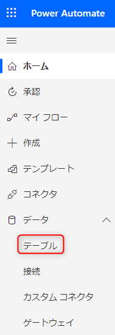
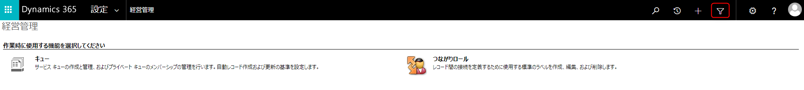
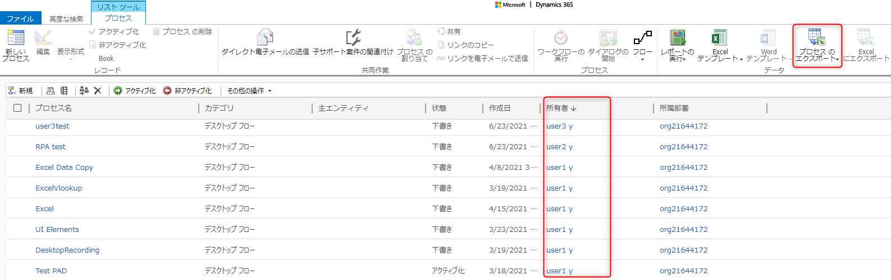

こんにちは。Power Platform サポートの原野です。
今回は、Power Automate for desktopで作成したデスクトップフローの所有者を、環境単位で一括取得する方法についてご紹介します。

デスクトップフローに関しても、環境内の所有者情報を簡単に一覧表示できます。
お試しいただけましたら幸いです。

<!-- more -->

## はじめに
デスクトップフローの所有者等の情報は、Dataverseのプロセス(Process)テーブルに格納されています。
環境の管理者権限のあるユーザーが以下の手順を行うことで、環境ごとのデスクトップフローの所有者を一括で取得いただけます。

## 1. Power Apps の画面に遷移します
Power Automate 画面より [データ＞テーブル] メニューを選択することでPower Apps の画面に遷移します。

 
 
## 2. [詳細設定] を選択します
表示されたPower Apps画面の右上のギアアイコンより、[詳細設定] を選択します。

 
 
## 3. フィルタアイコンを選択します
表示された Dynamics 365 画面右上のフィルタアイコンを選択します。

 
 
## 4. 「プロセス」を選択した上で、条件をクリアします
表示された「高度な検索」の「検索」画面で、「プロセス」を選択した上で、赤枠の「クリア」で条件をクリアします。

 
 
## 5. 条件を設定し、リボンの [結果] をクリックします
検索条件として、カテゴリから「デスクトップフロー」を選択下さい。
列の編集にて６で表示される列を選択することができます。

 
 
## 6. デスクトップフローの一覧が表示されます
所有者列を参照することで、所有者を確認することができます。
表示された検索結果は「プロセスのエクスポート」からExcel にエクスポートすることが可能です。

 
 
## おわりに

デスクトップフローの所有者を、環境単位で一括取得する方法についてご紹介しました。
少しでもお役に立つ情報がございましたら幸いです。

---
