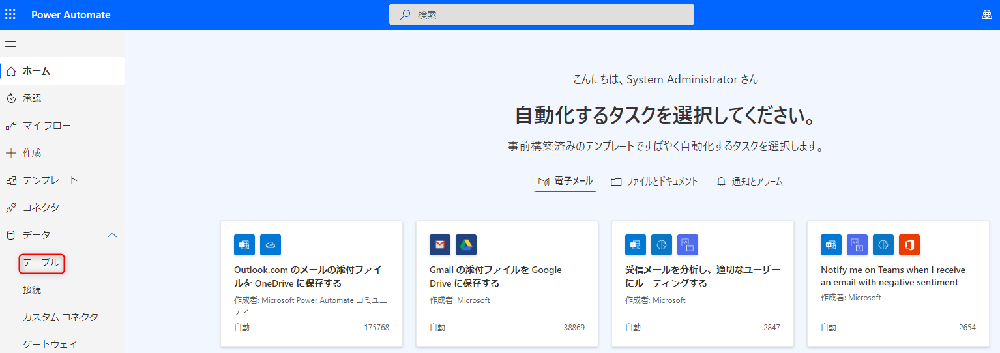
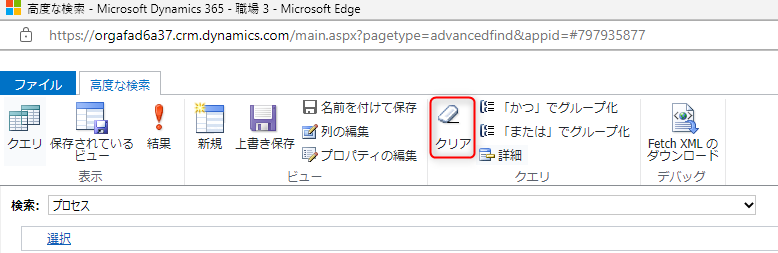
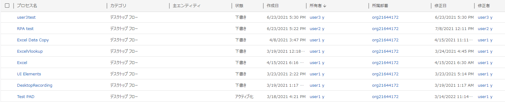

こんにちは。Power Platform サポートの原野です。  
今回は、Power Automate for desktop で作成した環境内のデスクトップ フローの所有者、作成日、修正日などの基礎情報を確認する方法についてご紹介します。

デスクトップ フローに関しても、所有者、作成日、修正日などの基礎情報を環境単位で簡単に確認できます。
  
お試しいただけましたら幸いです。

<!-- more -->

## はじめに
環境の管理者権限のあるユーザーの場合、デスクトップ フローの所有者等の基礎情報を確認する方法は大きく分けて 2 つあります。

## a. Power Automate ポータル画面から確認する
環境の管理者は、環境内の全てのデスクトップ フローの共同所有者となります。  
そのため、有償ライセンスをお持ちの場合 __「マイ フロー > デスクトップ フロー」__ からフローごとに確認いただけます。)

ライセンスについては以下をご確認ください。
[Premium RPA 機能 - Power Automate | Microsoft Learn](https://learn.microsoft.com/ja-jp/power-automate/desktop-flows/premium-features#plans-that-provide-entitlements-for-the-premium-rpa-features)

また、Power Automate ポータル画面からデスクトップ フローを確認する方法については以下に記載されています。  
[デスクトップ フローの共有と管理 - Power Automate | Microsoft Learn](https://learn.microsoft.com/ja-jp/power-automate/desktop-flows/manage#list-of-desktop-flows)

## b. Dataverse 内のテーブルから確認する
デスクトップ フローの所有者等の情報は、Dataverse のプロセス テーブルに格納されています。  
環境の管理者権限のあるユーザーが以下の手順を行うことで、環境ごとのデスクトップ フローの基礎情報を一括で取得いただけます。  
取得した情報は Excel ファイルにエクスポートすることが可能です。

### 1. Power Apps の画面に遷移します
Power Automate 画面より __「データ > テーブル」__ からメニューを選択することで Power Apps の画面に遷移します。

 
 
### 2. [詳細設定] を選択します
表示された Power Apps 画面の右上のギアアイコンより、__「詳細設定」__ を選択します。

 
 
### 3. フィルタアイコンを選択します
表示された Dynamics 365 画面右上のフィルタアイコンを選択します。

 
 
### 4. 「プロセス」を選択した上で、条件をクリアします
表示された「高度な検索」の「検索」画面で、 __「プロセス」__ を選択した上で、赤枠の  __「クリア」__ で条件をクリアします。

 
 
### 5. 条件を設定し、リボンの [結果] をクリックします
検索条件として、カテゴリから __「デスクトップ フロー」__ を選択下さい。  
また、 __「列の編集 > 列の追加」__ から作成日、修正日など追加で表示する列を選択できます。

 
 
### 6. デスクトップ フローの基礎情報が一覧表示されます  
表示された検索結果は __「プロセスのエクスポート」__ から Excel にエクスポートすることが可能です。

 
 
## おわりに

環境内のデスクトップ フローの所有者、作成日、修正日などの基礎情報を確認する方法についてご紹介しました。  
少しでもお役に立つ情報がございましたら幸いです。

---
