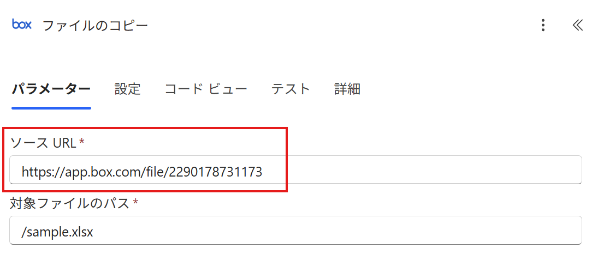
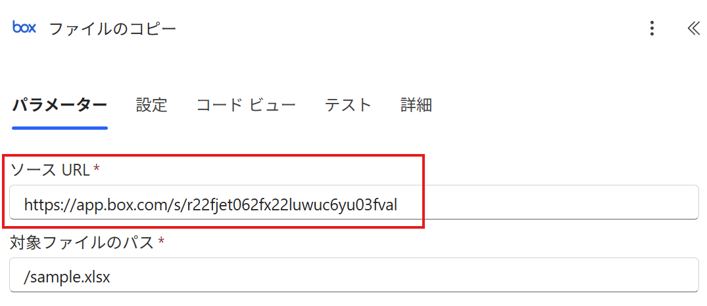
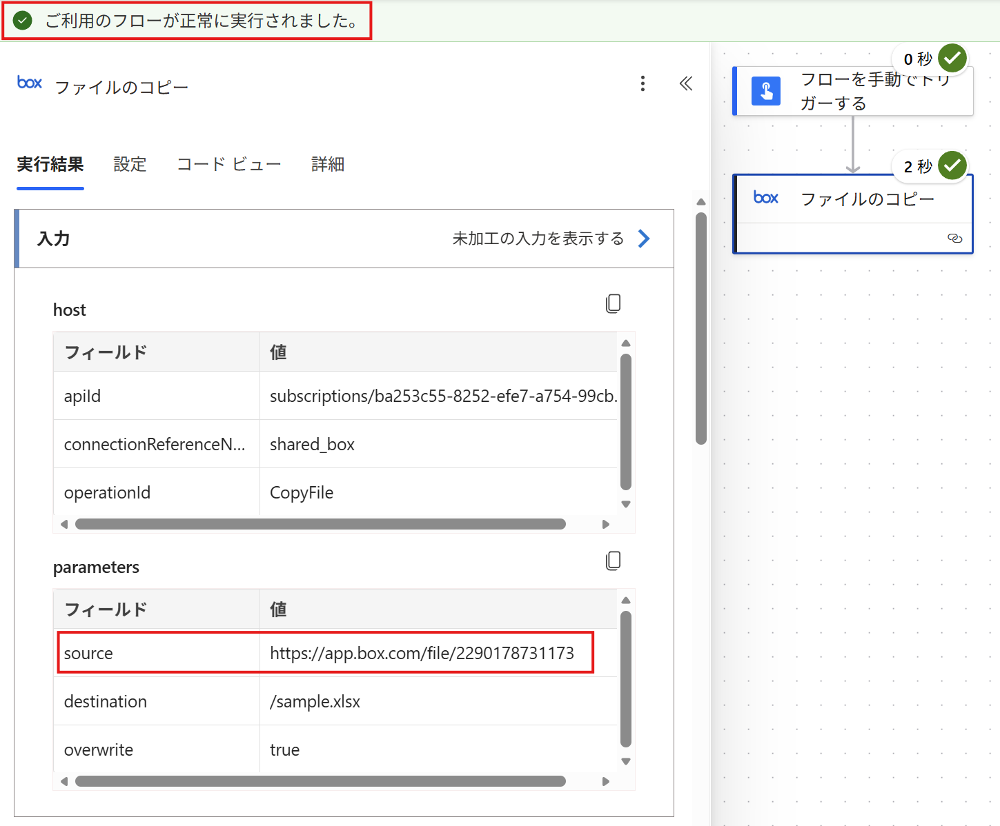
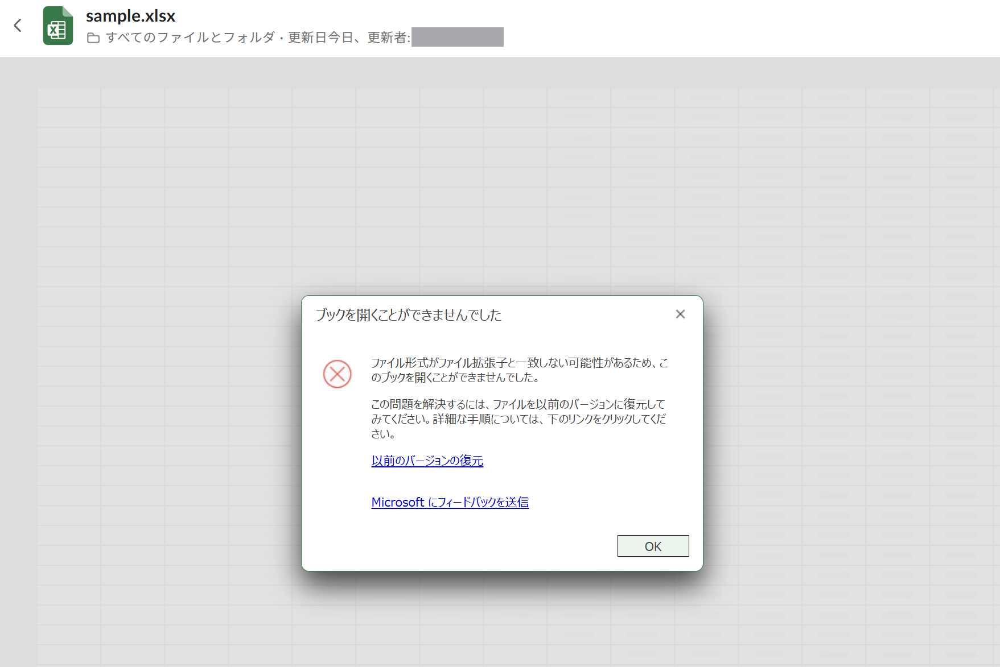
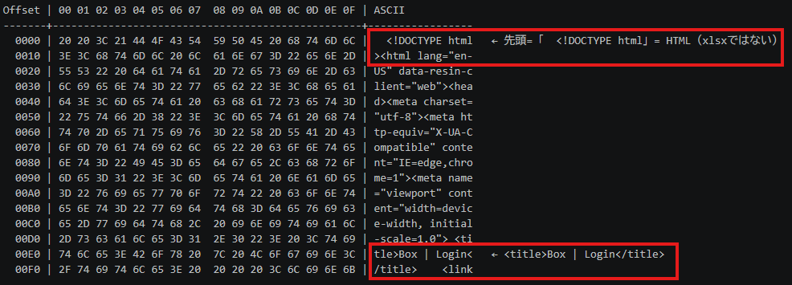
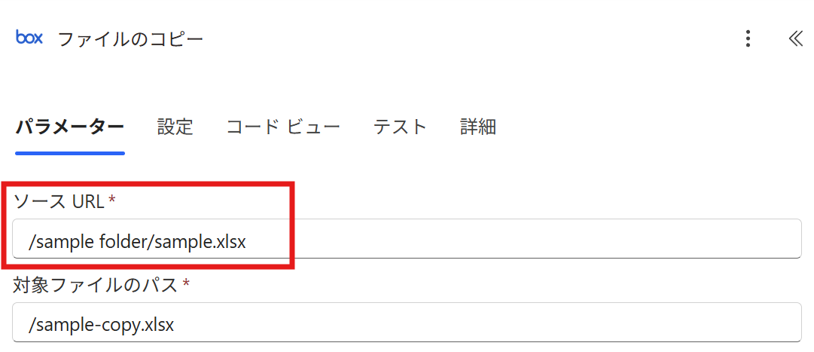
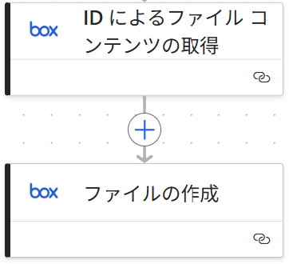

こんにちは、Power Platform サポートの橋本です。 
今回は、Power Automate の Box コネクタ「ファイルのコピー」アクションで「ソース URL」に指定する値について、誤解しやすいポイントとその対処方法をご紹介します。

<!-- more -->

## 目次
---
1. [はじめに](#anchor-intro)
2. [事象](#anchor-issue)
3. [原因](#anchor-cause)
4. [対処方法](#anchor-solution)
5. [参考情報](#anchor-reference)

## はじめに
Power Automate の Box コネクタには、Box 上のファイルを別の場所へコピーするための「ファイルのコピー」アクションが用意されています。 
このアクションには「ソース URL」というパラメーターがあり、パラメーター名から、Box でファイルを開いた際に表示される Web リンクを指定するものとイメージされる方が多くいらっしゃいます。しかし、Web リンクを指定すると、フロー自体は成功するものの、**コピー先のファイルが破損してしまう**という事象が発生します。

本記事では、この事象が発生する原因と、その対処方法についてご紹介します。

なお、本記事は以下の環境を前提としています。

- Power Automate（クラウド フロー）
- Box コネクタの「ファイルのコピー」アクション

## 事象
Box コネクタ「ファイルのコピー」アクションのパラメーターの一つに「ソース URL」があります。 
パラメーター名や公開情報から読み解くと、ここには Box でコピー元のファイルを開いた際の以下のような Web リンクを指定するようにイメージされるかもしれません。

- ファイルを開いた際の直接 Web URL（`app.box.com/file/{id}`）
- 共有リンクのプレビューページ（`app.box.com/s/...`）

それぞれの Web リンクを「ソース URL」に指定した例が以下です。

（直接 Web URL を指定した場合）

（共有リンクのプレビューページを指定した場合）

これらの Web リンクを指定してフローを実行すると、下図のように **フロー自体は成功します**。

ところが、**コピー先のファイルを開くと破損した状態になっています**。

## 原因
この事象は、「ソース URL」に指定した Web リンクにアクションがアクセスした際の振る舞いによるものです。

1. フロー実行時、アクションはコピー元のファイルを取得するために、指定された Web リンクにアクセスします。
2. しかし、これらの Web リンクは Web ページとしての表示を前提としており、Box 側はアクセスに認証情報を要求するため、Box へのログインページ（HTML）を返却します。
3. アクション自体はあくまで「ファイルの取得」のみを行い、Box へログインするという操作は行いません。そのため、**返却されたログインページをそのままコピー元のコンテンツとして取得し、コピー先のファイルとして保存**します。

その結果、破損しているように見えるコピー先のファイルのバイナリを Hex ダンプで確認すると、中身が xlsx ではなく HTML であることがわかります。実際に `Format-Hex` で先頭を確認すると `<!DOCTYPE html` となっており、さらに HTML の内容を見ていくと `<title>Box | Login</title>` という記述があるため、**中身は Box のログインページであること**が確認できます。

## 対処方法
対処方法は 2 種類あります。

### 方法① 「ソース URL」に Box 上のファイルパスを指定する
「ファイルのコピー」アクションの「ソース URL」には、**Web リンクではなく、Box 上のファイルパスを指定**してください。 
（例：`/sample.xlsx` のように、先頭が「/」で始まるパス）

注意点として、Box のフルパスは基本的に下記の形式になりますが、「ソース URL」に指定する際には、**先頭の「ファイル」を除いて、先頭に「/」を付ける**必要があります。

| 項目 | 値 |
| --- | --- |
| Box フルパス | `ファイル/sample folder/sample.xlsx` |
| ソース URL に指定するパス | `/sample folder/sample.xlsx` |

実際に「ソース URL」へ Box 上のファイルパスを指定すると、下図のようになります。

### 方法② 「ファイル コンテンツの取得」と「ファイルの作成」を組み合わせる
「ファイルのコピー」アクションを使用せず、以下の構成をご利用ください。

1. 「ファイル コンテンツの取得（ID 指定）」でコピー元ファイルの内容を取得します。
2. 「ファイルの作成」アクションの「ファイル コンテンツ」に、上記の取得結果を指定します。

そうすることで、「ファイル コンテンツの取得（ID 指定）」アクションで取得した対象ファイルを、そのまま指定の場所にコピーすることができます。

Box コネクタの「ファイルのコピー」アクションでコピー先のファイルが破損してしまう場合は、まず「ソース URL」に Web リンクではなくファイルパスが指定されているかをご確認ください。 
本記事が、Box コネクタを利用した自動化の一助になりましたら幸いです。

## 参考情報
- [Box コネクタ - ファイルのコピー | Microsoft Learn](https://learn.microsoft.com/ja-jp/connectors/box/#%E3%83%95%E3%82%A1%E3%82%A4%E3%83%AB%E3%81%AE%E3%82%B3%E3%83%94%E3%83%BC)
- [Box コネクタ - ID を使用してファイル コンテンツを取得する | Microsoft Learn](https://learn.microsoft.com/ja-jp/connectors/box/#id-%E3%82%92%E4%BD%BF%E7%94%A8%E3%81%97%E3%81%A6%E3%83%95%E3%82%A1%E3%82%A4%E3%83%AB%E3%82%B3%E3%83%B3%E3%83%86%E3%83%B3%E3%83%84%E3%82%92%E5%8F%96%E5%BE%97%E3%81%99%E3%82%8B)
- [Box コネクタ - ファイルを作成する | Microsoft Learn](https://learn.microsoft.com/ja-jp/connectors/box/#%E3%83%95%E3%82%A1%E3%82%A4%E3%83%AB%E3%82%92%E4%BD%9C%E6%88%90%E3%81%99%E3%82%8B)

---
