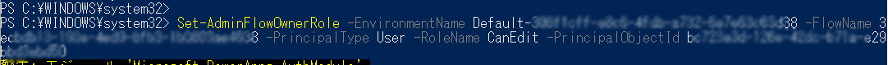
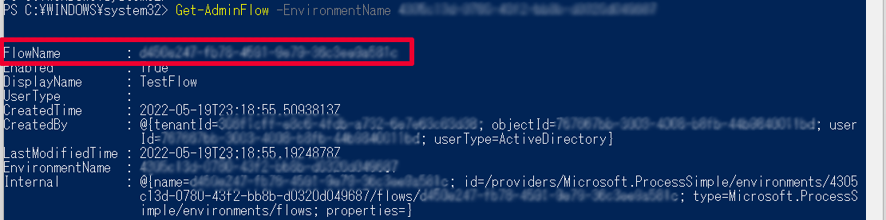

こんにちは、Power Platform サポートの谷です。<br/>
クラウド フロー所有者の退職・異動に際し、 クラウド フローの所有者を管理する方法についてご説明します。

<!-- more -->

## 目次  
---
1. [フローの所有者・実行専用ユーザーとは？](#anchor-about-flowowner)
2. [フロー作成者 (所有者) が退職あるいは離任する場合はどうしたらいいか？](#anchor-about-flowowner-retire)
3. [ソリューション フローと非ソリューション フロー](#anchor-solution-flow-or-not)
4. [フローの所有者を追加するにはどうしたらいいか？](#anchor-add-flow-co-owner)
    - [PowerShell で所有者を追加する方法](#anchor-add-flow-co-owner-ps)
    - [Power Platform 管理センターで所有者を追加する方法](#anchor-add-flow-co-owner-ppac)
    - [フロー編集画面で所有者を追加する方法](#anchor-add-flow-co-owner-portal)
5. [フロー作成者 (所有者) を変更したい場合はどうしたらいいか？](#anchor-change-flow-owner)
    - 非ソリューションフロー
        - [所有者が「名前をつけて保存」する方法](#anchor-change-flow-owner-rename)
        - [フローの「コピーを送信」する方法](#anchor-change-flow-owner-cp)
        - [フローのエクスポートを行い、新たなユーザーでインポートする方法](#anchor-change-flow-export)
    - ソリューションフロー
        - [フロー詳細画面からフローの所有者を変更する方法](#anchor-change-flow-solution)


<a id='anchor-about-flowowner'></a>

## フローの所有者・実行専用ユーザーとは？
フローを作成・実行するためには以下の 2 種類の権限があります。<br/>

**作成者 (所有者)**<br/>
フローの実行、編集、削除、共有設定を行うことが可能です。<br/>
フローの作成者のみがフローのオリジナルの所有者となりますが、所有者は複数存在できます。

**実行専用ユーザー**<br/>
フローの実行のみを行うことが可能です。

> [!IMPORTANT] 
> フローのパフォーマンスは作成者のライセンスにより決定されます
> 自動フローやスケジュール フローの場合は作成者のライセンスにより、また、
> インスタント フローの場合は実行者のライセンスによりパフォーマンスプロファイルが決定します。
> フローの所有者が複数存在する場合、作成者以外の所有者のライセンスはフローのパフォーマンスに影響いたしません。


<a id='anchor-about-flowowner-retire'></a>

## フロー作成者 (所有者) が退職あるいは離任する場合はどうしたらいいか？
### 実行について
フロー所有者のアカウントを削除後、フロー自体は削除されずそのまま残りますが、引き続きご利用いただくには以下の観点から対応が必要です。

1. 作成者がいない状態が続くと、有効なライセンスがないとみなされフローが中断される場合がある。
2. 削除されたユーザーアカウントの接続を使用している場合、アカウントの削除に伴い接続が無効となる。<br/>
    ※フロー作成者 (所有者) の変更および、接続の修正が必要になる場合があります。

したがいまして、引き続きご利用いただくためには以下のいずれかの対応を行ってください。
1. フローに Power Automate per flow ライセンスを割り当て、接続を修正する。
2.  新たなフローとして保存し、新たな所有者でフローを実行する。<br/>
    なお、現時点では、一部のフローのみ、既存のフローの作成者 (所有者) を変更することができます。<br/>

### 編集・削除・共有について
フローの所有者がいる場合、フローを編集・削除・共有することができます。<br/>
所有者は以下のいずれかの方法で追加いただけます。

- PowerShell
- Power Platform 管理センター
- フロー編集画面


<a id='anchor-solution-flow-or-not'></a>

## ソリューション フローと非ソリューション フロー
Power Platform では、Power Platform 上で構築するアプリやフローなどのコンポーネントを管理するためのメカニズム、ソリューションを提供しています。<br/>
ソリューションに含まれるフローは**ソリューション 対応 フロー**と呼ばれます。<br/>
ソリューション 対応 フローには独自で作成したソリューションに含まれるフローやDataverse for Teams環境で作成するフローがあります。<br/>

本記事ではソリューション対応フローを「ソリューション フロー」、それ以外のフローを「非ソリューションフロー」として記載しています。<br/>
ソリューション フローであるか否かにより、フローの所有者を追加する方法、フローの所有者を変更する方法が一部異なりますためご留意ください。


<a id='anchor-add-flow-co-owner'></a>

## フローの所有者を追加するにはどうしたらいいか？
フローの所有者を追加する方法が複数ありますので、状況に応じた方法をご利用ください。

<a id='#anchor-add-flow-co-owner-ps'></a>

### PowerShell で所有者を追加する方法
グローバル管理者、Power Platform 管理者、Dynamics 365 管理者などの管理者はフローの所有者を追加することができます。<br/>
非ソリューション フローの場合のみご利用いただける方法です。<br/>

事前準備として、管理者用 Power Apps コマンドレットのPowerShell モジュールをインストールいただく必要があります。<br/>
https://docs.microsoft.com/ja-jp/power-platform/admin/powerapps-powershell#installation

**実行例**
1. (事前準備) 管理者向け Power Apps コマンドレットをインストールします
2. (事前準備) コマンドを実行するユーザー (管理者アカウント) でPower Platform 管理センターにサインインします
3. 以下のコマンドを実行します

```
Set-AdminFlowOwnerRole -EnvironmentName <環境ID> -FlowName <フローID> -PrincipalType User -RoleName CanEdit -PrincipalObjectId <新所有者のObjectID>
```

 

**<環境ID>の確認方法**
- 管理者用 Power Apps コマンドレット「 [Get-AdminPowerAppEnvironment](https://docs.microsoft.com/ja-jp/power-platform/admin/powerapps-powershell#display-a-list-of-all-environments)　」コマンドで対象の 環境ID をご確認ください
    - 例えば、以下のとおり実行いただきますとテナント内の全環境について 環境ID が取得できます。
    - ```
        Get-AdminPowerAppEnvironment
      ```
    - 

**<フローID>の確認方法**
- 管理者用 Power Apps コマンドレット「[Get-AdminFlow](https://docs.microsoft.com/ja-jp/power-platform/admin/powerapps-powershell#display-all-flows)」あるいはフロー編集画面のURLからご確認ください
    - Get-AdminFlow実行例
        - 例えば、以下のとおり実行いただきますと、環境内のすべてのフローが取得できます
        - ```
            Get-AdminFlow -EnvironmentName <環境ID>
          ```
        - 
    - フロー編集画面におけるフローIDの確認例
        - 対象のフローの編集画面のURLの一部がフローIDでございます
        - 

**<新所有者の ObjectID> の確認方法**
- 「[Get-AzureADUser](https://docs.microsoft.com/ja-jp/microsoft-365/enterprise/view-user-accounts-with-microsoft-365-powershell?view=o365-worldwide#view-additional-property-values-for-a-specific-account)」コマンド、あるいは Azure Active Directory 管理センターでご確認ください
- Get-AzureADUser 実行例
    - 例えば、以下のとおり実行いただきますとテナント内の全ユーザーについて ObjectId が取得できます。
    - ```
        Get-AzureADUser | Select DisplayName, UserPrincipalName, ObjectId
      ```
    - 
- Azure Active Directory 管理センターにおけるユーザーの ObjectID の確認例
    - [Azure Active Directory 管理センター](https://aad.portal.azure.com) > ユーザー > 対象のユーザー
    - 

<a id='anchor-add-flow-co-owner-ppac'></a>

### Power Platform 管理センターで所有者を追加する方法
グローバル管理者、Power Platform 管理者、Dynamics 365 管理者などの管理者や環境管理者、システム管理者など対象の環境の管理者セキュリティロールを持つユーザーはPower Platform 管理センターからフローの所有者を追加することができます。<br/>
非ソリューション フロー、ソリューション フローでご利用いただける方法です。<br/>

1. 管理者アカウントで [Power Platform 管理センター](https://admin.powerplatform.com) にアクセスします
2. 対象の環境の「設定」を表示し、「リソース」＞「フロー」を選択します
    
3. 対象のアプリの「…」メニューから、「共有」を選択します
    
4. 所有者として追加したいアカウントを追加します

<a id='anchor-add-flow-co-owner-portal'></a>

### フロー編集画面で所有者を追加する方法
フロー作成者(所有者)はフロー編集画面から所有者を追加することができます。<br/>
非ソリューション フロー、ソリューション フローでご利用いただける方法です。

1. Power Automate 作成者ポータルにアクセスします
2. 対象のフローの「…」メニューから「共有」を選択します
    
3. 所有者として追加したいアカウントを追加します

<a id='anchor-change-flow-owner'></a>

## フロー作成者 (所有者) を変更したい場合はどうしたらいいか？
以下のいずれかの方法で、新たなフローとして保存を行い、フローの作成者 (所有者) を変更します。<br>
フローの種類により変更方法が異なりますので、それぞれ説明します。

- 非ソリューション フロー
    - 所有者が「名前を付けて保存」する
    - フローの「コピーを送信」する
    - フローのエクスポートを行い、新たな所有者で当フローをインポートする
- ソリューション フロー
    - フロー詳細画面からフローの所有者を変更する

<a id='anchor-change-flow-owner-rename'></a>

### ＜非ソリューション フロー＞　所有者が「名前をつけて保存」する方法
変更先のユーザーにフローを共有し、フロー一覧より「名前をつけて保存」選択いただきますと<br/>
同一環境に同一構成のフローを別名で、自身のフローとして保存いただけます。

**実行例**
1. フロー一覧画面から「名前を付けて保存」を実行します
     

<a id='anchor-change-flow-owner-cp'></a>

### ＜非ソリューション フロー＞　フローの「コピーを送信」する方法
作成したフローをテンプレートとして、組織内のユーザーに送信いただけます。<br/>
「コピーの送信」時に変更先ユーザーを指定し、指定されたユーザーにメール通知されますため、<br/>
メールリンクより対象フローのテンプレートへアクセスし、自身のフローとして保存ください。<br/>

**実行例**
1. フロー編集画面から「コピーの送信」を実行し、新たな所有者のメールアドレスを指定します
     
2. メール内のリンクをクリックし、テンプレートにアクセスします
     
3. フローを保存します

<a id='anchor-change-flow-export'></a>

### ＜非ソリューション フロー＞　フローのエクスポートを行い、新たなユーザーでインポートする方法
フローのパッケージファイルをしてエクスポートし、エクスポートしたファイルを変更先ユーザーにご送付いただきます。<br/>
変更先ユーザーは当該エクスポートファイルをPower Automate ポータル画面よりインポートすることで、同一構成のフローを自身のフローとして保存いただけます。<br/>
なお、パッケージのエクスポート後のインポートはテナントや環境をまたいだ実施が可能です。

**実行例**
1. フロー編集画面から「エクスポート」を実行します
     
2. 新たな所有者で「インポート」を実行します
     


<a id='anchor-change-flow-solution'></a>

### ＜ソリューション フロー＞　フロー詳細画面からフローの所有者を変更する方法
以下の方法でフローの所有者を変更できます。<br/>

**実行例**
1. 対象のソリューション 編集画面を表示し、対象のフローの「詳細」メニューを選択します
     
2. フロー編集画面の「編集」を押下します
     
3. 所有者を変更します<br/>
     


## 補足
本手順は執筆時点でのユーザー インターフェイスをもとに紹介しています。バージョンアップによって若干の UI の遷移など異なる場合があります。その場合は画面の指示に従って進めてください。


## 参考情報
- [パフォーマンスプロファイルについて](https://docs.microsoft.com/ja-jp/power-automate/limits-and-config#performance-profiles)
- [PowerShell を使用してフローの所有者を追加する](https://docs.microsoft.com/ja-jp/troubleshoot/power-platform/power-automate/manage-orphan-flow-when-owner-leaves-org)
- [Power Platform 管理センターにてフローの所有者を追加する](https://docs.microsoft.com/ja-jp/power-platform/admin/manage-power-automate)
- [所有者が組織を離れるときに孤立したフローを管理する方法](https://support.microsoft.com/ja-jp/topic/%E6%89%80%E6%9C%89%E8%80%85%E3%81%8C%E7%B5%84%E7%B9%94%E3%82%92%E9%9B%A2%E3%82%8C%E3%82%8B%E3%81%A8%E3%81%8D%E3%81%AB%E5%AD%A4%E7%AB%8B%E3%81%97%E3%81%9F%E3%83%95%E3%83%AD%E3%83%BC%E3%82%92%E7%AE%A1%E7%90%86%E3%81%99%E3%82%8B%E6%96%B9%E6%B3%95-c2915d93-cf96-98a3-e78c-5a69224270b7
)

---