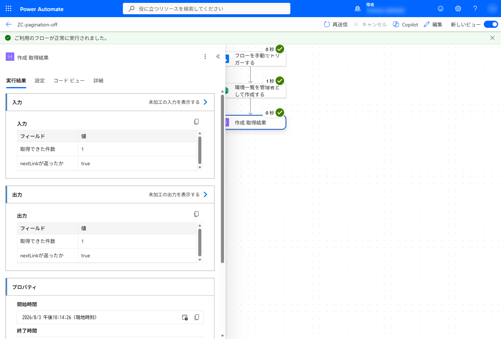
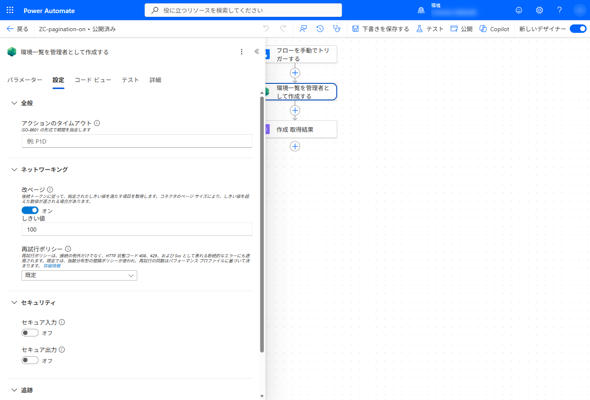
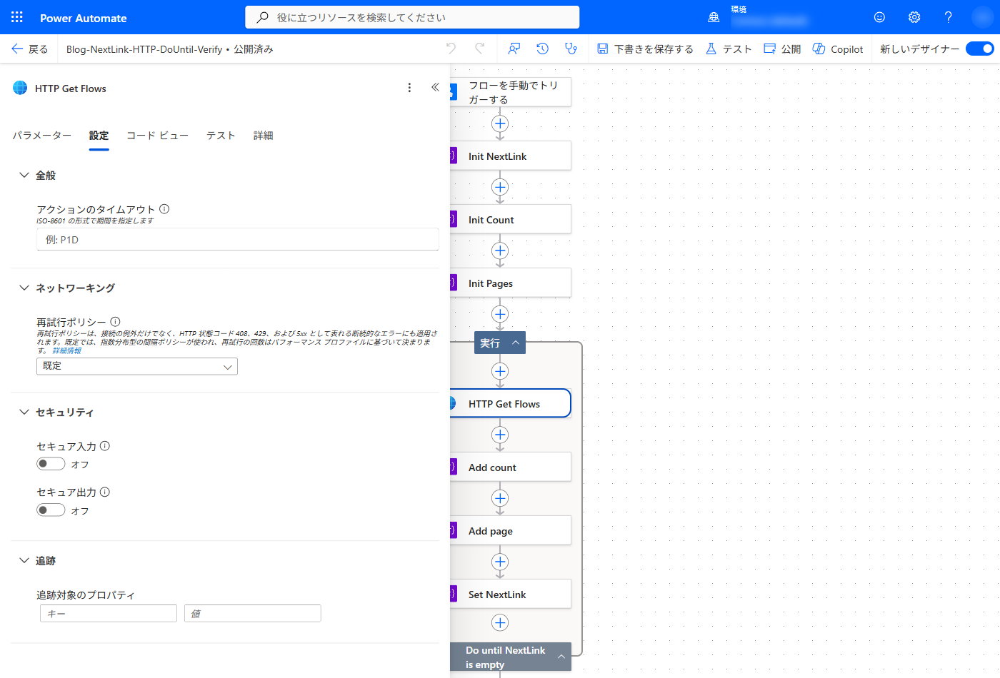
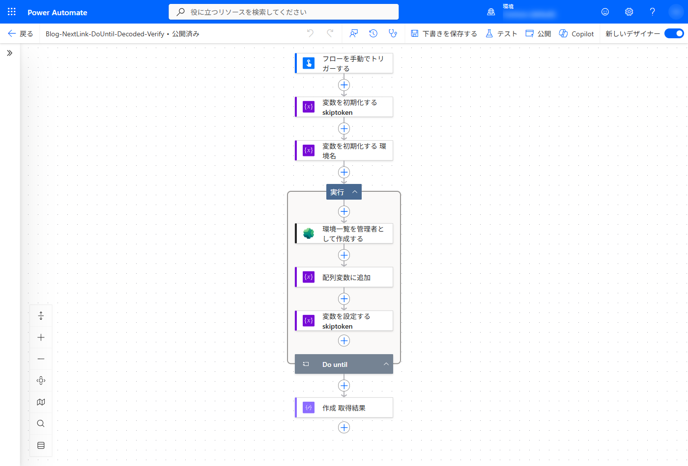
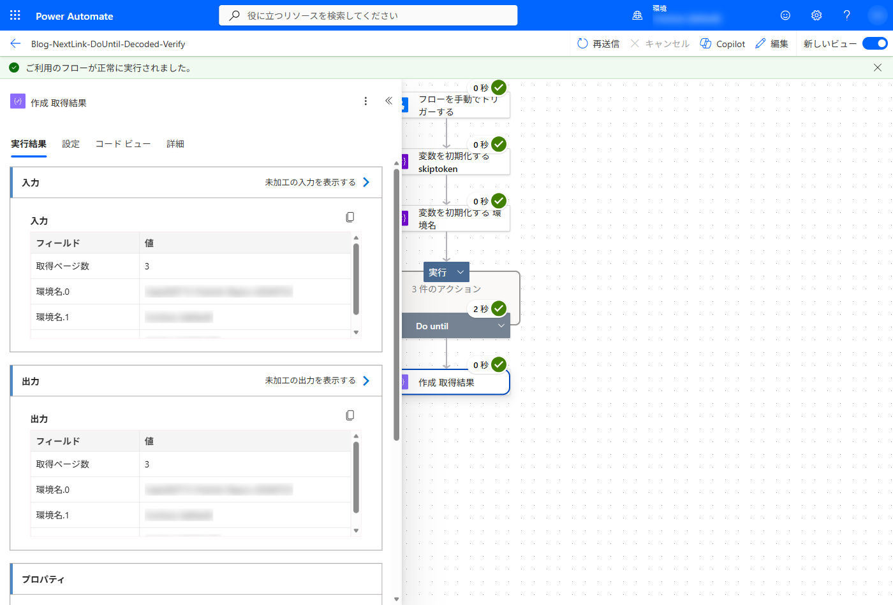
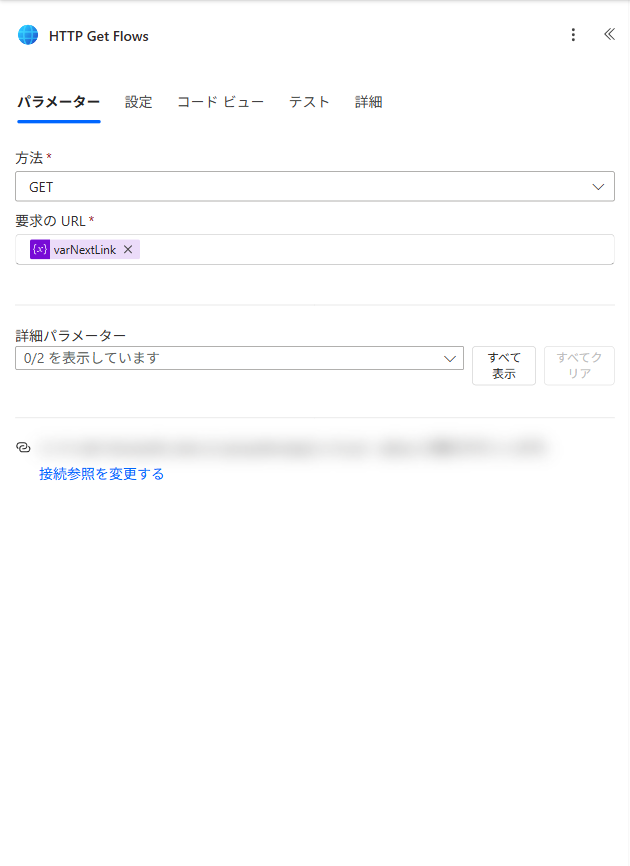
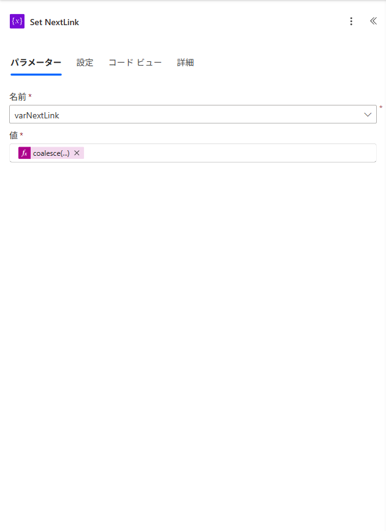
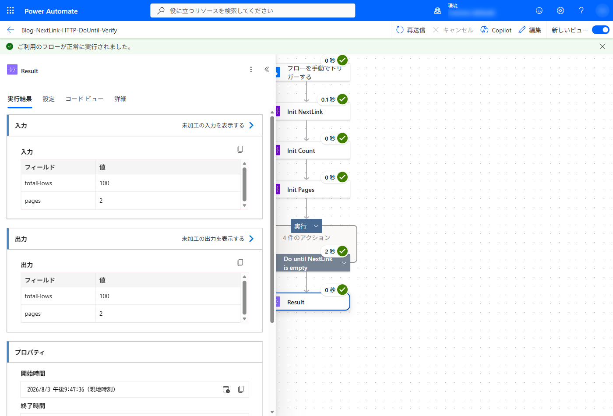
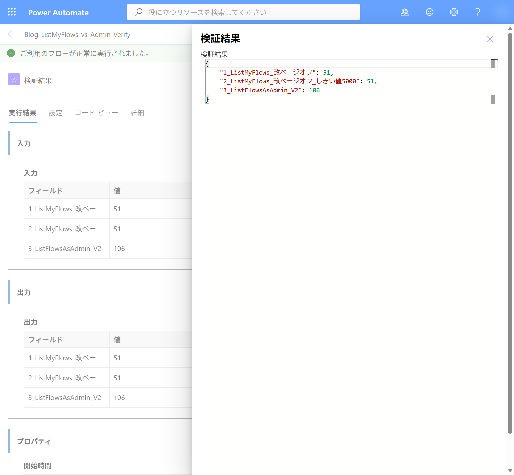

こんにちは、Power Platform サポートチームの早坂です。<br/>

本記事では、Power Automate のクラウド フローからコネクタの一覧取得アクションを実行したときに、**データが存在するのに一部のレコードしか取得できない** という事象について、その理由と対処方法をご紹介します。アクションの **改ページ** 設定を使用する方法と、改ページ設定がないアクションで応答の `nextLink` をたどる方法の 2 つを、実機での確認結果とあわせて整理しています。

<!-- more -->

> [!NOTE]
> 本記事では、Power Platform for Admins コネクタの「環境一覧を管理者として作成する」(`Get-AdminEnvironment`) アクションを例にご説明します。ページングの対応有無、パラメーター名、1 ページあたりの既定件数はコネクタとアクションによって異なるため、実際にご利用になるアクションのコネクタ リファレンスをあわせてご確認ください。
>
> 本記事のスクリーンショットは日本語表示の環境で取得しています。アクション名やパラメーター名の表示は、環境の言語設定によって異なる場合があります。

## 目次

- [1. 概要](#1-概要)
- [2. 一度の呼び出しですべてのデータを取得できない理由](#2-一度の呼び出しですべてのデータを取得できない理由)
- [3. 改ページ設定を使用する](#3-改ページ設定を使用する)
  - [3-1. 設定手順](#3-1-設定手順)
  - [3-2. 動作確認](#3-2-動作確認)
- [4. 改ページ設定がないアクションで nextLink を使用する](#4-改ページ設定がないアクションで%20nextLink%20を使用する)
  - [4-1. 処理の流れ](#4-1-処理の流れ)
  - [4-2. nextLink から $skiptoken を取り出す](#4-2-nextLink%20から%20$skiptoken%20を取り出す)
  - [4-3. 実装例](#4-3-実装例)
  - [4-4. 動作確認](#4-4-動作確認)
- [5. 2 つの方法の使い分け](#5-2%20つの方法の使い分け)
- [6. 設計時に確認しておきたい注意点](#6-設計時に確認しておきたい注意点)
- [7. まとめ](#7-まとめ)
- [参考情報](#参考情報)

<a id='1-概要'></a>

## 1. 概要

クラウド フローから一覧を取得するコネクタ アクションを実行すると、対象のデータが存在していても、**一部のレコードしか返らない** ことがあります。

コネクタの応答が複数ページに分かれている場合、1 回のアクション実行で返るのは最初のページのデータだけです。残りのデータを取得するには、次のいずれかの対応が必要です。

- アクションの **改ページ** 設定をオンにして、Power Automate に続きのページを自動的に取得させる
- 応答に含まれる `nextLink` からトークンを取り出し、`Do until` で自分で繰り返す

本記事では、この 2 つの方法と、それぞれの動作確認結果をご説明します。

<a id='2-一度の呼び出しですべてのデータを取得できない理由'></a>

## 2. 一度の呼び出しですべてのデータを取得できない理由

コネクタの一覧取得アクションでは、応答サイズやサービス側の処理負荷を抑えるため、結果を複数ページに分けて返す実装になっている場合があります。

「環境一覧を管理者として作成する」アクションでは、詳細パラメーターとして次を指定できます。

| パラメーター | 説明 |
| --- | --- |
| ページ サイズ (`$top`) | 1 ページに含める件数 |
| トークンをスキップする (`$skiptoken`) | 続きのページを取得するためのトークン |
| プロパティを展開する (`$expand`) | 応答に展開するプロパティ |

また、応答には主に次の値が含まれます。

| プロパティ | 説明 |
| --- | --- |
| `value` | 現在のページに含まれるデータ |
| `nextLink` | 次のページを取得するための URL。最終ページでは返りません |

改ページ設定がオフ (既定) の状態では、アクションは 1 ページ分の応答をそのまま返します。次の画像は、環境が 3 つ存在するテナントでページ サイズに `1` を指定して実行した結果です。結果を確認しやすくするため、アクションの後に **作成** を置き、`length()` で取得件数を、`nextLink` の有無を出力しています。取得できたのは 1 件だけで、`nextLink` が返っています。



`nextLink` は、`$skiptoken` を含むクエリ文字列付きの URL として返されます。

```text
https://<host>/apim/powerplatformforadmins/<connection>/environments?api-version=2018-10-01&%24top=1&%24skiptoken=<トークン>&%24paginationId=<ID>
```

<a id='3-改ページ設定を使用する'></a>

## 3. 改ページ設定を使用する

アクションの設定に **改ページ** が用意されている場合は、この設定を使用するのが最も簡潔です。指定したしきい値に達するまで、Power Automate が `nextLink` を自動的にたどり、結果を 1 つの応答にまとめて返します。

<a id='3-1-設定手順'></a>

### 3-1. 設定手順

1. デザイナーで対象のアクションを選択します。
2. **設定** タブを開きます。
3. **ネットワーキング** の **改ページ** をオンにします。
4. **しきい値** に、取得したい件数以上の値を入力します。



> [!NOTE]
> 改ページはすべてのアクションで使用できるわけではありません。設定タブに **改ページ** の項目が表示されないアクションは、この方法を使用できません。その場合は「[4. 改ページ設定がないアクションで nextLink を使用する](#4-改ページ設定がないアクションで%20nextLink%20を使用する)」をご覧ください。<br/>
> また、設定タブに **改ページ** があっても、アクションが応答に継続トークンを返さない場合は効果がありません。詳細は「[6-1. アクション自体の制限がないかを確認する](#6-1-アクション自体の制限がないかを確認する)」をご覧ください。

<a id='3-2-動作確認'></a>

### 3-2. 動作確認

環境が 3 つ存在するテナントで、ページ サイズとしきい値を変えて動作を確認しました。

| 項目 | 内容 |
| --- | --- |
| 確認日 | 2026 年 8 月 3 日 |
| 使用コネクタ | Power Platform for Admins (「環境一覧を管理者として作成する」) |
| 権限 | Power Platform 管理者 |
| 対象テナントの環境数 | 3 |
| 確認方法 | フローの実行履歴と actions API から取得した応答を確認 |

改ページ **オフ** (既定) の場合:

| ページ サイズ | 取得件数 | nextLink |
| --- | --- | --- |
| 1 | 1 | あり |
| 2 | 2 | あり |
| 未指定 | 3 | なし |
| 200 | 3 | なし |

改ページ **オン** の場合:

| ページ サイズ | しきい値 | 取得件数 | nextLink |
| --- | --- | --- | --- |
| 1 | 100 | 3 | なし |
| 1 | 1000 | 3 | なし |
| 2 | 100 | 3 | なし |
| 未指定 | 100 | 3 | なし |


ページ サイズを `1` にした場合でも、改ページをオンにすると 3 件すべてが 1 つの応答として返り、`nextLink` は返りませんでした。同じ条件で 2 回実行し、いずれも同じ結果になることを確認しています。

> [!NOTE]
> ページ サイズが未指定でも 3 件すべてが返っているのは、対象テナントの環境数が既定のページ サイズに収まっているためです。データ件数が既定のページ サイズを超える場合は、この条件でも複数ページに分かれます。

> [!IMPORTANT]
> 改ページのしきい値は「この件数に達するまでページをたどる」という指定です。実際に返る件数はコネクタのページ サイズ単位で決まるため、しきい値を超える件数が返る場合があります。取得件数の上限を厳密に制御したい場合は、フロー側で件数を確認する処理を実装してください。

<a id='4-改ページ設定がないアクションで nextLink を使用する'></a>

## 4. 改ページ設定がないアクションで nextLink を使用する

設定タブに **改ページ** が表示されないアクションでは、応答に `nextLink` などの継続情報があり、次のページを呼び出せる場合に、フロー側で続きを取得できます。

たとえば HTTP with Microsoft Entra ID コネクタのアクションでは、設定タブの **ネットワーキング** に再試行ポリシーしか表示されず、改ページの項目自体がありません。



<a id='4-1-処理の流れ'></a>

### 4-1. 処理の流れ

`Do until` を使用して、次の流れで実装します。

1. 続きのページ取得に使用する変数を初期化します。
2. アクションを実行して 1 ページ分を取得します。
3. 取得したデータを結果用の変数へ追加します。
4. 応答の `nextLink` から次のページ用の値を取り出し、変数を更新します。
5. `nextLink` が返らなくなるまで、2 から 4 を繰り返します。

<a id='4-2-nextLink から $skiptoken を取り出す'></a>

### 4-2. nextLink から $skiptoken を取り出す

`nextLink` は URL 全体なので、`$skiptoken` の値だけを取り出します。`skiptoken=` で分割して後半を取得し、さらに `&` で分割して先頭を取得します。

> [!IMPORTANT]
> 取り出した値は URL エンコードされています。トークン末尾の `=` が `%3d` のままの状態で `$skiptoken` へ渡すと、次のエラーになります。<br/>
> **要求 URI の継続トークンが無効です。継続トークン - '&lt;トークン&gt;%3d'**<br/>
> `decodeUriComponent()` でデコードしてから渡してください。

デコードを含めた式は次のとおりです。`環境一覧を管理者として作成する` の部分は、ご利用のアクション名に読み替えてください。

```
if(
  empty(coalesce(body('環境一覧を管理者として作成する')?['nextLink'], '')),
  '',
  decodeUriComponent(
    first(
      split(
        last(
          split(body('環境一覧を管理者として作成する')?['nextLink'], 'skiptoken=')
        ),
        '&'
      )
    )
  )
)
```

<a id='4-3-実装例'></a>

### 4-3. 実装例

フローの構成は次のとおりです。

| 順序 | アクション | 設定 |
| --- | --- | --- |
| 1 | 変数を初期化する | 名前 `varSkipToken` / 種類 文字列 / 値 空 |
| 2 | 変数を初期化する | 名前 `varEnvNames` / 種類 アレイ / 値 空 |
| 3 | Do until | 条件 `varSkipToken` が次の値に等しい (空) |
| 3-1 | 環境一覧を管理者として作成する | ページ サイズ `1` / トークンをスキップする `varSkipToken` |
| 3-2 | 配列変数に追加 | 取得したデータを `varEnvNames` へ追加 |
| 3-3 | 変数を設定する | `varSkipToken` に 4-2 の式を設定 |
| 4 | 作成 | 取得件数と結果を出力 |



`Do until` は本体を実行してから条件を評価します。`varSkipToken` は初期値が空のため、1 周目は `$skiptoken` を指定しない状態で 1 ページ目を取得し、2 周目以降は前の周回で取り出したトークンを使用します。最終ページでは `nextLink` が返らないため `varSkipToken` が空になり、繰り返しが終了します。

> [!WARNING]
> `Do until` には繰り返しの上限 (既定 60 回) とタイムアウト (既定 1 時間) があります。上限に達すると、途中までのデータしか取得できていない状態で `Do until` が終了します。想定するページ数に対して十分な上限を設定し、上限に達した場合を検知する処理をあわせて実装してください。

<a id='4-4-動作確認'></a>

### 4-4. 動作確認

上記の構成で実行したところ、3 ページに分けて 3 件すべてを重複なく取得できました。



改ページ設定がない HTTP with Microsoft Entra ID コネクタでは、最初に呼び出す URL を `varNextLink` へ設定します。次の例では、Flow Management API の一覧取得 URL を使用しています。`<環境 ID>` は取得対象の環境 ID に置き換えてください。

```text
https://api.flow.microsoft.com/providers/Microsoft.ProcessSimple/environments/<環境 ID>/flows?api-version=2016-11-01&$top=50
```

`Do until` 内の HTTP アクションは、メソッドを `GET`、要求の URL を `variables('varNextLink')` にします。



HTTP アクションの実行後、`varNextLink` を次の式で更新します。最終ページでは `nextLink` が返らないため、空文字を設定してループを終了します。

```text
coalesce(body('HTTP_Get_Flows')?['nextLink'], '')
```



この構成で、実行時に `nextLink` が返らなくなるまで取得したところ、2 ページ、合計 100 件を取得できました。



<a id='5-2 つの方法の使い分け'></a>

## 5. 2 つの方法の使い分け

| 方法 | 使用できる条件 | 特徴 |
| --- | --- | --- |
| 改ページ設定 (3 章) | 設定タブに **改ページ** がある | 設定するだけで済み、フローが単純になる |
| `Do until` + `nextLink` (4 章) | 応答に継続情報があり、次のページを呼び出せる | 実装量は増えるが、途中経過の記録や独自の停止条件を作り込める |

改ページ設定が使用できる場合は、そちらをご検討ください。

<a id='6-設計時に確認しておきたい注意点'></a>

## 6. 設計時に確認しておきたい注意点

<a id='6-1-アクション自体の制限がないかを確認する'></a>

### 6-1. アクション自体の制限がないかを確認する

一覧が全件返らない原因が改ページではなく、**アクションそのものの制限** である場合があります。この場合は、改ページ設定を有効にしても `Do until` で `nextLink` をたどっても解消しません。

たとえば、2026 年 8 月 4 日 15 時 (日本時間) に Power Platform 管理センターで確認した既知の問題 6057285 では、Power Automate Management コネクタの **List My Flows** アクションは、環境内に 50 個以上のフローがある場合にすべてを返さないことがあると案内されていました。回避策は **List Flows as Admin (V2)** アクションの使用です。

| アクション | 改ページ | 取得件数 |
| --- | --- | --- |
| 自分のフローの一覧表示 (`List My Flows`) | オフ (既定) | **51** |
| 自分のフローの一覧表示 (`List My Flows`) | オン (しきい値 5000) | **51** |
| 管理者としてフローの一覧を取得 (V2) (`List Flows as Admin (V2)`) | オフ (既定) | **106** |



この検証では、**List My Flows** の改ページをオンにし、しきい値を `5000` に設定しても、取得件数は 51 件のままでした。応答に `nextLink` がなかったため、改ページ設定では続きを取得できませんでした。一方、**List Flows as Admin (V2)** では 106 件が返りました。

> [!IMPORTANT]
> 既知の問題は一時的な情報であり、状態や回避策が変更される場合があります。期待した件数が返らないときは、対象アクションの応答に `nextLink` などの継続情報があるかを確認するとともに、Power Platform 管理センターの **ヘルプとサポート** > **既知の問題** とコネクタ リファレンスで最新情報をご確認ください。

- [既知の問題 6057285 - Power Platform 管理センター](https://admin.powerplatform.microsoft.com/support/knownissues/6057285)
- [List My Flows - Power Automate Management コネクタ - Microsoft Learn](https://learn.microsoft.com/connectors/flowmanagement/#list-my-flows)
- [List Flows as Admin (V2) - Power Automate Management コネクタ - Microsoft Learn](https://learn.microsoft.com/connectors/flowmanagement/#list-flows-as-admin-(v2))

### 6-2. 本当に全件が必要かを確認する

全件取得は、実行時間、コネクタの呼び出し回数、フローが扱うデータ量をいずれも増加させます。フィルターで対象を絞れないかをあわせてご検討ください。

### 6-3. 最終ページを判定する

最終ページでは `nextLink` が返りません。空の値を `$skiptoken` に渡して再実行すると 1 ページ目が返るため、判定を省略すると同じデータを重複して取得します。`empty()` などで必ず確認してください。

### 6-4. コネクタの呼び出し回数の制限を確認する

ページングを実装すると、ページ数の分だけコネクタの呼び出し回数が増えます。Power Platform for Admins コネクタには、接続ごとに 60 秒あたり 100 回の API 呼び出し制限があります。利用者数と実行頻度を含めて、制限に到達しないかをご確認ください。

### 6-5. エラー処理を追加する

途中のページ取得に失敗した場合、結果には一部のデータだけが残る可能性があります。「全件取得できた」と誤解しないよう、実運用では `Do until` の終了条件と実行結果を確認し、失敗を検知する処理をあわせて実装してください。

<a id='7-まとめ'></a>

## 7. まとめ

コネクタの応答に `nextLink` が含まれる場合、データは次のページへ続いています。改ページ設定がオフのアクションでは、通常はフロー側で続きを取得するための対応が必要です。

- アクションの設定に **改ページ** があれば、オンにしてしきい値を指定する
- 改ページがないアクションでは、`Do until` で `nextLink` をたどる
- `$skiptoken` を自分で組み立てる場合は、`decodeUriComponent()` で URL エンコードを戻す
- `nextLink` が返らなくなったことを判定して繰り返しを止める

なお、一覧が全件返らない原因がページングではなく、アクション自体の制限であることもあります。実装に着手する前に、対象アクションのリファレンスと既知の問題をあわせてご確認ください (6-1 参照)。

あわせて、`Do until` の繰り返し上限、コネクタの呼び出し回数の制限、エラー処理の実装もご確認いただけますと幸いです。

<a id='参考情報'></a>

## 参考情報

- [Power Platform for Admins コネクタ - Microsoft Learn](https://learn.microsoft.com/ja-jp/connectors/powerplatformforadmins/)
- [Power Automate Management コネクタ - Microsoft Learn](https://learn.microsoft.com/ja-jp/connectors/flowmanagement/)
- [改ページ位置の自動修正で既定のページ サイズを超える結果を取得する - Microsoft Learn](https://learn.microsoft.com/ja-jp/azure/logic-apps/logic-apps-exceed-default-page-size-with-pagination)
- [ループを使用してデータを繰り返し処理する - Azure Logic Apps | Microsoft Learn](https://learn.microsoft.com/ja-jp/azure/logic-apps/logic-apps-control-flow-loops#until-loop)
- [変数を使用して値を保存および管理する - Azure Logic Apps | Microsoft Learn](https://learn.microsoft.com/ja-jp/azure/logic-apps/logic-apps-create-variables-store-values)
- [ワークフロー式関数のリファレンス ガイド - Azure Logic Apps | Microsoft Learn](https://learn.microsoft.com/ja-jp/azure/logic-apps/workflow-definition-language-functions-reference)

> [!NOTE]
> 本記事に記載した数式は実装例です。エラー処理や各環境固有の条件をすべて含むものではありません。ご利用の際は、検証環境で十分に動作をご確認ください。

※本記事の執筆には生成 AI を使用しています。[参考](https://learn.microsoft.com/ja-jp/principles-for-ai-generated-content)
