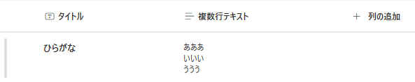
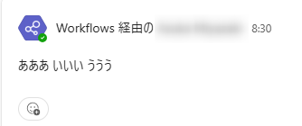
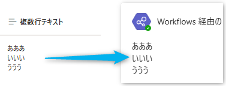
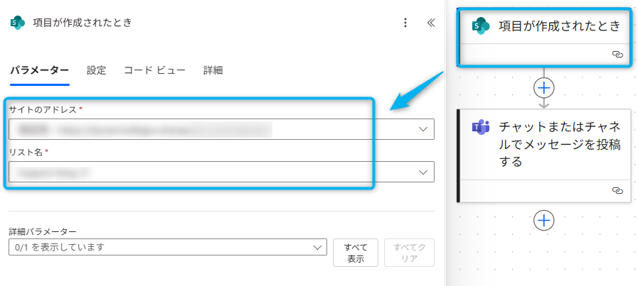
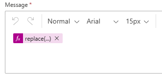

# はじめに

こんにちは、Power Platform サポートチームの宮﨑です。  
本記事では Power Automate で文字列に含まれる改行が反映されない場合の対応方法についてご案内いたします。


<!-- more -->
# 目次
1. [概要](#anchor-intro)
1. [解決したい事象](#anchor-line-break-issue)
1. [改行を反映させる方法](#anchor-line-break)
   1. [フローの例](#anchor-line-break-flow) 
   1. [なぜこれで解消できるのか](#anchor-line-break-reason)
1. [補足](#補足)

<a id='anchor-intro'></a>

# 概要
今回はよくあるお問い合わせとして、 Power Automate で文字列を扱う際に改行が反映されない場合の対応方法についてご案内いたします。

<a id='anchor-line-break-issue'></a>

## 解決したい事象


上のような SharePoint リストから、Power Automate のクラウドフローで 複数行テキスト を取得する際、



Teams に投稿すると改行が反映されないことがあります。

以降では、このような事象の解決方法をご案内いたします。

<a id='anchor-line-break'></a>

## 改行を反映させる方法

<a id='anchor-line-break-flow'></a>

### フローの例
今回の例では、以下の状況を想定しています。

トリガー：SharePoint リストにアイテムが追加されたとき  
アクション：アイテムの内容を Teams に投稿する

イメージ図  


フローの全体図は以下の通りです。  


ここから、フローの詳細を順を追って解説いたします。

#### トリガー：SharePoint リストにアイテムが追加されたとき  
※こちらのトリガーはあくまでも一例となります。

下画像のように、ご自身の SharePoint リストをご指定ください。<br>



#### アクション：アイテムの内容を Teams に投稿する

下画像のように、投稿先の情報についてご指定ください。<br>


#### メッセージ部分

以下の式をアクション内で設定することで、投稿されたメッセージに改行が反映されるようになります。

```
replace(改行を反映させたい文字列, decodeUriComponent('%0A'), '<br>')
```



---

<a id='anchor-line-break-reason'></a>

### なぜこれで解消できるのか
SharePoint リストや Microsoft Excel から取得した複数行テキスト（JSON形式）を Teams に HTML形式で投稿する際には、
改行部分を「&lt;br&gt;」タグへ置換する必要がございます。

特定の文字列を別の文字列に置換する replace 関数を用いることで、「&lt;br&gt;」タグを挿入することが可能となります。

#### replace(文字列, '\n', '&lt;br&gt;') ではなぜ解消しないのか
JSON形式での改行コードは「\n」となりますが、Power Automate における改行コードは LF（%0A）となっています。
そのため、replace( 文字列, '\n', '&lt;br&gt;' ) では、Power Automate が認識する改行部分を取得・置換することができません。

今回の方法では、decodeUriComponent 関数を使って「%0A」をデコードすることで、実際の改行文字（LF）を取得しています。  
その改行文字を replace 関数で 「&lt;br&gt;」タグ に置換することで、Teams などに投稿する際に正しく改行が反映されるようになります。

以上が、Power Automate で文字列を扱う際に改行が反映されない場合の対応方法でございます。
お役に立てましたら幸いです。

<a id='補足'></a>

# 補足

本手順は執筆時点でのユーザー インターフェイスを基に紹介しています。バージョンアップによって UI の遷移などが若干異なる場合があります。その場合は画面の指示に従って進めてください。  

