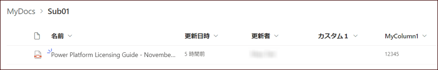
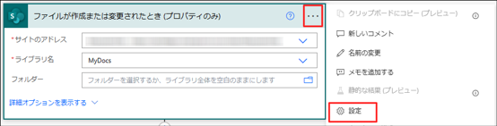
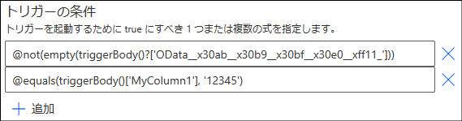
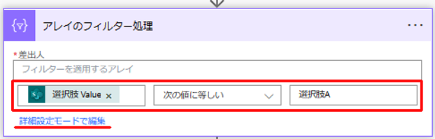
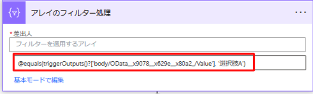

こんにちは、Power Platform サポート 谷です。 
Power Automate では、例えば、SharePoint リストのアイテムの作成や変更などのイベント発生後にタスクを実行したい場合、自動フローを使用することができます。 
自動フローでは、全ての値が入力されている場合のみ、また、特定の値の場合のみ、など、タスクを実行する際の条件を設定することができます。

本記事では、トリガー条件を設定して条件を満たす場合のみフローが実行されるようにする方法をご紹介します。

<!-- more -->

## トリガー条件の設定方法
例として、SharePoint ドキュメント ライブラリにファイルが作成され、指定したカスタム列に値が登録されている場合にのみフローが実行されるよう設定してみます。

前提条件として、SharePoint ドキュメント ライブラリにカスタム列「カスタム1」、「MyColumn01」を追加しています。

1. 「ファイルが作成または変更されたとき (プロパティのみ)」トリガーを使用してフローを作成します
    - 
2. トリガー右上部の 3 点メニューを押下し、「設定」を選択します
    - 
3. トリガーの条件を設定します
    - triggerBody 関数を使用してトリガー実行時の情報 (ドキュメントライブラリにアップロードされたファイルやカスタム列の値) を取得します。
    - カスタム1 列の値が入力されている場合のみトリガーが実行されるように設定するためには、以下の式を設定します。

      empty 関数は引数の値が空かどうか評価し、空の場合 true を返却します。また、not 関数は引数が false かどうか評価し、false の場合 true を返却します。

      `@not(empty(triggerBody()['OData__x30ab__x30b9__x30bf__x30e0__xff11_']))`

      ※`OData__x30ab__x30b9__x30bf__x30e0__xff11_` はカスタム1 列の内部列名です。

      　内部列名の確認方法については弊社ブログ記事「[SharePoint リストの内部列名の確認方法](https://jpdynamicscrm.github.io/blog/powerautomate/Look-up-internal-column-names-in-SPO/)」でご紹介しています。

      

    - MyColumn01 列の値が「12345」の場合のみトリガーが実行されるように設定するには、以下の式を設定します。

      equeals 関数は第一引数と第二引数の値が等しいかどうか評価し、等しい場合 true を返却します。

      `@equals(triggerBody()['MyColumn1'], '12345')`

      

## FAQ & Tips
### トリガー条件を複数設定できますか？

トリガー条件は複数設定することができます。条件を全て満たす場合にフローが実行されます。 

### トリガー条件の式設定を簡単にする方法はありますか？

以下の方法で条件式を取得することができます。

1. 「データ操作 > アレイのフィルタ処理」 アクションをトリガーの下に追加します
2. トリガーしたい条件をトリガーの動的コンテンツを用いて設定後、"詳細設定モードで編集" リンクを押下し、表示された式をコピーします
    - "選択肢" という列の値が "選択肢A" の場合の条件式
      

      ↓

      
3. 手順 2 でコピーした式をトリガー [… > 設定] より、トリガー条件に設定します
    - 

4. 追加した「データ操作 > アレイのフィルタ処理」アクションを削除します

この記事が皆さまの自動化の一助になりましたら幸いです。

## 参考情報
- [not、empty、triggerBodyなど式関数のリファレンス](https://learn.microsoft.com/ja-jp/azure/logic-apps/workflow-definition-language-functions-reference)

---
