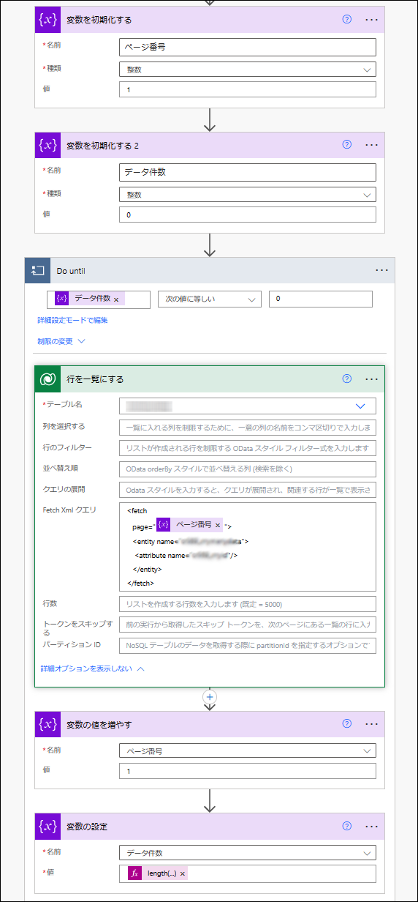
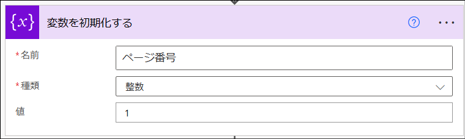
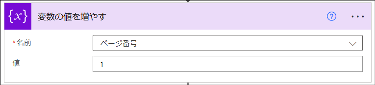

こんにちは、Power Platform サポート 谷です。<br/>
この記事では Dataverse テーブルに登録されている 5,000 件を超えるデータを取得する方法について、FetchXML クエリを使用した方法をご紹介します。

<!-- more -->

## Dataverse テーブルから 5,000 件を超えるデータを取得する方法
Power Platform の Dataverse コネクタ「行を一覧にする」アクションを使用すると、取得する列の選択や行のフィルターなどを設定することで、取得されたいデータをローコードで絞り込むことができます。<br/>
多くの場合、この方法で Dataverse からデータを取得していると思います。<br/>
「行を一覧にする」アクションは 1 回の実行で最大 5,000 件のデータを取得しますので、 5,000 件を超えるデータを取得したい場合は、当アクションのオプション「改ページ」を設定します。<br/>
複雑なフローを構成することなく、5,000 件を超える 100,000件(※) までのデータをページングしながら取得することができます。<br/>
※ 100,000 件は Power Automate クラウド フローで取得可能なページ付けされた項目数の上限です。
<br/>
<br/>
アクションの 3 点メニュー > 設定 にて改ページの設定を行います。

 


さて、Dataverse では FetchXML という独自の XML ベースのクエリ言語を使用することができます。<br/>
複雑なクエリでデータを検索したり、100,000 件を超える大量のデータを取得したり、柔軟できめ細やかな条件にてデータを取得することが可能になります。

しかし、FetchXML クエリをコーディングしたり、フロー側で `Do until` アクションを使用して 5,000 件を超えるデータをページングして取得するようフローを構成する必要があります。<br/>
FetchXML を使用した実装方法をより身近に感じていただきたく、以降では、実際に FetchXML を使用して 5,000 件を超えるデータをページングしながら取得するサンプル フローをご紹介します。


## FetchXML クエリで5,000 件を超えるデータを取得するサンプル フロー
下図はサンプル フローの完成図です。 `Do until` アクションを使用して順次、対象ページのデータを取得します。

 

### 0. FetchXML クエリをビルドする
FetchXML クエリの作成方法は [公開情報](https://learn.microsoft.com/ja-jp/power-apps/developer/data-platform/use-fetchxml-construct-query) に記載があるとおり、FetchXML 言語のスキーマ定義に従います。<br/>

[Power Apps](https://make.powerapps.com) や、環境の「詳細設定」から遷移できる従来の [高度な検索](https://learn.microsoft.com/ja-jp/power-apps/user/advanced-find) を使用すると簡単にクエリをビルドできます。

i.  Power Apps 作成者 ポータル > 歯車 アイコン > [詳細設定] を選択します
 

ii. フィルター アイコンを選択します


iii. 条件を設定し、[Fetch XML のダウンロード] を押下します


### 1. ページ番号を格納するための変数を定義する
次に読み込むべき、対象ページのページ番号を識別するための変数を定義します。    
1 ページ目からデータを取得するため初期値は `1` です。

[名前] 任意の変数名を入力ください    
[種類] 整数    
[値] 1    

 

### 2. データ件数を格納するための変数を定義する
「行を一覧にする」アクションにて取得されたデータ件数を識別するための変数を定義します。<br/>
取得されたデータ件数が 0 件になるまで後続のループ処理で Dataverse へのアクションを実行します。

[名前] 任意の変数名を入力ください    
[種類] 整数    
[値] 0    

 

### 3. 全データを取得するよう繰り返しDataverseからデータを取得する
手順 2 で定義した、 Dataverse から取得されたデータ件数が 0 件と判定されるまでループを実行し続けます。

[左辺] 手順 2 で定義した変数   
[条件] 次の値に等しい    
[右辺] 0    

 


### 4. FetchXML を使用して Dataverse からデータを取得する
FetchXML クエリを使用して Dataverse への検索を行います。<br/>
`page` プロパティに、手順 1 で定義した変数に格納しておいたページ番号を指定して、取得対象のページのデータを取得します。<br/>
本サンプルでは検索条件などは設定していませんが、要件に応じて柔軟にクエリをカスタマイズできます。詳細は手順 0 にてご紹介しています。

[テーブル名] 対象の Dateverse テーブルを指定ください    
[Fetch Xml クエリ]    
```xml
<fetch
   page="【ページ番号を定義した変数名】">
   <entity name="【Dataverse テーブル名】">
    <attribute name="【取得されたい列名】"/>
   </entity>
</fetch>
```

`ページ番号`は動的コンテンツから手順 1 で定義した変数名をご指定ください

 


### 5. ページ番号をインクリメントする
次に読み込むべきページ番号を 1 ずつ増分します。

[名前] 手順 1 で定義した変数    
[値] 1    

 


### 6. データ件数を最新化する
今回の実行で取得されたデータ件数を格納します。<br/>
データ件数が 0 件の場合、ループを抜け処理を終了します。

[名前] 手順 2 で定義した変数    
[値] 式に以下の数式を設定ください。取得できたデータ件数で更新します。    
```
length(outputs('行を一覧にする')?['body/value'])
```
 

複雑な検索条件で Dataverse から取得したデータをもとにクラウド フローを実行されたい場合のご参考になりましたら幸いです。


## 参考情報
[Web API で FetchXml を使用する](https://learn.microsoft.com/ja-jp/power-apps/developer/data-platform/webapi/use-fetchxml-web-api#paging-with-fetchxml)

---
