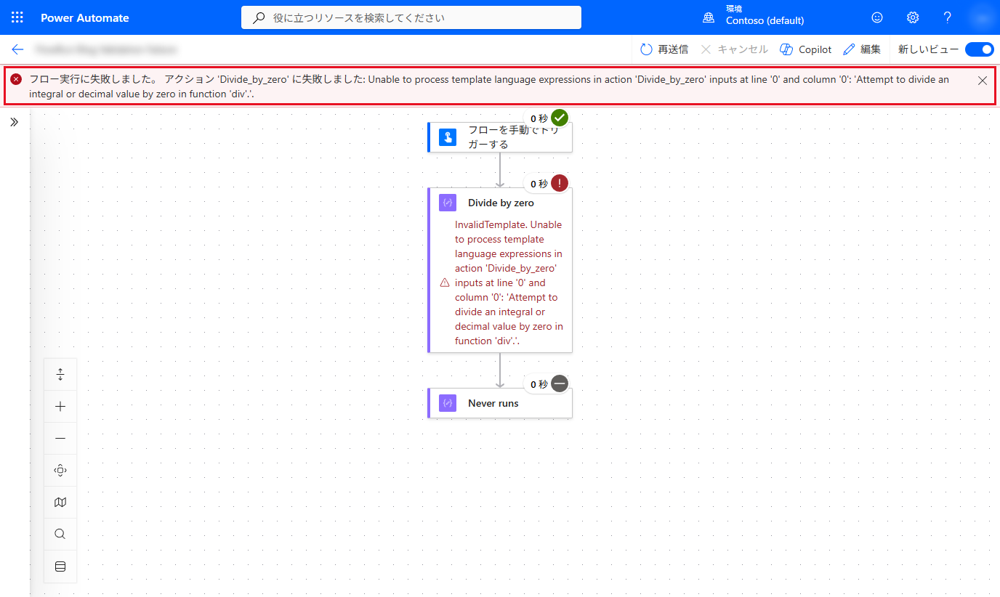
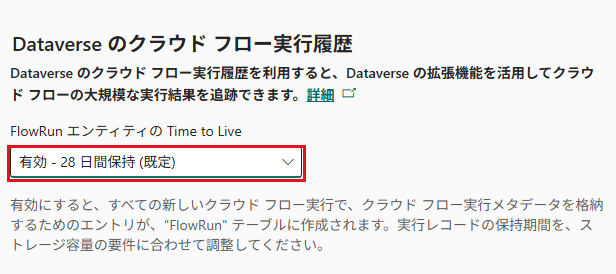
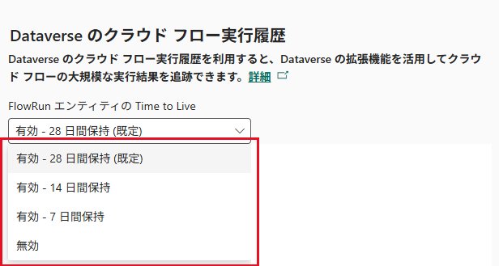
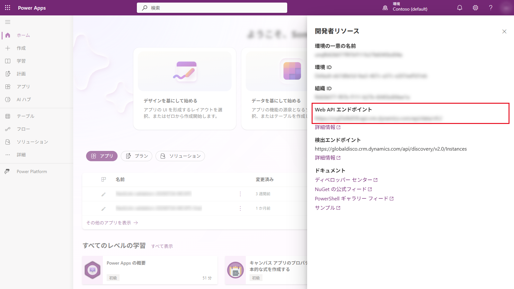
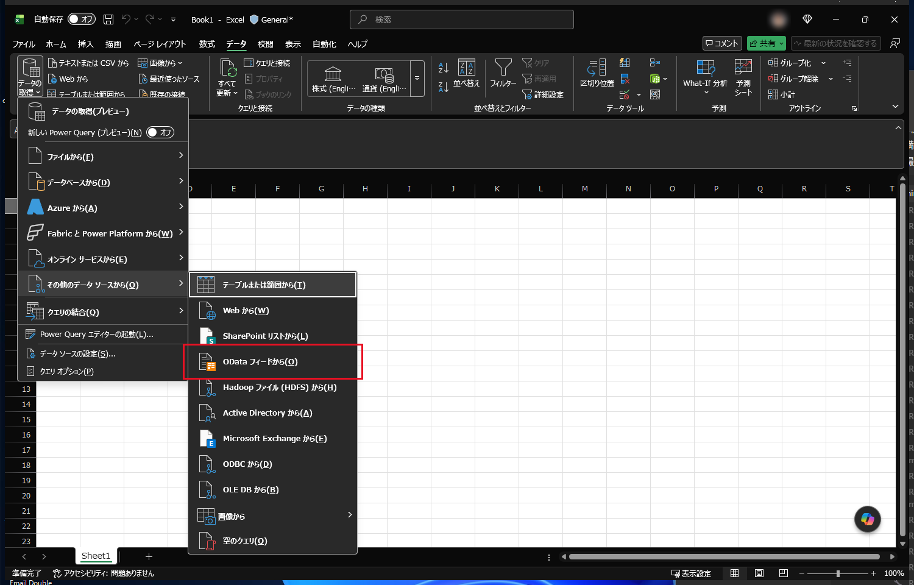
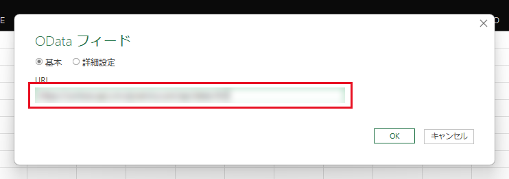
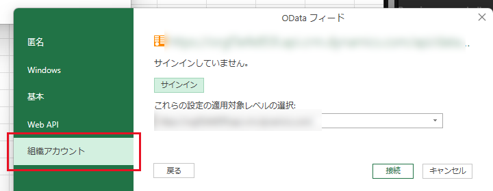
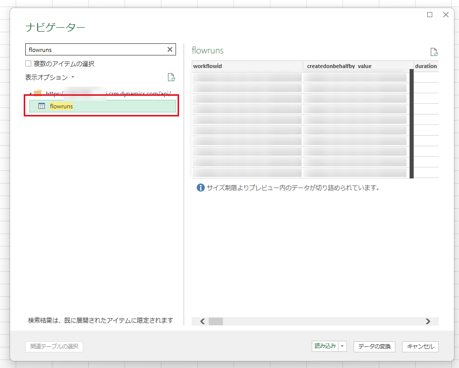
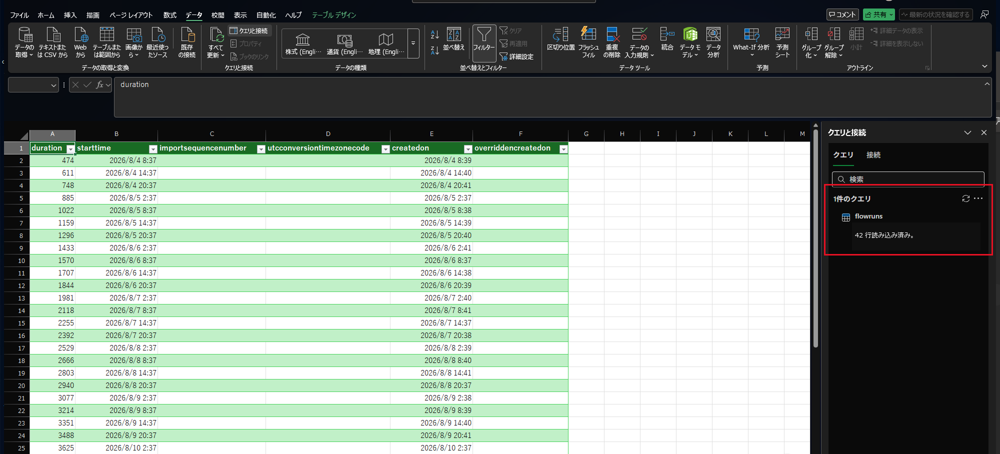

こんにちは、Power Platform サポートチームの早坂です。  
本記事では、管理者が Power Automate クラウド フローの実行履歴を確認、取得する方法についてご案内します。

「特定のクラウド フローが失敗した原因を調べたい」「複数のクラウド フローの実行状況をまとめて監視したい」「実行結果を一覧で取得して集計・レポートしたい」といった場面では、目的によって適した実行履歴が異なります。本記事では、こうした困りごとを解消するために、Power Automate の標準の実行履歴、Application Insights のテレメトリ、Dataverse の `FlowRun` テーブルという 3 種類のログについて、それぞれの特徴と使い分け、取得方法をご紹介します。目的に合ったログの選び方が分かるよう、次章でまず全体像を整理します。

なお、管理者がクラウド フローの一覧を取得する方法は、弊社ブログ記事「[Power Automate のクラウドフロー一覧を管理者が取得する方法](https://jpdynamicscrm.github.io/blog/powerautomate/list-cloud-flow/)」でご紹介しています。

<!-- more -->

# 目次

1. [概要](#anchor-overview)
1. [Power Automate の標準の実行履歴](#anchor-standard-history)
   1. [ログの概要](#anchor-standard-overview)
   1. [ログの取得方法](#anchor-standard-retrieval)
      1. [ポータルで確認する](#anchor-action-details)
      1. [CSV でエクスポートする](#anchor-csv-export)
      1. [PowerShell の Get-FlowRun で取得する](#anchor-get-flowrun)
1. [Application Insights のテレメトリ](#anchor-app-insights)
   1. [ログの概要](#anchor-app-insights-overview)
   1. [ログの取得方法](#anchor-app-insights-retrieval)
1. [Dataverse の FlowRun テーブル](#anchor-flowrun)
   1. [ログの概要](#anchor-flowrun-overview)
      1. [対象となるクラウド フロー](#anchor-prerequisites)
      1. [保存される列](#anchor-flowrun-data)
      1. [保存されない情報とポータルとの比較](#anchor-flowrun-limitations)
      1. [保持期間](#anchor-retention)
      1. [実行履歴が保存されない主な条件](#anchor-ingestion-failures)
   1. [ログの取得方法](#anchor-flowrun-retrieval)
      1. [オートメーション センターで確認する](#anchor-automation-center)
      1. [Excel の OData フィードから取得する](#anchor-excel)
         1. [Web API エンドポイントを確認する](#anchor-excel-endpoint)
         1. [Excel から接続する](#anchor-excel-connect)
         1. [flowruns テーブルを読み込む](#anchor-excel-load)
      1. [Dataverse Web API から取得する](#anchor-web-api)

- [まとめ](#anchor-summary)
- [参考情報](#anchor-references)
- [サンプルコード免責事項](#anchor-sample-disclaimer)

---

<a id='anchor-overview'></a>
<a id='anchor-methods'></a>

# 1. 概要

管理者が利用できる主な実行履歴は、以下の 3 種類です。用途や粒度、保持期間、取得方法が異なるため、まずは全体像を把握し、目的に合ったログを選んでください。

| データソース | 利用者・アクセス権 | 対象となるクラウド フロー | 情報の粒度・主な用途 | 保持期間 | 取得・確認ツール |
|---|---|---|---|---|---|
| Power Automate の標準の実行履歴 | 所有者・共同所有者など、対象のクラウド フローへのアクセス権を持つユーザー | ソリューションに含まれるクラウド フローと含まれないクラウド フロー | 実行、トリガー、アクションの状態や入力・出力。個別の問題調査 | 既定 28 日 | Power Automate ポータル、CSV エクスポート、PowerShell (`Get-FlowRun`) |
| Application Insights のテレメトリ | エクスポートを設定する管理者と、Azure リソースのログを読み取れるユーザー | マネージド環境で、クラウド フローのエクスポート対象として設定したデータ | 実行、トリガー、アクションのテレメトリ。横断的な監視・分析 (完全な入力・出力ではない) | 出力先 Log Analytics の保持設定に従う | Application Insights のメトリック・ログ (KQL) |
| Dataverse の `FlowRun` | 対象レコードを読み取れるユーザー。オートメーション センターには追加のアクセス条件あり | ソリューションに含まれるクラウド フロー | 実行単位の状態、時刻、実行時間、エラー概要。横断監視や結果の集計 | 既定 28 日 (変更可能) | オートメーション センター、Excel の OData フィード、Dataverse Web API / PowerShell |

クラウド フローには、ソリューションに含まれるものと含まれないものがあります。それぞれ内部的に管理される場所が異なるため、実行履歴の閲覧可否も異なります。

<a id='anchor-standard-history'></a>

# 2. Power Automate の標準の実行履歴

<a id='anchor-standard-overview'></a>

## 2-1. ログの概要

Power Automate ポータルでは、アクセス権を持つ対象のクラウド フローの実行履歴を確認できます。ソリューションに含まれるものと含まれないものの両方が対象です。

標準の実行履歴はトランザクション ベースで、既定の保持期間は 28 日です。長期保存が必要な場合は、保持期限が切れる前に必要な情報を取得してください。詳細は [フローの実行履歴またはトリガー履歴が見つからない場合の説明](https://learn.microsoft.com/ja-jp/troubleshoot/power-platform/power-automate/flow-run-issues/missing-runs-or-triggers-history-for-a-flow) を参照してください。

<a id='anchor-standard-retrieval'></a>

## 2-2. ログの取得方法

標準の実行履歴は、Power Automate ポータルからの確認と CSV エクスポート、または PowerShell の `Get-FlowRun` で取得します。個別の問題調査にはポータル、一覧での取得には CSV や PowerShell が適しています。

<a id='anchor-action-details'></a>

### 2-2-1. ポータルで確認する

個別の問題を調査する場合は、はじめに Power Automate ポータルの実行履歴から対象の実行を特定します。

1. [Power Automate](https://make.powerautomate.com/) で対象の環境へ切り替えます。
1. 対象のクラウド フローを開き、実行履歴から調査する実行を選択します。
1. 実行詳細ページの URL から実行 ID を確認します。
1. 失敗したトリガーまたはアクションを展開し、エラー、入力、出力を確認します。

実行詳細ページの URL は以下の形式です。

```text
https://make.powerautomate.com/environments/<環境 ID>/flows/<クラウド フロー ID>/runs/<実行 ID>
```

ソリューションに含まれるクラウド フローの場合は、以下の形式になります。**マイ フロー** から開いた場合は、`<ソリューション ID>` の部分が `~preferred` になります。

```text
https://make.powerautomate.com/environments/<環境 ID>/solutions/<ソリューション ID>/flows/<クラウド フロー ID>/runs/<実行 ID>
```

URL の `<実行 ID>` は `FlowRun` テーブルの `name` に対応します。

失敗した実行を Power Automate ポータルで開くと、クラウド フローの詳細画面の上部にはアクション名とエラーの詳細が表示されます。



<a id='anchor-csv-export'></a>

### 2-2-2. CSV でエクスポートする

実行履歴を CSV として取得する場合は、以下の手順を使用します。

1. [Power Automate](https://make.powerautomate.com/) で **マイ フロー** から対象のクラウド フローを開きます。
1. **実行履歴** の **すべて表示** を選択します。
1. **CSV のダウンロード** を選択します。

詳細は [実行履歴をエクスポートする](https://learn.microsoft.com/ja-jp/power-automate/privacy-dsr-export#export-run-history) を参照してください。CSV は実行履歴の一覧を取得する方法であり、各アクションの入れ子になった入力・出力をすべてエクスポートするものではありません。アクション単位の詳細はポータルで確認します。

<a id='anchor-get-flowrun'></a>

### 2-2-3. PowerShell の Get-FlowRun で取得する

標準の実行履歴は、`Microsoft.PowerApps.PowerShell` モジュールの `Get-FlowRun` でも取得できます。管理者向けモジュールではなく、ユーザー向けモジュールに含まれるコマンドです。

以下は、モジュールをインストールし、サインインして対象のクラウド フローの実行履歴を取得する使用例です。環境 ID とクラウド フロー ID を対象の値に置き換えてください。使用にあたっては [サンプルコード免責事項](#anchor-sample-disclaimer) をご確認ください。

```powershell
Install-Module -Name Microsoft.PowerApps.PowerShell -Scope CurrentUser
Add-PowerAppsAccount
Get-FlowRun -EnvironmentName '<環境 ID>' -FlowName '<クラウド フロー ID>'
```

所有者・共同所有者など、サインインするユーザーに対象のクラウド フローへのアクセス権が必要です。管理者ロールがあるだけで、すべてのクラウド フローの実行履歴を取得できるわけではありません。

> [!NOTE]
> [Microsoft.PowerApps.PowerShell 1.0.45](https://www.powershellgallery.com/packages/Microsoft.PowerApps.PowerShell/1.0.45) の `Get-FlowRun` は、標準の実行履歴 API が返した一覧を処理し、次ページを自動的にたどる処理は含まれていません。保持期間内のすべての実行履歴を一度に取得できるとは限らない点に注意してください。

モジュールの利用方法は [Power Apps 用の PowerShell サポート](https://learn.microsoft.com/ja-jp/power-platform/admin/powerapps-powershell) を参照してください。

<a id='anchor-app-insights'></a>

# 3. Application Insights のテレメトリ

<a id='anchor-app-insights-overview'></a>

## 3-1. ログの概要

個別の調査ではなく、**アクション単位のテレメトリを長期的に保持して監視・分析したい**場合は、Application Insights へのエクスポートを検討します。

Application Insights では、クラウド フローの実行は `requests`、トリガーとアクションは `dependencies` に保存されます。`customDimensions` の `environmentId` と `resourceId`（クラウド フロー ID）に加え、発生時刻やアクション名を使って、ポータルで確認した実行と対象範囲を絞り込みます。ただし、テレメトリは各アクションの完全な入力・出力を保存するものではありません。

対象は、Dataverse データベースを持つ**マネージド環境**で、エクスポート対象として設定したクラウド フローの実行、トリガー、アクションのデータです。エクスポートの設定には、Power Platform 管理者、Dynamics 365 管理者、または対象環境の管理者・システム管理者などの権限と、出力先 Azure リソースに対する必要な権限が必要です。ログを確認するユーザーにも、その Azure リソースのログを読み取る権限が必要です。

保持期間は、出力先 Log Analytics ワークスペースおよびテーブルの実際の設定に従います。`AppRequests` と `AppDependencies` の既定の保持期間は 90 日とされていますが、すべての環境で一律に 90 日とは限りません。設定は [Log Analytics ワークスペースでデータ保持を管理する](https://learn.microsoft.com/ja-jp/azure/azure-monitor/logs/data-retention-configure) を参照してください。

> [!IMPORTANT]
> Application Insights へのデータ エクスポートは、**マネージド環境でのみ**サポートされます。また、Application Insights のテレメトリもトランザクション データではないため、すべてのログが欠落なく保存されることは保証されません。

<a id='anchor-app-insights-retrieval'></a>

## 3-2. ログの取得方法

設定から確認までの流れは以下のとおりです。画面付きの詳しい手順は、各リンク先の公開情報を参照してください。

1. [Application Insights へのデータのエクスポートを設定する](https://learn.microsoft.com/ja-jp/power-platform/admin/set-up-export-application-insights) に沿って、Power Platform 管理センターで対象環境と出力先を指定し、Power Automate の実行、トリガー、アクションからエクスポートするカテゴリを選択します。
1. データの反映を待ち、[Application Insights を使用してクラウド フローを監視する](https://learn.microsoft.com/ja-jp/power-platform/admin/app-insights-cloud-flow) に沿って、Application Insights のメトリックやログを確認します。データの配信には最大 24 時間かかる場合があります。
1. ログの絞り込みや集計には、同ページに掲載されている KQL の例を参照し、対象環境やクラウド フローに合わせて使用します。

<a id='anchor-flowrun'></a>

# 4. Dataverse の FlowRun テーブル

<a id='anchor-flowrun-overview'></a>

## 4-1. ログの概要

`FlowRun` は Dataverse のエラスティック テーブルで、クラウド フローの実行単位の情報が保存されます。実行結果を一覧で取得・集計する用途に適しています。

<a id='anchor-prerequisites'></a>

### 4-1-1. 対象となるクラウド フロー

`FlowRun` テーブルへ実行履歴が保存される対象は、ソリューション対応クラウド フロー (定義が Dataverse に保存されているクラウド フロー) です。オートメーション センターのクラウド フロー実行データにも `FlowRun` が使用されます。

対象のクラウド フローの定義が Dataverse に存在するかどうかは、Web API で `workflow` テーブルを参照して確認できます。

```http
GET https://<組織 URL>/api/data/v9.2/workflows(<クラウド フロー ID>)?$select=name,category
```

クラウド フローの情報が返れば `FlowRun` に実行履歴が記録され、`404`（定義が見つからない）の場合は記録されません。

<a id='anchor-flowrun-data'></a>

### 4-1-2. 保存される列

保存される列の詳細は、[Dataverse でクラウド フロー実行履歴を管理する](https://learn.microsoft.com/ja-jp/power-automate/dataverse/cloud-flow-run-metadata) を参照してください。

<a id='anchor-flowrun-limitations'></a>

### 4-1-3. 保存されない情報とポータルとの比較

以下のようなアクション単位の情報は `FlowRun` テーブルへ保存されません。

- アクションの表示名
- アクションごとの状態や実行時間
- アクションの入力と出力

失敗した実行では、`errorcode` に `ActionFailed` などのコードが、`errormessage` に次のような JSON が保存されます。

```json
{
  "code": "ActionFailed",
  "message": "An action failed. No dependent actions succeeded.",
  "messageTemplate": "An action failed. No dependent actions succeeded."
}
```

`FlowRun` と Power Automate ポータルで取得できる情報の違いは以下のとおりです。同じ失敗した実行を両方から確認した結果です。

| 情報 | `FlowRun` | Power Automate ポータル |
|---|---|---|
| 実行の状態 | 確認可 (`status`) | 確認可 |
| エラー コード | 確認可 (`errorcode`) | 確認可 |
| 失敗したアクション名 | 確認不可 | 確認可 |
| エラーの詳細 | 概要のみ (`errormessage`) | 確認可 |
| アクションの入力と出力 | 確認不可 | 確認可 |
| クライアント追跡 ID | 確認可 (`clienttrackingid`) | 確認可 |

このように、`errormessage` から取得できるのは実行単位の概要までです。どのアクションが失敗したかを特定する場合は、[2-2-1. ポータルで確認する](#anchor-action-details) のポータルの手順を使用してください。

<a id='anchor-retention'></a>

### 4-1-4. 保持期間

`FlowRun` レコードの既定の保持期間は 28 日です。

Power Platform 管理センターから保持期間を変更する手順は以下のとおりです。

1. [Power Platform 管理センター](https://admin.powerplatform.microsoft.com/) にサインインします。
1. **管理** > **環境** から対象の環境を選択し、**設定** を開きます。
1. **製品** > **機能** を選択します。
1. **Dataverse のクラウド フロー実行履歴** の **FlowRun エンティティの Time to Live** を設定します。



選択できる値は、**有効 - 28 日間保持 (既定)**、**有効 - 14 日間保持**、**有効 - 7 日間保持**、**無効** の 4 つです。



管理センターに用意されていない任意の値が必要な場合は、組織テーブルの `FlowRunTimeToLiveInSeconds` を直接変更します。変更後に新しく作成される `FlowRun` レコードへ、その保持期間が適用されます。値を `0` にすると、新しいレコードの取り込みが停止します。

> [!NOTE]
> 保持期間の変更は、変更後に作成される `FlowRun` レコードにのみ適用されます。既存のレコードの保持期間は変わりません。

<a id='anchor-ingestion-failures'></a>

### 4-1-5. 実行履歴が保存されない主な条件

`FlowRun` レコードが記録されない、またはスキップされる代表的な条件は以下のとおりです。

| 条件 | 内容 |
|---|---|
| クラウド フロー所有者の権限不足 | クラウド フローのプライマリ所有者が `FlowRun` テーブルへの読み取り権限を持たない場合、`FlowRun` レコードは保存されません。`FlowEvent` に `ElasticTableNoRoleForUser` が記録されます。 |
| パーティション サイズの上限 | エラスティック テーブルには、現時点でパーティションあたり 20 GB の制限があります。上限に達すると、そのユーザーのレコード挿入のみが失敗します。 |
| 取り込みレートのスロットリング | 1 人のユーザーが実行頻度の高いクラウド フローを多数所有している場合、`FlowRun` レコードがスロットリングされ、スキップされることがあります。 |
| TTL が `0` | `FlowRunTimeToLiveInSeconds` が `0` の場合、新しいレコードの取り込みが停止し、`FlowEvent` に `TtlSettingEqual0` が記録されます。 |

> [!NOTE]
> `FlowRun` はユーザー単位でパーティション分割されるため、上記の上限やスロットリングは組織全体ではなく、クラウド フローの所有者ごとに評価されます。特定のユーザーへクラウド フローの所有権が集中している環境では影響を受けやすくなります。

> [!WARNING]
> `FlowRun` には、すべての実行履歴が欠落なく保存されるとは限りません。監査や完全な実行記録が必要な設計では、他の方法をご検討ください。

レコードが欠落している可能性がある場合は、`FlowEvent` テーブルの `FlowRunIngestion` イベントを確認します。保持期間の無効化、ストレージ容量、パーティション上限、取り込みレートの超過など、記録がスキップされた原因がシグナルとして残ります。

> [!IMPORTANT]
> ただし、`FlowEvent` にシグナルがないことは、すべての実行が `FlowRun` に保存されていることを意味しません。データ ストリームの一時的な問題で欠落したレコードは、`FlowEvent` にも記録されないためです。

<a id='anchor-flowrun-retrieval'></a>

## 4-2. ログの取得方法

環境内の自動化を横断的に監視する場合はオートメーション センター、コードを書かずに一覧を取得・集計する場合は Excel の OData フィード、自動処理に組み込む場合は Dataverse Web API を使用します。いずれも、クラウド フローの実行データとして `FlowRun` を参照します。

<a id='anchor-automation-center'></a>

### 4-2-1. オートメーション センターで確認する

オートメーション センターでは、ダッシュボードから実行ログ、エラー、パフォーマンスなどを確認できます。クラウド フローについてはソリューション対応のものが対象で、実行データには標準の実行履歴ではなく `FlowRun` が使用されます。このため、本記事では、通常の実行履歴ではなく `FlowRun` の取得方法の一つとして扱います。

表示には、クラウド フローの所有者であること、または環境全体の関連データへの読み取りアクセス権が必要です。**共同所有者であることだけでは十分ではありません。** `workflow`、`flowrun`、`flowsession` などの関連テーブルに対する読み取り権限とその範囲を確認してください。

[Power Automate](https://make.powerautomate.com/) で対象環境の **オートメーション センター** を開き、実行ログやパフォーマンスを確認します。画面付きの操作方法とアクセス条件は [オートメーション センターの概要](https://learn.microsoft.com/ja-jp/power-automate/automation-center-overview) を参照してください。

<a id='anchor-excel'></a>

### 4-2-2. Excel の OData フィードから取得する

`FlowRun` の内容は、Excel の OData フィードから取得することもできます。コードを使用せずに一覧を取得できるため、定期的な集計やレポートの作成に適しています。

<a id='anchor-excel-endpoint'></a>

#### 4-2-2-1. Web API エンドポイントを確認する

1. [Power Apps](https://make.powerapps.com/) で対象の環境へ切り替えます。
1. 右上の歯車アイコンから **開発者リソース** を選択します。
1. **Web API エンドポイント** に表示されている URL を控えます。



<a id='anchor-excel-connect'></a>

#### 4-2-2-2. Excel から接続する

1. 空の Excel ファイルを開きます。
1. **データ** タブ > **データの取得** > **その他のデータ ソースから** > **OData フィードから** を選択します。



1. [4-2-2-1. Web API エンドポイントを確認する](#anchor-excel-endpoint) で控えた **Web API エンドポイント** の URL を入力し、**OK** を選択します。



1. **組織アカウント** を選択し、環境に対する権限を持つユーザーでサインインします。サインイン後、**接続** を選択します。



> [!IMPORTANT]
> 認証方法の既定は **匿名** です。**組織アカウント** を選択しないと接続できません。

<a id='anchor-excel-load'></a>

#### 4-2-2-3. flowruns テーブルを読み込む

1. ナビゲーターの検索ボックスに `flowruns` と入力し、表示されたテーブルを選択します。
1. プレビューの内容を確認し、**読み込み** を選択します。



Excel のワークシートへ `FlowRun` のレコードが読み込まれます。



> [!NOTE]
> Dataverse のテーブル数は多いため、ナビゲーターでは検索を使用して `flowruns` を絞り込むと確実です。また、接続時にメタデータの取得が行われ、完了までに時間がかかる場合があります。

> [!NOTE]
> Excel の OData フィードや Dataverse コネクタは、比較的小規模なデータを扱う分析シナリオを想定しています。大量データを継続的に抽出する場合は、Azure Synapse Link の使用が推奨されています。詳細は [Dataverse コネクタの制限事項と考慮事項](https://learn.microsoft.com/ja-jp/power-query/connectors/dataverse) を参照してください。

<a id='anchor-web-api'></a>

### 4-2-3. Dataverse Web API から取得する

本記事では、Dataverse Web API を使用してデータを読み取る例を紹介します。API の実行には、対象環境の `FlowRun` テーブルを読み取る権限と、Dataverse Web API 用のアクセストークンが必要です。システム管理者ロールなど、環境内の `FlowRun` レコードを組織単位で読み取れる権限があれば、自分が所有していないクラウド フローの実行履歴も取得できます。

Dataverse Web API の `$select` で指定する論理名と説明は、[Flow Run (flowrun) テーブル/エンティティ参照](https://learn.microsoft.com/ja-jp/power-apps/developer/data-platform/reference/entities/flowrun) を参照してください。

> [!NOTE]
> `duration` の単位は、Microsoft Learn の日本語ページ間で記載が異なります。[Dataverse でクラウド フロー実行履歴を管理する](https://learn.microsoft.com/ja-jp/power-automate/dataverse/cloud-flow-run-metadata) では「実行期間」が **秒単位**、[Flow Run (flowrun) テーブル/エンティティ参照](https://learn.microsoft.com/ja-jp/power-apps/developer/data-platform/reference/entities/flowrun) の `DurationInMs` では「実行時間 (**ミリ秒単位**)」と記載されており、弊社の環境でもミリ秒単位であることを確認しました。

> [!IMPORTANT]
> `status` と `triggertype` を `$filter` で指定する場合は、画面の表示名ではなく API が返す値を使用します。弊社の環境では、`triggertype` に `Scheduled`（予定されている）や `Instant`（手動実行）が、`status` に `Succeeded` や `Failed` が格納されていました。[Dataverse でクラウド フロー実行履歴を管理する](https://learn.microsoft.com/ja-jp/power-automate/dataverse/cloud-flow-run-metadata) に記載されている「自動化」「予定されている」「マニュアル」は画面上の表示名であり、そのまま `$filter` へ指定しても一致しません。

`FlowRun` テーブルのエンティティ セット名は `flowruns` です。以下のような GET 要求で実行履歴を取得できます。使用にあたっては [サンプルコード免責事項](#anchor-sample-disclaimer) をご確認ください。

```http
GET https://<組織 URL>/api/data/v9.2/flowruns
  ?$select=name,starttime,endtime,duration,status,triggertype,errorcode,errormessage,clienttrackingid,workflowid,partitionid,ttlinseconds
  &$filter=workflowid eq '<クラウド フロー ID>'
  &$orderby=starttime desc
  &$top=100
Accept: application/json
OData-Version: 4.0
Authorization: Bearer <アクセストークン>
```

PowerShell から取得する場合は、はじめに Dataverse Web API 用のアクセストークンを取得します。以下の例では Azure CLI を使用し、対象組織の URL をリソースとして指定しています。

```powershell
az login
$webApiUrl = 'https://<組織 URL>/api/data/v9.2'
$accessToken = az account get-access-token --resource "https://<組織 URL>" --query accessToken --output tsv
```

取得したアクセストークンを使用して、以下のように要求できます。

```powershell
$flowId = '<クラウド フロー ID>'

$select = 'name,starttime,endtime,duration,status,triggertype,errorcode,errormessage,clienttrackingid,workflowid,partitionid,ttlinseconds'
$filter = [uri]::EscapeDataString("workflowid eq '$flowId'")
$requestUri = "$webApiUrl/flowruns?`$select=$select&`$filter=$filter&`$orderby=starttime desc&`$top=100"

$headers = @{
    Authorization      = "Bearer $accessToken"
    Accept             = 'application/json'
    'OData-Version'    = '4.0'
    'OData-MaxVersion' = '4.0'
}

$response = Invoke-RestMethod -Method Get -Uri $requestUri -Headers $headers
$response.value
```

弊社の環境では、実行が終了してから `FlowRun` へレコードが現れるまで、約 3 分かかりました。取得処理では即時反映を前提とせず、再試行や待機時間を考慮してください。

> [!TIP]
> Web API エンドポイントは、開発者リソース画面では `https://<組織名>.api.crm.dynamics.com/api/data/v9.2` の形式で表示されます。弊社の環境では、`api` を含まない組織 URL (`https://<組織名>.crm.dynamics.com/api/data/v9.2`) でも同じ結果を取得できました。

<a id='anchor-summary'></a>

# まとめ

管理者がクラウド フローの実行履歴を確認する方法は、目的に応じて使い分けます。

- 個別の実行を確実に調査する場合は、Power Automate ポータルの実行履歴を使用します。アクション名、入力、出力まで確認できます。
- アクション単位のテレメトリを長期的に保持して監視・分析する場合は、Application Insights を使用します。ただし**マネージド環境が必要**です。
- 実行単位で横断的に監視したり、実行結果を一覧で取得・集計したりする場合は、`FlowRun` を使用します。ダッシュボードで確認する場合はオートメーション センター、コードを書かずに済ませたい場合は Excel の OData フィード、自動処理に組み込む場合は Dataverse Web API や PowerShell が適しています。

`FlowRun` には、アクション名やアクションごとの入力と出力は保存されません。また、`FlowRun` は 100% の完全性が保証されるデータではないため、監査など欠落が許されない用途では Power Automate ポータルの実行履歴と併用してください。

<a id='anchor-references'></a>

# 参考情報

- [Dataverse でクラウド フロー実行履歴を管理する](https://learn.microsoft.com/ja-jp/power-automate/dataverse/cloud-flow-run-metadata)
- [FlowRun テーブル/エンティティ参照](https://learn.microsoft.com/ja-jp/power-apps/developer/data-platform/reference/entities/flowrun)
- [Web API を使用してデータのクエリを実行する](https://learn.microsoft.com/ja-jp/power-apps/developer/data-platform/webapi/query-data-web-api)
- [エラスティック テーブルを作成して編集する](https://learn.microsoft.com/ja-jp/power-apps/maker/data-platform/create-edit-elastic-tables)
- [FlowEvent テーブル/エンティティ参照](https://learn.microsoft.com/ja-jp/power-apps/developer/data-platform/reference/entities/flowevent)
- [Dataverse コネクタ (Power Query) の制限事項と考慮事項](https://learn.microsoft.com/ja-jp/power-query/connectors/dataverse)
- [Application Insights を使用してクラウド フローを監視する](https://learn.microsoft.com/ja-jp/power-platform/admin/app-insights-cloud-flow)
- [Application Insights へのデータのエクスポートを設定する](https://learn.microsoft.com/ja-jp/power-platform/admin/set-up-export-application-insights)
- [オートメーション センターの概要](https://learn.microsoft.com/ja-jp/power-automate/automation-center-overview)
- [実行履歴をエクスポートする](https://learn.microsoft.com/ja-jp/power-automate/privacy-dsr-export#export-run-history)
- [フローの実行履歴またはトリガー履歴が見つからない場合の説明](https://learn.microsoft.com/ja-jp/troubleshoot/power-platform/power-automate/flow-run-issues/missing-runs-or-triggers-history-for-a-flow)
- [Power Apps 用の PowerShell サポート](https://learn.microsoft.com/ja-jp/power-platform/admin/powerapps-powershell)
- [Microsoft.PowerApps.PowerShell 1.0.45](https://www.powershellgallery.com/packages/Microsoft.PowerApps.PowerShell/1.0.45)
- [Log Analytics ワークスペースでデータ保持を管理する](https://learn.microsoft.com/ja-jp/azure/azure-monitor/logs/data-retention-configure)

<a id='anchor-sample-disclaimer'></a>

# サンプルコード免責事項

> [!IMPORTANT]
> ===サンプルコード免責事項===
> ・本記事で紹介しているサンプルコードは説明のためのサンプルであり、お客様の要望を直接満たすためのご提供ではございません。
> そのため、製品の実運用環境で使用されることを前提に提供されるものではありません。
>
> ・エラー処理などは含まれておりません。また、弊社にてその動作を保証するものではございません。
>
> ・サンプル コードおよびそれに関連するあらゆる情報は、"現状のまま" で
> 提供されるものであり、商品性や特定の目的への適合性に関する黙示の保証も含め、
> 明示、黙示を問わずいかなる保証も付されるものではありません。
>
> ご使用の際には、十分にご検証いただき、ご使用くださいますようお願い申し上げます。
>
> マイクロソフトは、お客様に対し、サンプル コードを使用および改変するための
> 非排他的かつ無償の権利ならびに本サンプル コードをオブジェクト コードの形式で
> 複製および頒布するための非排他的かつ無償の権利を許諾します。
>
> 但し、お客様は下記に同意するものとします。
> (1) サンプル コードが組み込まれたお客様のソフトウェア製品のマーケティングのために
>     マイクロソフトの会社名、ロゴまたは商標を用いないこと
> (2) サンプル コードが組み込まれたお客様のソフトウェア製品に有効な著作権表示をすること
> (3) サンプル コードの使用または頒布から生じるあらゆる損害 (弁護士費用を含む) に
>     関する請求または訴訟について、マイクロソフトおよびマイクロソフトの取引業者に対し補償し、
>     損害を与えないこと

※本記事の執筆には生成 AI を使用しています。[参考](https://learn.microsoft.com/ja-jp/principles-for-ai-generated-content)

---
免責事項
※本情報の内容 (添付文書、リンク先などを含む) は、作成日時点でのものであり、予告なく変更される場合があります。
