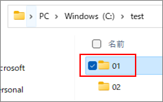
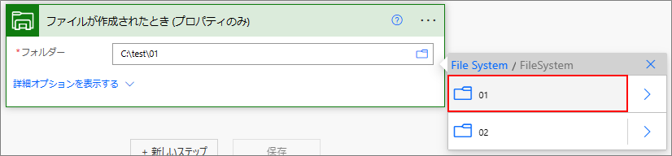
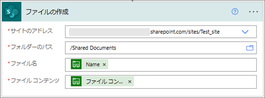

こんにちは、Power Platform サポートの林です。  
本記事では ローカルファイルをクラウドフローで扱う方法についてご案内いたします。  

<!-- more -->

# オンプレミス データ ゲートウェイ

オンプレミス データ ゲートウェイ（以下、ゲートウェイ）をインストールすることでクラウド フローとローカル マシン間で通信することができ、ローカル ファイルが格納されたことをトリガーにクラウド フローを実行することや、クラウド フローで扱ったファイルをローカル マシンに保存することができます。  
その他、ローカル マシンから接続できるデータ ソース（SQL Server や Oracle）のデータ操作もできるようになります。

今回はローカル マシンにファイルが格納されたことをトリガーにクラウド フローでSharePoint のドキュメント ライブラリに格納する方法をご紹介させていただきます。

# ゲートウェイのインストール方法

## 1. 前提
1. 要件  
Windows 8 以降、Windows Server 2012 R2 以降の端末にインストールできます。詳細は以下の公開情報をご確認いただき、要件を満たしているかご確認ください。  
[オンプレミス データ ゲートウェイをインストールする | Microsoft Learn](https://learn.microsoft.com/ja-jp/data-integration/gateway/service-gateway-install#requirements) 

2. 必要なエンドポイント  
ゲートウェイは送信ポートのみを利用してクラウドサービスと通信します。  
以下の公開情報をご確認いただき、送信ポートから全てのエンドポイントに接続できる状態となっているかご確認ください。  
[オンプレミス データ ゲートウェイの通信設定を調整する | Microsoft Learn](https://learn.microsoft.com/ja-jp/data-integration/gateway/service-gateway-communication#ports)  

3. 有償ライセンス
ゲートウェイは Microsoft 365 のライセンスでは利用できず、Power Platform の有償ライセンスが必要となります。  
有償ライセンスについては以下をご確認ください。  
・[Power Automate の有償ライセンス](https://powerautomate.microsoft.com/ja-jp/pricing/)
・[Power Apps の有償ライセンス](https://powerapps.microsoft.com/ja-jp/pricing/ )

## 2. ゲートウェイをインストールする
ゲートウェイをダウンロードしインストールします。手順については、以下の公開情報をご確認ください。  
[オンプレミス データ ゲートウェイをインストールする | Microsoft Learn](https://learn.microsoft.com/ja-jp/data-integration/gateway/service-gateway-install#download-and-install-a-standard-gateway)  

* 補足事項１  
設定時にメール アドレスを入力しますが、入力したアドレスのユーザーが管理者となります。管理者はゲートウェイの管理者や利用者の追加、複数のゲートウェイをクラスター化する権限を有します。  

* 補足事項２  
ゲートウェイの登録情報はクラウド上に記録されますが、登録先リージョン（以下、赤枠）をご確認下さい。テナントが日本の場合、Japan East と表示されているかご確認し、異なっていれば変更してください。  

## 3.プロキシ設定をする
プロキシ サーバー経由でネットワーク通信をする必要がある場合、インストールされた設定ファイルを修正します。修正対象、修正内容は以下の公開情報をご確認ください。  
[オンプレミス データ ゲートウェイのプロキシ設定を構成する | Microsoft Learn](https://learn.microsoft.com/ja-jp/data-integration/gateway/service-gateway-proxy)

# ファイルシステムコネクタを利用したフローの構築

サンプルとして、以下のフォルダに追加されたファイルを SharePoint のドキュメント ライブラリに格納します。  

## 1.ファイルシステムコネクタの接続作成
Power Automate ポータルの接続メニューからファイル システム コネクタの接続を作成します。  

|パラメータ名|値|
|---|---|
|Root folder|連携したいファイルの親フォルダを指定します。アクションにてサブフォルダを指定することができます。|
|Authentication Type|Windows 固定|
|Username|Windowsにログインする際のドメイン名とユーザー名を「ドメイン名\ユーザー名」の形式でご指定ください。 端末にログオンしているユーザーのドメインとユーザーの名は whoami コマンドから確認いただけます。 ※ Power Automate のログインアカウントではございませんので、ご注意ください。|
|Password|上記で指定したユーザーのパスワードをご指定ください。|
|ゲートウェイの選択|インストールしたゲートウェイを選択ください。|

## 2.クラウド フローの作成

#### 全体図

クラウド フローの全体図です。  

### (1) ファイルが作成されたことをトリガーに起動

ファイル システム コネクタの「[ファイルが作成されたとき (プロパティのみ)](https://learn.microsoft.com/ja-jp/connectors/filesystem/#%E3%83%95%E3%82%A1%E3%82%A4%E3%83%AB%E3%81%8C%E4%BD%9C%E6%88%90%E3%81%95%E3%82%8C%E3%81%9F%E3%81%A8%E3%81%8D-(%E3%83%97%E3%83%AD%E3%83%91%E3%83%86%E3%82%A3%E3%81%AE%E3%81%BF))」トリガーを使用します。  

|パラメータ名|値|
|---|---|
|フォルダー|接続で指定した Root folder 配下のトリガー対象のフォルダを指定します。 対象フォルダのサブフォルダ内にファイルが追加された場合はトリガーしないので注意してください。|

### (2) ファイルコンテンツの取得

ファイル システム コネクタの「[パスを使用してファイル コンテンツを取得](https://learn.microsoft.com/ja-jp/connectors/filesystem/#%E3%83%91%E3%82%B9%E3%82%92%E4%BD%BF%E7%94%A8%E3%81%97%E3%81%A6%E3%83%95%E3%82%A1%E3%82%A4%E3%83%AB-%E3%82%B3%E3%83%B3%E3%83%86%E3%83%B3%E3%83%84%E3%82%92%E5%8F%96%E5%BE%97)」アクションを使用します。  

|パラメータ名|値|
|---|---|
|ファイルパス|追加したファイルのファイル コンテンツを取得します。ファイル パスにはトリガーで取得した" Path "を指定します。|

### (3) SharePoint のドキュメント ライブラリにファイルを格納

SharePoint コネクタの「[ファイルの作成](https://learn.microsoft.com/ja-jp/connectors/sharepointonline/#%E3%83%95%E3%82%A1%E3%82%A4%E3%83%AB%E3%81%AE%E4%BD%9C%E6%88%90)」アクションを使用します。  

|パラメータ名|値|
|---|---|
|サイトのアドレス|任意のサイトを指定してください。|
|フォルダーのパス|格納先のパスを指定してください。|
|ファイル名|トリガーで取得した" Name "を指定します。|
|ファイル コンテンツ|パスによるファイル コンテンツで取得した"ファイル コンテンツ"を指定します。|  

フローの各アクションの設定は以上です。  

---

## FAQ

### Q. ゲートウェイは自動でバージョンアップされるのか
自動ではバージョンアップされません。Microsoft は最新の 6 リリースのみを積極的にサポートしています。月に一度程度バージョン アップされるため、定期的なバージョン アップをお勧めいたします。  

### Q. ゲートウェイ利用時はアプリの起動が必要か
不要です。マシン起動と同時に必要なサービスが立ち上がるため、インストール後はゲートウェイを利用するための操作は不要です。  

---
