# はじめに

こんにちは、Power Platform サポートチームの網野です。  
本記事では Power Automate クラウドフロー関連のお問い合わせの際の、情報取得手順についてご案内致します。

<!-- more -->
# 目次

1. [概要](#anchor-intro)
1. [情報取得手順詳細](#anchor-how-to-collect)
   1. [事象の発生状況](#anchor-about-situation)
   1. [事象発生時のエラーメッセージや画面キャプチャ・動画](#anchor-about-screencapture)
         - [エラーメッセージや画面キャプチャ](#anchor-errormessage-image)
         - [動画](#anchor-video)
   1. [フローのパッケージ](#anchor-flowpackage)
      * [フローのパッケージ (マイフロー)](#anchor-flowpackage-myflow)
      * [フローのパッケージ (ソリューションフロー)](#anchor-flowpackage-in-solution)
      * [フローのパッケージ (Dataverse for Teams)](#anchor-flowpackage-in-dv4t)
   1. [フロー識別子](#anchor-flowid)
   1. [実行履歴](#anchor-flowrunhistory)
      * [実行履歴 CSV(実行時にエラーが発生する場合)](#anchor-flowrunhistory-csv)
      * [実行のチェック(期待通りにトリガーされない場合)](#anchor-flowrunhistory-check)
   1. [フロー実行履歴 URL](#anchor-flowrunhistory-url)
   1. [エラーメッセージ](#anchor-error-message-in-run-history)
   1. [アクションの未加工入力、未加工出力](#anchor-raw-input-output)
   1. [テナント情報](#anchor-tenantInfo)
   1. [環境 ID](#anchor-environmentid)
   1. [Web ブラウザのネットワーク トレース・コンソール ログ](#anchor-about-networkhar)
   (デザイナーや実行履歴詳細画面の表示で問題が発生する場合)

---  

# 概要
Power Automate に関するサポートサービスのお問い合わせの際の、情報取得手順についてご案内致します。  

# 情報取得手順詳細

## 事象の発生状況
エラーがどのような状況下で発生するかお知らせください。  
事象の発生条件を特定することで、問題の特定だけではなく弊社環境での再現調査においても有用な情報が得られます。
以下の情報をお知らせいただくことでより明確に事象を把握することができます。  
1. 事象について
   * 同一の構成内容での成功実績有無
   * いつから発生しているか・現在も継続して発生しているか
   * どれぐらいの頻度で発生しているか
   * 発生前後で何らかの変更を行ったか
1. 特定の利用方法で発生する事象か
   * 特定のユーザーか
   * 事象が発生しているユーザーと事象が発生していないユーザーの差
     および、両者のメールアドレスやユーザープリンシパル名

## 事象発生時のエラーメッセージや画面キャプチャ・動画
エラーの内容を具体的に表すメッセージや画面キャプチャなどの情報をお寄せください。  
事象再現時の動画がありますと事象の発生状況をより正確に把握することができます。  

### エラーメッセージや画面キャプチャ
エラーの内容が分かるよう画面キャプチャをご取得ください。  
エラーメッセージ内にタイムスタンプやエラーコードが記載されている場合はそれらの情報を **テキスト形式** でご取得ください。  

### 動画
以下のいずれかの方法で事象発生時の動画をご取得ください。  

> [!IMPORTANT]
> 事象発生の事前に取得開始し、事象発生後に採取を行う必要がございます。

- Windows ゲーム バーでの画面収録  
  [ゲーム バーを使用して PC にゲーム クリップを記録する](https://support.microsoft.com/ja-jp/windows/%E3%82%B2%E3%83%BC%E3%83%A0-%E3%83%90%E3%83%BC%E3%82%92%E4%BD%BF%E7%94%A8%E3%81%97%E3%81%A6-pc-%E3%81%AB%E3%82%B2%E3%83%BC%E3%83%A0-%E3%82%AF%E3%83%AA%E3%83%83%E3%83%97%E3%82%92%E8%A8%98%E9%8C%B2%E3%81%99%E3%82%8B-2f477001-54d4-1276-9144-b0416a307f3c)
- Power Point での画面収録  
  [PowerPoint で画面を記録する](https://support.microsoft.com/ja-jp/office/powerpoint-%E3%81%A7%E7%94%BB%E9%9D%A2%E3%82%92%E8%A8%98%E9%8C%B2%E3%81%99%E3%82%8B-0b4c3f65-534c-4cf1-9c59-402b6e9d79d0)
- Microsoft Teams での画面収録  
  [Microsoft Teamsで会議を記録する](https://support.microsoft.com/ja-jp/office/microsoft-teams-%E3%81%A7%E4%BC%9A%E8%AD%B0%E3%82%92%E8%A8%98%E9%8C%B2%E3%81%99%E3%82%8B-34dfbe7f-b07d-4a27-b4c6-de62f1348c24#:~:text=Microsoft)

## フローのパッケージ
フローの作成方法により取得手順が異なります。  
フローを作成した方法から手順を選択し、パッケージファイルを取得してください。  
* マイ フローに作成した場合 - [フローのパッケージ (マイ フロー)](#anchor-flowpackage-myflow)  
* ソリューションに作成した場合 - [フローのパッケージ (ソリューションフロー)](#anchor-flowpackage-in-solution)  
* Teams の Power Apps アプリから作成した場合 - [フローのパッケージ (Dataverse for Teams)](#anchor-flowpackage-in-dv4t)  

### フローのパッケージ (マイ フロー)
エクスポートしたフローのパッケージ (zip) ファイルをご提供ください。  
* マイ フロー > (フローを選択) > … > エクスポート > パッケージ (zip)  
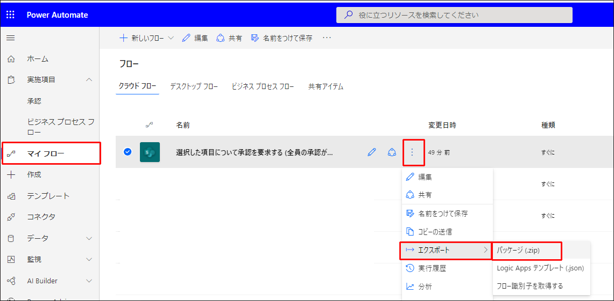  

### フローのパッケージ (ソリューションフロー)
ソリューション内に作成したフローの場合は、エクスポートしたソリューション ファイル (zip) をご提供ください。  
ソリューション全体の提供が難しい場合は、必要なコンポーネントのみが含まれる新しいソリューションを作成し、ご提供ください。
> [!IMPORTANT]
> 弊社環境にインポートできるよう、依存関係のあるコンポーネントを含めてご提供をお願い致します。  

* 既存ソリューションをご提供頂く場合  
ソリューション >  (ソリューションを選択) > エクスポート  
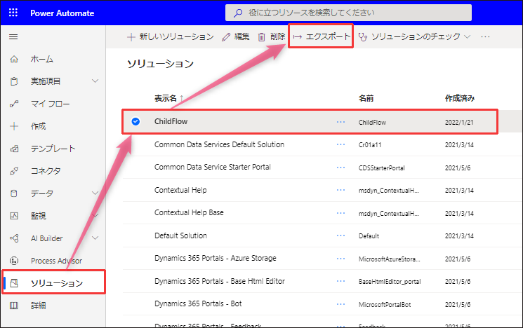  
* 新しいソリューションを作成頂く場合  
  1. ソリューション > ＋新しいソリューション > (必須項目の入力) > 作成  
  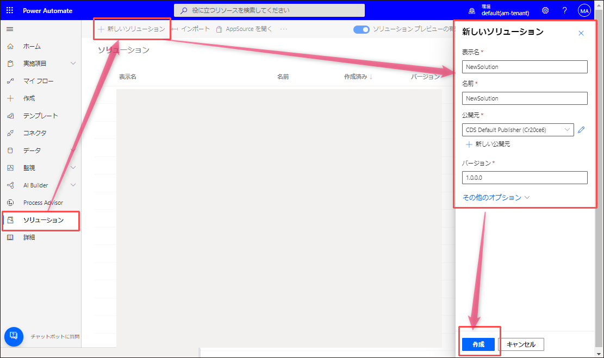  
  1.  (作成したソリューションを選択) > 編集  
  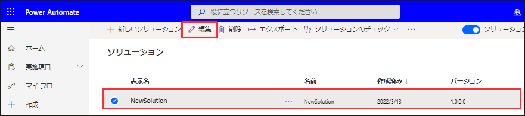  
  1. 既存を追加 > 自動化 > クラウド フロー から対象のフローを追加  
  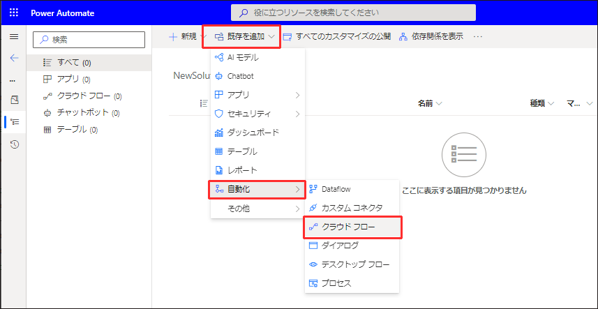  
  1. 追加したフロー > 詳細 > 必須オブジェクトを追加  
  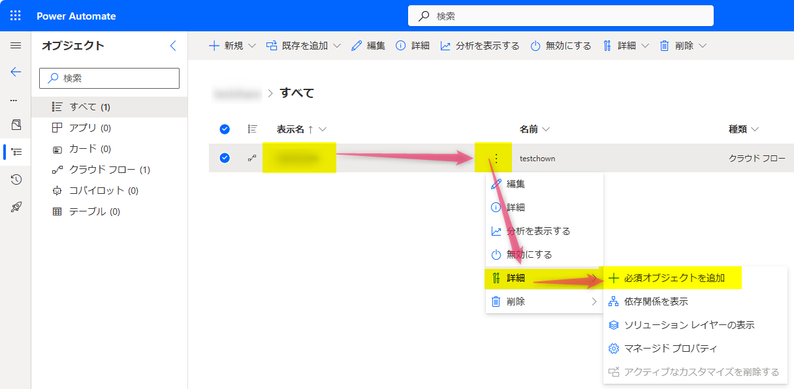  
  > [!NOTE]  
  > 追加されたリソースにも必須オブジェクトがある場合がございます。  
  > それらの必須オブジェクトも追加頂くようお願い致します。  
  1. ソリューション >  作成したソリューションを選択 > エクスポート  
    

### フローのパッケージ (Dataverse for Teams)
Teams の Power Apps アプリで作成したフローの場合は、エクスポートしたソリューションファイル (zip) をご提供ください。  
1. Power Apps アプリ > ビルド > (チーム選択) > すべて表示  
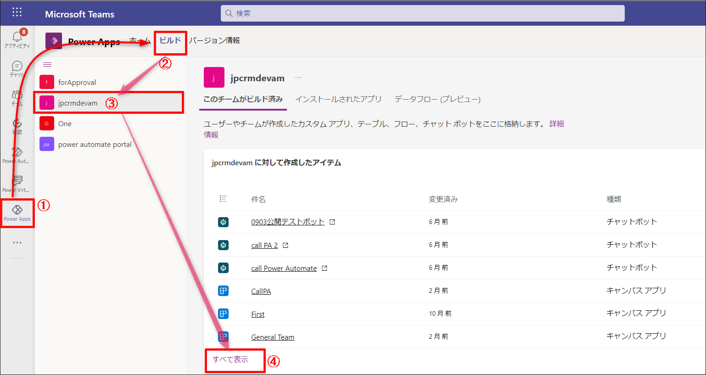  
1. (フローを選択) > エクスポート > Export solution  
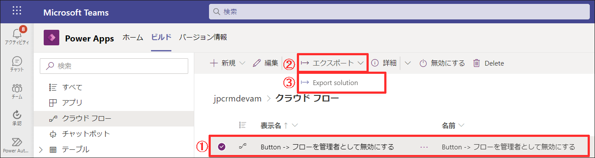  
1. 「すべての依存関係をエクスポートする」を選択し、「zip 形式でエクスポート」  
  

## フロー識別子
1. フロー詳細画面 > エクスポート > フロー識別子を取得する  
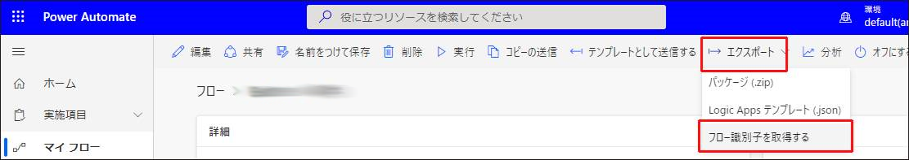  
1. 「クリックしてコピー」 で取得したテキストをご提供ください。   
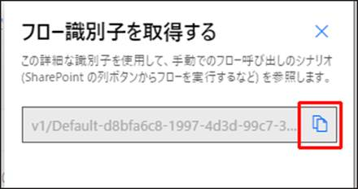  

## 実行履歴
直面されている問題の内容によりご提供頂く情報が異なります。  
* 実行時にエラーが発生する場合 ‐ [実行履歴 CSV(実行時にエラーが発生する場合)](#anchor-flowrunhistory-csv)
* 期待通りにトリガーされない場合 ‐ [実行のチェック(期待通りにトリガーされない場合)](#anchor-flowrunhistory-check)

### 実行履歴 CSV(実行時にエラーが発生する場合)
1. フローの詳細画面を開き「28 日間の実行履歴」から「すべての実行」を選択します。  
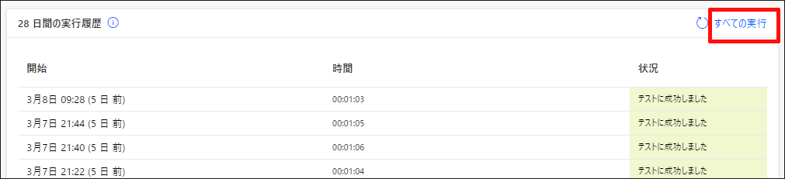  
1. 「.csv ファイルを取得」を選択し、取得した CSV ファイルをご提供ください。  
  

### 実行のチェック情報(期待通りにトリガーされない場合)
1. フローの詳細画面を開き「28 日間の実行履歴」から「すべての実行」を選択します。  
  
1. 実行履歴画面右上のドロップダウンから「失敗したチェック」および「チェック(新しいデータなし)」をご確認下さい。  
  
1. 確認結果に応じ、以下の情報をご提供ください。
   * 「失敗したチェック」にトリガーを試行履歴が存在する場合  
     * 該当のチェック履歴詳細より、[実行履歴に表示されるエラーメッセージ](#anchor-error-message-in-run-history)
     * 該当のチェック履歴詳細より、トリガーの[未加工入力および未加工出力](#anchor-raw-input-output)
   * トリガーの試行もなく実行されない場合は、以下をご提供ください  
     * 該当時間帯に「失敗したチェック」が存在しないことが確認できるスクリーンショット  
     * 該当時間帯の「チェック(新しいデータなし)」のチェック履歴スクリーンショット  
     * 該当時間帯の「チェック(新しいデータなし)」のチェック履歴詳細のトリガーの[未加工入力および未加工出力](#anchor-raw-input-output)  
     トリガーが期待される時刻および前後1件をご提供ください。 
     * トリガーが期待されるリソースを操作した時刻
     * トリガーが期待されるリソースの情報
     例) Dataverse レコードID、SharePoint リストアイテムID 等  

## フロー実行履歴 URL
1. [Power Automate ポータル](https://make.powerautomate.com/)にアクセスし、以下の手順でフロー詳細画面を開きます  
> [!IMPORTANT]
> Power Apps ポータルや Teams では正しく URL が表示されないため、Power Automate ポータルをご利用ください。
   * マイ フローに作成した場合  
   マイ フロー(①) > (フロー選択)  
   * ソリューションに作成した場合  
   ソリューション(②) > (ソリューションを選択)   > (フロー選択)  
   * Teams の Power Automate アプリから作成した場合  
   default 環境を選択(③) > マイ フロー(①) > (フロー選択)  
   * Teams の Power Apps アプリから作成した場合  
   対象 Teams 環境を選択(③) > ソリューション(②) > Common Data Services Default Solution(既定のソリューション) > (フロー選択)  
   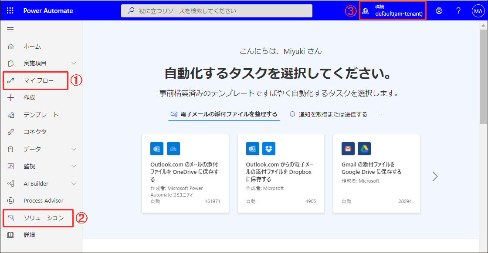  
1. 「28 日間の実行履歴」から履歴を選択します。  
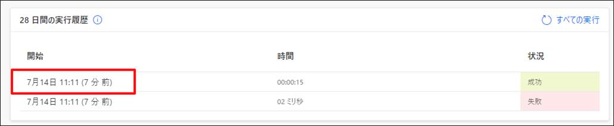
1. 開いた画面の URL をご提供ください。  
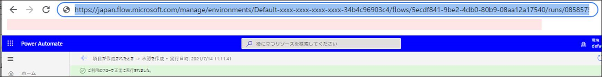

## エラーメッセージ
実行履歴を開き、エラーメッセージがわかるスクリーンショットと、⑥エラーの詳細のテキストコピーの 2 点をご提供ください。  
フロー編集時に問題が発生している場合には、発生したエラーメッセージや状態のスクリーンショットをご提供下さい。
スクリーンショットには 6 点の情報が表示されていることをご確認ください。  
1. フローの実行時刻  
1. フローのエラーメッセージ  
1. エラーになったアクション名  
1. アクション内のエラーメッセージ  
1. エラーメッセージ  
1. エラーの詳細  
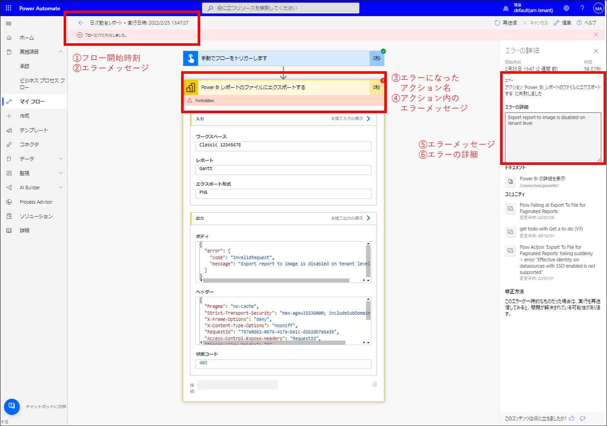
  

## アクションの未加工入力、未加工出力  
実行履歴から該当アクションを展開し、入力および出力として表示されるテキストをコピーし、ご提供ください。  
* 未加工入力の表示  
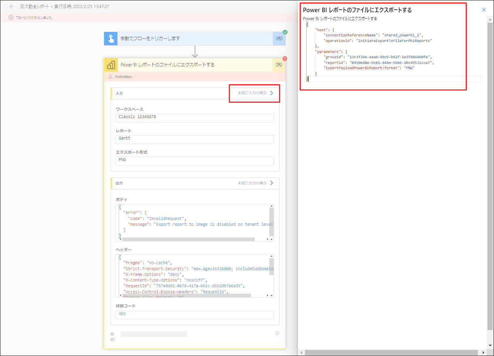  
* 未加工出力の表示  
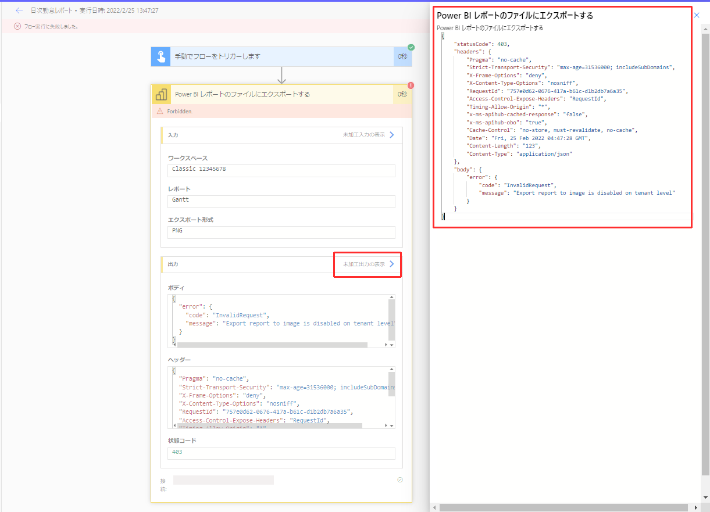  
  
> [!NOTE]
> 未加工入力、未加工出力いずれも表示されるテキストが多い場合は、「クリックしてダウンロードします」と表示されます。  
> リンクを開いた先の全文をテキストファイルに貼り付けご提供ください。
> 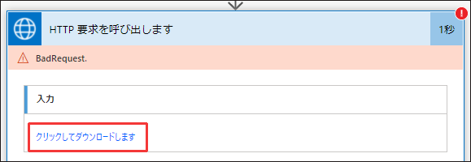  

## テナント情報、ユーザー情報  
* フロー詳細画面を開き`Ctrl＋Alt＋A`を押し、別ウィンドウに表示されるテキスト全文をテキストファイルに貼り付けご提供ください。  
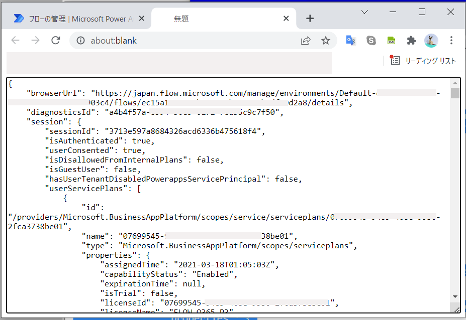  

> [!IMPORTANT]
> 特定ユーザーでの事象発生の場合、該当ユーザーにてご取得下さい。  

## 環境ID
以下の手順で環境 ID を取得し、ご提供ください。
1. [Power Automate ポータル](https://make.powerautomate.com/) > (エラーが発生したフローのある環境を選択) > マイフロー を開きます。
1. URL の environments/  と  /flows の間の文字列が環境 ID です。
  

## Web ブラウザのネットワーク トレース・コンソール ログ
デザイナーや実行履歴詳細画面の表示で問題が発生する場合には、事象発生時に Power Automate のサービスへ送信する HTTP リクエストや受信する HTTP レスポンスの内容を確認するため、ブラウザ開発者ツールのネットワーク トレースおよびコンソール ログをご提供ください。

> [!IMPORTANT]
> 事象発生の事前に取得開始し、事象発生後に採取を行う必要がございます。

### ブラウザネットワークトレース
ご取得方法は以下公開情報をご参照ください。  
[ブラウザーでネットワーク トレースを収集する (ブラウザーベースのアプリのみ)](https://learn.microsoft.com/ja-jp/azure/azure-web-pubsub/howto-troubleshoot-network-trace#collect-a-network-trace-in-the-browser-browser-based-apps-only)

> [!IMPORTANT]
> ご取得の際は「ログの保持」「キャッシュを無効にする」にチェックを有効にしご取得ください。  
> 

###  コンソールログ
Console タブをクリックし、ログ領域を右クリックし**「名前を付けて保存」**にて保存いたします。  
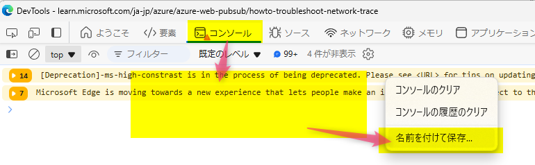

---

## 補足

本手順は執筆時点でのユーザー インターフェイスを基に紹介しています。バージョンアップによって若干の UI の遷移など異なる場合があります。その場合は画面の指示に従って進めてください。

