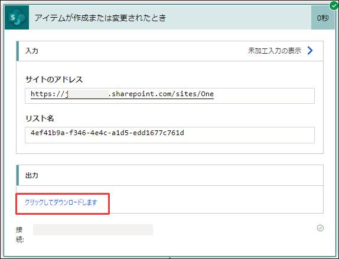

こんにちは、Power Platform サポートチームの網野です。  
本記事では Power Automate 関連のお問い合わせの際の、情報取得手順についてご案内致します。

<!-- more -->
# 目次

1. [概要](#anchor-intro)
1. [情報取得手順詳細](#anchor-how-to-collect)
      1. [フローのパッケージ](#anchor-flowpackage)
          1. [フローのパッケージ (マイフロー)](#anchor-flowpackage-myflow)
          1. [フローのパッケージ (ソリューションフロー)](#anchor-flowpackage-in-solution)
          1. [フローのパッケージ (Dataverse for Teams)](#anchor-flowpackage-in-dv4t)
      1. [フロー識別子](#anchor-flowid)
      1. [実行履歴 CSV](#anchor-flowrunhistory-csv)
      1. [フロー実行履歴 URL](#anchor-flowrunhistory-url)
      1. [実行履歴に表示されるエラーメッセージ](#anchor-error-message-in-run-history)
      1. [アクションの未加工入力、未加工出力 ](#anchor-raw-input-output)
      1. [テナント情報](#anchor-tenantInfo)
      1. [環境 ID](#anchor-environmentid)

# 概要

Power Automate に関するサポートサービスのお問い合わせの際の、情報取得手順についてご案内致します。

# 情報取得手順詳細

## フローのパッケージ
フローの作成方法により取得手順が異なります。フローを作成した方法から手順を選択し、パッケージファイルを取得してください。

   * マイ フローに作成した場合　-　[フローのパッケージ (マイ フロー)](#anchor-flowpackage-myflow)
   * ソリューションに作成した場合 - [フローのパッケージ (ソリューションフロー)](#anchor-flowpackage-in-solution)
   * Teams の Power Apps アプリから作成した場合 - [フローのパッケージ (Dataverse for Teams)](#anchor-flowpackage-in-dv4t)
      

### フローのパッケージ (マイ フロー)
   エクスポートしたフローのパッケージ (zip) ファイルをご提供ください。
   * マイ フロー > (フローを選択) > … > エクスポート > パッケージ (zip)  
     

### フローのパッケージ (ソリューションフロー)

   ソリューション内に作成したフローの場合は、エクスポートしたソリューション ファイル (zip) をご提供ください。  
   * ソリューション >  (ソリューションを選択) > エクスポート  
     

   ソリューション全体の提供が難しい場合は、必要なコンポーネントのみが含まれる新しいソリューションを作成し、ご提供ください。  
   ※弊社環境にインポートできるよう、依存関係のあるコンポーネントを含めてご提供をお願い致します  
   1. ソリューション > ＋新しいソリューション > (必須項目の入力) > 作成  
     
   1.  (作成したソリューションを選択) > 編集  
     
   1.  既存を追加 > 自動化 > クラウド フロー から対象のフローを追加  
   　　※依存関係のあるコンポーネントがあれば、一緒に追加してください。  
     
  

### フローのパッケージ (Dataverse for Teams)
   Teams の Power Apps アプリで作成したフローの場合は、エクスポートしたソリューションファイル (zip) をご提供ください。  
   1. Power Apps アプリ > ビルド > (チーム選択) > すべて表示  
     
   1. (フローを選択) > エクスポート > Export solution  
     
   1. 「すべての依存関係をエクスポートする」を選択し、「zip形式でエクスポート」  
     

## フロー識別子
   1. フロー詳細画面 > エクスポート > フロー識別子を取得する  
     
   1. 「クリックしてコピー」 で取得したテキストをご提供ください。   
     

## フロー実行履歴CSV
  1. フローの詳細画面を開き、「28 日間の実行履歴」から「すべての実行」を選択します。  
     
  1. 「.csv ファイルを取得」を選択し、取得した CSV ファイルをご提供ください。  
     

## フロー実行履歴URL
  1. <b>Power Automate</b> ポータル画面にアクセスし、以下の手順でフロー詳細画面を開きます  
     ※Power Apps ポータルや Teams からだと正しくURLが表示されないため、Power Automate ポータルをご利用ください。
     * マイ フローに作成した場合　-　マイ フロー (①) > (フロー選択)  
     * ソリューションに作成した場合　-　ソリューション(②) > (ソリューションを選択)   > (フロー選択)  
     * Teams の Power Automate アプリから作成した場合　-　(default環境を選択) (③) > マイ フロー(①) > (フロー選択)  
     * Teams の Power Apps アプリから作成した場合　-　(Teams環境を選択) (③) > ソリューション(②) > Common Data Services Default Solution > (フロー選択)  
      
  1. 「28 日間の実行履歴」から履歴を選択します。  
    
  1. 開いた画面の URL をご提供ください。  
    

## 実行履歴に表示されるエラーメッセージ
  実行履歴を開き、エラーメッセージがわかるスクリーンショットと、⑥エラーの詳細のテキストコピーの 2 点をご提供ください。  
  またスクリーンショットには 6 点の情報が表示されていることをご確認ください。  
   1. フローの実行時刻  
   1. フローのエラーメッセージ  
   1. エラーになったアクション名  
   1. アクション内のエラーメッセージ  
   1. エラーメッセージ  
   1. エラーの詳細  
   

  

## アクションの未加工入力、未加工出力 
  実行履歴から該当アクションを展開し、入力および出力として表示されるテキストをコピーし、ご提供ください。  
  * 未加工入力の表示  
     
    未加工入力として表示されるテキストが多い場合は、「クリックしてダウンロードします」と表示されます。  
     

* 未加工出力の表示  
     
    未加工出力として表示されるテキストが多い場合は、「クリックしてダウンロードします」と表示されます。   
     

## テナント情報  
  * フロー詳細画面を開き、「Ctrl＋Alt＋A」を押し、別ウィンドウに表示されるテキストをご提供ください。  
     

## 環境ID
  以下の手順で環境 ID を取得し、ご提供ください。
  * Power Automate ポータル > (任意の環境選択) > マイフロー を開きます。URL の environments/  と  /flows の間の文字列が環境 ID です。
     

---

## 補足

本手順は執筆時点でのユーザー インターフェイスを基に紹介しています。バージョンアップによって若干の UI の遷移など異なる場合があります。その場合は画面の指示に従って進めてください。

