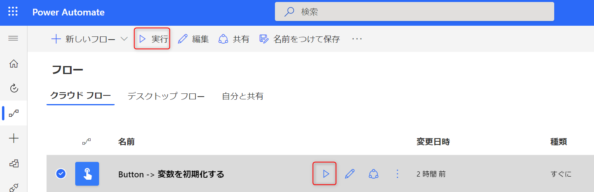
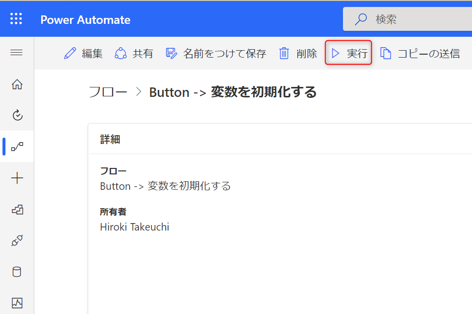
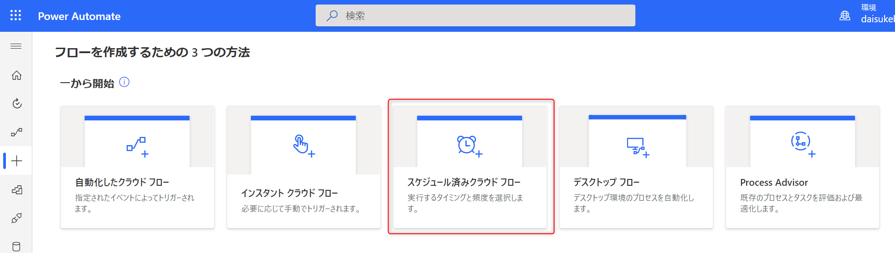
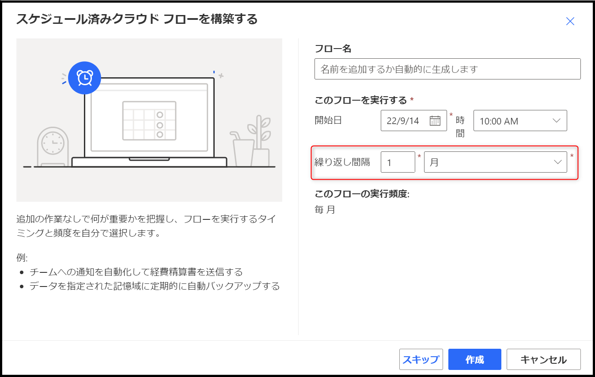
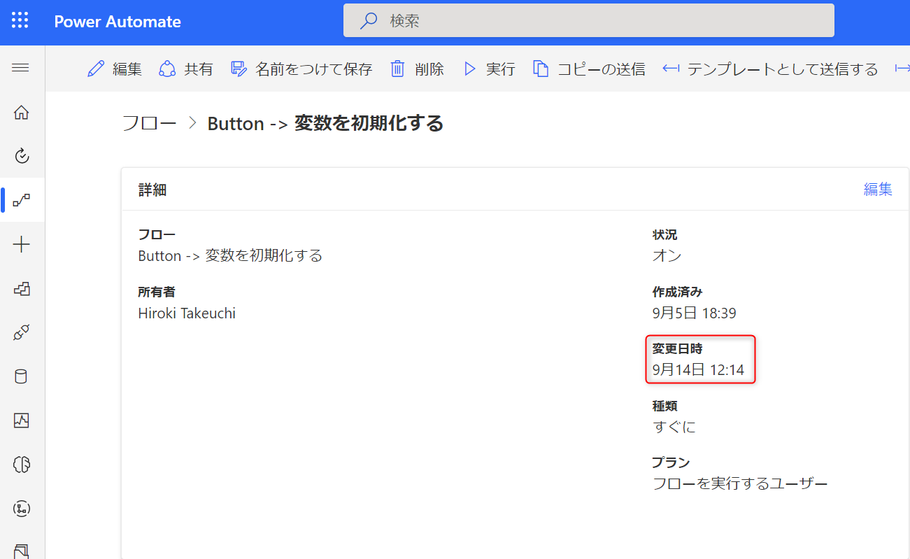
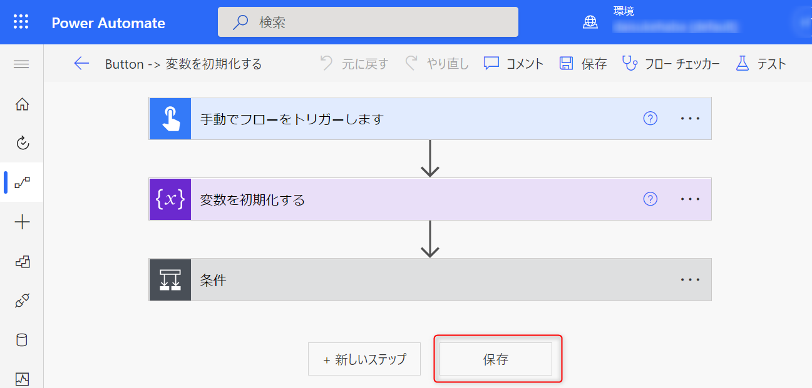
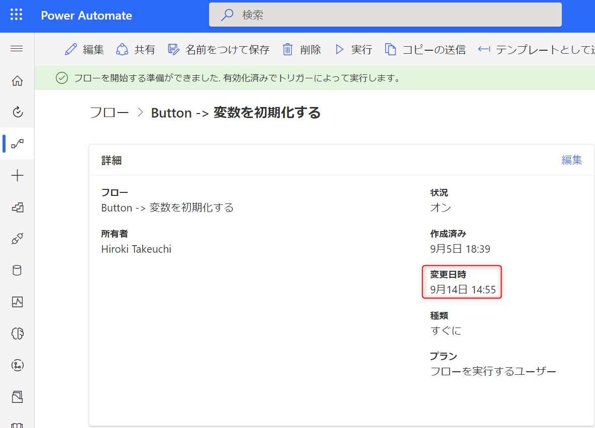

# Power Automate におけるフローの有効期限切れを防ぐ

こんにちは、 Power Platform サポートの竹内です。  
今回は、 Power Automate で一定期間フローを実行していない場合に有効期限が切れてしまい自動的に無効化される事象を防ぐために、どのように対応すればよいのかをご紹介します。

## [前提]

現在、以下のプランで Power Automate をご利用されている方々に対し、 90 日間フローを実行していない場合にはフローの作成者 (所有者) と共同作成者 (共同所有者) へ 30 日後にフローを自動的に無効化する旨のメールが届きます。  
その後、30 日以内に適切な対応がされない場合には、フローはシステム上無効化され、フローの作成者 (所有者) と共同作成者 (共同所有者) へメールで通知されます。  
[対象のプラン]  
無料版と試用版、Power Apps 開発者プラン* 、 Microsoft 365 プラン  

詳細については以下の公開文書を併せてご確認ください。

[制限と構成 - Power Automate | Microsoft Learn](https://learn.microsoft.com/ja-jp/power-automate/limits-and-config?WT.mc_id=BA-MVP-5003233#expiration-limits)

*Power Apps コミュニティプランは 2021 年 5 月に Power Apps 開発者プランに名称を変更しました。  
Power Apps 開発者プランの詳細につきましては以下の公開情報をご参照ください。  

[Power Apps 開発者プランにサインアップ - Power Apps | Microsoft Learn](https://learn.microsoft.com/ja-jp/power-apps/maker/developer-plan#improvements-from-the-previous-power-apps-community-plan)

## [フローの無効化を回避する方法]

以降では、フローが自動的に無効化される事象を回避する方法についてご案内いたします。その方法は大きく分けて、以下の 3 つがございます。  
① スタンドアロンの Power Automate ライセンスを購入する。  
② フロー作成、あるいは最終実行日から 120 日以内に 1 度以上実行する。  
③ フローの最終更新日から 30 日以内に 1 度以上更新する。

以降ではそれらについて詳細にご紹介いたします。

<!-- more -->

## ① スタンドアロンの Power Automate ライセンスを購入する。  

スタンドアロンの Power Automate ライセンスを購入することにより、自動で無効化される事象を回避できます。以下のいずれかの方法をご検討ください。

* Power Automate Premium ライセンスを購入し、対象のフローの作成者に割り当てる  
* Power Automate Process ライセンスを購入し、対象のフローに割り当てる  
  
詳細につきましては以下の公開情報も併せてご確認ください。  

[制限と構成 - Power Automate | Microsoft Learn](https://learn.microsoft.com/ja-jp/power-automate/limits-and-config?WT.mc_id=BA-MVP-5003233#expiration-limits)

また、スタンドアロンの Power Automate ライセンスの詳細につきましては以下の公開情報をご参照ください。

[Power Automate ライセンスの種類 - Power Platform | Microsoft Learn](https://learn.microsoft.com/ja-jp/power-platform/admin/power-automate-licensing/types)  
[価格 | Microsoft Power Automate](https://powerautomate.microsoft.com/ja-jp/pricing/)  

## ② フロー作成日、あるいは最終実行日から 120 日以内に 1 度以上実行する。  

フローを実行することにより、フローを実行していない 90 日の期間と自動的に無効化されるまでの 30 日の期間をリセットすることができます。  
手動で実行する方法についてご紹介致します

フローの一覧画面から対象のフローを選択し、下図の赤枠のいずれかを押すことにより実行します。

  

あるいは下図のフローの詳細画面から実行することもできます。

  

 
参考情報としまして、下図のように「スケジュール済みクラウド フロー」を作成する場合、90 日に一度は実行されるように設定していただくことで、フローの有効期限切れを防ぐことができます。

  

  

## ③ フローの最終更新日から 30 日以内に 1 度以上更新する。  

フローの更新をしていただくことにより、フローが自動的に無効化されるまでの 30 日の期間をリセットすることができます。  

以下では、手動でフローを更新する方法についてご紹介致します。  
例として、下図のフローの更新を行います。最終変更日時が 9 月 14 日 12:14 であることが確認できます。  

  

では、更新を行います。このフローの編集画面へ遷移すると以下のような画面になります。  
ここで保存ボタンを押してください。

  

すると、変更日時が更新されていることが確認できます。

  

この操作を定期的に行っていただくことにより、自動的にフローがオフになる事象を回避することができます。

 

## 最後に

以上、Power Automate で一定期間フローを実行していない場合の有効期限切れを防ぐ方法を大きく 3 つご紹介いたしました。  
なお、Power Automate はグローバルでご利用いただいているクラウド製品となりますので、30 日や 90 日などの実行間隔は余裕をもってご設定ください。  
参考になりましたら幸いです。  
