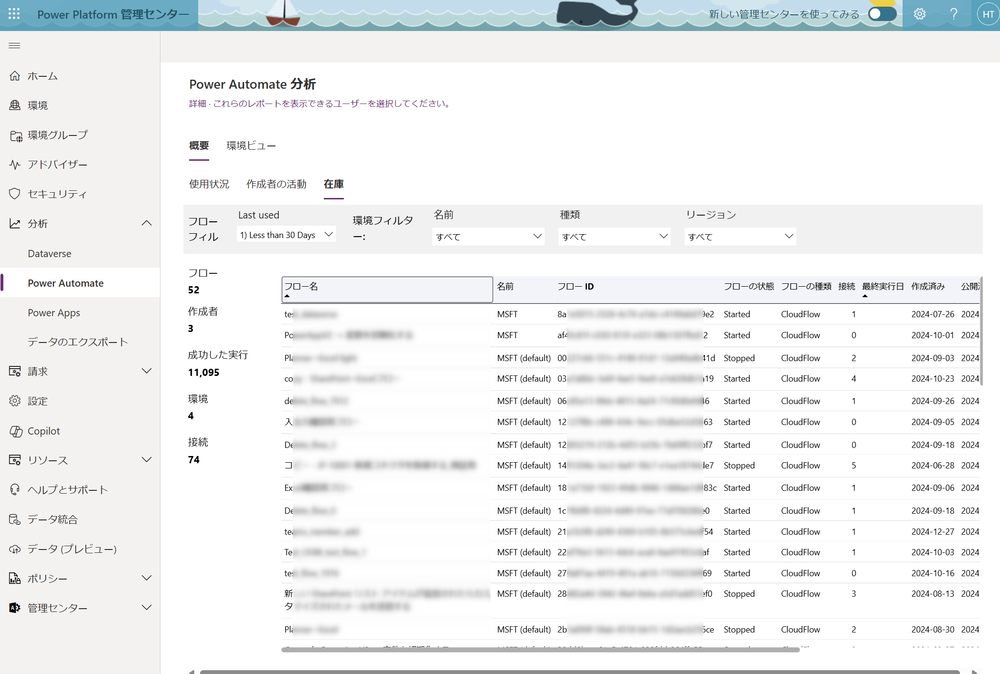

こんにちは、Power Platform サポートチームの竹内です。  
本記事では、Power Automate のクラウドフローをテナント全体で効率的に管理するために、フローの一覧を取得する 3 つの方法を詳しくご案内します。

<!-- more -->

# 目次

- [目次](#目次)
- [1. 概要](#1-概要)
- [2. クラウドフローの一覧を取得する方法](#2-クラウドフローの一覧を取得する方法)
  - [2-1. テナントレベルの分析を利用する](#2-1-テナントレベルの分析を利用する)
  - [2-2. PowerShell を利用する](#2-2-powershell-を利用する)
  - [2-3. Power Automate Management コネクタを利用する](#2-3-power-automate-management-コネクタを利用する)
- [まとめ](#まとめ)

<a id='1-概要'></a>

# 1. 概要
Power Automate をご利用いただく際、管理者がテナント内で作成されたすべてのクラウドフローを把握することについて多くお問い合わせを頂いております。  
本記事では、テナント全体のフローを一元的に把握するための具体的な方法を解説します。  
なお、本記事は管理者 (グローバル管理者、Power Platform 管理者) が実行することを想定しております。  

<a id='2-クラウドフローの一覧を取得する方法'></a>

# 2. クラウドフローの一覧を取得する方法
本記事では、クラウドフローの一覧を取得する具体的な方法として以下の3つを説明します。

- テナントレベル分析
- PowerShell スクリプト
- Power Automate Management コネクタ

<a id='2-1-テナントレベルの分析を利用する'></a>

## 2-1. テナントレベルの分析を利用する

> [!IMPORTANT]  
> この方法は事前にテナントレベルの分析を有効にする必要がございます。  
> 有効にする方法については下記の公開情報をご参照ください。  
> [テナント レベルでの分析 - Power Platform | Microsoft Learn](https://learn.microsoft.com/ja-jp/power-platform/admin/tenant-level-analytics#how-do-i-enable-tenant-level-analytics)


> [!NOTE]  
> この方法は削除済みのフローを取得することはできません。  

1. [Power Platform 管理センター](https://admin.powerplatform.microsoft.com) にサインインします。
2. 左側メニューの [分析] > [Power Automate] を選択します。
3. 表示されるダッシュボードからフローの使用状況や一覧を確認できます。
4. 特にテナント内のフロー一覧を取得する場合、[概要] > [在庫] タブをご確認ください。

  


テナントレベルの分析の詳細については下記の公開情報をご参照ください。  
[Power Automate のテナント レベルの分析 - Power Platform | Microsoft Learn](https://learn.microsoft.com/ja-jp/power-platform/admin/power-automate-analytics-reports)  

<a id='2-2-powershellを利用する'></a>

## 2-2. PowerShell を利用する
PowerShellを使用すると、詳細なフロー情報をCSV形式でエクスポートし、分析に役立てることができます。

1. PowerShell を管理者権限で開きます。
2. 以下のコマンドを順番に実行します。

```PowerShell
Install-Module -Name Microsoft.PowerApps.Administration.PowerShell
Add-PowerAppsAccount # ここで管理者アカウントでログインしてください。
Get-AdminFlow | Export-Csv -Path "flows.csv" -Encoding UTF8
```

実行後に生成された `flows.csv` ファイルを利用し、フローの詳細を把握できます。
CSVファイルには作成者、フロー名、作成日などの詳細な情報が含まれています。  
  

> [!Note]
> Power Platform の PowerShell コマンド実行についての詳細は下記の情報をご確認ください。  
> [Power Apps と Power Automate の PowerShell サポート - Power Platform | Microsoft Learn](https://learn.microsoft.com/ja-jp/power-platform/admin/powerapps-powershell#module-installation-and-sign-in)  
> また、フロー一覧を取得するコマンドの詳細については下記の公開情報をご参照ください。  
> [Get-AdminFlow (Microsoft.PowerApps.Administration.PowerShell) | Microsoft Learn](https://learn.microsoft.com/ja-jp/powershell/module/microsoft.powerapps.administration.powershell/get-adminflow?view=pa-ps-latest)  

> [!NOTE]  
> この方法は削除後 28 日以内のフローを取得することができます。  
 
<a id='2-3-power-automate-management-コネクタを利用する'></a>

## 2-3. Power Automate Management コネクタを利用する
この方法はクラウドフローを用いて、テナント内のクラウドフローを一覧化することが可能です。

1. Power Automate で新規クラウドフローを作成します。
2. 任意のトリガー（例:手動）を選択します。
3. アクションに「Power Automate Management」コネクタを追加し、「管理者としてフローの一覧を取得 (V2)」アクションを選びます。
4. 取得対象の環境を選択してください。
5. アクション実行後、得られたフロー情報をExcelやメール通知など、適切な形で利用できます。

  

テナント内の全環境を対象としてクラウドフローを実行する場合、「自分の環境の一覧表示」コネクタと組み合わせてください。
その場合、下記のように設定してください。

「それぞれに適用する」：outputs('自分の環境の一覧表示')?['body/value']  
「管理者としてフローの一覧を取得 (V2)」：items('それぞれに適用する')?['name']  

  
  

「Power Automate Management」コネクタの詳細は下記の公開情報をご覧ください。  
[](https://learn.microsoft.com/ja-jp/connectors/flowmanagement/)  

> この方法は削除済みのフローを取得することはできません。

<a id='まとめ'></a>

# まとめ
上記三つの方法から、ご要件に応じて適切な方法をご選択いただき、ご利用ください。  
本記事が適切な管理の一助となりましたら幸いでございます。  

---

※ 本記事の内容は執筆時点の情報に基づいています。最新の情報については公式ドキュメントも合わせてご確認ください。

