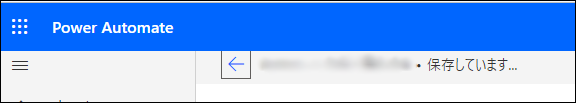
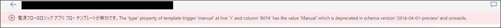

こんにちは、日本マイクロソフト Power Automate サポートの清水です。  
この記事では、Power Automate の一部のインスタント フローで表示される以下のエラーに関してご説明します。  

```
電源フローのロジック アプリ フロー テンプレートが無効です。The 'type' property of template trigger 'manual' at line '1' and column '#####' has the value 'Manual' which is deprecated in schema version '2016-04-01-preview' and onwards.
```

<!-- more -->

# エラーの詳細について
---
2021 年 11 月 8 日頃、Power Automate のクラウド フローに新たな機能としてコメント機能が追加されました。  

ブログ: [Collaborative comments in Power Automate | Power Automate ブログ (microsoft.com)​​​​​​​](https://powerautomate.microsoft.com/ja-jp/blog/collaborative-comments-in-power-automate/)  
公開情報: [Add an advanced option and multiple actions - Power Automate | Microsoft Docs](https://docs.microsoft.com/en-us/power-automate/multi-step-logic-flow#add-comments-to-actions-and-triggers)  

この変更により、当該機能のリリース前に作成されたフローでは、機能の追加後初めてフローの編集画面を開いた際、一度だけフローの自動保存が行われる動作となりました。  
これは、コメント機能を有効にするためのメタデータを追加するための作業です。  
※編集画面を開くと、フローの読み込み時に保存メッセージが表示されます。  
  

この際、一部のインスタント フローでは、フローの読み込みが完了する前にフローの保存が実行されることが原因で、保存時に以下のエラーが発生する場合があります。  

  
```
電源フローのロジック アプリ フロー テンプレートが無効です。The 'type' property of template trigger 'manual' at line '1' and column '#####' has the value 'Manual' which is deprecated in schema version '2016-04-01-preview' and onwards.
```  

上述の通り、フローの保存に失敗したことで発生するエラーのため、エラーが発生した場合でもフローの動作への影響はありません。  
また、自動保存の動作は、既存のフローへコメントの機能を追加するために一度のみ実行されるため、  
エラーが発生した場合には、手動でフローを再保存することで以降はエラーが解消します。  
 
そのため、上記のエラーが発生した場合には、一度手動でフローを保存しエラーが解消されるかをご確認ください。  

また、エラーが解消しない場合や、ご不明点がある場合には、弊社サポート窓口までお問い合わせください。  

---
